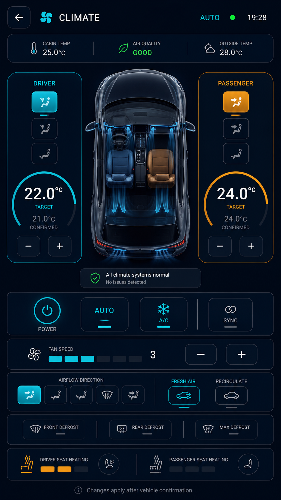

# HyperNova Cockpit — Task 05: Climate Android App

> **Project:** HyperNova Cockpit  
> **Task:** Task 05 — HyperNova Climate  
> **Application package:** `com.hypernova.climate`  
> **Target platform:** Custom AOSP / Android Automotive IVI image  
> **Orientation:** Portrait only  
> **Production baseline:** `1080 × 1920 px`, 9:16  
> **Reference image resolution:** `941 × 1672 px`  
> **Implementation language:** Kotlin  
> **UI technology:** Android XML Views + ViewBinding  
> **Architecture:** Single Activity + MVVM + capability-driven Climate Service + backend abstraction  
> **Vehicle integration:** Android CarPropertyManager / VHAL or protected Vehicle Gateway  
> **Zone support:** Single-zone and dual-zone capable  
> **Data policy:** Real vehicle state only — no production dummy data  
> **Status:** Ready for implementation  

---

# 1. Approved Visual Reference



The image above is the approved visual reference for Task 05.

It defines the primary **dual-zone Climate Home** screen and the shared HyperNova visual language:

- Dark navy background.
- Cyan driver-side controls.
- Amber passenger-side comfort accent.
- Large central top-down vehicle visualization.
- Separate driver and passenger temperature controls.
- Confirmed and requested values.
- Cabin temperature.
- Air quality.
- Outside temperature.
- A/C, AUTO, Power, and Sync controls.
- Fan speed.
- Airflow direction.
- Fresh air and recirculation.
- Front, rear, and maximum defrost.
- Driver and passenger seat heating.
- Explicit vehicle-confirmation behavior.

Values shown in the image, such as `22.0°C`, `24.0°C`, `25.0°C`, `28.0°C`, and fan level `3`, are visual examples only.

Production code must use real `ClimateState` and `ClimateCapabilities` values.

---

# 2. Product Definition

HyperNova Climate is a production automotive HVAC controller.

The application is responsible for:

```text
Climate Power
Driver Target Temperature
Passenger Target Temperature
Single-Zone / Dual-Zone Mode
Zone Synchronization
Cabin Temperature
Outside Temperature
Air Quality
Fan Speed
A/C
AUTO Mode
Heating / Cooling State
Airflow Direction
Fresh Air
Recirculation
Front Defrost
Rear Defrost
Maximum Defrost
Driver Seat Heating
Passenger Seat Heating
Vehicle Confirmation
Error and Unavailable States
```

The application is not a generic Android Settings page.

It is a capability-driven automotive climate interface connected to the real vehicle system.

---

# 3. System Architecture

```text
Climate UI
    |
    v
ClimateViewModel
    |
    v
ClimateRepository
    |
    v
Climate domain service/repository
    |
    v
ClimateBackend
    |
    +--> CarPropertyClimateBackend
    |       |
    |       v
    |   CarPropertyManager
    |       |
    |       v
    |      VHAL
    |
    +--> VehicleGatewayClimateBackend
            |
            v
     Protected IPC / Ethernet / SOME-IP / Serial
            |
            v
        Vehicle ECU / AURIX
```

The UI must never access vehicle hardware directly.

Launcher reads through `ClimateStatusService`. NOVA mutates state through
`ClimateCommandService`. Both adapters use the same Climate repository.

---

# 4. Critical Confirmation Rule

The UI must distinguish between:

```text
Confirmed Value
Requested Value
Pending Command
Completed Command
Rejected Command
Timed-Out Command
Unavailable Command
```

Example:

```text
Confirmed driver temperature: 21.0°C
Requested driver temperature: 22.0°C
```

While waiting, display:

```text
Setting driver temperature to 22.0°C…
Waiting for vehicle confirmation
```

The UI must not replace the confirmed value until the vehicle confirms the command.

The same rule applies to:

- Passenger temperature.
- Fan level.
- A/C.
- AUTO mode.
- Power.
- Sync.
- Airflow.
- Fresh air.
- Recirculation.
- Defrost.
- Seat heating.

Never report success before confirmation.

---

# 5. No Production Dummy Data

The production application must not include:

```text
MockClimateRepository
FakeClimateBackend
DummyCabinTemperature
HardcodedFanLevel
StaticConfirmedState
DemoClimateService
FakeAirQuality
FakeOutsideTemperature
```

Test doubles are allowed only in:

```text
src/test/
src/androidTest/
```

When data is unavailable, display an honest state:

```text
Cabin temperature unavailable
Outside temperature unavailable
Air quality unavailable
Passenger zone unavailable
Seat heating unavailable
Climate service disconnected
```

---

# 6. Zone Architecture

The UI must support:

```text
SINGLE_ZONE
DUAL_ZONE
```

## 6.1 Dual-Zone Mode

The approved reference shows:

```text
Driver Zone
Passenger Zone
Independent target temperatures
Optional SYNC
Independent seat heating
Independent airflow capability when supported
```

## 6.2 Single-Zone Mode

When the vehicle supports one climate zone:

- Show one shared target temperature.
- Hide the separate passenger temperature card.
- Hide Sync.
- Show one unified cabin zone.
- Keep the central car visualization.
- Hide unsupported passenger-only controls.
- Do not simulate dual-zone behavior.

## 6.3 Capability Rule

Zone behavior comes from `ClimateCapabilities`.

Never hard-code dual-zone support.

---

# 7. High-Level Components

| Component | Responsibility |
|---|---|
| `ClimateActivity` | Full-screen portrait host |
| `ClimateFragment` | Renders climate screen and state panels |
| `ClimateViewModel` | Exposes immutable UI state |
| `ClimateRepository` | Combines backend state and capabilities |
| `ClimateCommandManager` | Serializes, tracks, and times out commands |
| `ClimateStatusService` | Read-only Launcher state API |
| `ClimateCommandService` | Signature-protected NOVA command API |
| `ClimateBackend` | Vehicle implementation abstraction |
| `CarPropertyClimateBackend` | AAOS/VHAL integration |
| `VehicleGatewayClimateBackend` | Custom gateway integration |
| `ClimateStatePublisher` | Publishes updates to Launcher/NOVA AI |
| `VehicleUxRestrictionClient` | Applies driving restrictions |
| `ClimateFormatter` | Formats temperature, fan, and mode labels |

---

# 8. Shared HyperNova Design System

The application must use:

```text
hypernova-design-system
```

Shared tokens must define:

- Colors.
- Typography.
- Dimensions.
- Card shapes.
- Buttons.
- Icons.
- Loading states.
- Error states.
- Press states.
- Automotive touch sizes.
- Animation timings.

The Climate developer must not redefine these values locally.

---

# 9. Color System

| Token | Hex | Usage |
|---|---|---|
| `hn_background_primary` | `#020A13` | Main background |
| `hn_background_secondary` | `#06121F` | Secondary gradient |
| `hn_surface_primary` | `#071524` | Main cards |
| `hn_surface_secondary` | `#0B1B2C` | Elevated cards |
| `hn_surface_overlay` | `#102337` | Selected controls |
| `hn_border_primary` | `#506174` | Main borders |
| `hn_border_subtle` | `#293847` | Dividers |
| `hn_primary_cyan` | `#25D9E8` | Main active color |
| `hn_primary_cyan_pressed` | `#1FC2D0` | Pressed cyan |
| `hn_primary_cyan_dark` | `#0B8493` | Cyan glow |
| `hn_text_primary` | `#F5F7FA` | Main text |
| `hn_text_secondary` | `#A7B0BE` | Secondary text |
| `hn_text_disabled` | `#687486` | Disabled content |
| `hn_success` | `#39EA4B` | Confirmed healthy state |
| `hn_warning` | `#F5A623` | Heating, warning, pending |
| `hn_error` | `#FF5E68` | Error |
| `hn_white` | `#FFFFFF` | High-emphasis icon |
| `hn_transparent` | `#00000000` | Transparent |

## 9.1 Color Rules

- Cyan is the primary interaction color.
- Cyan is used for active cooling and driver-side active state.
- Amber is used for heating, seat heating, warning, and pending state.
- Green is used only for confirmed healthy or completed state.
- Red is used only for real errors.
- The main background always remains dark navy.
- Do not use large red-blue temperature gradients.
- Do not recolor the entire screen for heating or cooling.
- Do not use purple as the main Climate color.

---

# 10. Screen Baseline and Spacing

```text
Resolution: 1080 × 1920 px
Aspect ratio: 9:16
Logical baseline: approximately 540 × 960 dp
Orientation: Portrait
```

Spacing scale:

```text
4dp
8dp
12dp
16dp
20dp
24dp
32dp
```

Recommended dimensions:

```text
Screen horizontal margin: 16dp
Header height: 56dp
Top status card height: 72–84dp
Zone card radius: 22dp
Main card radius: 22dp
Small control radius: 16dp
Card padding: 16dp
Main section gap: 12dp
Minimum touch target: 48dp
Temperature buttons: 56dp
Main temperature text: 52–64sp
```

The main Climate Home screen must fit without scrolling.

---

# 11. Typography

Use:

```text
Roboto
```

| Element | Size | Weight |
|---|---:|---|
| App title | `18sp` | Medium |
| Header state | `10–12sp` | Medium |
| Zone title | `14–16sp` | Medium |
| Main temperature | `52–64sp` | Medium |
| Confirmed/requested label | `10–12sp` | Regular |
| Cabin/outside value | `18–22sp` | Medium |
| Section title | `11–12sp` | Medium |
| Body | `13sp` | Regular |
| Secondary | `10–11sp` | Regular |
| Button text | `13sp` | Medium |

Rules:

- Use ellipsis for long labels.
- Keep critical temperatures clearly visible.
- Do not shrink important text.
- Do not use decorative fonts.

---

# 12. Icon System

Use:

```text
Material Symbols Rounded
```

Required icons:

```text
Back
Climate Fan
Temperature
Air Quality
Outside Weather
Driver Zone
Passenger Zone
Power
AUTO
A/C
Sync
Fan
Face Airflow
Feet Airflow
Face + Feet
Windshield
Defrost
Fresh Air
Recirculation
Front Defrost
Rear Defrost
Maximum Defrost
Seat Heating
Seat
Success
Warning
Error
Retry
Unavailable
```

Rules:

- Same rounded outline style.
- Same stroke weight.
- Active icon uses cyan or amber by function.
- Inactive icon uses gray.
- Every interactive icon needs a content description.
- Do not rely on color only.

---

# 13. Fixed Screen Structure

The approved Climate Home contains:

```text
Top Header
Cabin / Air Quality / Outside Status Card
Driver Zone Card
Central Vehicle Visualization
Passenger Zone Card
System Health Card
Primary Controls
Fan Control
Airflow Control
Fresh Air / Recirculation
Defrost Controls
Seat Heating Controls
Confirmation Message
```

The implementation must preserve this hierarchy.

---

# 14. Header

Content:

```text
Back
Climate icon
CLIMATE
Current mode
Status dot
Current time
```

Possible mode labels:

```text
AUTO
MANUAL
COOLING
HEATING
DEFROST
OFF
PENDING
UNAVAILABLE
ERROR
```

State colors:

| Mode | Color |
|---|---|
| AUTO | Cyan or green |
| MANUAL | Cyan |
| COOLING | Cyan |
| HEATING | Amber |
| DEFROST | Cyan |
| OFF | Gray |
| PENDING | Amber |
| UNAVAILABLE | Amber/gray |
| ERROR | Red |

---

# 15. Top Environment Status Card

The top status card shows:

```text
Cabin Temperature
Air Quality
Outside Temperature
```

## 15.1 Cabin Temperature

Source:

```text
ClimateBackend / cabin-temperature sensor
```

When unavailable:

```text
Cabin temperature unavailable
```

## 15.2 Air Quality

Possible states:

```text
GOOD
MODERATE
POOR
UNAVAILABLE
```

Do not invent an air-quality value.

## 15.3 Outside Temperature

Source:

```text
Vehicle exterior-temperature property
```

When unavailable:

```text
Outside temperature unavailable
```

---

# 16. Central Vehicle Visualization

The central top-down vehicle is a functional state visualization.

It should represent:

- Driver zone.
- Passenger zone.
- Active airflow.
- Cooling/heating direction.
- Seat comfort state.
- Defrost airflow.
- Fresh-air/recirculation state.

Rules:

- Do not use the vehicle image as a static decorative asset only.
- Airflow overlays must reflect the current confirmed airflow mode.
- Cooling uses subtle cyan airflow.
- Heating uses subtle amber airflow.
- Defrost directs airflow to the windshield.
- Hide unsupported zone overlays.
- Pause expensive animation when the app is hidden.
- Provide a static fallback.

Accepted formats:

```text
VectorDrawable
AnimatedVectorDrawable
Lottie
Layered PNG/WebP
Custom Canvas rendering
```

---

# 17. Driver Zone Card

Required content:

```text
DRIVER
Airflow mode selectors
Target temperature arc
Confirmed temperature
Requested temperature when pending
Minus
Plus
```

Optional content:

```text
Driver seat-heating summary
Cooling/heating state
```

## 17.1 Driver Target Temperature

The large value represents:

```text
Confirmed driver target temperature
```

If a request is pending:

```text
Confirmed: 21.0°C
Requested: 22.0°C
```

Do not replace the confirmed value early.

## 17.2 Driver Airflow

The visible three buttons may represent supported zone airflow modes.

Their actual number and meaning must come from `ClimateCapabilities`.

---

# 18. Passenger Zone Card

Required content:

```text
PASSENGER
Airflow mode selectors
Target temperature arc
Confirmed temperature
Requested temperature when pending
Minus
Plus
```

The passenger accent may use soft amber when heating is active.

Do not imply heating only because the passenger card uses amber styling.

The state text and vehicle data remain the source of truth.

If passenger-zone control is unsupported:

- Hide the card, or
- Show `Passenger zone unavailable`.

---

# 19. Temperature Control Logic

The temperature range comes from:

```text
minimumTemperatureC
maximumTemperatureC
temperatureStepC
```

Examples only:

```text
16.0°C to 30.0°C
0.5°C step
```

Do not hard-code these limits without capabilities.

Flow:

```text
User presses + or -
        |
        v
Calculate requested value from capabilities
        |
        v
Send command
        |
        v
Show requested value as pending
        |
        v
Wait for confirmation
        |
        +--> Confirmed
        +--> Rejected
        +--> Timeout
```

Prevent repeated commands while an incompatible command is pending.

---

# 20. Climate Health Card

The approved screen shows:

```text
All climate systems normal
No issues detected
```

This message must come from real backend health state.

Possible health states:

```text
NORMAL
DEGRADED
COMMUNICATION_LOST
SENSOR_FAILURE
ACTUATOR_FAILURE
SERVICE_UNAVAILABLE
```

Use:

- Green for normal.
- Amber for degraded.
- Red for real fault.

Do not show `All systems normal` without backend confirmation.

---

# 21. Primary Controls

The primary row contains:

```text
POWER
AUTO
A/C
SYNC
```

## 21.1 Power

Command:

```text
setPowerEnabled(true/false)
```

When power is off:

- Disable dependent controls.
- Do not display A/C or fan as active.
- Show last confirmed values only if clearly dimmed.

## 21.2 AUTO

Command:

```text
setAutoModeEnabled(true/false)
```

Changing fan or airflow may exit AUTO according to vehicle policy.

The UI waits for backend confirmation.

## 21.3 A/C

Command:

```text
setAcEnabled(true/false)
```

Hide or disable when unsupported.

## 21.4 Sync

Command:

```text
setZoneSyncEnabled(true/false)
```

When enabled:

- Passenger target follows driver target according to backend behavior.
- Show linked-zone icon.
- Do not simulate sync locally without backend support.

---

# 22. Fan Speed

The Fan card shows:

```text
Fan icon
Current confirmed fan level
Level indicators
Decrease
Increase
```

The maximum level comes from:

```text
maximumFanLevel
```

Do not assume five levels.

In AUTO mode:

- Fan may be controlled by the vehicle.
- Manual changes may exit AUTO.
- Display `AUTO controlled` when appropriate.

Pending fan change:

```text
Requested fan level: 4
Confirmed fan level: 3
```

---

# 23. Airflow Direction

Supported airflow modes may include:

```text
FACE
FEET
FACE_AND_FEET
WINDSHIELD
FEET_AND_DEFROST
```

The UI must map supported modes from capabilities.

Selected mode:

```text
Cyan icon
Cyan border
Selected surface
```

Pending mode:

```text
Small amber pending indicator
Confirmed mode remains selected
```

The central vehicle airflow overlay updates only after confirmation.

---

# 24. Fresh Air and Recirculation

Controls:

```text
FRESH AIR
RECIRCULATE
```

They may be mutually exclusive depending on vehicle behavior.

Commands:

```text
setRecirculationEnabled(true/false)
setFreshAirEnabled(true/false)
```

Do not assume both can be active simultaneously.

The backend owns the final state.

---

# 25. Defrost Controls

Controls:

```text
FRONT DEFROST
REAR DEFROST
MAX DEFROST
```

## 25.1 Front Defrost

Command:

```text
setFrontDefrostEnabled()
```

## 25.2 Rear Defrost

Command:

```text
setRearDefrostEnabled()
```

## 25.3 Maximum Defrost

Use one high-level command:

```text
setMaxDefrostEnabled()
```

The backend owns:

- Fan policy.
- Airflow.
- A/C.
- Recirculation.
- Temperature behavior.

Do not send an unsynchronized sequence of independent commands from the UI.

---

# 26. Seat Heating

The screen includes:

```text
Driver Seat Heating
Passenger Seat Heating
```

Possible levels:

```text
OFF
1
2
3
```

The actual number of levels comes from capabilities.

Commands:

```text
setDriverSeatHeatingLevel()
setPassengerSeatHeatingLevel()
```

Use amber for active heating.

Hide unsupported seat controls.

---

# 27. Required Visible States

The visual system must support:

```text
CLIMATE_STARTING
CLIMATE_OFF
AUTO
MANUAL
COOLING
HEATING
DEFROST
MAX_DEFROST
COMMAND_PENDING
COMMAND_REJECTED
COMMAND_TIMEOUT
SERVICE_UNAVAILABLE
VEHICLE_COMMUNICATION_LOST
CAPABILITIES_LOADING
ERROR
```

---

# 28. Climate Off State

Display:

```text
Climate is off
Turn on the climate system to control cabin comfort
```

Action:

```text
Turn On Climate
```

Rules:

- Disable temperature, fan, A/C, airflow, defrost, and seats.
- Do not show active fan or A/C state.
- Last values may appear dimmed and labeled.

---

# 29. Command Pending State

Display:

```text
Applying climate change…
Waiting for vehicle confirmation
```

Also display:

```text
Confirmed value
Requested value
```

Rules:

- Disable duplicate requests.
- Keep unrelated controls available where safe.
- Use amber/cyan progress indication.
- Do not use a success indicator.

---

# 30. Command Rejected State

Display:

```text
Unable to change climate
Vehicle controller rejected the command
No changes were made
```

Actions:

```text
Try Again
Close
```

The last confirmed state remains visible.

Use red only for the error indicator.

---

# 31. Command Timeout State

Display:

```text
Climate command timed out
Vehicle confirmation was not received
```

Actions:

```text
Retry
Refresh Climate State
```

Do not assume the command failed or succeeded until state is refreshed.

---

# 32. Service Unavailable State

Display:

```text
Climate unavailable
Vehicle climate service is not connected
Climate controls are disabled
```

Actions:

```text
Retry
Return to Launcher
```

Do not show fake values.

---

# 33. Vehicle Communication Lost

Display:

```text
Vehicle communication lost
Last confirmed state may be outdated
```

Rules:

- Freeze the last confirmed state.
- Mark it as stale.
- Disable new commands.
- Show the last update time.
- Retry connection in the background.

---

# 34. Climate Capabilities

Suggested model:

```kotlin
data class ClimateCapabilities(
    val zoneMode: ClimateZoneMode,
    val minimumTemperatureC: Float?,
    val maximumTemperatureC: Float?,
    val temperatureStepC: Float?,
    val maximumFanLevel: Int?,
    val supportsAutoMode: Boolean,
    val supportsAc: Boolean,
    val supportsHeating: Boolean,
    val supportsZoneSync: Boolean,
    val supportedAirflowModes: Set<AirflowMode>,
    val supportsFreshAir: Boolean,
    val supportsRecirculation: Boolean,
    val supportsFrontDefrost: Boolean,
    val supportsRearDefrost: Boolean,
    val supportsMaxDefrost: Boolean,
    val driverSeatHeatingLevels: Int,
    val passengerSeatHeatingLevels: Int,
    val supportsCabinTemperature: Boolean,
    val supportsOutsideTemperature: Boolean,
    val supportsAirQuality: Boolean
)
```

Unsupported controls must be hidden or disabled with clear text.

---

# 35. Climate State

Suggested model:

```kotlin
data class ClimateState(
    val apiVersion: Int,
    val availability: ClimateAvailability,
    val health: ClimateHealth,
    val powerEnabled: Boolean,
    val mode: ClimateMode,
    val driverTargetTemperatureC: Float?,
    val passengerTargetTemperatureC: Float?,
    val cabinTemperatureC: Float?,
    val outsideTemperatureC: Float?,
    val airQuality: AirQualityState?,
    val fanLevel: Int?,
    val acEnabled: Boolean?,
    val autoModeEnabled: Boolean?,
    val zonesSynchronized: Boolean?,
    val airflowMode: AirflowMode?,
    val freshAirEnabled: Boolean?,
    val recirculationEnabled: Boolean?,
    val frontDefrostEnabled: Boolean?,
    val rearDefrostEnabled: Boolean?,
    val maxDefrostEnabled: Boolean?,
    val driverSeatHeatingLevel: Int?,
    val passengerSeatHeatingLevel: Int?,
    val pendingCommand: ClimateCommand?,
    val lastErrorCode: Int?,
    val updatedAtEpochMillis: Long
)
```

---

# 36. Climate UI State

```kotlin
data class ClimateUiState(
    val capabilities: ClimateCapabilities?,
    val confirmedState: ClimateState?,
    val requestedState: ClimateRequestedState?,
    val pendingCommand: ClimateCommand?,
    val isCommandPending: Boolean,
    val canSendCommands: Boolean,
    val isStale: Boolean,
    val message: UiText?
)
```

The UI must always render from `confirmedState`.

Requested values are rendered separately.

---

# 37. Internal Climate Commands

Suggested command types:

```text
SET_POWER
SET_DRIVER_TEMPERATURE
SET_PASSENGER_TEMPERATURE
SET_ZONE_SYNC
SET_FAN_LEVEL
SET_AC
SET_AUTO
SET_AIRFLOW
SET_FRESH_AIR
SET_RECIRCULATION
SET_FRONT_DEFROST
SET_REAR_DEFROST
SET_MAX_DEFROST
SET_DRIVER_SEAT_HEATING
SET_PASSENGER_SEAT_HEATING
```

Command states:

```text
CREATED
SUBMITTED
ACCEPTED
COMPLETED
REJECTED
TIMEOUT
CANCELLED
UNAVAILABLE
```

`ACCEPTED` is not equal to `COMPLETED`.

The list above is the Climate app's full internal capability model. The frozen NOVA Demo API v1
exposes only power, target temperature, fan level, A/C, AUTO, and recirculation, plus capability and
current-state queries. Other controls remain inside Climate until a later cross-app contract
version.

---

# 38. Climate Backend Interface

```kotlin
interface ClimateBackend {
    val state: StateFlow<ClimateState>
    val capabilities: StateFlow<ClimateCapabilities>

    suspend fun execute(command: ClimateCommand): ClimateCommandResult
    suspend fun refreshState(): Result<ClimateState>
}
```

Implementations:

```text
CarPropertyClimateBackend
VehicleGatewayClimateBackend
```

The UI does not know which backend is active.

---

# 39. Climate Services

Keep read-only status and privileged commands separate:

```text
Launcher status:
com.hypernova.climate.service.ClimateStatusService
com.hypernova.climate.action.BIND_STATUS

NOVA commands:
com.hypernova.climate.service.ClimateCommandService
com.hypernova.climate.action.BIND_COMMAND
```

The NOVA command ABI is frozen in
[HyperNova_Contracts](../HyperNova_Contracts/README.md). Climate must consume that module rather than
keeping a private AIDL copy.

Follow the exact
[Climate AIDL generation and TC397 service implementation guide](../HyperNova_Contracts/docs/MAHGOUB_CLIMATE_SERVICE_GUIDE.md).

Frozen Demo API v1:

```aidl
interface IClimateCommandService {
    int getApiVersion();
    void getCapabilities(String requestId, IClimateCommandCallback callback);
    void getCurrentState(String requestId, IClimateCommandCallback callback);
    void setPowerEnabled(
        String requestId,
        boolean enabled,
        IClimateCommandCallback callback
    );
    void setTargetTemperature(
        String requestId,
        int zone,
        float temperatureC,
        IClimateCommandCallback callback
    );
    void setFanLevel(
        String requestId,
        int fanLevel,
        IClimateCommandCallback callback
    );
    void setAcEnabled(
        String requestId,
        boolean enabled,
        IClimateCommandCallback callback
    );
    void setAutoModeEnabled(
        String requestId,
        boolean enabled,
        IClimateCommandCallback callback
    );
    void setRecirculationEnabled(
        String requestId,
        boolean enabled,
        IClimateCommandCallback callback
    );
}
```

Every mutating call returns confirmed only after TC397 acknowledgement or authoritative property
readback.

---

# 40. Launcher Integration

The Launcher Climate card receives:

```text
Availability
Current mode
Driver/shared target temperature
Passenger target temperature when relevant
Fan level
A/C state
AUTO state
Airflow summary
Seat-heating summary
Pending/error state
```

Flow:

```text
Climate Backend
      |
      v
Climate Service
      |
      v
Launcher callback
```

The Launcher must not access VHAL directly.

Launcher quick action:

```text
Set climate to 22°C
```

must wait for confirmation.

---

# 41. NOVA AI Integration

Frozen Demo API v1 phrases:

```text
What is the climate set to?
Set the climate to 22 degrees
Set my side to 21 degrees
Turn the climate on/off
Set fan to level 3
Turn A/C on/off
Enable/disable automatic climate
Enable/disable recirculation
```

NOVA calls `getCapabilities` after binding and backend reconnection. It must not advertise or call
unsupported controls, zones, values, or fan levels.

State/capability queries time out after two seconds and mutations after five seconds.
`setTargetTemperature(ZONE_ALL, value)` targets all available cabin zones and turns Climate on when
needed as part of the same confirmed high-level command.

Airflow, fresh air, zone sync, defrost, and seat heating remain Climate app features but are not in
the frozen NOVA Demo API v1.

Flow:

```text
NOVA AI
    |
    v
IClimateCommandService
    |
    v
Climate Backend
    |
    v
Vehicle Controller
    |
    v
Confirmed / Rejected / Timeout
    |
    v
NOVA AI result
```

NOVA AI must wait for the final result.

---

# 42. IPC Security

Use a signature-level permission:

```xml
<permission
    android:name="com.hypernova.permission.CONTROL_COCKPIT_APPS"
    android:protectionLevel="signature" />
```

Service:

```xml
<service
    android:name=".service.ClimateCommandService"
    android:exported="true"
    android:permission="com.hypernova.permission.CONTROL_COCKPIT_APPS">
    <intent-filter>
        <action android:name="com.hypernova.climate.action.BIND_COMMAND" />
    </intent-filter>
</service>
```

Rules:

- Validate every command.
- Validate range and capability.
- Validate caller permission/signature.
- Reject unsupported zone commands.
- Do not expose debug services in release builds.
- Do not log sensitive raw vehicle payloads.

---

# 43. Contract Versioning

Expose:

```text
getApiVersion()
getServiceVersion()
```

Recommended:

```text
Climate API version: 1
```

On mismatch:

- Do not call unsupported methods.
- Publish incompatible/unavailable state.
- Log the mismatch.
- Keep the local UI readable.
- Do not send unsafe fallback commands.

---

# 44. Permissions and Platform Access

Possible requirements:

```text
android.car.permission.CONTROL_CAR_CLIMATE
android.car.permission.CAR_INFO
android.car.permission.READ_CAR_DISPLAY_UNITS
```

Exact permissions depend on the target AOSP and backend.

Custom gateway integration may require:

- System app placement.
- Platform signing.
- Vendor permissions.
- SELinux policy.
- Protected Binder service access.

Document every privileged requirement.

---

# 45. Driving Restrictions

The Climate Home screen must remain usable while driving.

Allowed:

- Temperature +/-.
- Fan +/-.
- A/C.
- AUTO.
- Power.
- Front defrost.
- Rear defrost.
- Sync.
- Simple airflow selection.
- Seat-heating levels.

Potentially restricted:

- Detailed diagnostic screens.
- Advanced calibration.
- Service setup.
- Backend configuration.

Rules:

- Minimum touch target: `48dp`.
- No long press for main actions.
- No multi-touch requirement.
- No scroll on the main screen.
- Keep Power and Defrost reachable.
- Keep temperature visible.
- Avoid deep menus.
- Use icons and text together.

---

# 46. Animation Rules

| Animation | Duration |
|---|---:|
| Button press | `100ms` |
| State crossfade | `160–220ms` |
| Temperature arc | `200–300ms` after confirmation |
| Fan indicator | `160ms` |
| Airflow overlay transition | `250–400ms` |
| Pending spinner | Continuous, subtle |
| Success pulse | `500–700ms` |
| Error pulse | `350–500ms` |

Rules:

- Do not animate the confirmed temperature before confirmation.
- Do not use rapid flashing.
- Pause airflow animation when hidden.
- Respect reduced-animation settings.

---

# 47. Performance Requirements

- Do not block the main thread.
- Use coroutines and `StateFlow`.
- Do not poll aggressively when callbacks exist.
- Serialize conflicting commands.
- Avoid duplicate command submission.
- Cache vehicle visual assets.
- Pause expensive animations when hidden.
- Handle Binder death.
- Release service connections.
- Avoid stale callbacks after lifecycle changes.
- Keep command timeout configurable.

---

# 48. Logging

Use tags:

```text
HN-Climate
HN-ClimateUi
HN-ClimateCommand
HN-ClimateService
HN-CarPropertyClimate
HN-VehicleGatewayClimate
HN-ClimateState
```

Log:

- State transitions.
- Command type.
- Command result.
- Capability changes.
- Service connect/disconnect.
- Timeout.
- Version mismatch.
- Backend health.
- Vehicle communication loss.

Do not log:

- Raw CAN frames in production.
- Sensitive vehicle payloads.
- Private user profile data.
- Full backend packets.
- Authentication secrets.

---

# 49. Accessibility

- Minimum touch target: `48dp`.
- Temperature buttons: approximately `56dp`.
- High contrast.
- Content descriptions.
- State is represented by text and color.
- No color-only meaning.
- No tiny toggles.
- No long press for primary features.
- No multi-touch requirement.
- Clear error and pending text.
- Large target temperatures.

---

# 50. Recommended Project Structure

```text
app/src/main/java/com/hypernova/climate/
|
+-- ClimateActivity.kt
|
+-- ui/
|   +-- ClimateFragment.kt
|   +-- ClimateViewModel.kt
|   +-- ClimateUiState.kt
|   +-- ClimateUiEvent.kt
|   +-- components/
|       +-- HeaderBinder.kt
|       +-- EnvironmentStatusBinder.kt
|       +-- DriverZoneBinder.kt
|       +-- PassengerZoneBinder.kt
|       +-- VehicleVisualizationBinder.kt
|       +-- FanBinder.kt
|       +-- AirflowBinder.kt
|       +-- ComfortBinder.kt
|
+-- service/
|   +-- ClimateService.kt
|   +-- ClimateStatePublisher.kt
|
+-- backend/
|   +-- ClimateBackend.kt
|   +-- CarPropertyClimateBackend.kt
|   +-- VehicleGatewayClimateBackend.kt
|
+-- command/
|   +-- ClimateCommand.kt
|   +-- ClimateCommandManager.kt
|   +-- ClimateCommandResult.kt
|
+-- model/
|   +-- ClimateState.kt
|   +-- ClimateCapabilities.kt
|   +-- ClimateMode.kt
|   +-- ClimateHealth.kt
|   +-- ClimateZoneMode.kt
|   +-- AirflowMode.kt
|   +-- AirQualityState.kt
|
+-- integration/
|   +-- VehicleUxRestrictionClient.kt
|
+-- util/
    +-- UiText.kt
    +-- Result.kt
    +-- TemperatureFormatter.kt
```

---

# 51. Recommended Layout Files

```text
activity_climate.xml
fragment_climate.xml
view_climate_header.xml
card_climate_environment_status.xml
card_climate_driver_zone.xml
card_climate_passenger_zone.xml
view_climate_vehicle_visualization.xml
card_climate_health.xml
view_climate_primary_controls.xml
card_climate_fan.xml
card_climate_airflow.xml
card_climate_air_source.xml
card_climate_defrost.xml
card_climate_seat_heating.xml
view_climate_confirmation_message.xml
view_state_climate_off.xml
view_state_command_pending.xml
view_state_command_rejected.xml
view_state_command_timeout.xml
view_state_climate_unavailable.xml
view_state_vehicle_communication_lost.xml
```

---

# 52. Suggested View IDs

## Header

```text
btnBack
ivClimateLogo
tvClimateTitle
tvClimateMode
viewClimateStatusDot
tvCurrentTime
```

## Environment

```text
tvCabinTemperature
tvAirQuality
tvOutsideTemperature
```

## Driver Zone

```text
cardDriverZone
tvDriverZoneTitle
driverTemperatureArc
tvDriverTargetTemperature
tvDriverConfirmedTemperature
btnDriverTemperatureMinus
btnDriverTemperaturePlus
driverAirflowOption1
driverAirflowOption2
driverAirflowOption3
```

## Passenger Zone

```text
cardPassengerZone
tvPassengerZoneTitle
passengerTemperatureArc
tvPassengerTargetTemperature
tvPassengerConfirmedTemperature
btnPassengerTemperatureMinus
btnPassengerTemperaturePlus
passengerAirflowOption1
passengerAirflowOption2
passengerAirflowOption3
```

## Primary Controls

```text
btnClimatePower
btnClimateAuto
btnClimateAc
btnClimateSync
```

## Fan

```text
fanLevelIndicator
tvFanLevel
btnFanMinus
btnFanPlus
```

## Airflow

```text
btnAirflowFace
btnAirflowFeet
btnAirflowFaceFeet
btnAirflowWindshield
btnAirflowFeetDefrost
```

## Air Source

```text
btnFreshAir
btnRecirculation
```

## Defrost

```text
btnFrontDefrost
btnRearDefrost
btnMaxDefrost
```

## Seats

```text
driverSeatHeatingLevel
passengerSeatHeatingLevel
btnDriverSeatHeating
btnPassengerSeatHeating
```

---

# 53. UI Events

```kotlin
sealed interface ClimateUiEvent {
    data object BackPressed : ClimateUiEvent
    data object PowerPressed : ClimateUiEvent
    data object AutoPressed : ClimateUiEvent
    data object AcPressed : ClimateUiEvent
    data object SyncPressed : ClimateUiEvent
    data object DriverTemperatureIncrease : ClimateUiEvent
    data object DriverTemperatureDecrease : ClimateUiEvent
    data object PassengerTemperatureIncrease : ClimateUiEvent
    data object PassengerTemperatureDecrease : ClimateUiEvent
    data object FanIncrease : ClimateUiEvent
    data object FanDecrease : ClimateUiEvent
    data class AirflowSelected(val mode: AirflowMode) : ClimateUiEvent
    data object FreshAirPressed : ClimateUiEvent
    data object RecirculationPressed : ClimateUiEvent
    data object FrontDefrostPressed : ClimateUiEvent
    data object RearDefrostPressed : ClimateUiEvent
    data object MaxDefrostPressed : ClimateUiEvent
    data class DriverSeatHeatingSelected(val level: Int) : ClimateUiEvent
    data class PassengerSeatHeatingSelected(val level: Int) : ClimateUiEvent
    data object RetryPressed : ClimateUiEvent
    data object RefreshStatePressed : ClimateUiEvent
}
```

---

# 54. Manifest

```xml
<activity
    android:name=".ClimateActivity"
    android:exported="true"
    android:screenOrientation="portrait">
    <intent-filter>
        <action android:name="android.intent.action.MAIN" />
        <category android:name="android.intent.category.LAUNCHER" />
    </intent-filter>
</activity>
```

Service:

```xml
<service
    android:name=".service.ClimateCommandService"
    android:exported="true"
    android:permission="com.hypernova.permission.CONTROL_COCKPIT_APPS">
    <intent-filter>
        <action android:name="com.hypernova.climate.action.BIND_COMMAND" />
    </intent-filter>
</service>
```

---

# 55. Testing Requirements

## 55.1 Capabilities

- Single-zone.
- Dual-zone.
- No passenger zone.
- No Sync.
- No A/C.
- No AUTO.
- Variable fan-level count.
- Missing cabin sensor.
- Missing outside sensor.
- Missing air quality.
- Missing seat heating.
- Missing rear defrost.

## 55.2 Temperature

- Driver increase/decrease.
- Passenger increase/decrease.
- Range limit.
- Temperature step.
- Pending value.
- Confirmation.
- Rejection.
- Timeout.
- Sync behavior.

## 55.3 Fan and Modes

- Fan +/-.
- AUTO controlled fan.
- A/C.
- Power.
- Manual mode.
- Cooling.
- Heating.
- Defrost.
- Max defrost.

## 55.4 Airflow and Air Source

- Every supported airflow mode.
- Fresh air.
- Recirculation.
- Backend-enforced exclusivity.
- Pending and rejected state.

## 55.5 Seat Heating

- Driver levels.
- Passenger levels.
- Unsupported feature.
- Command pending.
- Rejection.

## 55.6 Integration

- Launcher state update.
- NOVA AI commands.
- Binder reconnect.
- Version mismatch.
- Vehicle communication loss.
- State refresh after timeout.

## 55.7 Visual

- Matches approved image.
- No clipped text.
- No overlap.
- Fits 1080 × 1920.
- No scrolling.
- Touch targets meet size.
- Vehicle airflow matches confirmed state.
- Pending state never replaces confirmed state.

---

# 56. Development Order

```text
1. Freeze package name and Climate contracts
2. Import HyperNova design system
3. Create project and dark theme
4. Build Header
5. Build Environment Status card
6. Build central vehicle visualization
7. Build Driver Zone card
8. Build Passenger Zone card
9. Build Primary Controls
10. Build Fan controls
11. Build Airflow controls
12. Build Fresh Air / Recirculation
13. Build Defrost controls
14. Build Seat Heating controls
15. Implement ClimateUiState
16. Implement ClimateCapabilities
17. Implement ClimateState
18. Implement ClimateCommandManager
19. Implement ClimateBackend interface
20. Implement ClimateStatusService and ClimateCommandService
21. Implement CarPropertyClimateBackend or VehicleGatewayClimateBackend
22. Implement command confirmation
23. Implement rejection and timeout handling
24. Implement single-zone fallback
25. Integrate Launcher
26. Integrate NOVA AI
27. Add IPC security
28. Add contract versioning
29. Add vehicle communication recovery
30. Add driving restrictions
31. Test all capabilities and states
32. Build debug and release APKs
33. Integrate into AOSP
34. Validate on target portrait display
```

---

# 57. Required Deliverables

```text
1. Complete Android Studio project
2. Source code
3. HyperNova design-system dependency/version
4. IPC-contract dependency/version
5. Approved Climate Home screen
6. Single-zone layout behavior
7. Dual-zone layout behavior
8. Central vehicle visualization
9. Driver and passenger controls
10. Fan controls
11. A/C, AUTO, Power, and Sync
12. Airflow controls
13. Fresh Air and Recirculation
14. Defrost controls
15. Seat Heating controls
16. Climate capabilities implementation
17. Climate state implementation
18. Climate command manager
19. Climate backend implementation
20. Climate Service
21. Launcher integration
22. NOVA AI integration
23. IPC security
24. Command confirmation
25. Timeout/rejection handling
26. Debug APK
27. Release APK
28. Screenshots of all states
29. Capability test report
30. Command-state test report
31. Integration test report
32. Permission documentation
33. AOSP integration notes
34. Backend/VHAL/gateway notes
35. Asset source/license notes
36. Updated final README
```

Suggested APK names:

```text
HyperNovaClimate-debug.apk
HyperNovaClimate-release.apk
```

---

# 58. Definition of Done

## Visual

- [ ] UI matches the approved reference.
- [ ] HyperNova colors are used.
- [ ] Header is consistent with other apps.
- [ ] Central vehicle visualization is functional.
- [ ] Driver and passenger cards are aligned.
- [ ] Temperature values are readable.
- [ ] Confirmed/requested values are distinct.
- [ ] Main screen does not scroll.
- [ ] Controls meet `48dp`.
- [ ] Temperature buttons meet `56dp`.
- [ ] No text clipping.
- [ ] No overlapping controls.
- [ ] No stock Android Settings appearance.

## Architecture

- [ ] Package is `com.hypernova.climate`.
- [ ] No production dummy data exists.
- [ ] ClimateCapabilities is implemented.
- [ ] ClimateState is implemented.
- [ ] ClimateBackend abstraction exists.
- [ ] Single-zone fallback works.
- [ ] Dual-zone mode works.
- [ ] ClimateStatusService and ClimateCommandService are implemented.
- [ ] Command manager tracks pending requests.
- [ ] Confirmed state remains visible while pending.
- [ ] Rejection restores confirmed state.
- [ ] Timeout does not claim success.
- [ ] Unsupported features are hidden/disabled.
- [ ] Binder death is handled.
- [ ] Version mismatch is handled.

## Integration

- [ ] Launcher receives real climate state.
- [ ] NOVA AI commands work.
- [ ] Commands wait for final confirmation.
- [ ] VHAL or Vehicle Gateway is connected.
- [ ] Vehicle communication loss is handled.
- [ ] IPC is signature-protected.
- [ ] Driving restrictions are applied.

## Delivery

- [ ] Debug APK generated.
- [ ] Release APK generated.
- [ ] State screenshots included.
- [ ] Test reports included.
- [ ] AOSP integration notes included.
- [ ] Final README updated.

---

# 59. Questions and Answers

## Why are confirmed and requested temperatures separate?

Because a user request is not the same as a vehicle-confirmed state.

## Can the UI immediately display the requested value?

It may show it as `Requested`, but the main confirmed value stays unchanged until confirmation.

## Does the app support single-zone vehicles?

Yes. The layout adapts using `ClimateCapabilities`.

## Does the app support dual-zone vehicles?

Yes. The approved reference demonstrates dual-zone mode.

## Who owns the real HVAC state?

The Climate backend and vehicle controller.

## Does the UI communicate directly with AURIX?

No. It communicates through Climate Service and the selected backend.

## Can Launcher control Climate?

Yes, through the protected Launcher status/quick-action contract when that contract is implemented.

## Can NOVA AI control Climate?

Yes, through the frozen `IClimateCommandService` and real command results.

## Why is Max Defrost one command?

The vehicle controller must apply its coordinated fan, A/C, airflow, and recirculation policy.

## What is the most important rule?

Never display a climate change as confirmed before the vehicle confirms it.

---

# 60. Final Instruction

Build HyperNova Climate as a production automotive HVAC controller.

The final result must combine:

```text
Shared HyperNova design
+
Capability-driven UI
+
Single-zone and dual-zone support
+
Real vehicle state
+
Explicit command confirmation
+
Launcher integration
+
NOVA AI integration
+
VHAL or Vehicle Gateway backend
+
Automotive usability
```

Do not add fake climate data, unsupported controls, direct hardware access, unprotected IPC, or unconfirmed success states without an approved architecture change.
