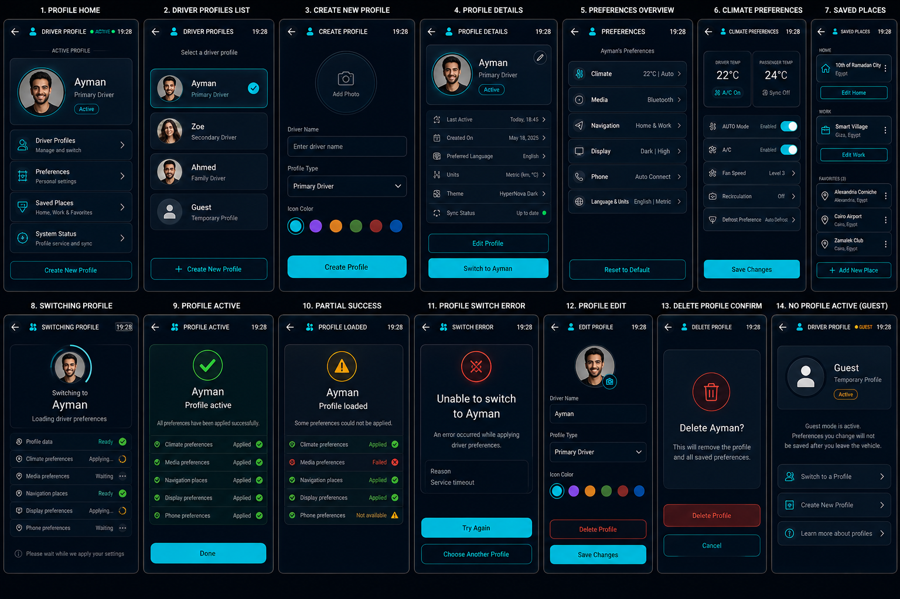

# HyperNova Cockpit — Task 08: Driver Profile Android App

> **Project:** HyperNova Cockpit  
> **Task:** Task 08 — HyperNova Driver Profile  
> **Application package:** `com.hypernova.profile`  
> **Target platform:** Custom AOSP / Android Automotive IVI image  
> **Orientation:** Portrait only  
> **Production baseline:** `1080 × 1920 px`, 9:16  
> **Reference board resolution:** `1536 × 1024 px`  
> **Implementation language:** Kotlin  
> **UI technology:** Android XML Views + ViewBinding  
> **Architecture:** Single Activity + MVVM + Room + DataStore + Profile Service + cross-app adapters  
> **Profile modes:** Personal profiles + non-removable Guest profile  
> **Data policy:** Real saved profile data and real per-application apply results only  
> **Status:** Ready for implementation  

---

# 1. Approved Visual Reference



The image above is the approved visual reference for Task 08.

It defines these 14 required screens and states:

```text
1. PROFILE HOME
2. DRIVER PROFILES LIST
3. CREATE NEW PROFILE
4. PROFILE DETAILS
5. PREFERENCES OVERVIEW
6. CLIMATE PREFERENCES
7. SAVED PLACES
8. SWITCHING PROFILE
9. PROFILE ACTIVE
10. PARTIAL SUCCESS
11. PROFILE SWITCH ERROR
12. PROFILE EDIT
13. DELETE PROFILE CONFIRM
14. NO PROFILE ACTIVE (GUEST)
```

The implementation must preserve the same visual language across all screens:

- Same dark navy background.
- Same top header geometry.
- Same cyan interaction color.
- Same card shape and border thickness.
- Same avatar style.
- Same status-dot style.
- Same typography.
- Same automotive-safe touch targets.
- Same screen margins.
- Same success, warning, and error behavior.
- Same profile-switch progress presentation.

Names, addresses, profile colors, temperatures, device choices, and preference values shown in the image are visual examples only.

Production code must use real persisted profile data and real results from the receiving applications.

---

# 2. Product Definition

HyperNova Driver Profile is the central driver-personalization manager for the HyperNova Cockpit.

It is responsible for:

```text
Active driver profile
Driver avatar
Driver name
Driver role/type
Guest profile
Profile creation
Profile editing
Profile deletion
Profile selection
Profile switching
Profile state publishing
Climate preferences
Media preferences
Navigation preferences
Display preferences
Phone preferences
Language and units
Saved Home and Work places
Favorite places
Preference validation
Per-application apply results
Partial success handling
Profile service errors
```

The app is not a social profile page and is not a cloud-account manager.

Its job is to connect one saved driver identity to the preferences used by the rest of the IVI.

---

# 3. Core Product Rule

Selecting a profile is not equal to successfully applying every preference.

The full flow is:

```text
User selects profile
        |
        v
Load profile data
        |
        v
Validate saved preferences
        |
        v
Set profile as selected
        |
        v
Apply preferences to each app
        |
        +--> Climate
        +--> Media
        +--> Navigation
        +--> Weather
        +--> Phone
        +--> Display / Settings
        |
        v
Collect module results
        |
        +--> APPLIED
        +--> UNSUPPORTED
        +--> UNAVAILABLE
        +--> FAILED
        |
        v
Publish final switch result
```

The UI must distinguish between:

```text
Profile selected
Profile loaded
Profile active
Preferences applying
Fully applied
Partially applied
Switch failed
```

Never display full success while one or more required modules are still pending or failed.

---

# 4. Real Data Rule

The application must never invent:

- Profile name.
- Avatar.
- Active profile.
- Profile type.
- Saved Home or Work location.
- Preferred climate temperature.
- Preferred media source.
- Preferred volume.
- Language.
- Units.
- Theme.
- Application result.
- Profile switching progress.
- Success state.

Examples such as:

```text
Ayman
Zoe
Ahmed
Guest
22°C
Bluetooth
English
Metric
Smart Village
```

are visual examples only.

Production values must come from:

```text
Room Database
DataStore
HyperNovaProfileService
ProfileSwitchCoordinator
Per-application adapter callbacks
```

---

# 5. No Production Dummy Data

The production app must not contain:

```text
MockProfileRepository
FakeDriverProfile
DummySavedPlace
HardcodedActiveProfile
StaticPreferenceResult
DemoProfileService
FakeSwitchProgress
```

Test doubles are allowed only in:

```text
src/test/
src/androidTest/
```

When no profile data exists, show:

```text
No personal profile available
Guest mode is active
Create a new profile
```

When one preference cannot be loaded, show the real missing or failed state.

---

# 6. High-Level Architecture

```text
+---------------- HyperNova Driver Profile App ------------------+
|                                                                |
|  ProfileActivity                                               |
|       |                                                        |
|       v                                                        |
|  ProfileNavHost                                                |
|       |                                                        |
|       v                                                        |
|  ProfileViewModel                                              |
|       |                                                        |
|       v                                                        |
|  ProfileRepository                                             |
|       |                                                        |
|       +--> Room Database                                       |
|       +--> DataStore                                           |
|       +--> Avatar Storage                                      |
|                                                                |
|  HyperNovaProfileService                                       |
|       |                                                        |
|       v                                                        |
|  ProfileSwitchCoordinator                                      |
|       |                                                        |
|       +--> ClimateProfileAdapter                               |
|       +--> MediaProfileAdapter                                 |
|       +--> NavigationProfileAdapter                            |
|       +--> WeatherProfileAdapter                               |
|       +--> PhoneProfileAdapter                                 |
|       +--> SettingsProfileAdapter                              |
|                                                                |
|  ProfileStatePublisher                                         |
|       |                                                        |
|       +--> Launcher                                             |
|       +--> NOVA AI                                              |
+----------------------------------------------------------------+
```

---

# 7. Main Components

| Component | Responsibility |
|---|---|
| `ProfileActivity` | Hosts the portrait application |
| `ProfileViewModel` | Exposes immutable UI state |
| `ProfileRepository` | Reads and writes profile data |
| `ProfileDatabase` | Stores profiles, places, and preferences |
| `ProfilePreferencesStore` | Stores active-profile and app-level settings |
| `HyperNovaProfileService` | Protected cross-app profile API |
| `ActiveProfileManager` | Owns the active profile ID |
| `ProfileSwitchCoordinator` | Coordinates switching and module results |
| `PreferenceApplicationManager` | Applies validated preferences |
| `ClimateProfileAdapter` | Applies climate preferences |
| `MediaProfileAdapter` | Applies media preferences |
| `NavigationProfileAdapter` | Applies navigation preferences |
| `WeatherProfileAdapter` | Applies weather preferences |
| `PhoneProfileAdapter` | Applies phone preferences |
| `SettingsProfileAdapter` | Applies language, units, theme, display preferences |
| `VehicleUxRestrictionClient` | Applies moving/parked restrictions |

---

# 8. Required App States

## 8.1 Profile States

```text
NO_ACTIVE_PROFILE
GUEST_ACTIVE
PROFILE_READY
PROFILE_LOADING
PROFILE_CREATING
PROFILE_SAVING
PROFILE_UPDATING
PROFILE_DELETING
PROFILE_ERROR
PROFILE_CORRUPTED
PROFILE_NOT_FOUND
```

## 8.2 Switching States

```text
SWITCH_REQUESTED
SWITCH_LOADING_PROFILE
SWITCH_VALIDATING
SWITCH_APPLYING
SWITCH_ACTIVE
SWITCH_PARTIAL
SWITCH_FAILED
SWITCH_CANCELLED
```

## 8.3 Service States

```text
SERVICE_STARTING
SERVICE_READY
SERVICE_UNAVAILABLE
SERVICE_VERSION_MISMATCH
DATABASE_ERROR
```

## 8.4 Preference Result States

```text
WAITING
APPLYING
APPLIED
UNSUPPORTED
UNAVAILABLE
FAILED
```

---

# 9. Shared HyperNova Design System

The application must use:

```text
hypernova-design-system
```

The shared module owns:

- Colors.
- Typography.
- Dimensions.
- Cards.
- Buttons.
- Icons.
- Loading states.
- Success states.
- Warning states.
- Error states.
- Automotive touch-target sizes.
- Animation timings.

The Driver Profile developer must not redefine shared tokens locally.

---

# 10. Color System

| Token | Hex | Usage |
|---|---|---|
| `hn_background_primary` | `#020A13` | Main background |
| `hn_background_secondary` | `#06121F` | Secondary gradient |
| `hn_surface_primary` | `#071524` | Main cards |
| `hn_surface_secondary` | `#0B1B2C` | Elevated cards |
| `hn_surface_overlay` | `#102337` | Selected profile/card |
| `hn_border_primary` | `#506174` | Main border |
| `hn_border_subtle` | `#293847` | Divider |
| `hn_primary_cyan` | `#25D9E8` | Primary interaction |
| `hn_primary_cyan_pressed` | `#1FC2D0` | Pressed state |
| `hn_primary_cyan_dark` | `#0B8493` | Cyan glow |
| `hn_text_primary` | `#F5F7FA` | Main text |
| `hn_text_secondary` | `#A7B0BE` | Secondary text |
| `hn_text_disabled` | `#687486` | Disabled text |
| `hn_success` | `#39EA4B` | Active / applied / complete |
| `hn_warning` | `#F5A623` | Pending / partial / unavailable |
| `hn_error` | `#FF5E68` | Failed / delete / corrupted |
| `hn_white` | `#FFFFFF` | High-emphasis icon |
| `hn_transparent` | `#00000000` | Transparent |

## 10.1 Color Rules

- Cyan is the main selected and action color.
- Green is used for active profile and applied modules.
- Amber is used for pending, applying, unsupported, unavailable, and partial states.
- Red is used only for failed states, delete actions, and corrupted profile state.
- Keep the background dark navy in every screen.
- Do not color the whole screen by state.
- Profile accent colors may appear as small avatar rings or chips only.

---

# 11. Screen Baseline and Dimensions

```text
Resolution: 1080 × 1920 px
Aspect ratio: 9:16
Orientation: Portrait
Logical baseline: approximately 540 × 960 dp
```

Recommended dimensions:

```text
Screen horizontal margin: 16dp
Header height: 56dp
Main card radius: 22dp
Small card radius: 16dp
Card padding: 16dp
Section gap: 12dp
Minimum touch target: 48dp
Primary button height: 48dp
Main avatar: 120–160dp
Profile-list avatar: 56–72dp
Status icon: 24–32dp
```

---

# 12. Typography

Use:

```text
Roboto
```

| Element | Size | Weight |
|---|---:|---|
| Header title | `18sp` | Medium |
| Header state | `9–10sp` | Medium |
| Main profile name | `24–30sp` | Medium |
| Profile-list name | `16–18sp` | Medium |
| Preference title | `14–16sp` | Medium |
| Preference value | `13–15sp` | Regular |
| Section title | `11–12sp` | Medium |
| Body | `13sp` | Regular |
| Secondary | `10–11sp` | Regular |
| Button label | `12–13sp` | Medium |

Rules:

- Use ellipsis for long names and addresses.
- Keep the active profile name clearly visible.
- Do not use decorative fonts.
- Do not shrink critical status text.

---

# 13. Icon System

Use:

```text
Material Symbols Rounded
```

Required icons:

```text
Back
Driver Profile
Add Profile
Edit
Delete
Guest
Avatar / Camera
Climate
Media
Navigation
Display
Phone
Language
Units
Home
Work
Favorite Place
System Status
Sync
Applied
Waiting
Warning
Error
Retry
More
Check
Settings
```

Rules:

- Same rounded outline style.
- Same stroke weight.
- Active icons use cyan.
- Applied uses green.
- Pending/partial uses amber.
- Failed/delete uses red.
- Every interactive icon needs a content description.

---

# 14. Header

Normal screens use:

```text
Back
Profile icon
Screen title
State dot
Current time
```

Possible titles:

```text
DRIVER PROFILE
DRIVER PROFILES
CREATE PROFILE
PROFILE DETAILS
PREFERENCES
CLIMATE PREFERENCES
SAVED PLACES
SWITCHING PROFILE
PROFILE ACTIVE
PROFILE LOADED
SWITCH ERROR
EDIT PROFILE
DELETE PROFILE
```

Possible states:

```text
ACTIVE
GUEST
SAVING
SWITCHING
PARTIAL
ERROR
UNAVAILABLE
```

---

# 15. Screen 1 — Profile Home

Required content:

```text
Active profile
Avatar
Profile name
Driver type
Active badge
Driver Profiles entry
Preferences entry
Saved Places entry
System Status entry
Create New Profile
```

The screen is a summary and navigation hub.

## 15.1 Active Profile Card

Display:

- Avatar.
- Driver name.
- Driver type.
- Active badge.
- Cyan active ring.

## 15.2 Main Entries

```text
Driver Profiles
Preferences
Saved Places
System Status
```

Each row includes:

- Icon.
- Title.
- Short summary.
- Open arrow.

---

# 16. Screen 2 — Driver Profiles List

Display:

```text
Ayman
Zoe
Ahmed
Guest
```

Each profile row includes:

- Avatar.
- Name.
- Driver type.
- Active check.
- Select action.
- More action when allowed.

Rules:

- Guest is always available.
- Guest cannot be deleted.
- The active profile is clearly marked.
- Do not show nonexistent production profiles.
- Add Driver Profile is disabled when the maximum profile count is reached.

---

# 17. Screen 3 — Create New Profile

Required content:

```text
Add photo
Driver name
Profile type
Profile accent color
Create Profile
```

Validation:

- Name is required.
- Duplicate-name policy must be defined.
- Avatar is optional.
- Accent color is visual only.
- Profile is not saved until validation succeeds.

Possible profile types:

```text
Primary Driver
Secondary Driver
Family Driver
```

Guest is system-owned and cannot be created manually.

---

# 18. Screen 4 — Profile Details

Required content:

```text
Avatar
Name
Driver type
Active state
Last active
Created date
Preferred language
Units
Theme
Sync status
Edit Profile
Switch to Profile
```

Rules:

- `Switch to [Name]` appears only when the profile is not already active.
- Dates come from real metadata.
- Sync status comes from Profile Service.
- Do not show `Up to date` without confirmation.

---

# 19. Screen 5 — Preferences Overview

Required categories:

```text
Climate
Media
Navigation
Display
Phone
Language & Units
```

Each row includes:

- Icon.
- Category name.
- Current summary.
- Open arrow.

Examples are visual only:

```text
Climate: 22°C | Auto
Media: Bluetooth
Navigation: Home & Work
Display: Dark | High
Phone: Auto Connect
Language & Units: English | Metric
```

The actual values come from the active profile.

---

# 20. Screen 6 — Climate Preferences

Required controls:

```text
Driver temperature
Passenger temperature when supported
A/C preference
AUTO mode
Fan speed
Recirculation
Defrost preference
Zone sync
```

Rules:

- Capabilities come from Climate integration.
- Unsupported preferences are hidden or disabled.
- Do not save an invalid temperature.
- Do not assume passenger-zone support.
- Save Changes writes profile data first.
- Applying the preference happens during profile activation or explicit apply flow.

Validation example:

```text
Requested preference: 22°C
Vehicle minimum: 24°C
```

The system must clamp or reject according to approved policy.

---

# 21. Screen 7 — Saved Places

Required sections:

```text
Home
Work
Favorites
```

Each saved place includes:

- Label.
- Display name.
- Address.
- Edit.
- Remove when allowed.
- More menu.

Data model:

```text
Place ID
Label
Latitude
Longitude
Address
Provider/source
Updated time
```

Rules:

- Store a real location reference.
- Do not store a screenshot.
- Navigation receives the location reference through the Profile Service.
- Invalid locations must be detected.

---

# 22. Screen 8 — Switching Profile

Full-screen progress state.

Required content:

```text
Target avatar
Switching to [Profile]
Loading driver preferences
Module progress list
```

Module states shown:

```text
Profile data
Climate preferences
Media preferences
Navigation places
Display preferences
Phone preferences
```

Status visuals:

| State | Visual |
|---|---|
| Ready | Green check |
| Applying | Cyan spinner |
| Waiting | Gray dots |
| Unavailable | Amber warning |
| Failed | Red error |

Do not show the target profile as active before activation is confirmed.

---

# 23. Screen 9 — Profile Active

Full-screen success state.

Display:

```text
Profile active
[Profile name]
All preferences applied successfully
```

Module list:

```text
Climate preferences — Applied
Media preferences — Applied
Navigation places — Applied
Display preferences — Applied
Phone preferences — Applied
```

Show success only when all required modules have completed.

Primary action:

```text
Done
```

---

# 24. Screen 10 — Partial Success

Display:

```text
Profile loaded
Some preferences could not be applied
```

Module examples:

```text
Climate — Applied
Media — Failed
Navigation — Applied
Display — Applied
Phone — Not available
```

Rules:

- The profile remains active.
- The UI clearly identifies failed or unavailable modules.
- Do not call the entire switch a failure.
- Offer retry for failed preferences.

Possible actions:

```text
Continue
Retry Failed Preferences
```

---

# 25. Screen 11 — Profile Switch Error

Display:

```text
Unable to switch to [Profile]
An error occurred while applying driver preferences
Reason: [real reason]
```

Actions:

```text
Try Again
Choose Another Profile
```

Rules:

- Previous active profile remains unchanged.
- Failed target profile is not marked active.
- Use red only for error indicators.
- Do not hide the failure reason when safe to show.

---

# 26. Screen 12 — Profile Edit

Required fields:

```text
Avatar
Driver Name
Profile Type
Accent Color
Save Changes
Delete Profile
```

Rules:

- Editing must not silently switch profiles.
- Guest cannot be edited like a normal personal profile.
- Delete is separated from Save.
- Changes remain pending until persisted.
- Duplicate-name policy is applied.

---

# 27. Screen 13 — Delete Profile Confirmation

Display:

```text
Delete [Profile]?
This removes the profile and all saved preferences.
```

If deleting the active profile:

```text
Choose replacement profile
```

Possible replacements:

```text
Guest
Another personal profile
```

Actions:

```text
Delete Profile
Cancel
```

Rules:

- Require explicit confirmation.
- Guest cannot be deleted.
- Delete must be atomic.
- If deletion fails, preserve the profile.
- Clear app-specific references safely.

---

# 28. Screen 14 — No Profile Active / Guest

Display:

```text
Guest
Temporary Profile
Guest mode is active
Preferences changed in Guest mode are not saved after leaving the vehicle
```

Actions:

```text
Switch to a Profile
Create New Profile
Learn More
```

Guest rules:

- Cannot be deleted.
- Does not expose personal history.
- Uses system defaults.
- Personal Home/Work is not loaded.
- Personal favorites are not loaded.
- Session data may be cleared after trip end.
- Temporary changes are not promoted to a personal profile automatically.

---

# 29. Guest Profile Policy

The Guest profile must:

```text
Use system default climate
Use default media source
Use no personal saved places
Use no personal phone favorites
Use temporary preferences
Clear personal session data according to policy
```

Guest is a safe fallback when:

- No active profile exists.
- Profile service is unavailable.
- Switching fails.
- Active profile is deleted.

---

# 30. Profile Data Model

```kotlin
data class DriverProfile(
    val id: String,
    val displayName: String,
    val avatarUri: String?,
    val profileType: DriverProfileType,
    val accentColorToken: String?,
    val isGuest: Boolean,
    val languageTag: String,
    val temperatureUnit: TemperatureUnit,
    val distanceUnit: DistanceUnit,
    val climatePreferences: ClimatePreferences,
    val mediaPreferences: MediaPreferences,
    val navigationPreferences: NavigationPreferences,
    val displayPreferences: DisplayPreferences,
    val phonePreferences: PhonePreferences,
    val weatherPreferences: WeatherPreferences,
    val savedPlaces: List<SavedPlace>,
    val createdAtEpochMillis: Long,
    val updatedAtEpochMillis: Long
)
```

Do not display internal IDs in the UI.

---

# 31. Preference Models

## 31.1 Climate

```kotlin
data class ClimatePreferences(
    val preferredDriverTemperatureC: Float?,
    val preferredPassengerTemperatureC: Float?,
    val autoModePreferred: Boolean?,
    val acPreferred: Boolean?,
    val fanLevel: Int?,
    val recirculationPreferred: Boolean?,
    val defrostPreference: DefrostPreference?
)
```

## 31.2 Media

```kotlin
data class MediaPreferences(
    val preferredSource: PreferredMediaSource?,
    val preferredVolumePercent: Int?,
    val resumeLastMedia: Boolean
)
```

## 31.3 Navigation

```kotlin
data class NavigationPreferences(
    val homePlaceId: String?,
    val workPlaceId: String?,
    val avoidTolls: Boolean,
    val avoidHighways: Boolean,
    val voiceGuidanceEnabled: Boolean
)
```

## 31.4 Display

```kotlin
data class DisplayPreferences(
    val theme: DisplayTheme,
    val brightnessMode: BrightnessMode,
    val preferredBrightnessPercent: Int?
)
```

## 31.5 Phone

```kotlin
data class PhonePreferences(
    val autoConnectPreferredDeviceId: String?,
    val autoSyncContacts: Boolean
)
```

## 31.6 Weather

```kotlin
data class WeatherPreferences(
    val useVehicleLocation: Boolean,
    val savedLocationIds: List<String>
)
```

---

# 32. Saved Place Model

```kotlin
data class SavedPlace(
    val id: String,
    val label: SavedPlaceLabel,
    val displayName: String,
    val address: String?,
    val latitude: Double,
    val longitude: Double,
    val updatedAtEpochMillis: Long
)
```

Labels:

```text
HOME
WORK
FAVORITE
```

---

# 33. Storage Architecture

Recommended storage:

```text
Room Database
+
DataStore
+
App-private Avatar Storage
```

## 33.1 Room Stores

```text
Profiles
Profile Preferences
Saved Places
Profile Metadata
Apply History when required
```

## 33.2 DataStore Stores

```text
Active Profile ID
Guest Session State
Last Selected Profile
Profile App UI Preferences
```

## 33.3 Avatar Storage

Store:

```text
Content URI or app-private file URI
```

Do not store avatar images as Base64 in database rows.

---

# 34. Profile Repository

Required operations:

```kotlin
interface ProfileRepository {
    fun observeProfiles(): Flow<List<DriverProfile>>
    fun observeActiveProfile(): Flow<DriverProfile?>
    suspend fun getProfile(profileId: String): Result<DriverProfile>
    suspend fun createProfile(profile: DriverProfileDraft): Result<DriverProfile>
    suspend fun updateProfile(profile: DriverProfile): Result<DriverProfile>
    suspend fun deleteProfile(profileId: String): Result<Unit>
    suspend fun setActiveProfile(profileId: String): Result<Unit>
}
```

Repository writes must be atomic where possible.

---

# 35. Profile Service

Service:

```text
com.hypernova.profile.service.HyperNovaProfileService
```

Contracts:

```text
IProfileService
IProfileCallback
DriverProfile
ProfileSummary
ProfileSwitchResult
ProfilePreferenceResult
```

Required methods:

```text
getApiVersion()
getServiceVersion()
getActiveProfile()
getProfiles()
getProfile(profileId)
createProfile()
updateProfile()
deleteProfile()
switchProfile()
retryFailedPreferences()
registerCallback()
unregisterCallback()
```

---

# 36. Profile Switch Result

```kotlin
data class ProfileSwitchResult(
    val profileId: String,
    val status: ProfileSwitchStatus,
    val moduleResults: Map<ProfileModule, PreferenceApplyStatus>,
    val message: String?
)
```

Statuses:

```text
REQUESTED
LOADING
APPLYING
ACTIVE
PARTIALLY_APPLIED
FAILED
CANCELLED
```

Modules:

```text
PROFILE_DATA
CLIMATE
MEDIA
NAVIGATION
WEATHER
PHONE
DISPLAY
LANGUAGE_UNITS
```

---

# 37. Cross-App Adapters

Each adapter must:

1. Validate capability.
2. Send a supported request.
3. Wait for a real response.
4. Return a standardized result.

Required result values:

```text
APPLIED
UNSUPPORTED
UNAVAILABLE
FAILED
```

## 37.1 Climate Adapter

Validates:

- Temperature range.
- Passenger-zone support.
- Fan-level range.
- A/C support.
- AUTO support.

## 37.2 Media Adapter

Validates:

- Preferred source availability.
- Bluetooth connection.
- USB availability.
- Volume range.

## 37.3 Navigation Adapter

Validates:

- Home/Work place validity.
- Routing preference support.

## 37.4 Weather Adapter

Validates:

- Saved location IDs.
- Current-location preference.

## 37.5 Phone Adapter

Validates:

- Preferred Bluetooth device.
- Contact sync support.

## 37.6 Settings Adapter

Applies:

- Language.
- Units.
- Theme.
- Display preference.

---

# 38. Launcher Integration

The Launcher Driver card receives:

```text
Active profile name
Avatar
Guest state
Profile status
Partial-apply warning
Quick-switch availability
```

Flow:

```text
HyperNovaProfileService
        |
        v
Launcher Driver Card
```

The Launcher must not read the Profile database directly.

---

# 39. NOVA AI Integration

Supported commands:

```text
Switch to Ayman profile
Switch to Guest
Open driver profile
Create a driver profile
Set Home location
Set Work location
Set my preferred temperature to 22 degrees
Use Bluetooth as my default media source
Set my default volume to 60 percent
Use metric units
Enable voice guidance by default
```

Flow:

```text
NOVA AI
    |
    v
HyperNovaProfileService
    |
    v
Validate request
    |
    v
Persist update or start switch
    |
    v
Collect real result
    |
    v
Return success / partial / error
```

NOVA AI must not report success before persistence and required app results are confirmed.

---

# 40. Driving Restrictions

When moving:

Allowed:

- View active profile.
- View preference summary.
- Quick-switch to an existing profile.
- Activate Guest.

Restricted:

- Create profile.
- Delete profile.
- Edit name.
- Change avatar.
- Enter addresses manually.
- Edit detailed preferences.
- Privacy/reset actions.

Show:

```text
Profile editing is available while parked
```

When parked:

- Full creation and editing are allowed.
- Saved-place editing is allowed.
- Profile deletion is allowed.
- Avatar selection is allowed.

---

# 41. IPC Security

Use a signature-level permission:

```xml
<permission
    android:name="com.hypernova.permission.ACCESS_COCKPIT_SERVICES"
    android:protectionLevel="signature" />
```

Service declaration:

```xml
<service
    android:name=".service.HyperNovaProfileService"
    android:exported="true"
    android:permission="com.hypernova.permission.ACCESS_COCKPIT_SERVICES">
    <intent-filter>
        <action android:name="com.hypernova.action.BIND_PROFILE_SERVICE" />
    </intent-filter>
</service>
```

Rules:

- Validate callers.
- Validate profile IDs.
- Validate preference ranges.
- Reject Guest deletion.
- Reject unsupported preference updates.
- Do not expose private profile data to untrusted apps.
- Do not export debug services in release builds.

---

# 42. Contract Versioning

Expose:

```text
getApiVersion()
getServiceVersion()
```

Recommended:

```text
HyperNova Profile API version: 1
```

On mismatch:

- Reject unsupported methods.
- Keep local profile UI usable.
- Publish incompatible-service state.
- Log the mismatch.
- Do not apply unsafe fallback preferences.

---

# 43. Manifest

Main Activity:

```xml
<activity
    android:name=".ProfileActivity"
    android:exported="true"
    android:screenOrientation="portrait">
    <intent-filter>
        <action android:name="android.intent.action.MAIN" />
        <category android:name="android.intent.category.LAUNCHER" />
    </intent-filter>
</activity>
```

Profile Service:

```xml
<service
    android:name=".service.HyperNovaProfileService"
    android:exported="true"
    android:permission="com.hypernova.permission.ACCESS_COCKPIT_SERVICES">
    <intent-filter>
        <action android:name="com.hypernova.action.BIND_PROFILE_SERVICE" />
    </intent-filter>
</service>
```

---

# 44. UI State

```kotlin
data class ProfileUiState(
    val profiles: List<ProfileSummary>,
    val activeProfile: DriverProfile?,
    val selectedProfile: DriverProfile?,
    val switchState: ProfileSwitchUiState,
    val moduleResults: Map<ProfileModule, PreferenceApplyStatus>,
    val isGuestActive: Boolean,
    val canEdit: Boolean,
    val canDelete: Boolean,
    val message: UiText?
)
```

---

# 45. UI Events

```kotlin
sealed interface ProfileUiEvent {
    data object BackPressed : ProfileUiEvent
    data object CreateProfilePressed : ProfileUiEvent
    data class ProfileSelected(val profileId: String) : ProfileUiEvent
    data class SwitchProfilePressed(val profileId: String) : ProfileUiEvent
    data class EditProfilePressed(val profileId: String) : ProfileUiEvent
    data class DeleteProfilePressed(val profileId: String) : ProfileUiEvent
    data class SaveProfilePressed(val draft: DriverProfileDraft) : ProfileUiEvent
    data object RetrySwitchPressed : ProfileUiEvent
    data object RetryFailedPreferencesPressed : ProfileUiEvent
    data object ActivateGuestPressed : ProfileUiEvent
    data object ClearGuestSessionPressed : ProfileUiEvent
}
```

---

# 46. Recommended Project Structure

```text
app/src/main/java/com/hypernova/profile/
|
+-- ProfileActivity.kt
|
+-- ui/
|   +-- ProfileViewModel.kt
|   +-- ProfileUiState.kt
|   +-- ProfileUiEvent.kt
|   +-- home/
|   +-- profiles/
|   +-- create/
|   +-- details/
|   +-- preferences/
|   +-- places/
|   +-- switching/
|   +-- edit/
|   +-- guest/
|
+-- data/
|   +-- ProfileRepository.kt
|   +-- ProfileRepositoryImpl.kt
|   +-- ProfileDatabase.kt
|   +-- ProfileDao.kt
|   +-- ProfilePreferencesStore.kt
|   +-- AvatarStorage.kt
|
+-- service/
|   +-- HyperNovaProfileService.kt
|   +-- ProfileStatePublisher.kt
|
+-- switcher/
|   +-- ActiveProfileManager.kt
|   +-- ProfileSwitchCoordinator.kt
|   +-- PreferenceApplicationManager.kt
|
+-- integration/
|   +-- ClimateProfileAdapter.kt
|   +-- MediaProfileAdapter.kt
|   +-- NavigationProfileAdapter.kt
|   +-- WeatherProfileAdapter.kt
|   +-- PhoneProfileAdapter.kt
|   +-- SettingsProfileAdapter.kt
|
+-- model/
|   +-- DriverProfile.kt
|   +-- ProfileSummary.kt
|   +-- DriverProfileDraft.kt
|   +-- ClimatePreferences.kt
|   +-- MediaPreferences.kt
|   +-- NavigationPreferences.kt
|   +-- DisplayPreferences.kt
|   +-- PhonePreferences.kt
|   +-- WeatherPreferences.kt
|   +-- SavedPlace.kt
|   +-- ProfileSwitchResult.kt
|
+-- integration/
|   +-- VehicleUxRestrictionClient.kt
|
+-- util/
    +-- UiText.kt
    +-- Result.kt
    +-- ProfileValidator.kt
```

---

# 47. Recommended Layout Files

```text
activity_profile.xml
fragment_profile_home.xml
fragment_driver_profiles.xml
fragment_create_profile.xml
fragment_profile_details.xml
fragment_preferences_overview.xml
fragment_climate_preferences.xml
fragment_saved_places.xml
fragment_switching_profile.xml
fragment_profile_active.xml
fragment_partial_success.xml
fragment_profile_switch_error.xml
fragment_profile_edit.xml
fragment_delete_profile.xml
fragment_guest_profile.xml

view_profile_header.xml
card_active_profile.xml
row_profile.xml
row_preference_category.xml
row_saved_place.xml
row_module_progress.xml
view_profile_avatar.xml
view_state_service_unavailable.xml
```

---

# 48. Suggested View IDs

## Header

```text
btnBack
ivProfileLogo
tvProfileTitle
tvProfileState
viewProfileStatusDot
tvCurrentTime
```

## Profile Home

```text
cardActiveProfile
ivActiveProfileAvatar
tvActiveProfileName
tvActiveProfileType
tvActiveBadge
rowDriverProfiles
rowPreferences
rowSavedPlaces
rowSystemStatus
btnCreateNewProfile
```

## Profile List

```text
rvProfiles
btnAddProfile
```

## Create / Edit

```text
ivProfileAvatar
btnChooseAvatar
etDriverName
spinnerProfileType
profileAccentSelector
btnSaveProfile
btnDeleteProfile
```

## Preferences

```text
rowClimatePreferences
rowMediaPreferences
rowNavigationPreferences
rowDisplayPreferences
rowPhonePreferences
rowLanguageUnits
```

## Saved Places

```text
cardHomePlace
cardWorkPlace
rvFavoritePlaces
btnAddPlace
```

## Switch Progress

```text
ivTargetProfileAvatar
tvSwitchTitle
tvSwitchSubtitle
rvModuleProgress
btnCancelSwitch
```

---

# 49. Error Handling

Required cases:

```text
Profile database unavailable
Profile not found
Profile corrupted
Duplicate profile name
Maximum profile count reached
Avatar load failed
Saved place invalid
Profile save failed
Profile delete failed
Profile switch timeout
Climate adapter unavailable
Media adapter unavailable
Navigation adapter unavailable
Settings adapter unavailable
Profile service unavailable
API version mismatch
```

Each error maps to:

```text
Readable message
Internal error code
Recovery action
Next valid state
```

Never show raw exceptions.

---

# 50. Logging

Use tags:

```text
HN-Profile
HN-ProfileDb
HN-ProfileService
HN-ProfileSwitch
HN-ProfileAdapter
HN-ProfileGuest
HN-ProfileSecurity
```

Log:

- Profile creation/update/delete.
- Active-profile changes.
- Switch state transitions.
- Module apply results.
- Validation failures.
- Guest activation.
- Service connection.
- Version mismatch.
- Error codes.

Do not log:

- Full saved addresses unless required.
- Private personal data.
- Avatar file contents.
- Raw IPC payloads.
- Authentication secrets.

---

# 51. Performance Requirements

- Do not block the main thread.
- Use coroutines and `StateFlow`.
- Run database operations off the UI thread.
- Serialize profile switches.
- Prevent duplicate switch requests.
- Apply independent modules in parallel only when safe.
- Keep active-profile updates atomic.
- Cache avatars efficiently.
- Release service connections.
- Handle Binder death.
- Avoid stale callbacks.
- Keep module timeouts configurable.

---

# 52. Accessibility and Automotive UX

- Minimum touch target: `48dp`.
- Main avatars are large and clear.
- Profile name is always visible.
- Guest state is always visible.
- Switch progress is readable.
- Use text plus icons.
- Do not rely only on color.
- Destructive actions are separated.
- No required long press.
- No required multi-touch.
- No dense tables.
- No hidden partial-success state.

---

# 53. Animation Rules

| Animation | Duration |
|---|---:|
| Card press | `100ms` |
| Profile selection | `160–220ms` |
| Avatar ring | `200ms` |
| Switch spinner | Continuous, subtle |
| Module completion | `160ms` |
| Success pulse | `500–700ms` |
| Warning pulse | `350–500ms` |
| Error pulse | `350–500ms` |

Rules:

- No rapid flashing.
- Do not show the active animation before confirmation.
- Pause hidden animations.
- Respect reduced-animation settings.

---

# 54. Testing Requirements

## Profile CRUD

- Create profile.
- Invalid name.
- Duplicate name.
- Edit profile.
- Delete inactive profile.
- Delete active profile.
- Guest delete blocked.
- Database failure.
- Avatar failure.

## Switching

- Successful switch.
- Partial success.
- Full failure.
- Timeout.
- Cancel.
- Repeated switch request.
- Adapter unavailable.
- Previous active profile preserved on failure.

## Preferences

- Valid climate preference.
- Invalid climate range.
- Unsupported passenger zone.
- Bluetooth media unavailable.
- Invalid Home/Work place.
- Display preference apply.
- Units and language apply.

## Guest

- Activate Guest.
- Clear Guest session.
- No personal data.
- Guest remains non-removable.

## Integration

- Launcher active-profile update.
- NOVA AI switch request.
- NOVA AI preference update.
- Service reconnect.
- Version mismatch.
- Binder death.

## Visual

- 14 approved screens match reference.
- No clipping.
- No overlap.
- 9:16 portrait fit.
- Correct state colors.
- Touch targets meet size.
- Partial success is clear.
- Guest state is clear.

---

# 55. Development Order

```text
1. Freeze package name and profile contracts
2. Import HyperNova design system
3. Create Android project and dark theme
4. Build common Header
5. Build Profile Home
6. Build Driver Profiles List
7. Build Create Profile
8. Build Profile Details
9. Build Preferences Overview
10. Build Climate Preferences
11. Build Saved Places
12. Build Switching Profile
13. Build Profile Active
14. Build Partial Success
15. Build Switch Error
16. Build Profile Edit
17. Build Delete Confirmation
18. Build Guest state
19. Implement profile models
20. Implement Room database
21. Implement DataStore
22. Implement AvatarStorage
23. Implement ProfileRepository
24. Implement HyperNovaProfileService
25. Implement ActiveProfileManager
26. Implement ProfileSwitchCoordinator
27. Implement PreferenceApplicationManager
28. Implement Climate adapter
29. Implement Media adapter
30. Implement Navigation adapter
31. Implement Weather adapter
32. Implement Phone adapter
33. Implement Settings adapter
34. Integrate Launcher
35. Integrate NOVA AI
36. Add IPC security
37. Add contract versioning
38. Add driving restrictions
39. Test full switching flow
40. Build debug and release APKs
41. Integrate into AOSP image
42. Validate on target portrait display
```

---

# 56. Required Deliverables

```text
1. Complete Android Studio project
2. Source code
3. HyperNova design-system version
4. IPC-contract version
5. 14 approved screens
6. Profile Home
7. Profiles List
8. Create Profile
9. Profile Details
10. Preferences Overview
11. Climate Preferences
12. Saved Places
13. Switching Profile
14. Profile Active
15. Partial Success
16. Switch Error
17. Profile Edit
18. Delete Confirmation
19. Guest state
20. Room database
21. DataStore implementation
22. Avatar storage
23. Profile repository
24. Profile Service
25. ActiveProfileManager
26. ProfileSwitchCoordinator
27. PreferenceApplicationManager
28. Climate adapter
29. Media adapter
30. Navigation adapter
31. Weather adapter
32. Phone adapter
33. Settings adapter
34. Launcher integration
35. NOVA AI integration
36. IPC security
37. Driving restrictions
38. Debug APK
39. Release APK
40. State screenshots
41. Profile CRUD test report
42. Profile switch test report
43. Cross-app integration report
44. Permission/security notes
45. AOSP integration notes
46. Updated final README
```

Suggested APK names:

```text
HyperNovaDriverProfile-debug.apk
HyperNovaDriverProfile-release.apk
```

---

# 57. Definition of Done

## Visual

- [ ] All 14 approved screens are implemented.
- [ ] UI matches the supplied reference.
- [ ] HyperNova colors are used.
- [ ] Header is consistent.
- [ ] Avatars and cards align correctly.
- [ ] Profile status is readable.
- [ ] Switch progress is readable.
- [ ] Partial success is clearly different from full success.
- [ ] Guest state is clearly visible.
- [ ] Touch targets meet `48dp`.
- [ ] No clipped text.
- [ ] No overlapping controls.
- [ ] No social-profile styling.

## Architecture

- [ ] Package is `com.hypernova.profile`.
- [ ] No production dummy data exists.
- [ ] Room database exists.
- [ ] DataStore exists.
- [ ] Avatar storage exists.
- [ ] Profile repository exists.
- [ ] Profile Service exists.
- [ ] ActiveProfileManager exists.
- [ ] ProfileSwitchCoordinator exists.
- [ ] Module results are standardized.
- [ ] Full success waits for all required modules.
- [ ] Partial success is supported.
- [ ] Failed switch preserves previous profile.
- [ ] Guest cannot be deleted.
- [ ] Invalid preferences are rejected or adapted safely.
- [ ] Version mismatch is handled.
- [ ] Binder death is handled.

## Integration

- [ ] Launcher receives real active-profile state.
- [ ] NOVA AI profile commands work.
- [ ] Climate preferences apply through adapter.
- [ ] Media preferences apply through adapter.
- [ ] Navigation places apply through adapter.
- [ ] Weather preferences apply through adapter.
- [ ] Phone preferences apply through adapter.
- [ ] Settings preferences apply through adapter.
- [ ] Driving restrictions are applied.
- [ ] IPC is protected.

## Delivery

- [ ] Debug APK generated.
- [ ] Release APK generated.
- [ ] State screenshots included.
- [ ] Test reports included.
- [ ] AOSP integration notes included.
- [ ] Final README updated.

---

# 58. Questions and Answers

## What is the difference between selecting and activating a profile?

Selecting starts the process. Activation is confirmed only after profile data is loaded and the profile becomes the system active profile.

## What is the difference between active and fully applied?

A profile may be active while one or more app preferences are unavailable. That is a partial-success state.

## Does the Profile app directly edit another app's database?

No. It uses protected adapters or services.

## Can Guest be deleted?

No.

## What happens if Climate is unavailable?

The profile can still become active, but the final result is partial and Climate is marked unavailable.

## What happens if switching fails?

The previous active profile remains unchanged.

## Can a saved temperature be outside vehicle capabilities?

It must be rejected or adapted according to approved policy before being sent.

## Does the Launcher read Room directly?

No. It uses `HyperNovaProfileService`.

## Can NOVA AI switch profiles?

Yes, through the protected Profile Service and real switch results.

## What is the most important rule?

Never report a profile or preference as fully active before the real profile state and required application results are confirmed.

---

# 59. Final Instruction

Build HyperNova Driver Profile as the production personalization manager for the cockpit.

The final result must combine:

```text
Shared HyperNova design
+
Real profile storage
+
Guest profile
+
Profile creation and editing
+
Saved places
+
Preference validation
+
Cross-app preference adapters
+
Full / partial / failed switch states
+
Launcher integration
+
NOVA AI integration
+
Automotive safety
```

Do not add fake profile data, direct access to another app's database, unconfirmed preference success, removable Guest behavior, or unprotected IPC without an approved architecture change.
