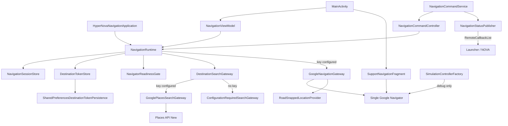

# HyperNova Google Navigation

Standalone Android application that implements the frozen HyperNova Navigation
API v1 on top of the Google Navigation SDK and the Places API (New), as a
drop-in replacement for the legacy Navigation provider.

This document describes the code as currently implemented. It is
documentation-only; no claim of runtime device validation is made here (see
`docs/03-test-and-runtime-validation-plan.md`).

Date: 2026-08-19

## Documents

| Document | Purpose |
|---|---|
| `docs/00-existing-integration-audit.md` | Frozen identity, AIDL surface, NOVA/Launcher assumptions from the legacy provider (read-only baseline). |
| `docs/01-target-architecture.md` | Phase 0 architecture baseline for the Google-backed implementation (read-only baseline). |
| `docs/02-gemini-maps-grounding-extension.md` | Additive future Gemini Maps Grounding bridge; design only, Frozen API v1 untouched. |
| `docs/03-test-and-runtime-validation-plan.md` | Pre-key / post-key / AIDL / Launcher / NOVA validation plan. |
| `secrets.properties.example` | Committed template for the local API key file. |

## Project layout

```text
HyperNovaGoogleNavigation/
├── app/
│   ├── build.gradle.kts          # application module; Secrets Gradle Plugin config
│   └── src/
│       ├── main/                 # runtime, AIDL service, UI, persistence
│       ├── debug/                # SDK simulation only (debug source set)
│       ├── release/              # simulation disabled (no-op)
│       └── test/                 # unit tests
├── settings.gradle.kts           # includes :app, :hypernova-contracts, :nova-visuals
├── secrets.properties.example    # committed template, placeholder value only
└── docs/
```

Two read-only sibling modules are included from outside this repository via
`settings.gradle.kts`:

- `:hypernova-contracts` → `../../HyperNova_Contracts/contracts`
  (AIDL, parcelables, frozen constants; never copied or modified).
- `:nova-visuals` → `../../HyperNova_Nova_Visuals`
  (shared cockpit navigation bar / visuals).

## Architecture overview

The application keeps the legacy single-session ownership model:
`HyperNovaNavigationApplication` creates exactly one `NavigationRuntime`;
`MainActivity`, `NavigationViewModel`, and the AIDL
`NavigationCommandService` all obtain that same runtime. No component creates a
second repository, Navigator, or shadow state.



Key runtime facts matching the current code:

- `NavigationRuntime.create(...)` selects the Places gateway and the Navigator
  gateway only when the API key is considered configured; otherwise it starts
  in `CONFIGURATION_REQUIRED` (`NavigationRuntime.kt:249-276`).
- `NavigationApi.setApiKey()` is called exactly once, before any Navigation SDK
  object, and only when the configured value is non-placeholder
  (`HyperNovaNavigationApplication.kt:11-17`).
- `GoogleNavigationGateway` owns one Navigator, builds waypoints with
  `Waypoint.builder().setPlaceIdString(...)`, and feeds route / reroute /
  arrival / progress / position events into the session store
  (`GoogleNavigationGateway.kt`).
- `NavigationCommandService` is a thin Binder adapter over the runtime
  (`NavigationCommandService.kt`); it keeps the exact frozen FQCN
  `com.hypernova.navigation.service.NavigationCommandService`.
- `NavigationStatusPublisher` registers observers in a `RemoteCallbackList` and
  publishes a route snapshot immediately on registration and progress
  snapshots at most once per second
  (`NavigationStatusPublisher.kt:34-67`).
- HyperNova overlays feed their measured top/bottom insets into
  `GoogleMap.setPadding()`. The built-in ETA card is disabled in favor of the
  SDK-driven HyperNova route panel so Google attribution, legal notices,
  camera targets, and controls remain outside obscured regions.

## SDK and build baseline

- Google Navigation SDK `7.9.0`
- Google Places SDK `5.3.0` using Places API (New)
- Secrets Gradle Plugin `2.0.1`
- compile SDK `36.1`, target SDK `36`, min SDK `35`
- Android Gradle Plugin `8.13.2`, Gradle wrapper `8.14.5`, Kotlin `2.2.21`

The normal `play-services-maps` artifact is excluded from every configuration.
Navigation SDK supplies the compatible Google map implementation and must not
be packaged alongside the regular Maps SDK.

## Prerequisites

- JDK 17 or 21. The committed wrapper pins Gradle 8.14.5, which cannot run on
  JDK 25 (the current default on this machine); export `JAVA_HOME` to a JDK 21
  install before invoking `./gradlew`, for example
  `JAVA_HOME=/usr/lib/jvm/java-21-openjdk-amd64`.
- Android SDK with compileSdk 36 (minor API level 1), platform-tools, and
  build-tools; set `sdk.dir` or `ANDROID_HOME`/`ANDROID_SDK_ROOT` so Gradle can
  find it.
- A Google Cloud project with billing enabled and the Navigation SDK and
  Places API (New) enabled (see next section).

## Google Cloud billing and API enablement

Billing and API enablement are done in the Google Cloud console; they cannot be
configured from this repository.

1. Create (or reuse) a Google Cloud project and enable billing for it.
2. Enable the **Navigation SDK** and the **Places API (New)** for that project.
3. Create an API key and record only the key's ID or a reference in a secure
   location; never commit the key value.
4. Restrict the key (see below) before first device use.

Official references:

- https://developers.google.com/maps/documentation/navigation/android-sdk/setup-overview
- https://developers.google.com/maps/documentation/android-sdk/get-api-key
- https://developers.google.com/maps/documentation/android-sdk/restrict-api-key
- https://developers.google.com/maps/api-security-best-practices
- https://developers.google.com/maps/documentation/places/android-sdk/config

## Local secrets: exact path

The Secrets Gradle Plugin is configured in `app/build.gradle.kts` with
`defaultPropertiesFileName = "secrets.properties.example"`. The committed
example lives at the **project root** and is what the build falls back to when
no local secrets file exists.

Local API key file (do not commit):

```text
/home/ayman/ITI/Android-Apps/HyperNova_Google_Navigation_Task_11/HyperNovaGoogleNavigation/secrets.properties
```

Create it by copying the committed template next to it and replacing only the
value:

```bash
cp secrets.properties.example secrets.properties
```

```properties
# secrets.properties  (local only; ignored by .gitignore)
MAPS_API_KEY=YOUR_REAL_GOOGLE_MAPS_PLATFORM_API_KEY
```

- `secrets.properties` is ignored by `.gitignore`; only
  `secrets.properties.example` (placeholder value) is committed.
- No key value appears in source, resources, manifest, Gradle files, or this
  documentation.
- The illustrative value above must be replaced with the real key. Any value
  recognized as a placeholder by `GoogleApiKeyPolicy` — the defaults
  `DEFAULT_API_KEY` / `YOUR_API_KEY` / `YOUR_GOOGLE_MAPS_API_KEY`, any value
  starting with `YOUR`, or any value containing `PLACEHOLDER`, `REPLACEME`, or
  `REPLACE_ME` — is
  deliberately treated as **not configured** and is never passed to
  `NavigationApi.setApiKey()`.

## Restricted key and signing SHA-1

A restricted key must include the Android package and the SHA-1 certificate
fingerprint of the **actual signing certificate used by the APK that runs on
the validation device**.

The debug keystore SHA-1 (Linux/macOS):

```bash
keytool -list -v \
  -keystore ~/.android/debug.keystore \
  -alias androiddebugkey \
  -storepass android \
  -keypass android
```

The release (or platform) keystore SHA-1:

```bash
keytool -list -v -keystore /path/to/your-release.jks -alias <alias>
```

The `keytool` command prints a certificate fingerprint block; copy the `SHA1`
line into the Google Cloud console restriction for package
`com.hypernova.navigation`. Do not fabricate or hardcode a SHA-1 value; read it
from the keystore that signs the APK under validation. If the app is later
re-signed (for example with the AAOS platform certificate), a new SHA-1 must be
added.

## Build, test, and lint commands

Run from `HyperNovaGoogleNavigation/` with a compatible JDK:

```bash
JAVA_HOME=/usr/lib/jvm/java-21-openjdk-amd64 ./gradlew :app:assembleDebug
JAVA_HOME=/usr/lib/jvm/java-21-openjdk-amd64 ./gradlew :app:testDebugUnitTest
JAVA_HOME=/usr/lib/jvm/java-21-openjdk-amd64 ./gradlew :app:lintDebug
```

- `assembleDebug` succeeds with the safe placeholder configuration.
- `testDebugUnitTest` passes all 55 tests (0 failures, 0 errors).
- `lintDebug` reports `No issues found`.
- `assembleRelease` also succeeds, but its APK is intentionally unsigned and
  is not a deployment artifact. No release or platform signing key is invented.
- The debug APK is written to
  `app/build/outputs/apk/debug/app-debug.apk`.

## No-key behavior (`CONFIGURATION_REQUIRED`)

A fresh clone has no local `secrets.properties`, so `BuildConfig.MAPS_API_KEY`
equals the example placeholder and `GoogleApiKeyPolicy.isConfigured(...)`
returns `false`. The app is designed to run gracefully in this state:

- `NavigationApi.setApiKey()` is never called, and no Navigator or Places client
  is created (`HyperNovaNavigationApplication.kt:13-16`,
  `NavigationRuntime.kt:41-49`).
- The session starts in `CONFIGURATION_REQUIRED` with the message
  "Add a restricted Google Maps Platform API key to secrets.properties."
  (`NavigationRuntime.kt:250-261`).
- `MainActivity` shows the "Google configuration required" panel and does **not**
  create the `SupportNavigationFragment` map surface
  (`MainActivity.kt:55-57,205-208`).
- Search uses `ConfigurationRequiredSearchGateway`, which throws
  `GooglePlacesException.ConfigurationRequired`; the AIDL layer maps this to
  `STATUS_UNAVAILABLE` "Google Maps configuration is required."
  (`DestinationSearchGateway.kt:9-13`, `NavigationCommandController.kt:72-73`).
- `setDestination` cannot resolve a route: `prepareDestination` fails with
  `FailureKind.CONFIGURATION`, projected to `STATUS_UNAVAILABLE` /
  `ERROR_SERVICE_UNAVAILABLE` (`NavigationRuntime.kt:106-110`,
  `NavigationCommandController.kt:333-335`).
- The app therefore builds and launches without a key and reports the missing
  configuration explicitly instead of crashing.

## Google-enabled device validation checklist

Device validation is **not** claimed by this document; the checklist below is
what must be true and exercised before a runtime PASS can be recorded (plan in
`docs/03-test-and-runtime-validation-plan.md`).

- [ ] Physical device (or emulator) with Google Play services installed and up
      to date; `GoogleApiAvailability.isGooglePlayServicesAvailable(...)` must
      return `SUCCESS` (`NavigationRuntime.kt:240-242`).
- [ ] Device/emulator image supports the Google Navigation SDK (a Google Play
      services-capable image, not a bare AOSP/AAOS image without GMS).
- [ ] App signing certificate is the one whose SHA-1 is registered for the
      restricted key (debug, release, or platform keystore as appropriate).
- [ ] Restricted key lists package `com.hypernova.navigation` and that SHA-1,
      and the key is enabled for the Navigation SDK and Places API (New).
- [ ] `secrets.properties` exists locally with the real key and the app is
      freshly installed; launch must transition `INITIALIZING` → `READY_IDLE`
      (or a documented `TERMS_REQUIRED`, `LOCATION_UNAVAILABLE`,
      `GOOGLE_SERVICES_UNAVAILABLE`, or `ERROR` state).
- [ ] Fine location permission granted; no synthetic position is ever reported
      as live.
- [ ] A real map surface renders, a search returns at most four real Places
      results, route preparation produces a real Google route preview, and
      guidance, progress, reroute, and arrival behave as documented.

## Debug simulation (debug builds only)

The `SimulationController` is compiled only into the debug source set and calls
the Navigation SDK `Simulator` with a deterministic Cairo demo route
(`app/src/debug/java/com/hypernova/navigation/simulation/SimulationControllerFactory.kt`).
The release source set is a no-op. Simulator-derived position is always labeled
"SIMULATED — Google SDK demo"; production code cannot activate it
(`NavigationSessionStore.kt:91-100`, `MainActivity.kt:165-168`).

## Official references

- https://developers.google.com/maps/documentation/navigation/android-sdk/setup-overview
- https://developers.google.com/maps/documentation/navigation/android-sdk/android-studio-setup
- https://developers.google.com/maps/documentation/navigation/android-sdk/route
- https://developers.google.com/maps/documentation/navigation/android-sdk/overview
- https://developers.google.com/maps/documentation/places/android-sdk/config
- https://developers.google.com/maps/documentation/android-sdk/get-api-key
- https://developers.google.com/maps/documentation/android-sdk/restrict-api-key
- https://developers.google.com/maps/api-security-best-practices
