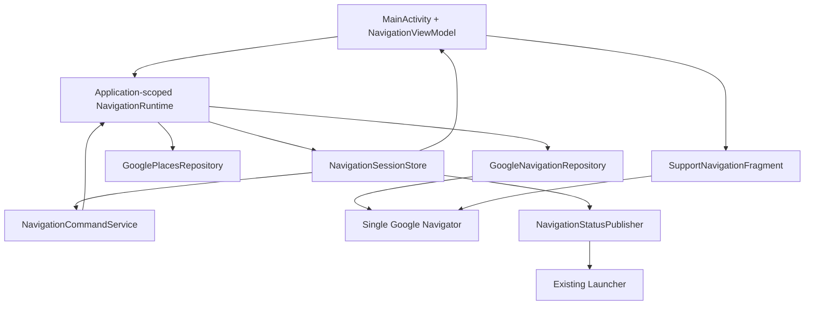
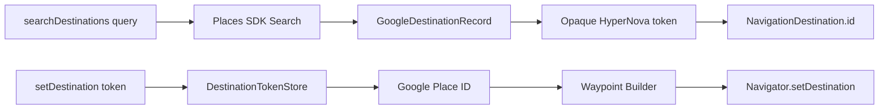

# Target Architecture — HyperNova Google Navigation

Date: 2026-08-19  
Status: Phase 0 architecture baseline

## Official Google baseline

Only current official Google documentation and Google Maven metadata were used
for Google SDK decisions.

- Navigation SDK Maven coordinate:
  `com.google.android.libraries.navigation:navigation:7.9.0`.
  Google Maven reports 7.9.0 as the current release on 2026-08-19.
- Places SDK Maven coordinate:
  `com.google.android.libraries.places:places:5.3.0`.
  Google Maven reports 5.3.0 as the current release on 2026-08-19.
- Secrets Gradle Plugin: `2.0.1`, as currently documented by Google.
- Navigation SDK 7.7+ build baseline: Gradle 8.13, Android Gradle Plugin
  8.13.2, and `desugar_jdk_libs_nio:2.1.5`.
- HyperNova baseline remains stricter than Google's runtime minimum:
  compile SDK 36.1, target SDK 36, and min SDK 35, matching the contract and
  existing Navigation project.
- `SupportNavigationFragment` is the selected map/navigation surface because
  Google recommends it for most integrations and it owns lifecycle forwarding.
- The normal Maps SDK dependency is forbidden because Navigation SDK already
  supplies the map layer and the two SDKs cannot coexist in one application.
- `Waypoint.builder().setPlaceIdString(...)` is selected; deprecated
  `fromPlaceId()`/`fromLatLng()` factories will not be used.
- The experimental `NavigationLayoutDelegate` API is not a production
  dependency. HyperNova overlays use stable view boundaries around the standard
  Google navigation experience.

Official references:

- https://developers.google.com/maps/documentation/navigation/android-sdk/setup-overview
- https://developers.google.com/maps/documentation/navigation/android-sdk/android-studio-setup
- https://developers.google.com/maps/documentation/navigation/android-sdk/route
- https://developers.google.com/maps/documentation/navigation/android-sdk/overview
- https://developers.google.com/maps/documentation/navigation/android-sdk/reference/com/google/android/libraries/navigation/NavigationApi
- https://developers.google.com/maps/documentation/navigation/android-sdk/reference/com/google/android/libraries/navigation/NavigationView
- https://developers.google.com/maps/documentation/navigation/android-sdk/reference/com/google/android/libraries/navigation/Simulator
- https://developers.google.com/maps/documentation/places/android-sdk/config
- https://developers.google.com/maps/api-security-best-practices
- https://dl.google.com/dl/android/maven2/com/google/android/libraries/navigation/navigation/maven-metadata.xml
- https://dl.google.com/dl/android/maven2/com/google/android/libraries/places/places/maven-metadata.xml

## Ownership model



`HyperNovaNavigationApplication` creates one `NavigationRuntime`. That runtime
owns the only session store, destination-token store, request registry, Places
client, and Navigator lifecycle. Activity and service obtain the same runtime
from the application. Neither creates a repository, Navigator, or shadow state.

The `SupportNavigationFragment` is Activity-owned UI attached to the same SDK
singleton. Destroying the Activity destroys its view, not the navigation
session. `Navigator.cleanup()` is never tied to `Activity.onDestroy()` because
guidance and AIDL status may remain active while the UI is backgrounded.

## Terms and cold-start initialization

Google terms enforcement needs an Activity unless the Google Cloud project has
explicit permission to skip it. HyperNova will not assume that permission and
will not use `getNavigatorNoToS()` as a bypass.

State flow:

```text
process start -> INITIALIZING
missing/invalid key or authorization -> ERROR / GOOGLE_SERVICES_UNAVAILABLE
terms not accepted and no Activity -> TERMS_REQUIRED; retain pending intent
Activity visible -> NavigationApi.getNavigator(Activity, listener)
terms accepted + Navigator ready -> READY; drain pending route request
location permission missing/denied -> LOCATION_UNAVAILABLE
```

An AIDL `setDestination` received before the Activity exists is validated,
deduplicated, stored in application state, and receives `ACCEPTED` immediately.
NOVA then opens the Activity as it already does. If terms are required, the
Activity presents Google's terms surface; route preparation continues after
acceptance. Once terms have been accepted and the Navigator exists, later
service requests can calculate routes while the Activity is not visible.

## Destination and Places boundary



`GoogleDestinationRecord` contains at minimum Google Place ID, display name,
formatted address, primary/category text, optional straight-line distance, and
token metadata. NOVA sees only a random opaque token. Search tokens persist in
application-private storage until their ten-minute TTL has elapsed so ordinary
process recreation does not violate the contract. Saved tokens are stable while
the saved destination exists.

Places uses the new Places API initialization and requests only fields needed
for the UI, contract, and routing. Navigation SDK remains the sole routing
authority; Places never supplies ETA or a route.

## Routing and guidance state machine

Internal states are richer than the frozen five-state public enum:

```text
INITIALIZING
TERMS_REQUIRED
READY_IDLE
SEARCHING
CALCULATING
PREVIEW_READY
GUIDING
REROUTING
ARRIVED
LOCATION_UNAVAILABLE
GOOGLE_SERVICES_UNAVAILABLE
ERROR
```

Contract projection remains compatible:

| Internal state | Frozen state |
|---|---|
| Initial/ready/searching/preview ready | `STATE_IDLE` |
| Calculating/rerouting before a usable route | `STATE_CALCULATING` |
| Guiding/rerouting with usable active route | `STATE_ACTIVE` |
| Arrived | `STATE_ARRIVED` |
| Terminal SDK/provider failure | `STATE_ERROR` |

`Navigator.setDestination()` calculates and displays the route but does not
start guidance. `RouteStatus.OK` produces the final `setDestination`
confirmation with SDK-derived metrics. Only a driver UI action invokes
`startGuidance()`. Cancel clears destinations/guidance and atomically publishes
an idle session. Rerouting, arrival, remaining time/distance, position, and
route changes are listener-driven SDK truth.

## AIDL service design

`NavigationCommandService` keeps the exact frozen FQCN. It is a thin Binder
adapter over application runtime commands:

- validate and normalize arguments on a dedicated executor;
- deduplicate `(operation, requestId)` for ten minutes;
- return/replay `ACCEPTED` and final results according to v1;
- never block Binder threads on Places, Navigator, disk, or callbacks;
- deliver callbacks defensively and tolerate dead Binder clients;
- expose current state and bounded route preview without mutation;
- register status observers in a `RemoteCallbackList` and immediately publish
  current route/progress snapshots.

Route IDs are opaque and stable for one SDK route identity; route versions rise
monotonically when the route changes, including reroutes. Progress sequences
rise monotonically. Status geometry is sampled to at most 128 valid points.

## Gemini Maps grounding boundary

The current Android wire command supports:

```text
search_destinations { query }
set_destination { destination_id }
```

No inspected Android source carries a Google Place ID from Gemini. Phase 1-5
therefore preserve query -> opaque token -> set flow unchanged.

Future additive design, documented but not implemented in Frozen API v1:

```text
Gemini Maps Grounding place identity
  -> NOVA validates/maps grounded result
  -> additive v2 method or separately versioned capability
  -> Navigation resolves Google Place ID
  -> same DestinationTokenStore/GoogleDestinationRecord
  -> same Navigator pipeline
```

The extension must be capability/version negotiated and additive. It must not
reinterpret existing opaque IDs or change existing method transactions.

## Automotive UI architecture

The 1080x1920 portrait composition is:

```text
status/search overlay (large 64dp+ touch targets, collapses during guidance)
Google SupportNavigationFragment (dominant map/navigation surface)
contextual HyperNova preview/error controls (state-driven, non-scrolling)
shared HyperNova cockpit navigation bar (104dp reserved height)
```

The Google fragment owns map attribution, legal marks, route rendering,
navigation camera, maneuver cards, ETA card, traffic layers, and guidance
prompts. HyperNova controls never cover those surfaces. During active guidance,
the search panel collapses and the standard Google guidance components remain
unobscured. Core driving UI has no scrolling.

The shared `HyperNova_Nova_Visuals` bottom bar is reused and marks Navigation as
selected. Back collapses search/results first, cancels an unstarted preview only
after an explicit user action, and returns HOME without cancelling active
guidance. Light/dark follows deliberate system night mode plus the shared
values/values-night cockpit resources; Google map night behavior uses supported
Navigation SDK controls.

## Security and manifest baseline

- No key is stored in source, resources, manifest literals, Gradle files, or
  documentation.
- Secrets Gradle Plugin reads local `secrets.properties`; a safe
  `secrets.properties.example` is committed and local secrets are ignored.
- The key is restricted to Android package `com.hypernova.navigation` plus the
  actual debug/release/platform signing SHA-1, and restricted to Navigation SDK
  and Places API (New) when both are used.
- `NavigationApi.setApiKey()` is called once, before any Navigation SDK object,
  only when the configured value is non-placeholder.
- Activity is exported only for launcher/OPEN entry. The service is exported
  only behind `CONTROL_COCKPIT_APPS` and rejects an unexpected bind action.
- Navigation requests but does not define the signature permission.
- Backup is disabled for destination-token and navigation state data.
- Fine location is requested at runtime with a visible unavailable state; no
  synthetic location is reported as live.

## Debug simulation

Simulation is compiled only into the debug source set and calls the Navigation
SDK `Simulator`. A deterministic demo route is labeled as simulated in session
state and UI. Production code cannot activate it, and simulator-derived
position is never labeled as live GPS. Traffic and ETA continue to come from the
SDK; no fake production values are introduced.

## Verification gates

1. Skeleton assembles before Navigation SDK behavior is added.
2. SDK vertical slice renders a real map and reports explicit initialization
   states.
3. Search/route/guidance tests use SDK or fakes behind defined interfaces; no
   fake runtime route data appears in production.
4. Frozen identity, manifest, request registry, token TTL, state projection, and
   status reducer have tests.
5. `assembleDebug`, unit tests, and lint pass.
6. Dependency/source scans find no MapLibre, OpenFreeMap, Nominatim, Overpass,
   OSRM, or software route overlay in the new runtime.
7. APK manifest/signature inspection passes.
8. Device validation is reported separately from build success and requires
   Google Play services, target SDK/device checks, a provisioned restricted key,
   accepted terms, and actual map/route exercise.

## Phase plan

1. Phase 1: clean drop-in skeleton, sibling module wiring, secure placeholder,
   manifest identity, shared cockpit bar, and successful debug assembly.
2. Phase 2: Navigator/fragment minimum vertical slice and explicit SDK states.
3. Phase 3: Places search, durable opaque tokens, waypoint resolution, route
   preview, ETA, and distance.
4. Phase 4: guidance, progress, rerouting, arrival, camera, and voice settings.
5. Phase 5: complete frozen AIDL service, dedup, state query, route preview, and
   status publishing.
6. Phase 6: Gemini grounding extension design only.
7. Phase 7: final automotive UI integration.
8. Phase 8: debug-only SDK simulation.
9. Phase 9: full build/test/lint/APK/device verification and later AAOS staging
   proposal without modifying the image.
