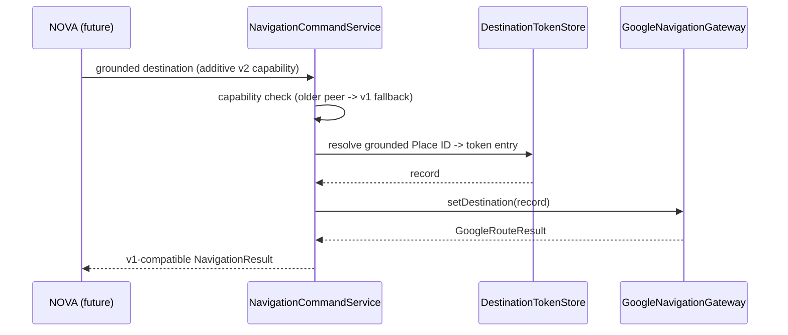

# Gemini Maps Grounding Extension (Design-Only Additive Bridge)

Date: 2026-08-19
Status: Design only. No Gemini payload code exists in this repository, and
Frozen API v1 is untouched.

## Purpose

This document specifies how a future Gemini Maps Grounding source of
destinations could be bridged into the current Google-backed Navigation
application as an **additive** capability. It is a design reference for a
later phase; nothing here changes the implemented Frozen API v1 surface.

## Explicit absence of Gemini payload code

- This repository contains **no code that consumes, parses, or transforms a
  Gemini Maps Grounding payload**. There is no Gemini client, no grounding
  data model, and no API method that accepts a grounded destination reference.
- The external Gemini agent implementation is **not present in this workspace**,
  so its current raw grounding payload shape cannot be asserted here.
- The inspected NOVA Android source carries only a search `query` or an opaque
  `destination_id`; it has no Maps-grounded destination representation
  (see `docs/00-existing-integration-audit.md`, "NOVA assumptions").
- Everything below is forward-looking design. Any implementation must be
  capability/version negotiated and additive (section "Additive design").

## Current implemented surface (the bridge must not disturb)

The implemented wire flow for destinations is unchanged:

```text
search_destinations { query }
   -> Places SDK SearchByText
   -> GoogleDestinationRecord (Google Place ID + display fields)
   -> opaque token "nav_search_<uuid>" in DestinationTokenStore
   -> NavigationDestination { id = opaque token }

set_destination { destination_id = opaque token }
   -> DestinationTokenStore.resolve (expired / unknown / found)
   -> GoogleNavigationGateway (Waypoint.builder().setPlaceIdString(placeId))
   -> Navigator.setDestination(...)
```

Frozen elements that must remain byte-for-byte intact:

- Package `com.hypernova.navigation`, service FQCN
  `com.hypernova.navigation.service.NavigationCommandService`, actions, API
  version `1`, and control permission (see
  `docs/00-existing-integration-audit.md`, "Frozen external identity").
- All nine `INavigationCommandService` methods and their callback semantics.
- `NavigationResult` field and Parcel order; route geometry stays in the
  separate preview/snapshot parcelables.
- Search token TTL (10 minutes), search/route timeouts, result limits, request
  dedup retention (10 minutes), and the argument-fingerprint conflict rule.
- `setDestination` semantics: `ACCEPTED` before any Activity is required, final
  `CONFIRMED` means route preview ready (`STATE_IDLE`), never guidance started.

## Additive design

When a future phase implements the bridge, it must extend rather than
reinterpret:

```text
Gemini Maps Grounding place identity (future, external)
   -> NOVA validates / maps the grounded result (future NOVA change)
   -> additive capability: separately negotiated, versioned method/field
   -> Navigation resolves the Google Place ID
   -> same DestinationTokenStore / GoogleDestinationRecord
   -> same Waypoint / Navigator pipeline (no new routing authority)
```



### Binding rules

- The extension is **additive**: a new capability must be exposed through a
  separately versioned AIDL interface or a new transaction on a new API version,
  negotiated at bind time. Existing v1 clients must receive v1 behavior
  unchanged.
- Existing opaque tokens must never be reinterpreted as grounding payloads, and
  grounded references must never be forced into the v1 `destination_id` field.
- The extension must reuse `DestinationTokenStore`, `GoogleDestinationRecord`,
  and `GoogleNavigationGateway` unchanged; it adds an input path, not a second
  routing authority.
- Place identity flows through the same `Waypoint.builder().setPlaceIdString(...)`
  pipeline so route geometry, ETA, and distance continue to come from the
  Navigation SDK alone.

### Compatibility guarantees

- A Navigation build without the capability still serves every v1 method
  exactly as today; NOVA must detect the missing capability and stay on v1.
- A NOVA build without the capability must not attempt grounded requests; older
  peers keep the query / opaque-token flow.
- No change to billing, key restrictions, permissions, or manifest boundaries is
  introduced by the design.

## Out of scope for this document

- Any external Gemini implementation, prompt, or tool configuration.
- Any modification to `HyperNova_Contracts`, NOVA, Launcher, the legacy
  Navigation project, or the AAOS image.
- Any runtime validation claim (see `docs/03-test-and-runtime-validation-plan.md`).
