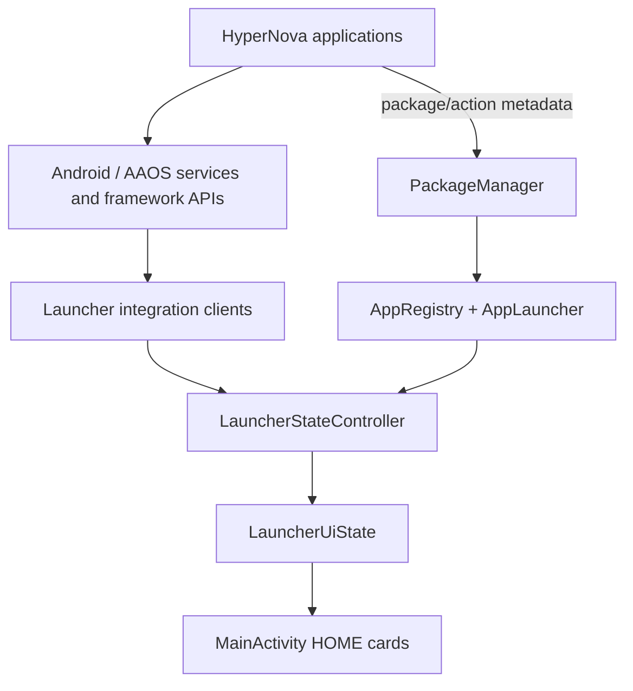
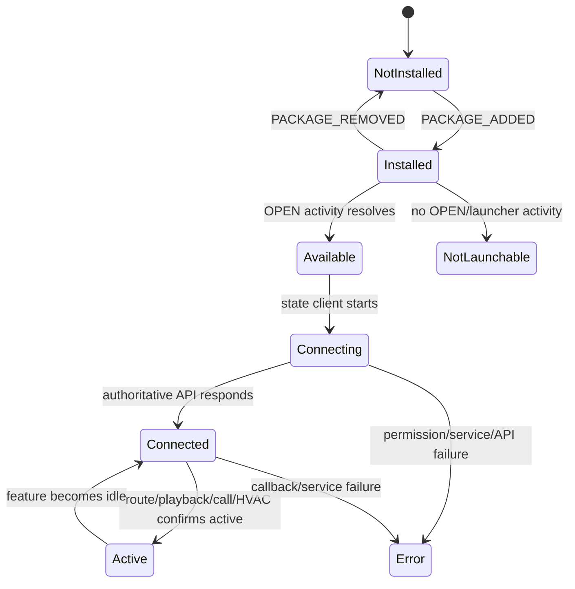
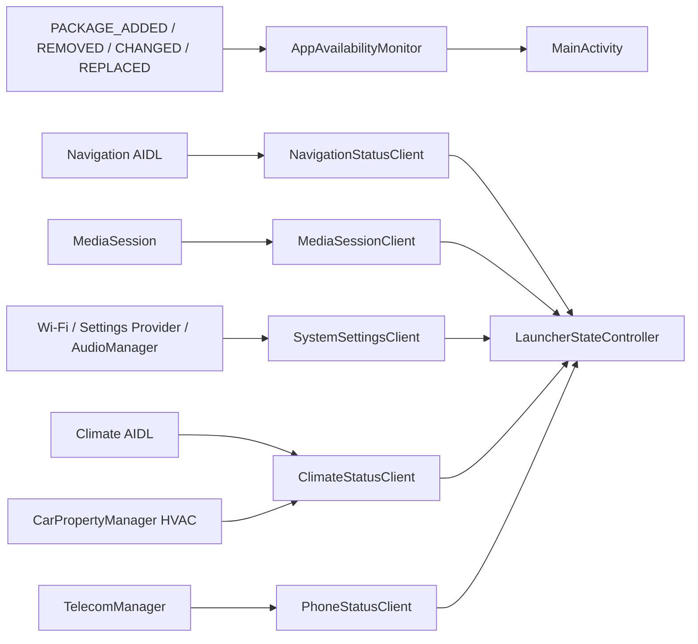

# Architecture

## State pipeline

The existing architecture was extended rather than replaced:

- `AppRegistry` remains the source of package, OPEN action, and known service
  component metadata.
- `AppLauncher` remains the only application-launching component. It first
  resolves the package-scoped HyperNova OPEN action, then falls back to the
  package launch intent.
- `LauncherStateController` remains the only component that converts raw
  integration snapshots into user-facing card state.
- `MainActivity` remains the lifecycle owner and UI renderer.
- `MediaSessionClient` and NOVA integration remain intact.

## Separate state dimensions

`IntegratedAppState` stores these dimensions explicitly:

- `availability`: package/launch resolution (`NOT_INSTALLED`,
  `NO_LAUNCHABLE_ACTIVITY`, `AVAILABLE`, or `ERROR`).
- `connectionState`: runtime source connection (`DISCONNECTED`, `CONNECTING`,
  `CONNECTED`, or `ERROR`).
- `active`: authoritative feature activity only.
- `errorMessage`: real failure detail when available.

## Clients

The frozen Contracts source is compiled read-only into the Launcher build by
adding its `aidl` and `java` directories to the Launcher source set. Gradle
writes generated output only under the Launcher `build/` directory.

## Lifecycle

- `onStart`: register package/framework observers and connect state clients.
- `onResume`: refresh package availability and issue non-mutating state reads.
- Framework callbacks/broadcasts: publish a new snapshot immediately.
- Package change: reconnect only the affected client and rerender.
- `onStop`: unregister observers, unbind services, release MediaController and
  Car connections, and remove callbacks.

No periodic polling was added. Media position retains its existing one-second
update only while media is playing.
