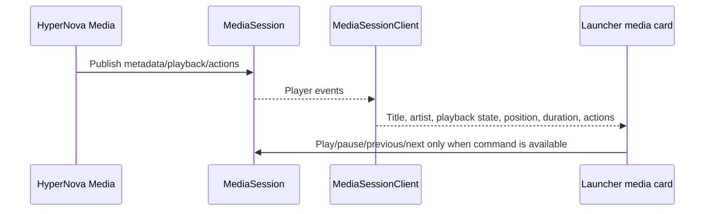
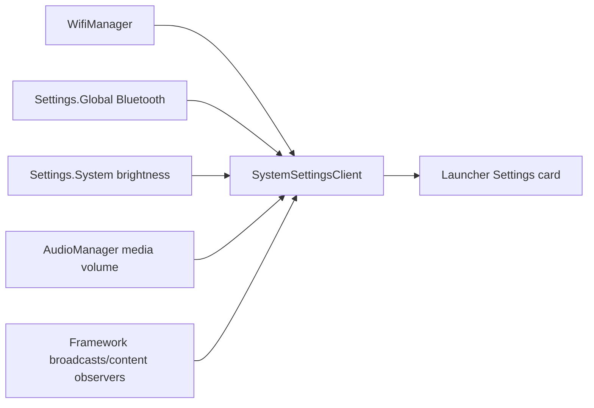
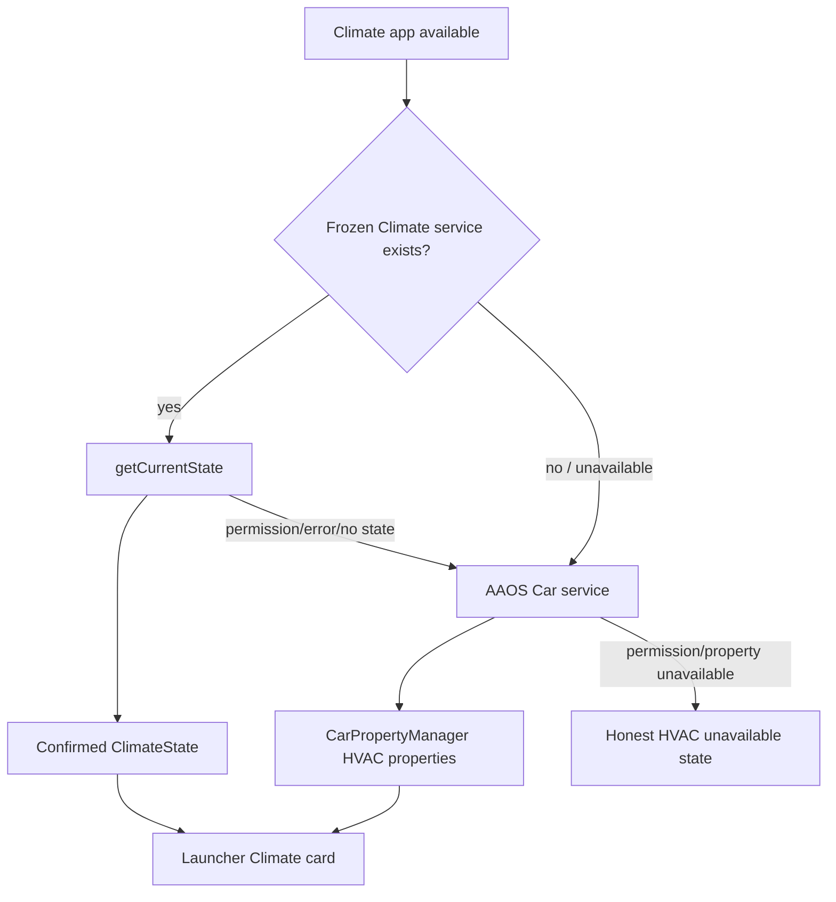
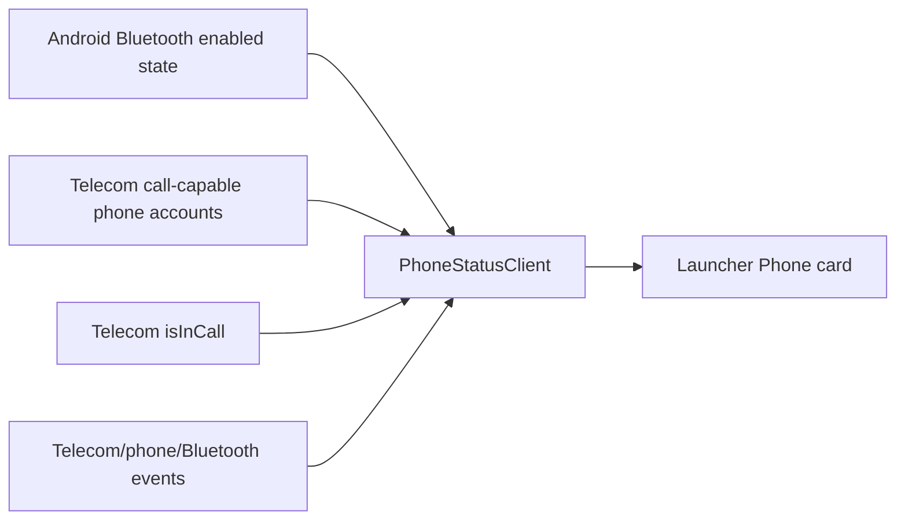
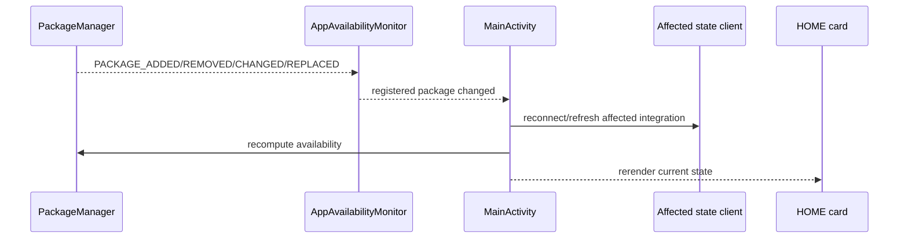

# Runtime State Flow

## Navigation

```mermaid
sequenceDiagram
    participant UI as Navigation UI
    participant Repo as NavigationRepository/Session
    participant AIDL as NavigationCommandService
    participant Client as NavigationStatusClient
    participant Home as Launcher HOME

    UI->>Repo: User creates/activates a real route
    Repo->>Repo: Session becomes ACTIVE
    Home->>Client: onResume refresh
    Client->>AIDL: getSavedDestinations(requestId)
    Note over Client,AIDL: Non-mutating request; used only because API v1 includes navigationState
    AIDL-->>Client: NavigationResult(STATE_ACTIVE)
    Client-->>Home: Active route state
    Note over Home: Destination/ETA/distance remain unavailable because this query omits them
```

## Media



## Settings



The Launcher observes these values only. It does not write Settings.

## Climate



## Phone



No Contacts Provider, PBAP data, phone number, device name, or synthetic call
timer is read or displayed.

## Package lifecycle


