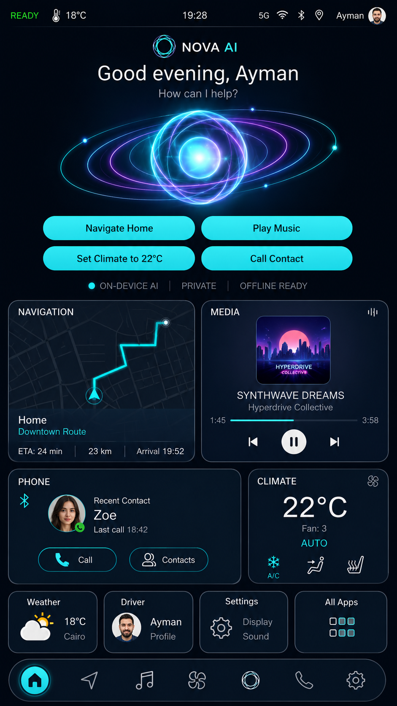

# HyperNova Cockpit — Task 01: Android Launcher App

> **Project:** HyperNova Cockpit  
> **Task:** Task 01 — Android Launcher  
> **Application package:** `com.hypernova.launcher`  
> **Target:** Custom AOSP Android IVI image  
> **Orientation:** Portrait only  
> **Reference aspect ratio:** 9:16  
> **Reference asset resolution:** 941 × 1672 px  
> **Implementation baseline:** 1080 × 1920 px  
> **Language:** Kotlin  
> **UI:** Android XML Views + ViewBinding  
> **Architecture:** Single Activity + MVVM + service clients  
> **Data policy:** Real application data only — no production mock or dummy data  
> **Status:** Ready for implementation  

---

## 1. Final Visual Reference



### Important Difference from the Reference Asset

The reference image contains an **All Apps** card in the lower-right quick-card row.

That card is included in the image only because the image is an unedited visual reference. It must **not** be implemented.

The final quick-card row contains exactly:

```text
Weather | Driver | Settings
```

The implementation must not contain:

- An All Apps card.
- An All Apps icon.
- An app drawer.
- An All Apps screen.
- A Vehicle application.
- A Vehicle Status card.

---

# 2. Task Objective

Build the production Android HOME application for the HyperNova Cockpit.

The launcher is the first interactive application displayed after Android finishes booting. It provides one consistent automotive interface for viewing live states and controlling the main HyperNova applications.

The launcher must:

- Replace the default Android HOME application.
- Match the supplied reference image.
- Use the shared HyperNova visual language.
- Display live data owned by the corresponding applications.
- Open the correct application or screen when the user presses a card.
- Send commands through defined IPC contracts.
- Update cards when applications publish new states.
- Show real connection and empty states when data is unavailable.
- Never display hard-coded operational data as if it were real.
- Continue running safely when another application or service is unavailable.
- Be ready for integration into the HyperNova AOSP product image.

---

# 3. Final Launcher Sections

The launcher contains six main vertical sections:

```text
1. Custom Status Bar
2. NOVA AI Hero Section
3. Navigation and Media Row
4. Phone and Climate Row
5. Weather, Driver, and Settings Row
6. Fixed Bottom Navigation Bar
```

Final structure:

```text
+--------------------------------------------------+
| READY  Temp          Time      Network     Driver|
+--------------------------------------------------+
|                    NOVA AI                       |
|             Greeting and AI Orb                  |
|                                                  |
| Navigate Home | Play Music                       |
| Set Climate   | Call Contact                     |
|                                                  |
| ON-DEVICE AI | PRIVATE | OFFLINE READY           |
+------------------------+-------------------------+
| Navigation             | Media                   |
+------------------------+-------------------------+
| Phone                              | Climate      |
+----------------+----------------+----------------+
| Weather        | Driver         | Settings       |
+--------------------------------------------------+
| Home | Navigation | Media | Climate | AI | Phone |
| Settings                                         |
+--------------------------------------------------+
```

---

# 4. HyperNova Application Ecosystem

The visible launcher integrates with the following applications and services.

| Component | Package | Visible application |
|---|---|---|
| Launcher | `com.hypernova.launcher` | Yes |
| NOVA AI | `com.hypernova.ai` | Yes |
| Navigation | `com.hypernova.navigation` | Yes |
| Media | `com.hypernova.media` | Yes |
| Phone | `com.hypernova.phone` | Yes |
| Climate | `com.hypernova.climate` | Yes |
| Driver & Settings | `com.hypernova.settings` | Yes |
| Weather provider | `com.hypernova.weather` | No separate UI required |
| Cockpit core/health | `com.hypernova.core` | No separate UI required |

The package names must be agreed before development begins and must not change independently after integration starts.

---

# 5. Non-Negotiable Data Rule

## 5.1 The Launcher Does Not Own Operational Data

The launcher is a presentation and command surface.

It must not own or invent:

- Navigation destination.
- Route name.
- ETA.
- Remaining distance.
- Arrival time.
- Current song.
- Artist.
- Album artwork.
- Playback progress.
- Recent contact.
- Phone connection state.
- Climate temperature.
- Fan level.
- AC state.
- Seat heating state.
- Weather temperature.
- Weather condition.
- Driver name.
- Driver avatar.
- Cockpit health state.

Each value is owned by its source application or service.

## 5.2 Values Shown in the Reference Are Design Examples Only

The following text is visible in the supplied design:

```text
Home
Downtown Route
ETA: 24 min
SYNTHWAVE DREAMS
Hyperdrive Collective
Zoe
22°C
18°C
Ayman
```

These values define visual length and hierarchy only.

They must not be hard-coded into the production launcher.

## 5.3 No Production Dummy Layer

The production source set must not contain:

```text
MockLauncherDataSource
FakeNavigationRepository
DummyMediaState
HardcodedClimateState
HardcodedPhoneState
HardcodedWeatherState
StaticProfileData
Demo JSON pretending to be real data
```

When real data is unavailable, display a valid system state such as:

```text
Connecting
No active route
No media playing
Phone not connected
Climate unavailable
Weather unavailable
Driver profile unavailable
Service error
```

These are real states, not dummy content.

## 5.4 Testing Rule

Unit tests may use test doubles inside test source sets only:

```text
src/test/
src/androidTest/
```

Test doubles must never be compiled into the production launcher APK.

---

# 6. System Architecture

## 6.1 High-Level Architecture

```text
+----------------------- HYPERNOVA ANDROID IMAGE ----------------------+
|                                                                      |
|  +------------------+       +-------------------------------------+  |
|  | HyperNova        |       | Shared IPC Contracts                |  |
|  | Launcher         |<----->| AIDL models, callbacks, permissions |  |
|  +------------------+       +-------------------------------------+  |
|          ^    ^    ^                         ^                       |
|          |    |    |                         |                       |
|          |    |    +-------------------------+                       |
|          |    |                                                      |
|          |    +-------- Android MediaSession ------------------+      |
|          |                                                   |      |
|  +-------+---------+  +----------------+  +------------------+ |      |
|  | Navigation App  |  | Climate App    |  | Media App        |-+      |
|  | AIDL Service    |  | AIDL Service   |  | MediaSession     |        |
|  +-----------------+  +----------------+  +------------------+        |
|                                                                      |
|  +-----------------+  +----------------+  +------------------+        |
|  | Phone App       |  | Driver/Settings|  | Weather Service  |        |
|  | AIDL Service    |  | AIDL Service   |  | AIDL Service     |        |
|  +-----------------+  +----------------+  +------------------+        |
|                                                                      |
|  +-----------------+                                                 |
|  | Cockpit Core    |  System health, readiness, service status       |
|  +-----------------+                                                 |
+----------------------------------------------------------------------+
```

## 6.2 Communication Types

Use the appropriate Android mechanism for each integration.

| Integration | Mechanism |
|---|---|
| Open a complete application | Explicit Intent |
| Open a specific application screen | Deep Link or explicit component Intent |
| Receive Navigation live state | Bound AIDL service + callback |
| Send Navigation command | AIDL command or deep link |
| Receive Media metadata/state | Android `MediaSession` / `MediaController` |
| Control Media playback | `MediaController.TransportControls` |
| Receive Phone state | Bound AIDL service + callback |
| Open Phone screen | Explicit Intent/deep link |
| Receive Climate state | Bound AIDL service + callback |
| Send Climate command | AIDL service command |
| Receive Driver profile | Bound AIDL service + callback |
| Open Profile/Settings tab | Deep link |
| Receive Weather state | Bound AIDL service + callback |
| Receive cockpit readiness | Bound core service or system-state contract |
| Current time | Android system clock |
| Network status | Android connectivity APIs |
| Bluetooth status | Android Bluetooth APIs or Phone service |
| GPS availability | Android location APIs |

## 6.3 Mechanisms That Must Not Be Used

Do not use:

- Shared static variables between APKs.
- Public writable files for live communication.
- SharedPreferences as cross-application IPC.
- Polling every second for all services.
- Unprotected broadcasts for private data.
- `sharedUserId`.
- Hard-coded JSON inside the launcher.
- Direct database access into another application's private database.
- Direct hardware communication from the launcher.

---

# 7. Shared Modules Required Before App Integration

The team must create two shared modules or repositories.

```text
hypernova-design-system
hypernova-ipc-contracts
```

## 7.1 `hypernova-design-system`

This module defines the visual rules used by every HyperNova application.

It must contain:

- Color tokens.
- Dimension tokens.
- Typography styles.
- Card shapes.
- Button shapes.
- Icon rules.
- Common status components.
- Common loading/empty/error states.
- Reusable XML styles.
- Asset naming rules.

Every application must either depend on this module or copy its versioned Android resources without changing token values.

## 7.2 `hypernova-ipc-contracts`

This module defines communication between applications.

It must contain:

```text
AIDL interfaces
AIDL callbacks
Parcelable state models
Package constants
Deep-link constants
Signature permission constants
Service action constants
API version constants
Error codes
Capability flags
```

Suggested structure:

```text
hypernova-ipc-contracts/
|
+-- src/main/
    |
    +-- aidl/com/hypernova/contracts/
    |   |
    |   +-- navigation/
    |   |   +-- INavigationService.aidl
    |   |   +-- INavigationCallback.aidl
    |   |   +-- NavigationState.aidl
    |   |
    |   +-- climate/
    |   |   +-- IClimateService.aidl
    |   |   +-- IClimateCallback.aidl
    |   |   +-- ClimateState.aidl
    |   |
    |   +-- phone/
    |   |   +-- IPhoneService.aidl
    |   |   +-- IPhoneCallback.aidl
    |   |   +-- PhoneState.aidl
    |   |
    |   +-- profile/
    |   |   +-- IProfileService.aidl
    |   |   +-- IProfileCallback.aidl
    |   |   +-- DriverProfileState.aidl
    |   |
    |   +-- weather/
    |   |   +-- IWeatherService.aidl
    |   |   +-- IWeatherCallback.aidl
    |   |   +-- WeatherState.aidl
    |   |
    |   +-- core/
    |       +-- ICockpitCoreService.aidl
    |       +-- ICockpitCoreCallback.aidl
    |       +-- CockpitSystemState.aidl
    |
    +-- java/com/hypernova/contracts/
        +-- HyperNovaPackages.kt
        +-- HyperNovaActions.kt
        +-- HyperNovaDeepLinks.kt
        +-- HyperNovaPermissions.kt
        +-- ContractVersions.kt
```

---

# 8. Source-of-Truth Ownership

Every data field has exactly one owner.

| Data | Owner |
|---|---|
| Destination | Navigation App |
| Active route | Navigation App |
| ETA | Navigation App |
| Distance | Navigation App |
| Arrival time | Navigation App |
| Map preview | Navigation App |
| Current song | Media App |
| Artist | Media App |
| Album artwork | Media App |
| Playback state | Media App |
| Playback progress | Media App |
| Phone connection | Phone App |
| Recent contact | Phone App |
| Contact avatar | Phone App |
| Last call | Phone App |
| Target temperature | Climate App |
| Fan level | Climate App |
| AUTO mode | Climate App |
| AC state | Climate App |
| Seat heating | Climate App |
| Driver name | Driver & Settings App |
| Driver avatar | Driver & Settings App |
| Weather condition | Weather Service |
| Outside temperature | Weather Service or approved sensor provider |
| Cockpit READY state | Cockpit Core |
| Current time | Android system |
| Network state | Android system |
| GPS state | Android system |
| Bluetooth system state | Android system/Phone App |

The launcher may cache the latest state in memory for UI continuity, but it is never the authoritative owner.

---

# 9. Launcher Internal Architecture

## 9.1 Recommended Structure

```text
MainActivity
|
+-- HomeFragment
|
+-- LauncherViewModel
|
+-- LauncherRepository
|
+-- LauncherConnectionManager
    |
    +-- CoreServiceClient
    +-- NavigationServiceClient
    +-- MediaSessionClient
    +-- PhoneServiceClient
    +-- ClimateServiceClient
    +-- ProfileServiceClient
    +-- WeatherServiceClient
```

## 9.2 Responsibilities

| Component | Responsibility |
|---|---|
| `MainActivity` | Hosts the HOME UI and immersive window behavior |
| `HomeFragment` | Renders the launcher screen |
| `LauncherViewModel` | Combines all service states into one UI state |
| `LauncherRepository` | Exposes service client flows to the ViewModel |
| `LauncherConnectionManager` | Starts, binds, unbinds, and reconnects service clients |
| `NavigationServiceClient` | Handles Navigation AIDL |
| `MediaSessionClient` | Handles MediaSession connection and callbacks |
| `PhoneServiceClient` | Handles Phone AIDL |
| `ClimateServiceClient` | Handles Climate AIDL |
| `ProfileServiceClient` | Handles Driver/Profile AIDL |
| `WeatherServiceClient` | Handles Weather AIDL |
| `CoreServiceClient` | Handles cockpit readiness and health |
| `AppNavigator` | Opens applications and deep links safely |

## 9.3 Recommended Package Structure

```text
app/src/main/java/com/hypernova/launcher/
|
+-- MainActivity.kt
|
+-- ui/
|   +-- home/
|   |   +-- HomeFragment.kt
|   |   +-- LauncherViewModel.kt
|   |   +-- LauncherUiState.kt
|   |
|   +-- components/
|       +-- StatusBarBinder.kt
|       +-- NovaHeroBinder.kt
|       +-- NavigationCardBinder.kt
|       +-- MediaCardBinder.kt
|       +-- PhoneCardBinder.kt
|       +-- ClimateCardBinder.kt
|       +-- QuickCardsBinder.kt
|       +-- BottomNavigationBinder.kt
|
+-- data/
|   +-- LauncherRepository.kt
|   +-- LauncherConnectionManager.kt
|
+-- integration/
|   +-- core/CoreServiceClient.kt
|   +-- navigation/NavigationServiceClient.kt
|   +-- media/MediaSessionClient.kt
|   +-- phone/PhoneServiceClient.kt
|   +-- climate/ClimateServiceClient.kt
|   +-- profile/ProfileServiceClient.kt
|   +-- weather/WeatherServiceClient.kt
|
+-- navigation/
|   +-- AppNavigator.kt
|   +-- HyperNovaDestinations.kt
|
+-- system/
|   +-- TimeStateProvider.kt
|   +-- ConnectivityStateProvider.kt
|   +-- BluetoothStateProvider.kt
|   +-- LocationStateProvider.kt
|
+-- util/
    +-- Result.kt
    +-- UiText.kt
    +-- ServiceBindingState.kt
```

---

# 10. Launcher UI State

Use one immutable aggregate state.

```kotlin
data class LauncherUiState(
    val system: CockpitSystemUiState,
    val driver: DriverUiState,
    val navigation: NavigationUiState,
    val media: MediaUiState,
    val phone: PhoneUiState,
    val climate: ClimateUiState,
    val weather: WeatherUiState,
    val currentTime: String,
    val network: NetworkUiState,
    val bluetooth: BluetoothUiState,
    val gps: GpsUiState
)
```

Each domain state must explicitly represent availability.

Example:

```kotlin
sealed interface NavigationUiState {
    data object Connecting : NavigationUiState
    data object NoActiveRoute : NavigationUiState
    data class ActiveRoute(
        val destination: String,
        val routeName: String?,
        val etaMinutes: Int?,
        val remainingDistanceMeters: Long?,
        val arrivalEpochMillis: Long?,
        val mapPreviewUri: String?
    ) : NavigationUiState
    data class Error(val message: UiText) : NavigationUiState
    data object Unavailable : NavigationUiState
}
```

Use the same pattern for Phone, Climate, Weather, Profile, and Core state.

---

# 11. Service Connection Lifecycle

## 11.1 Startup Flow

```text
Launcher onStart
    |
    +--> Bind Cockpit Core
    +--> Bind Navigation Service
    +--> Connect MediaSession
    +--> Bind Phone Service
    +--> Bind Climate Service
    +--> Bind Profile Service
    +--> Bind Weather Service
```

## 11.2 On Service Connection

```text
onServiceConnected
    |
    +--> Validate API version
    +--> Request current state
    +--> Register callback
    +--> Mark service AVAILABLE
```

## 11.3 Live Update Flow

```text
Source App changes state
    |
    v
Source Service invokes callback
    |
    v
Launcher service client
    |
    v
LauncherRepository StateFlow
    |
    v
LauncherViewModel
    |
    v
HomeFragment updates only the affected card
```

## 11.4 Binder Failure

Use `IBinder.DeathRecipient` or equivalent service-disconnection handling.

```text
Binder dies
    |
    +--> Mark service unavailable
    +--> Unregister stale references
    +--> Show real unavailable state
    +--> Schedule controlled reconnect
```

Recommended reconnect schedule:

```text
1 second
2 seconds
5 seconds
10 seconds
Maximum interval: 30 seconds
```

Reset the delay after a successful connection.

Do not reconnect continuously in a tight loop.

## 11.5 Stop Flow

When the launcher is no longer visible:

- Keep lightweight state providers if required by HOME behavior.
- Unregister high-frequency callbacks that are not needed.
- Pause the NOVA animation.
- Keep the last valid state in memory.
- Do not stop source application services owned by other applications.

---

# 12. IPC Security

All private HyperNova services must use a signature-level permission.

Recommended permission:

```xml
<permission
    android:name="com.hypernova.permission.ACCESS_COCKPIT_SERVICES"
    android:protectionLevel="signature" />
```

Every exported HyperNova bound service must declare:

```xml
<service
    android:name=".service.ExampleService"
    android:exported="true"
    android:permission="com.hypernova.permission.ACCESS_COCKPIT_SERVICES">
    <intent-filter>
        <action android:name="com.hypernova.action.BIND_EXAMPLE_SERVICE" />
    </intent-filter>
</service>
```

Security requirements:

- Sign HyperNova applications with the approved platform/project key.
- Validate caller permissions inside sensitive services.
- Do not expose driver or call data through unprotected broadcasts.
- Do not return file paths that another application cannot safely read.
- Use content URIs with temporary read permission for artwork or avatars.
- Validate every command parameter.
- Return explicit error codes.
- Do not trust launcher input because it comes from another process.

---

# 13. Contract Versioning

Every service contract must expose a version.

Example:

```text
Navigation API version: 1
Climate API version: 1
Phone API version: 1
Profile API version: 1
Weather API version: 1
Core API version: 1
```

Each AIDL service should provide:

```text
int getApiVersion()
String getServiceVersion()
```

Launcher behavior:

```text
Supported version
    -> Continue

Unsupported version
    -> Do not call incompatible methods
    -> Show service unavailable/incompatible state
    -> Log the mismatch
```

Do not silently assume compatibility.

---

# 14. Navigation Integration

## 14.1 Data Owner

```text
com.hypernova.navigation
```

## 14.2 Navigation Service Responsibilities

The Navigation application owns:

- Active destination.
- Route name.
- Route geometry.
- ETA.
- Remaining distance.
- Arrival time.
- Navigation availability.
- Map preview.
- Home destination.
- Route calculation and guidance state.

## 14.3 Required State

Suggested state model:

```kotlin
data class NavigationState(
    val apiVersion: Int,
    val status: Int,
    val isNavigating: Boolean,
    val destinationName: String?,
    val routeName: String?,
    val etaSeconds: Long?,
    val remainingDistanceMeters: Long?,
    val arrivalEpochMillis: Long?,
    val mapPreviewUri: String?,
    val updatedAtEpochMillis: Long
)
```

## 14.4 Required AIDL Operations

```text
getApiVersion()
getCurrentState()
registerCallback()
unregisterCallback()
navigateHome()
openNavigation()
```

Commands must return or publish:

```text
Accepted
Rejected
Unavailable
Invalid destination
Route calculation failed
```

## 14.5 Launcher Display States

| Navigation state | Card output |
|---|---|
| Connecting | `Connecting to Navigation…` |
| Available, no route | `No active route` |
| Active route | Destination, map, ETA, distance, arrival |
| Unavailable | `Navigation unavailable` |
| Error | `Navigation error` |

Do not display a fake map or route when no active route exists.

## 14.6 User Actions

| UI action | Result |
|---|---|
| Press Navigation card | Open Navigation application |
| Press bottom Navigation icon | Open Navigation application |
| Press `Navigate Home` | Call `navigateHome()` |
| Service unavailable during command | Open Navigation app or show unavailable state |

The quick action must not claim success until the Navigation service confirms the request.

## 14.7 Deep Link

Reserved deep link:

```text
hypernova://navigation/home
```

Use AIDL for direct command execution when connected. Use the deep link as a controlled fallback.

---

# 15. Media Integration

## 15.1 Data Owner

```text
com.hypernova.media
```

## 15.2 Required Android Standard

The Media application must expose an Android `MediaSession`.

The launcher must use:

```text
MediaBrowser
MediaController
MediaController.Callback
PlaybackState
MediaMetadata
TransportControls
```

## 15.3 Launcher Receives

- Track title.
- Artist.
- Album.
- Album artwork.
- Duration.
- Current position.
- Buffered position where applicable.
- Playing/paused state.
- Available playback actions.
- Current session availability.

## 15.4 Launcher Sends

- Play.
- Pause.
- Skip to previous.
- Skip to next.
- Open Media application.

## 15.5 Display States

| State | Display |
|---|---|
| Connecting | `Connecting to Media…` |
| No session | `No media session` |
| Session with no track | `No media playing` |
| Playing | Metadata, progress, pause button |
| Paused | Metadata, progress, play button |
| Error | `Media unavailable` |

Do not display the reference song when no session publishes that song.

## 15.6 Playback Progress

Playback progress must be calculated from real session values:

```text
Current position
Playback speed
Last position update time
Track duration
```

Update the visible progress efficiently while playing.

Recommended UI update frequency:

```text
500–1000 ms while playing
No periodic update while paused
```

Do not poll the Media application through custom IPC for data already provided by MediaSession.

## 15.7 Artwork

Preferred order:

```text
1. MediaMetadata artwork bitmap
2. MediaMetadata artwork URI
3. HyperNova default media placeholder
```

The placeholder is a visual empty-state asset, not fake album data.

---

# 16. Phone Integration

## 16.1 Data Owner

```text
com.hypernova.phone
```

## 16.2 Phone Application Responsibilities

The Phone application owns:

- Connected phone status.
- Bluetooth calling profile status.
- Recent contact.
- Recent call timestamp.
- Contact avatar.
- Call state.
- Contact list.
- Permission handling.
- Actual call confirmation.

## 16.3 Required State

Suggested model:

```kotlin
data class PhoneState(
    val apiVersion: Int,
    val connectionStatus: Int,
    val recentContactId: String?,
    val recentContactName: String?,
    val recentContactType: String?,
    val recentContactAvatarUri: String?,
    val lastCallEpochMillis: Long?,
    val callState: Int,
    val updatedAtEpochMillis: Long
)
```

## 16.4 Required AIDL Operations

```text
getApiVersion()
getCurrentState()
registerCallback()
unregisterCallback()
openRecentContact()
openContacts()
requestCallRecentContact()
```

The Phone application remains responsible for driver confirmation and legal/safety behavior.

## 16.5 Display States

| State | Display |
|---|---|
| Connecting | `Connecting to Phone…` |
| No phone connected | `Phone not connected` |
| Connected, no recent contact | `No recent calls` |
| Connected with recent contact | Avatar, name, last call |
| Active call | Current call state |
| Error | `Phone unavailable` |

## 16.6 User Actions

| UI action | Result |
|---|---|
| Press Phone card | Open Phone application |
| Press bottom Phone icon | Open Phone application |
| Press Contacts | Open contacts screen |
| Press Call | Request recent-contact call through Phone service |
| Press `Call Contact` | Open recent-contact or contact-selection flow |

The launcher must not directly access call logs or contacts when the Phone application is the approved owner.

---

# 17. Climate Integration

## 17.1 Data Owner

```text
com.hypernova.climate
```

## 17.2 Climate Application Responsibilities

The Climate application owns:

- Target temperature.
- Cabin temperature where available.
- Fan level.
- AUTO mode.
- AC state.
- Air direction.
- Seat heating state.
- Hardware command status.
- Communication with the approved vehicle-control layer.

## 17.3 Hardware Flow

```text
AURIX / Vehicle Controller
        |
        v
Vehicle Communication Layer
        |
        v
Climate Service
        |
        +--> Climate Application UI
        |
        +--> Launcher Climate Card
```

The launcher must never communicate directly with AURIX.

## 17.4 Required State

Suggested model:

```kotlin
data class ClimateState(
    val apiVersion: Int,
    val availability: Int,
    val targetTemperatureC: Float?,
    val cabinTemperatureC: Float?,
    val fanLevel: Int?,
    val autoModeEnabled: Boolean?,
    val acEnabled: Boolean?,
    val airflowMode: Int?,
    val seatHeatingLevel: Int?,
    val lastCommandStatus: Int,
    val updatedAtEpochMillis: Long
)
```

## 17.5 Required AIDL Operations

```text
getApiVersion()
getCurrentState()
registerCallback()
unregisterCallback()
setTargetTemperature(float temperatureC)
openClimate()
```

## 17.6 Command Confirmation

For `Set Climate to 22°C`:

```text
Launcher sends command
    |
    v
Climate service validates request
    |
    v
Vehicle communication layer sends request
    |
    v
Controller confirms or rejects
    |
    v
Climate state callback updates launcher
```

The launcher must not immediately update to 22°C before confirmation.

## 17.7 Display States

| State | Display |
|---|---|
| Connecting | `Connecting to Climate…` |
| Available | Real temperature and controls |
| Command pending | Small progress indicator |
| Unavailable | `Climate unavailable` |
| Rejected | Clear temporary error message |
| Timeout | `Climate command timed out` |

---

# 18. Driver and Settings Integration

## 18.1 Data Owner

```text
com.hypernova.settings
```

## 18.2 Driver & Settings Responsibilities

- Driver name.
- Driver avatar.
- Preferred language.
- Preferred units.
- Saved Home destination.
- Theme preference.
- Audio preferences.
- Climate preferences.
- Profile selection.
- Settings screens.

## 18.3 Required State

```kotlin
data class DriverProfileState(
    val apiVersion: Int,
    val profileId: String?,
    val displayName: String?,
    val avatarUri: String?,
    val preferredLanguage: String?,
    val temperatureUnit: Int,
    val distanceUnit: Int,
    val updatedAtEpochMillis: Long
)
```

## 18.4 Required Operations

```text
getApiVersion()
getCurrentProfile()
registerCallback()
unregisterCallback()
openProfile()
openSettings()
```

## 18.5 Greeting Behavior

The launcher greeting uses:

```text
System time + real driver display name
```

Examples:

```text
Good morning, Ayman
Good afternoon, Ayman
Good evening, Ayman
```

When no profile is available:

```text
Good evening
```

Do not hard-code `Ayman` in the launcher.

## 18.6 Card Actions

| UI action | Result |
|---|---|
| Press Driver card | Open profile screen |
| Press driver avatar in status bar | Open profile screen |
| Press Settings card | Open settings screen |
| Press bottom Settings icon | Open settings screen |

Reserved deep links:

```text
hypernova://settings/profile
hypernova://settings/system
```

---

# 19. Weather Integration

## 19.1 Data Owner

```text
com.hypernova.weather
```

The Weather component may be a headless system application with a bound service.

## 19.2 Weather Responsibilities

- Outside temperature.
- Condition.
- City/location label.
- Data timestamp.
- Data source status.
- Offline cache policy.
- Staleness status.

## 19.3 Required State

```kotlin
data class WeatherState(
    val apiVersion: Int,
    val availability: Int,
    val temperatureC: Float?,
    val conditionCode: Int?,
    val conditionText: String?,
    val city: String?,
    val observationEpochMillis: Long?,
    val isStale: Boolean,
    val updatedAtEpochMillis: Long
)
```

## 19.4 Launcher Use

Weather state is used in:

- The Weather quick card.
- The outside-temperature value in the top status bar.

The launcher must not call a public weather API directly.

## 19.5 Offline Behavior

| State | Display |
|---|---|
| Fresh data | Normal weather card |
| Cached valid data | Data + subtle cached indicator |
| Stale data | Data + `Outdated` indicator |
| No data | `Weather unavailable` |
| Service unavailable | `Weather unavailable` |

Do not display `18°C` unless the Weather service publishes it.

---

# 20. Cockpit Core and READY State

## 20.1 Data Owner

```text
com.hypernova.core
```

The green `READY` label must represent real system health.

## 20.2 Suggested System States

```text
STARTING
READY
DEGRADED
OFFLINE
ERROR
```

## 20.3 Example Readiness Logic

Cockpit Core may consider:

- Required Android services running.
- Driver profile loaded or intentionally absent.
- Climate interface state.
- Vehicle communication state.
- Critical system errors.
- Storage state.
- Safety-controller communication.

The launcher only displays the state published by Cockpit Core.

## 20.4 Colors

| State | Color |
|---|---|
| READY | `#49D36D` |
| STARTING | `#9AA9B7` |
| DEGRADED | `#F5A623` |
| OFFLINE | `#657381` |
| ERROR | `#FF5E68` |

---

# 21. Custom Status Bar

## 21.1 Required Layout

```text
READY | Outside Temperature | Current Time | 5G | Wi-Fi | Bluetooth | GPS | Driver | Avatar
```

## 21.2 Real Sources

| Element | Source |
|---|---|
| Cockpit state | Cockpit Core |
| Outside temperature | Weather Service |
| Time | Android system clock |
| Mobile data | Connectivity Manager |
| Wi-Fi | Connectivity/Wi-Fi APIs |
| Bluetooth | Bluetooth APIs |
| GPS | Location APIs |
| Driver name | Profile Service |
| Avatar | Profile Service |

## 21.3 Dimensions

Baseline logical canvas:

```text
540 × 960 dp
```

Status bar specification:

```text
Height: 36dp
Left/right content margin: 12dp
Bottom divider: 1dp
Icon size: 15–17dp
Driver avatar: 24dp
Gap between compact icons: 6dp
```

## 21.4 Typography

```text
READY: 12sp Medium
Temperature: 13sp Regular
Time: 14sp Regular
Network label: 11sp Medium
Driver name: 12sp Regular
```

## 21.5 Divider

```text
Color: #293847
Height: 1dp
Opacity: 75%
```

---

# 22. NOVA AI Hero Section

## 22.1 Purpose

NOVA AI is the primary visual focus and occupies the largest area.

## 22.2 Content Order

```text
NOVA AI logo and name
Time-based greeting
“How can I help?”
Animated AI orb
Four quick-action buttons
AI privacy/status row
```

## 22.3 Dimensions

Recommended baseline:

```text
Height: 350dp
Horizontal padding: 48dp for action area
Logo group top margin: 10dp
Logo size: 34dp
NOVA AI title: 18sp
Greeting: 26sp
Subtitle: 14sp
Orb visual bounds: approximately 360dp × 150dp
Quick-action button height: 42dp visible
Minimum touch target: 48dp
Button gap: 8dp
Privacy row height: 24dp
```

## 22.4 Orb Asset

Accepted production asset types:

```text
Local Lottie JSON
AnimatedVectorDrawable
Pre-rendered local WebP animation
Static vector/PNG fallback
```

Requirements:

- Cyan, blue, and purple only.
- 4–6 second loop.
- No rapid flashing.
- No online asset loading.
- Pause when launcher is not visible.
- Static fallback must always be included.

## 22.5 Quick Actions

```text
Navigate Home | Play Music
Set Climate to 22°C | Call Contact
```

Real command behavior:

| Button | Integration |
|---|---|
| Navigate Home | Navigation AIDL command |
| Play Music | MediaSession play/resume or open Media |
| Set Climate to 22°C | Climate AIDL command |
| Call Contact | Phone service contact/call flow |

The button text may describe the desired command, but success must be based on the source application's confirmation.

## 22.6 AI Status Row

Text:

```text
ON-DEVICE AI | PRIVATE | OFFLINE READY
```

The state must eventually come from NOVA AI/Core capability state.

During initial integration, unavailable capabilities must be shown as unavailable, not falsely marked ready.

## 22.7 Button Style

```text
Background: #35D6E4
Pressed: #2BC2D0
Text: #050B12
Corner radius: 24dp
Text size: 13sp
Weight: Medium
Horizontal gap: 8dp
Vertical gap: 8dp
```

---

# 23. Navigation and Media Row

## 23.1 Row Layout

Two equal cards:

```text
Navigation: 50%
Media: 50%
```

Recommended:

```text
Row height: 208dp
Gap: 8dp
Card radius: 14dp at baseline
Card border: 1dp
Card padding: 12dp
```

The visual card radius may scale to approximately 22dp on the 1080 × 1920 implementation.

## 23.2 Navigation Card

Required visual regions:

```text
Title
Map preview
Destination
Route subtitle
ETA | Distance | Arrival
```

No active route state:

```text
NAVIGATION
No active route
Open Navigation
```

## 23.3 Media Card

Required visual regions:

```text
Title
Album artwork
Song title
Artist
Progress
Previous | Play/Pause | Next
```

No media state:

```text
MEDIA
No media playing
Open Media
```

---

# 24. Phone and Climate Row

## 24.1 Row Ratio

```text
Phone: 62%
Climate: 38%
```

Recommended:

```text
Row height: 156dp
Gap: 8dp
Card radius: 14dp baseline
Card padding: 12dp
```

## 24.2 Phone Card

Required regions:

```text
Title
Phone/Bluetooth state
Contact avatar
Recent contact label
Contact name
Last call
Call button
Contacts button
```

No phone state:

```text
PHONE
Phone not connected
Open Phone
```

## 24.3 Climate Card

Required regions:

```text
Title
Target temperature
Fan level
AUTO state
AC icon
Airflow icon
Seat heating icon
```

Unavailable state:

```text
CLIMATE
Climate unavailable
```

---

# 25. Final Quick-Card Row

## 25.1 Final Cards

Exactly three equal cards:

```text
Weather | Driver | Settings
```

Do not implement All Apps.

## 25.2 Layout

At a `540dp` screen width:

```text
Outer horizontal margin: 12dp
Available content width: 516dp
Two gaps: 8dp + 8dp
Card width: approximately 166.6dp
Card height: 84dp
```

Use ConstraintLayout equal-width constraints instead of hard-coding the calculated width.

## 25.3 Weather Card

Content when available:

```text
Weather
Condition icon
Temperature
City
```

Unavailable state:

```text
Weather
Unavailable
```

## 25.4 Driver Card

Content when available:

```text
Driver
Avatar
Display name
Profile
```

Unavailable state:

```text
Driver
Profile unavailable
```

## 25.5 Settings Card

Content:

```text
Settings
Settings icon
Display
Sound
```

Pressing the card opens the real Settings screen.

## 25.6 Shared Quick-Card Dimensions

```text
Height: 84dp
Radius: 14dp baseline
Padding: 10dp
Title: 11sp Medium
Main value: 13sp
Secondary text: 10sp
Icon: 28–36dp depending on content
Minimum touch target: 48dp
```

---

# 26. Fixed Bottom Navigation

## 26.1 Final Order

```text
Home | Navigation | Media | Climate | NOVA AI | Phone | Settings
```

## 26.2 No All Apps Item

The bottom bar must not contain an All Apps icon.

## 26.3 Dimensions

```text
Height: 64dp
Horizontal margin: 12dp
Bottom margin: 8dp
Container radius: 28dp
Border: 1dp
Icon size: 24dp
Item touch target: 48dp
```

## 26.4 Selected Home State

```text
Circle size: 44dp
Background: #35D6E4
Icon color: #050B12
Subtle cyan glow
```

## 26.5 Inactive State

```text
Icon color: #9AA9B7
Background: transparent
```

## 26.6 Actions

| Item | Action |
|---|---|
| Home | Remain on launcher |
| Navigation | Open Navigation |
| Media | Open Media |
| Climate | Open Climate |
| NOVA AI | Open NOVA AI |
| Phone | Open Phone |
| Settings | Open Driver & Settings system tab |

---

# 27. Screen Dimensions and Spacing

## 27.1 Design Baseline

Use:

```text
Reference asset: 941 × 1672 px
Production reference: 1080 × 1920 px
Logical reference canvas: approximately 540 × 960 dp at 2× density
```

Do not use raw pixels in Android layouts.

## 27.2 Global Spacing Scale

Every HyperNova application must use:

```text
4dp
8dp
12dp
16dp
20dp
24dp
32dp
```

Do not introduce arbitrary spacing unless documented.

## 27.3 Global Layout Values

```text
Screen horizontal margin: 12dp
Primary vertical section gap: 10–12dp
Card internal padding: 10–12dp
Large control minimum touch target: 48dp
Small icon minimum touch target: 48dp
```

## 27.4 Recommended Section Heights

| Section | Baseline height |
|---|---:|
| Custom status bar | `36dp` |
| NOVA AI hero | `350dp` |
| Navigation/Media row | `208dp` |
| Phone/Climate row | `156dp` |
| Quick-card row | `84dp` |
| Bottom navigation | `64dp` |

Use constraints and safe insets. Minor adjustments are allowed to fit the exact target panel, but section order and visual ratios must remain consistent.

---

# 28. Color System

All HyperNova applications must use the same named color tokens.

| Token | Hex | Usage |
|---|---|---|
| `hn_background_primary` | `#020A13` | Main top background |
| `hn_background_secondary` | `#06121F` | Lower/background gradient |
| `hn_surface_primary` | `#071524` | Main card background |
| `hn_surface_secondary` | `#0B1B2C` | Elevated card area |
| `hn_surface_overlay` | `#102337` | Selected/elevated regions |
| `hn_border_primary` | `#506174` | Main thin card border |
| `hn_border_subtle` | `#293847` | Subtle separators |
| `hn_primary_cyan` | `#25D9E8` | Main active color |
| `hn_primary_cyan_pressed` | `#1FC2D0` | Pressed active color |
| `hn_primary_cyan_dark` | `#0B8493` | Secondary cyan |
| `hn_ai_blue` | `#2C9CFF` | NOVA AI only |
| `hn_ai_purple` | `#A04CFF` | NOVA AI only |
| `hn_text_primary` | `#F5F7FA` | Main text |
| `hn_text_secondary` | `#A7B0BE` | Secondary text |
| `hn_text_disabled` | `#687486` | Disabled/unavailable text |
| `hn_success` | `#39EA4B` | READY |
| `hn_warning` | `#F5A623` | Degraded/warning |
| `hn_error` | `#FF5E68` | Error |
| `hn_white` | `#FFFFFF` | High-emphasis controls |
| `hn_transparent` | `#00000000` | Transparent |

## 28.1 Color Rules

- Cyan is the primary interaction color.
- Blue and purple are reserved for NOVA AI visuals.
- Green is reserved for healthy/READY state.
- Amber is reserved for warnings.
- Red is reserved for errors.
- Do not use bright full-card backgrounds.
- Do not use pure white as a screen background.
- Do not use more than one accent family in a normal application card.
- All apps must use these token names to maintain consistency.

## 28.2 Recommended `colors.xml`

```xml
<resources>
    <color name="hn_background_primary">#020A13</color>
    <color name="hn_background_secondary">#06121F</color>
    <color name="hn_surface_primary">#071524</color>
    <color name="hn_surface_secondary">#0B1B2C</color>
    <color name="hn_surface_overlay">#102337</color>
    <color name="hn_border_primary">#506174</color>
    <color name="hn_border_subtle">#293847</color>
    <color name="hn_primary_cyan">#25D9E8</color>
    <color name="hn_primary_cyan_pressed">#1FC2D0</color>
    <color name="hn_primary_cyan_dark">#0B8493</color>
    <color name="hn_ai_blue">#2C9CFF</color>
    <color name="hn_ai_purple">#A04CFF</color>
    <color name="hn_text_primary">#F5F7FA</color>
    <color name="hn_text_secondary">#A7B0BE</color>
    <color name="hn_text_disabled">#687486</color>
    <color name="hn_success">#39EA4B</color>
    <color name="hn_warning">#F5A623</color>
    <color name="hn_error">#FF5E68</color>
    <color name="hn_white">#FFFFFF</color>
    <color name="hn_transparent">#00000000</color>
</resources>
```

---

# 29. Background and Card Style

## 29.1 Screen Background

Use a subtle vertical gradient:

```text
Top: #020A13
Bottom: #06121F
```

No large texture, noisy image, or moving background.

## 29.2 Main Card

```text
Background: #071524
Optional internal gradient: #071524 -> #0B1B2C
Border: 1dp #506174
Corner radius: 14dp baseline / approximately 22dp at full-size design
Elevation: 0–2dp
Shadow: dark and subtle
```

## 29.3 Press State

```text
Scale: 1.00 -> 0.98
Alpha: 1.00 -> 0.94
Duration: 100ms
```

## 29.4 Selected State

```text
Border: #25D9E8
Background: #102337
```

Do not apply the selected style to every card.

---

# 30. Typography

Use:

```text
Roboto
```

No external downloadable font dependency is allowed.

| Style | Size | Weight | Color |
|---|---:|---|---|
| Greeting | `26sp` | Regular/Medium | Primary |
| Hero subtitle | `14sp` | Regular | Secondary |
| NOVA AI title | `18sp` | Medium | Primary + cyan suffix |
| Card title | `11–12sp` | Medium | Primary |
| Main card value | `24–30sp` | Regular/Medium | Primary |
| Main body | `13sp` | Regular | Primary |
| Secondary body | `10–11sp` | Regular | Secondary |
| Status text | `9–10sp` | Medium | Secondary/disabled |
| Button text | `13sp` | Medium | Dark background |
| Bottom navigation label | No visible text in main design | — | — |

Rules:

- Use one-line labels where possible.
- Use ellipsis for long metadata.
- Do not allow three-line text in preview cards.
- Do not reduce essential text below `9sp`.
- Do not use decorative fonts.
- Keep the same text styles across all future IVI applications.

---

# 31. Icon System

Use one icon family:

```text
Material Symbols Rounded
```

Rules:

- Use rounded outline icons.
- Do not mix unrelated icon families.
- Default card icon: `20–24dp`.
- Bottom navigation icon: `24dp`.
- Active icon: cyan.
- Inactive icon: secondary gray.
- Selected Home icon: dark navy on cyan.
- Every interactive icon requires a content description.
- Custom NOVA AI symbol may use a dedicated vector asset.
- Climate-specific custom symbols must follow the same stroke weight.

---

# 32. Layout Resource Rules

Do not hard-code visible strings, colors, or dimensions inside layout files.

Required resource files:

```text
res/values/colors.xml
res/values/dimens.xml
res/values/strings.xml
res/values/styles.xml
res/values/themes.xml
res/drawable/
res/color/
res/animator/
```

Suggested dimension tokens:

```xml
<resources>
    <dimen name="hn_screen_margin">12dp</dimen>
    <dimen name="hn_gap_xs">4dp</dimen>
    <dimen name="hn_gap_sm">8dp</dimen>
    <dimen name="hn_gap_md">12dp</dimen>
    <dimen name="hn_gap_lg">16dp</dimen>
    <dimen name="hn_card_radius">14dp</dimen>
    <dimen name="hn_card_border">1dp</dimen>
    <dimen name="hn_card_padding">12dp</dimen>
    <dimen name="hn_touch_target">48dp</dimen>
    <dimen name="hn_bottom_nav_height">64dp</dimen>
    <dimen name="hn_bottom_nav_icon">24dp</dimen>
</resources>
```

---

# 33. Recommended XML Layout Files

```text
res/layout/
|
+-- activity_main.xml
+-- fragment_home.xml
+-- view_hn_status_bar.xml
+-- view_nova_ai_hero.xml
+-- card_navigation.xml
+-- card_media.xml
+-- card_phone.xml
+-- card_climate.xml
+-- card_weather.xml
+-- card_driver.xml
+-- card_settings.xml
+-- view_hn_bottom_navigation.xml
+-- view_state_connecting.xml
+-- view_state_unavailable.xml
+-- view_state_error.xml
```

Do not create All Apps layouts.

---

# 34. View IDs

Use stable IDs.

## Status Bar

```text
tvCockpitState
ivOutsideTemperature
tvOutsideTemperature
tvCurrentTime
tvMobileNetwork
ivWifi
ivBluetooth
ivGps
tvDriverName
ivDriverAvatar
```

## NOVA AI

```text
ivNovaLogo
tvNovaTitle
tvGreeting
tvAiPrompt
novaOrbContainer
btnNavigateHome
btnPlayMusic
btnSetClimate
btnCallContact
tvOnDeviceAi
tvPrivateAi
tvOfflineReady
```

## Navigation

```text
cardNavigation
tvNavigationTitle
ivNavigationMap
tvNavigationDestination
tvNavigationRouteName
tvNavigationEta
tvNavigationDistance
tvNavigationArrival
navigationStateContainer
```

## Media

```text
cardMedia
tvMediaTitle
ivAlbumArtwork
tvTrackTitle
tvArtist
mediaProgress
tvMediaElapsed
tvMediaDuration
btnMediaPrevious
btnMediaPlayPause
btnMediaNext
mediaStateContainer
```

## Phone

```text
cardPhone
ivPhoneConnection
ivRecentContactAvatar
tvRecentContactLabel
tvRecentContactName
tvLastCall
btnCall
btnContacts
phoneStateContainer
```

## Climate

```text
cardClimate
tvClimateTitle
tvTargetTemperature
tvFanLevel
tvAutoMode
ivAc
ivAirflow
ivSeatHeating
climateStateContainer
```

## Quick Cards

```text
cardWeather
ivWeatherCondition
tvWeatherTemperature
tvWeatherCity
weatherStateContainer

cardDriver
ivDriverQuickAvatar
tvDriverQuickName
tvDriverQuickSubtitle
driverStateContainer

cardSettings
ivSettings
tvSettingsDisplay
tvSettingsSound
```

## Bottom Navigation

```text
navHome
navNavigation
navMedia
navClimate
navNovaAi
navPhone
navSettings
```

---

# 35. Explicit Intent and Deep-Link Registry

Create one central registry.

```kotlin
object HyperNovaPackages {
    const val LAUNCHER = "com.hypernova.launcher"
    const val NOVA_AI = "com.hypernova.ai"
    const val NAVIGATION = "com.hypernova.navigation"
    const val MEDIA = "com.hypernova.media"
    const val PHONE = "com.hypernova.phone"
    const val CLIMATE = "com.hypernova.climate"
    const val SETTINGS = "com.hypernova.settings"
    const val WEATHER = "com.hypernova.weather"
    const val CORE = "com.hypernova.core"
}
```

Reserved deep links:

```text
hypernova://ai/home
hypernova://navigation/home
hypernova://media/home
hypernova://phone/recent
hypernova://phone/contacts
hypernova://climate/home
hypernova://settings/profile
hypernova://settings/system
```

Opening logic:

```text
1. Resolve explicit/deep-link target.
2. Verify the resolved package is the expected HyperNova package.
3. Launch safely.
4. If unavailable, display a user-friendly message.
5. Never crash the HOME application.
```

---

# 36. Error and Empty-State Design

All cards must support these generic states:

```text
Connecting
Available
Empty
Unavailable
Error
Command Pending
```

## 36.1 Visual Rules

### Connecting

- Small indeterminate progress indicator.
- Secondary text.
- No fake value.

### Empty

- Relevant outline icon.
- Clear label such as `No active route`.

### Unavailable

- Disabled text color.
- Optional reconnect action.
- No red unless it is an actual error.

### Error

- Small red indicator.
- Short readable error.
- Detailed error only in logs.

### Command Pending

- Disable repeated command presses.
- Show subtle progress.
- Wait for service confirmation.

---

# 37. HOME Application Manifest

The activity must be selectable as Android HOME.

```xml
<activity
    android:name=".MainActivity"
    android:exported="true"
    android:screenOrientation="portrait">
    <intent-filter>
        <action android:name="android.intent.action.MAIN" />
        <category android:name="android.intent.category.HOME" />
        <category android:name="android.intent.category.DEFAULT" />
    </intent-filter>
</activity>
```

A debug variant may also expose a normal launcher entry for Android Studio testing.

The production variant must be configured as the selected/default HOME in the AOSP product.

---

# 38. Full-Screen and Insets

The launcher supplies its own status and bottom navigation bars.

Production requirements:

- Edge-to-edge rendering.
- Hide the normal Android status bar.
- Hide the normal Android navigation bar.
- Handle display cutouts.
- Respect safe insets.
- Restore immersive mode after system UI appears.
- Use a dark launch theme to avoid a white flash.

Debug behavior may allow normal system bars through a build configuration flag.

---

# 39. Orientation and State Preservation

- Lock to portrait.
- Preserve latest service state when opening another app.
- Refresh system time and connectivity on resume.
- Rebind disconnected services when returning.
- Do not recreate all cards for one state update.
- Do not reset media state when returning to HOME.
- Do not display stale state as current without its update timestamp.
- Stop/pause heavy visual animations when hidden.

---

# 40. Performance Requirements

- Do not block the main thread.
- Perform Binder callback processing on the correct dispatcher.
- Post UI state through `StateFlow`.
- Update only changed card content.
- Avoid deeply nested layouts.
- Use optimized local assets.
- Use WebP for raster assets where appropriate.
- Do not decode large bitmaps repeatedly.
- Cache artwork responsibly.
- Pause the AI animation while not visible.
- Avoid service polling when callbacks are available.
- Avoid memory leaks from service connections.
- Unregister callbacks correctly.

---

# 41. Accessibility and Automotive Usability

- Minimum touch target: `48dp`.
- Use content descriptions.
- Use readable contrast.
- Do not require long press.
- Do not require multi-touch.
- Do not use tiny critical controls.
- Do not use scrolling on the main launcher.
- Do not open the keyboard from the launcher.
- Keep important controls one press away.
- Keep the Home icon selected clearly.
- Do not overload the UI with notifications.
- Use text and icon state, not color alone.

---

# 42. Logging

Use structured log tags:

```text
HN-Launcher
HN-CoreClient
HN-NavigationClient
HN-MediaClient
HN-PhoneClient
HN-ClimateClient
HN-ProfileClient
HN-WeatherClient
```

Log:

- Service bind attempts.
- API version mismatch.
- Service connection/disconnection.
- Binder death.
- Command request and result.
- Application launch failure.
- Invalid received state.

Do not log:

- Full contact lists.
- Private phone numbers.
- Sensitive driver profile data.
- Authentication secrets.
- Raw personal data not needed for debugging.

---

# 43. Required Test Cases

## 43.1 Launcher Shell

- Launcher can be selected as HOME.
- Launcher starts after boot.
- No white launch flash.
- Portrait layout fills the screen.
- No main-screen scrolling.
- All Apps is absent.
- Vehicle UI is absent.

## 43.2 Core/Status

- STARTING state displays correctly.
- READY state displays green.
- DEGRADED state displays amber.
- ERROR state displays red.
- Time updates correctly.
- Connectivity icons update correctly.
- Driver name updates when profile changes.

## 43.3 Navigation

- Service connects.
- Active route appears.
- No-route state appears.
- ETA update changes the card.
- Navigate Home command is sent.
- Rejected command is shown safely.
- Binder death changes to unavailable.

## 43.4 Media

- MediaSession connects.
- Metadata appears.
- Play/Pause works.
- Previous/Next works.
- Progress updates only while playing.
- No-session state appears.
- Artwork fallback works.

## 43.5 Phone

- Connected-phone state appears.
- Disconnected state appears.
- Recent contact changes live.
- Contacts action opens the Phone app.
- Call request uses the Phone service.
- Launcher never accesses contacts directly.

## 43.6 Climate

- Real state appears.
- Temperature update appears.
- Set 22°C sends command.
- Pending state prevents repeated commands.
- Confirmation updates the card.
- Rejection and timeout are handled.

## 43.7 Weather

- Fresh weather appears.
- Cached state appears.
- Stale state is marked.
- Missing weather does not show 18°C.
- Status-bar temperature and Weather card use the same source.

## 43.8 Service Compatibility

- Compatible API connects.
- Incompatible API is rejected safely.
- Missing service does not crash launcher.
- Reconnection backoff works.
- Callback is unregistered correctly.

---

# 44. Required Deliverables

The Launcher task owner must provide:

```text
1. Complete Android Studio project
2. Source code
3. Shared design-system dependency/version
4. Shared IPC-contract dependency/version
5. Debug APK
6. Release APK
7. HOME manifest configuration
8. Service integration implementation
9. No-dummy-data verification
10. Screenshot of final launcher
11. Test report
12. AOSP integration notes
13. Asset-license/source notes
14. Updated final README
```

Suggested APK names:

```text
HyperNovaLauncher-debug.apk
HyperNovaLauncher-release.apk
```

---

# 45. Development Order

Implement in this order:

```text
1. Freeze package names
2. Freeze shared color/dimension tokens
3. Create hypernova-ipc-contracts
4. Create launcher project and HOME manifest
5. Implement static layout and all real empty states
6. Implement Cockpit Core client
7. Implement Profile client
8. Implement Weather client
9. Implement Navigation client
10. Implement MediaSession client
11. Implement Phone client
12. Implement Climate client
13. Implement real quick actions
14. Implement bottom navigation app opening
15. Implement service security
16. Add binder recovery and version checks
17. Test with every source application
18. Integrate APK into AOSP image
19. Select HyperNova Launcher as default HOME
20. Run final target-screen validation
```

---

# 46. Definition of Done

The task is complete only when all items are true.

## Visual

- [ ] Layout matches the supplied portrait reference.
- [ ] All Apps card is removed.
- [ ] No All Apps screen exists.
- [ ] Weather, Driver, and Settings are three equal quick cards.
- [ ] No Vehicle application or card exists.
- [ ] Colors use shared HyperNova tokens.
- [ ] Card radii, borders, and spacing are consistent.
- [ ] NOVA AI is the main visual focus.
- [ ] Bottom navigation contains seven approved destinations.
- [ ] Home is selected by default.
- [ ] UI fits without scrolling.
- [ ] Text is not clipped.

## Architecture

- [ ] Launcher uses no production mock data.
- [ ] Every card receives state from its owner.
- [ ] Navigation uses versioned AIDL.
- [ ] Media uses MediaSession.
- [ ] Phone uses versioned AIDL.
- [ ] Climate uses versioned AIDL.
- [ ] Driver/Profile uses versioned AIDL.
- [ ] Weather uses versioned AIDL.
- [ ] Cockpit READY uses a real Core state.
- [ ] Signature permission protects private services.
- [ ] Binder death is handled.
- [ ] API mismatch is handled.
- [ ] Missing services do not crash HOME.
- [ ] Commands wait for real confirmation.

## Delivery

- [ ] Debug APK is generated.
- [ ] Release APK is generated.
- [ ] HOME intent filter is verified.
- [ ] AOSP integration notes are included.
- [ ] Real service integration tests pass.
- [ ] Screenshot matches the agreed design.
- [ ] Final README is updated.

---

# 47. Questions and Answers

## Why is there no dummy data?

The launcher must represent the real cockpit state. Fake route, media, phone, climate, or weather data could mislead the driver and make later integration harder.

## What appears before another application is connected?

A real connection or empty state such as `Connecting`, `No media playing`, or `Climate unavailable`.

## Who owns the data shown in each card?

The application or service responsible for that domain. The launcher only renders the state.

## How are applications opened?

Through explicit Intents or verified deep links.

## How is live data received?

Through versioned AIDL callbacks, except Media, which uses Android MediaSession.

## Does the launcher control AURIX directly?

No. Climate commands go through the Climate service and approved vehicle communication layer.

## Why is the All Apps card still visible in the asset?

The provided image is stored unedited as the visual reference. The implementation requirement explicitly removes that card.

## What replaces the All Apps card?

Nothing. Weather, Driver, and Settings expand into three equal cards across the row.

## Is Weather a visible separate application?

Not necessarily. It may be a headless system service that supplies live Weather state.

## How do all IVI applications remain visually consistent?

Every application uses the same versioned `hypernova-design-system` tokens for colors, spacing, typography, cards, icons, and states.

## What is the most important architectural rule?

The launcher must never become the owner of another application's business data.

---

# 48. Final Instruction to the Task Owner

Build the launcher as a real integration surface, not as a standalone visual demo.

The final result must combine:

```text
Accurate visual implementation
+
Shared HyperNova design system
+
Real cross-application state
+
Safe command routing
+
AOSP HOME integration
```

Do not add an All Apps card, app drawer, Vehicle card, or production dummy data without an approved architecture change.

# 49. Production Light and Dark Theme

The launcher now follows the Android system day/night configuration and uses
separate light and dark semantic color resources. It does not keep a private
launcher-only mode. The future HyperNova Settings application owns the
system-wide Light, Dark, or Automatic selection.

See [THEMING.md](THEMING.md) for the resource structure, cross-application
contract, and Cuttlefish test commands.
