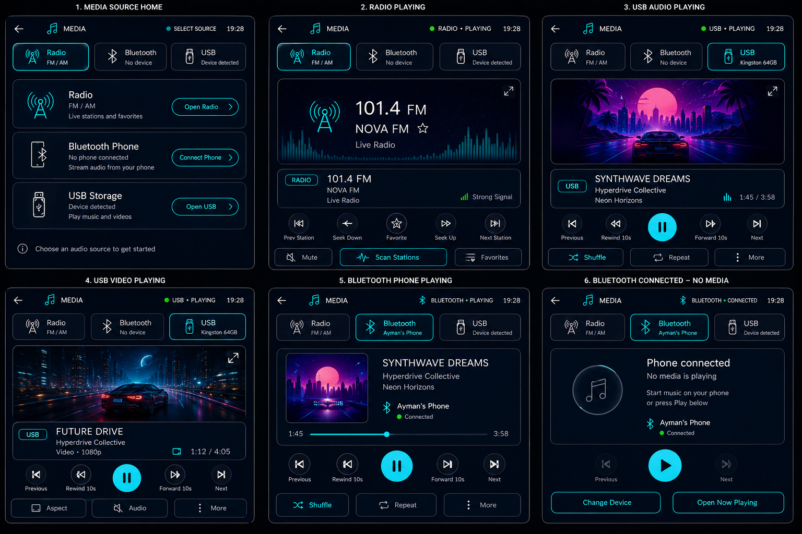

# HyperNova Cockpit — Task 04: Media Android App

> **Project:** HyperNova Cockpit  
> **Task:** Task 04 — HyperNova Media  
> **Application package:** `com.hypernova.media`  
> **Target platform:** Custom AOSP / Android Automotive IVI image  
> **Orientation:** Portrait only  
> **Production baseline:** `1080 × 1920 px`, 9:16  
> **Reference board resolution:** `1536 × 1024 px`  
> **Implementation language:** Kotlin  
> **UI technology:** Android XML Views + ViewBinding  
> **Playback framework:** AndroidX Media3 + MediaSession  
> **Architecture:** Single Activity + MVVM + Source Manager + source-specific controllers  
> **Supported sources:** Radio, Bluetooth Phone, USB Audio, USB Video  
> **Cloud dependency:** None  
> **Data policy:** Real source state and real metadata only  
> **Status:** Ready for implementation  

---

# 1. Approved Visual Reference



This image is the approved visual reference for Task 04.

It defines six primary screens:

```text
1. MEDIA SOURCE HOME
2. RADIO PLAYING
3. USB AUDIO PLAYING
4. USB VIDEO PLAYING
5. BLUETOOTH PHONE PLAYING
6. BLUETOOTH CONNECTED — NO MEDIA
```

The implementation must preserve the same visual language across all screens:

- Same top header.
- Same source selector.
- Same cards and borders.
- Same color tokens.
- Same typography.
- Same icon family.
- Same touch-target rules.
- Same portrait geometry.
- Same source-state behavior.

Values such as `NOVA FM`, `101.4 FM`, `Ayman's Phone`, `Kingston 64GB`, `SYNTHWAVE DREAMS`, and `FUTURE DRIVE` are visual examples only. Production code must use real source data.

---

# 2. Product Definition

HyperNova Media is a premium automotive media-source controller.

It is **not** a Spotify-style application.

It supports exactly these primary sources:

```text
Radio
Bluetooth Phone
USB
```

The application must not contain:

- Album discovery.
- Artist discovery.
- Music recommendations.
- Subscription accounts.
- Cloud streaming catalog.
- Social features.
- Music marketplace.
- Smartphone-style bottom navigation.
- Spotify-style library.
- Fake playback information.

The product flow is:

```text
Select Source
    |
    v
Activate Real Source
    |
    v
Receive Real State and Metadata
    |
    v
Render Current Source
    |
    v
Expose Supported Controls
    |
    v
Publish State through MediaSession
```

---

# 3. Task Objective

The developer must build a complete Android Studio project that:

- Matches the approved six-screen reference.
- Supports Radio, Bluetooth Phone, USB Audio, and USB Video.
- Contains one large central media area.
- Uses real source state and metadata.
- Integrates with the HyperNova Launcher.
- Integrates with NOVA AI.
- Uses Android MediaSession.
- Uses AndroidX Media3 for USB audio and video.
- Integrates Bluetooth through the approved Android/AOSP Bluetooth stack.
- Integrates Radio through the approved platform/vendor tuner service.
- Handles source switching correctly.
- Handles audio focus from Navigation, Phone, and NOVA AI.
- Handles disconnected, scanning, unavailable, interrupted, and error states.
- Is ready for integration into the HyperNova AOSP image.

---

# 4. Source Ownership

| Data | Real owner |
|---|---|
| Radio frequency | Radio controller/tuner service |
| Station name | Radio metadata/tuner service |
| Signal state | Radio service |
| Connected phone | Bluetooth platform stack |
| Bluetooth title/artist | AVRCP or platform media session |
| Bluetooth artwork | AVRCP/media metadata when available |
| Bluetooth playback state | Bluetooth media state |
| USB device label | Mounted-volume/device layer |
| USB file list | USB scanner/index |
| USB metadata | Media extractor/Media3 |
| USB video state | Media3 player |
| Position and duration | Active source/player |
| Audio focus | Android audio framework |
| Active source | HyperNova `MediaSourceManager` |

The UI must never invent any of these values.

---

# 5. No Production Dummy Data

The production app must not contain:

```text
MockRadioRepository
FakeBluetoothDevice
DummyUsbVolume
HardcodedStation
HardcodedTrack
FakeProgressTicker
StaticConnectedState
DemoMediaSource
```

Test doubles are allowed only in:

```text
src/test/
src/androidTest/
```

When data is unavailable, show an honest state:

```text
No station selected
No phone connected
Phone connected — no media is playing
USB not connected
No supported media found
Metadata unavailable
Playback unavailable
```

A placeholder image may be used only when real artwork is missing. It must not pretend to be real album artwork.

---

# 6. High-Level Architecture

```text
+---------------------- HyperNova Media App ----------------------+
|                                                                 |
|  MediaActivity                                                  |
|       |                                                         |
|       v                                                         |
|  MediaFragment                                                  |
|       |                                                         |
|       v                                                         |
|  MediaViewModel                                                 |
|       |                                                         |
|       v                                                         |
|  MediaRepository                                                |
|       |                                                         |
|       v                                                         |
|  MediaSourceManager                                             |
|       |                                                         |
|       +--> RadioSourceController                                |
|       +--> BluetoothSourceController                            |
|       +--> UsbSourceController                                  |
|                                                                 |
|  HyperNovaMediaService                                          |
|       |                                                         |
|       +--> MediaSession                                         |
|       +--> Media3 Player for USB audio/video                    |
|       +--> Source-specific command adapter                      |
|                                                                 |
|  AudioFocusController                                           |
|  VehicleUxRestrictionClient                                     |
+-----------------------------------------------------------------+
             |                         |
             v                         v
      HyperNova Launcher           NOVA AI
```

---

# 7. Component Responsibilities

| Component | Responsibility |
|---|---|
| `MediaActivity` | Hosts the full-screen portrait UI |
| `MediaFragment` | Renders all source screens and states |
| `MediaViewModel` | Exposes immutable UI state |
| `MediaRepository` | Combines source and player state |
| `MediaSourceManager` | Activates/deactivates sources |
| `RadioSourceController` | Tune, seek, scan, presets |
| `BluetoothSourceController` | Connect, metadata, playback controls |
| `UsbSourceController` | USB monitoring, scanning, files |
| `HyperNovaMediaService` | MediaSession and playback lifecycle |
| `UsbPlayerController` | Media3 audio/video playback |
| `MediaSessionCoordinator` | Publishes unified media state |
| `AudioFocusController` | Handles audio interruptions |
| `VehicleUxRestrictionClient` | Applies driving restrictions |
| `AppNavigator` | Opens pairing/settings safely |

Recommended pattern:

```text
Single Activity
+
One primary MediaFragment
+
State-driven source renderers
+
One MediaSession service
+
StateFlow
```

Do not create one Activity per source.

---

# 8. Unified Source Interface

```kotlin
interface MediaSourceController {
    val sourceType: MediaSourceType
    val state: StateFlow<MediaSourceState>
    val capabilities: StateFlow<MediaSourceCapabilities>

    suspend fun activate(): SourceCommandResult
    suspend fun deactivate(): SourceCommandResult
    suspend fun play(): SourceCommandResult
    suspend fun pause(): SourceCommandResult
    suspend fun previous(): SourceCommandResult
    suspend fun next(): SourceCommandResult
    suspend fun seekTo(positionMs: Long): SourceCommandResult
    suspend fun stop(): SourceCommandResult
}
```

Capabilities:

```kotlin
data class MediaSourceCapabilities(
    val canPlay: Boolean,
    val canPause: Boolean,
    val canPrevious: Boolean,
    val canNext: Boolean,
    val canSeek: Boolean,
    val canBrowse: Boolean,
    val canShowVideo: Boolean,
    val canShowSubtitles: Boolean,
    val canFullscreen: Boolean
)
```

The UI enables only confirmed capabilities.

---

# 9. Source Switching Flow

```text
User selects new source
        |
        v
Disable repeated presses
        |
        v
Pause or stop previous source
        |
        v
Deactivate previous source
        |
        v
Activate selected source
        |
        v
Wait for READY / ERROR
        |
        v
Update viewport, metadata, controls, and MediaSession
```

Rules:

- Never show metadata from the previous source.
- Never preserve the previous source progress.
- Do not show PLAYING before confirmation.
- Do not run two audible sources at once.
- Clear stale artwork and metadata.
- If activation fails, show a real source error.
- Persist the last source only when it remains available.

---

# 10. Required States

## Global

```text
SELECT_SOURCE
SWITCHING_SOURCE
BUFFERING
SEEKING
AUDIO_FOCUS_INTERRUPTED
PLAYBACK_ERROR
```

## Radio

```text
RADIO_READY
RADIO_PLAYING
RADIO_MUTED
RADIO_SCANNING
RADIO_NO_SIGNAL
RADIO_ERROR
```

## Bluetooth

```text
BLUETOOTH_DISABLED
BLUETOOTH_NO_PAIRED_DEVICE
BLUETOOTH_CONNECTING
BLUETOOTH_CONNECTED_NO_MEDIA
BLUETOOTH_PLAYING
BLUETOOTH_PAUSED
BLUETOOTH_METADATA_UNAVAILABLE
BLUETOOTH_DISCONNECTED
BLUETOOTH_ERROR
```

## USB

```text
USB_NOT_CONNECTED
USB_SCANNING
USB_READY
USB_AUDIO_PLAYING
USB_AUDIO_PAUSED
USB_VIDEO_PLAYING
USB_VIDEO_PAUSED
USB_DISCONNECTED
USB_UNSUPPORTED_FILE
USB_ERROR
```

---

# 11. Shared HyperNova Design System

The app must use:

```text
hypernova-design-system
```

The shared module defines:

- Colors.
- Dimensions.
- Typography.
- Card shapes.
- Buttons.
- Icons.
- Loading/error states.
- Automotive touch sizes.
- Press animations.

The Media developer must not redefine these values locally.

---

# 12. Color System

| Token | Hex | Usage |
|---|---|---|
| `hn_background_primary` | `#020A13` | Main background |
| `hn_background_secondary` | `#06121F` | Lower gradient |
| `hn_surface_primary` | `#071524` | Standard cards |
| `hn_surface_secondary` | `#0B1B2C` | Elevated areas |
| `hn_surface_overlay` | `#102337` | Selected source |
| `hn_border_primary` | `#506174` | Main border |
| `hn_border_subtle` | `#293847` | Dividers |
| `hn_primary_cyan` | `#25D9E8` | Active controls |
| `hn_primary_cyan_pressed` | `#1FC2D0` | Press state |
| `hn_primary_cyan_dark` | `#0B8493` | Cyan glow |
| `hn_text_primary` | `#F5F7FA` | Main text |
| `hn_text_secondary` | `#A7B0BE` | Secondary text |
| `hn_text_disabled` | `#687486` | Disabled text/icons |
| `hn_success` | `#39EA4B` | Healthy/playing |
| `hn_warning` | `#F5A623` | Scanning/connecting/interrupted |
| `hn_error` | `#FF5E68` | Real error |
| `hn_white` | `#FFFFFF` | High-emphasis control |
| `hn_transparent` | `#00000000` | Transparent |

Color rules:

- Cyan is the main active color.
- Green appears only for confirmed healthy or playing state.
- Amber appears for scanning, connecting, or interruption.
- Red appears only for real errors or destructive actions.
- Do not recolor the whole screen.
- Artwork and video may contain other colors.
- UI controls remain cyan, white, and gray.

---

# 13. Screen Baseline and Spacing

```text
Resolution: 1080 × 1920 px
Aspect ratio: 9:16
Logical baseline: approximately 540 × 960 dp
```

Spacing scale:

```text
4dp
8dp
12dp
16dp
20dp
24dp
32dp
```

Global dimensions:

```text
Screen horizontal margin: 16dp
Header height: 56dp
Source selector item height: 68–76dp
Section gap: 12dp
Main card radius: 22dp
Small card radius: 16dp
Card padding: 12–16dp
Primary button height: 48dp
Minimum touch target: 48dp
Main Play/Pause button: 64dp
```

---

# 14. Typography

Use `Roboto`.

| Element | Size | Weight |
|---|---:|---|
| App title | `18sp` | Medium |
| Header status | `9–10sp` | Medium |
| Source title | `13–14sp` | Medium |
| Source subtitle | `9–10sp` | Regular |
| Media title | `20–24sp` | Medium |
| Artist/station/device | `12–14sp` | Regular |
| Radio frequency | `32–40sp` | Medium |
| Body | `13sp` | Regular |
| Secondary | `10–11sp` | Regular |
| Button | `13sp` | Medium |
| Progress time | `11–12sp` | Regular |

Rules:

- Maximum title lines: 2.
- Use ellipsis for long text.
- Do not shrink important controls.
- Do not use decorative fonts.

---

# 15. Icon System

Use `Material Symbols Rounded`.

Required icons:

```text
Back
Media
Radio
Bluetooth
Bluetooth Connected
Bluetooth Off
Phone
USB
Audio File
Video File
Folder
Previous
Rewind 10
Play
Pause
Forward 10
Next
Mute
Volume
Fullscreen
Subtitle
Favorite
Scan
Signal
Change Device
Disconnect
Retry
Eject
Shuffle
Repeat
More
Aspect Ratio
Audio Track
Error
Warning
```

Rules:

- Same rounded outline style.
- Same stroke weight.
- Active icon: cyan.
- Inactive icon: gray.
- Healthy state: green.
- Warning: amber.
- Error: red.
- Every interactive icon needs a content description.

---

# 16. Fixed Screen Geometry

Every primary screen uses:

```text
Top Header
Source Selector
Large Main Content / Media Viewport
Media Information Card
Playback Controls
Source-Specific Secondary Controls
```

Do not add:

```text
Albums
Artists
Playlists
Recommendations
Queue
Streaming account
```

as main application navigation.

---

# 17. Top Header

Content:

```text
Back
HyperNova Media logo
MEDIA
Active source
Playback/connection state
Current time
```

Possible source labels:

```text
SELECT SOURCE
RADIO
BLUETOOTH
USB
USB VIDEO
```

Possible state labels:

```text
READY
PLAYING
PAUSED
CONNECTED
CONNECTING
SCANNING
DISCONNECTED
ERROR
```

Dimensions:

```text
Height: 56dp
Back touch target: 48dp
Logo: 28dp
Title: 18sp
Status dot: 6–8dp
```

---

# 18. Source Selector

Show exactly three equal source buttons:

```text
Radio | Bluetooth | USB
```

Each includes:

- Icon.
- Source name.
- Short availability state.

Selected style:

```text
Background: #102337
Border: 1dp #25D9E8
Icon: #25D9E8
Title: #25D9E8
Subtle cyan glow
```

Inactive style:

```text
Background: #071524
Border: 1dp #506174
Icon: #A7B0BE
Title: #F5F7FA
Subtitle: #A7B0BE
```

Runtime examples:

```text
Radio — FM / AM
Bluetooth — [Phone name] / No device
USB — [Volume label] / Not connected
```

---

# 19. Screen 1 — Media Source Home

This screen appears when no source is opened or when the user returns to source selection.

## Header

```text
MEDIA
SELECT SOURCE
Current time
```

## Source Cards

### Radio

```text
Radio
FM / AM
Live stations and favorites
Open Radio
```

### Bluetooth

Connected:

```text
Bluetooth Phone
[Phone name]
Stream audio from your phone
Open Bluetooth
```

Disconnected:

```text
Bluetooth Phone
No phone connected
Connect Phone
```

### USB

Connected:

```text
USB Storage
[Device label]
Play music and videos
Open USB
```

Disconnected:

```text
USB Storage
No device connected
Connect a USB device
```

Bottom text:

```text
Choose an audio source to get started
```

No fake media appears here.

---

# 20. Screen 2 — Radio Playing

Required content:

```text
Radio selected
Frequency
Station name
Live state
Signal state
Radio visualization
Radio controls
Station scan
Favorites
```

Central content displays:

- Radio tower icon.
- Real frequency.
- Station name when available.
- Audio spectrum visualization.
- `Live Radio`.

Do not display fake video.

Information card:

```text
Source badge: RADIO
Frequency
Station name
Live state
Signal state
```

Main controls:

```text
Previous Station
Seek Down
Favorite
Seek Up
Next Station
```

Secondary controls:

```text
Mute
Scan Stations
Favorites
```

Every action must call the real radio controller.

---

# 21. Radio Scanning

Display:

```text
SCANNING
Scanning radio stations…
Detected stations
Stop Scan
```

Rules:

- Do not select a fake station.
- Show each real detected frequency.
- Use amber/cyan processing state.
- Cancel safely.
- Restore previous station when appropriate.

---

# 22. Radio No Signal

Display:

```text
NO SIGNAL
Radio signal unavailable
Try another frequency or rescan
```

Actions:

```text
Seek
Scan Stations
```

Do not show `Strong Signal`.

---

# 23. Radio Architecture

```text
RadioSourceController
        |
        v
RadioTunerClient
        |
        v
Android Broadcast Radio / Vendor Tuner Service
```

Required operations:

```text
open()
close()
tune(frequency)
seekUp()
seekDown()
scan()
stopScan()
setMuted()
saveFavorite()
removeFavorite()
```

Keep the app vendor-independent above `RadioTunerClient`.

---

# 24. Screen 3 — USB Audio Playing

Required content:

```text
USB selected
Real device label
Artwork or placeholder
Track title
Artist
Album when available
Elapsed position
Duration
Playback controls
Shuffle
Repeat
More
```

Central viewport:

- Embedded artwork when available.
- HyperNova placeholder if missing.
- USB badge.
- Optional artwork fullscreen view.

Playback controls:

```text
Previous
Rewind 10s
Play/Pause
Forward 10s
Next
```

Secondary:

```text
Shuffle
Repeat
More
```

Only enable supported actions.

---

# 25. Screen 4 — USB Video Playing

Required content:

```text
USB selected
Real device label
Large video viewport
Video title
Video type/resolution when available
Progress
Playback controls
Aspect
Audio
More
```

Video viewport:

```text
Aspect ratio: 16:9
Rounded 22dp corners
Thin border
Fullscreen control
Real video frame
```

Do not display desktop player controls.

Video controls:

```text
Previous
Rewind 10s
Play/Pause
Forward 10s
Next
```

Secondary:

```text
Aspect
Audio Track
More
```

Subtitle appears only when a subtitle track exists.

---

# 26. USB Fullscreen Video

Fullscreen mode must:

- Preserve video aspect ratio.
- Use black background.
- Preserve playback position.
- Show an exit action.
- Auto-hide nonessential controls.
- Restore controls on touch.
- Respect safe insets.
- Follow vehicle video-safety restrictions.
- Avoid desktop-style UI.

---

# 27. USB Scanning

Display:

```text
SCANNING USB
Searching audio and video files
```

Show:

- Device label.
- Scan progress when available.
- Supported-file count.
- Cancel action.

Do not show a completed list before scanning finishes.

---

# 28. USB Not Connected

Display:

```text
USB not connected
Connect a USB storage device
```

Actions:

```text
Retry
Choose Source
```

No fake device information.

---

# 29. USB Unsupported File

Display:

```text
Unable to play this file
Unsupported or damaged media format
```

Actions:

```text
Skip File
Choose Another File
```

The application must not crash.

---

# 30. USB Architecture

```text
UsbSourceController
        |
        +--> UsbDeviceMonitor
        +--> MountedVolumeProvider
        +--> MediaFileScanner
        +--> UsbMediaIndex
        +--> UsbPlayerController
                    |
                    v
             AndroidX Media3
```

Metadata:

```text
File name
Title
Artist
Album
Duration
Artwork
MIME type
Folder
Subtitle tracks
URI
```

---

# 31. Screen 5 — Bluetooth Phone Playing

Required content:

```text
Bluetooth selected
Connected phone name
Connection state
Artwork when available
Track title
Artist
Album when available
Playback progress when available
Previous
Rewind 10s when supported
Play/Pause
Forward 10s when supported
Next
Shuffle/Repeat/More only when supported
```

Bluetooth rules:

- Receive phone audio through platform A2DP Sink behavior.
- Receive metadata/controls through AVRCP or approved platform media integration.
- Do not claim full phone-library browsing.
- Do not display video through normal A2DP.
- Do not fake metadata.
- Do not update progress unless position data exists.
- Do not claim command success before phone confirmation.

Central area:

- Real artwork when available.
- HyperNova placeholder when unavailable.
- Bluetooth badge.
- Optional audio-reactive background.
- Phone name.

---

# 32. Screen 6 — Bluetooth Connected, No Media

Display:

```text
Phone connected
No media is playing
Start music on your phone or press Play below
[Phone name]
Connected
```

Actions:

```text
Play
Change Device
Open Now Playing
```

Disabled:

```text
Previous
Next
```

Do not show:

- Fake artwork.
- Fake title.
- Fake artist.
- Fake duration.
- Moving progress.

---

# 33. Bluetooth Connecting

Display:

```text
CONNECTING
Connecting to [Phone Name]…
Waiting for Bluetooth audio and media controls
```

Actions:

```text
Cancel
Choose Another Device
```

Use amber/cyan, not green.

---

# 34. Bluetooth Disconnected

Display:

```text
DISCONNECTED
No phone connected
Connect a Bluetooth phone to stream audio
```

Actions:

```text
Connect Phone
Choose Device
```

On disconnect:

- Stop progress updates.
- Clear current metadata.
- Clear playing state.
- Publish disconnected state.
- Clear stale artwork.

---

# 35. Bluetooth Metadata Unavailable

Display:

```text
Audio connected
Media information unavailable
Playback controls may still be available
```

Enable only confirmed controls.

---

# 36. Bluetooth Architecture

```text
BluetoothSourceController
        |
        +--> Bluetooth state client
        +--> A2DP Sink audio state
        +--> AVRCP metadata
        +--> AVRCP controls
        +--> Platform MediaSession when available
```

Required states:

```text
BLUETOOTH_DISABLED
NO_PAIRED_DEVICE
PAIRING
CONNECTING
CONNECTED_NO_MEDIA
CONNECTED_PLAYING
CONNECTED_PAUSED
METADATA_UNAVAILABLE
DISCONNECTED
ERROR
```

---

# 37. Bluetooth Device Selection

Use a HyperNova-styled screen.

Sections:

```text
Paired Devices
Available Devices
```

Actions:

```text
Connect
Pair
Cancel
```

Safety note:

```text
Bluetooth setup is available while parked
```

Do not copy the stock Android Settings UI.

---

# 38. Media3 and Playback Service

Use:

```text
AndroidX Media3
ExoPlayer
MediaSessionService
```

for USB audio/video.

Recommended service:

```text
com.hypernova.media.playback.HyperNovaMediaService
```

Responsibilities:

- Playback lifecycle.
- MediaSession.
- Foreground playback.
- Metadata publishing.
- Transport controls.
- Active source publishing.
- Launcher/NOVA AI integration.
- Audio focus.

Radio and Bluetooth should adapt their state into the unified MediaSession where practical.

---

# 39. MediaSession Contract

MediaSession publishes:

```text
Title
Artist/station
Artwork
Duration
Position
Playback state
Available actions
Active source
```

Standard controls:

```text
play()
pause()
skipToPrevious()
skipToNext()
seekTo()
```

Custom commands:

```text
SELECT_RADIO
SELECT_BLUETOOTH
SELECT_USB
RADIO_SEEK_UP
RADIO_SEEK_DOWN
RADIO_SCAN
OPEN_SOURCE_SELECTOR
```

Validate every custom command.

---

# 40. Launcher Integration

The Launcher media card reads:

```text
Source badge
Artwork/placeholder
Title/station
Subtitle
Playback state
Progress when available
Previous
Play/Pause
Next
```

Launcher rules:

- Do not access Media internal databases.
- Do not show stale metadata.
- Do not enable unsupported controls.
- Clear old source state when switching.
- Use MediaSession as source of truth.

---

# 41. NOVA AI Integration

Supported commands:

```text
Play radio
Switch to Bluetooth
Play USB media
Pause media
Next track
Scan radio stations
Open USB video
```

Flow:

```text
NOVA AI
    |
    v
MediaSession or protected source command
    |
    v
HyperNova Media
    |
    v
Real source result
    |
    v
NOVA AI SUCCESS / ERROR
```

Results:

```text
ACCEPTED
IN_PROGRESS
COMPLETED
REJECTED
SOURCE_UNAVAILABLE
DEVICE_NOT_CONNECTED
UNSUPPORTED_ACTION
TIMEOUT
ERROR
```

NOVA AI waits for confirmation.

---

# 42. Audio Focus

## Navigation Guidance

```text
Navigation prompt
      |
      v
Duck active media
      |
      v
Restore after prompt
```

Visible state:

```text
Volume reduced for Navigation guidance
```

## NOVA AI Speech

NOVA AI may request temporary focus.

The active source may:

- Duck.
- Pause.
- Resume after TTS.

## Phone Call

```text
Phone call begins
      |
      v
Pause or mute media
      |
      v
Show interrupted state
```

Visible state:

```text
Playback paused for phone call
```

Resume only after real audio-focus and source state return.

---

# 43. Audio Focus Interrupted

Display:

```text
AUDIO FOCUS
Playback temporarily interrupted
[Reason]
```

Possible reasons:

```text
Navigation guidance
Phone call
NOVA AI response
System prompt
```

Use amber, not red.

---

# 44. Buffering

Display:

```text
BUFFERING
Preparing media…
```

Rules:

- Keep last confirmed progress.
- Do not show PLAYING.
- Disable unsupported controls.
- Allow cancel when supported.

---

# 45. Seeking

Display:

```text
SEEKING
Seeking to [Time]…
Waiting for playback confirmation
```

Rules:

- Separate requested and confirmed positions.
- Do not update confirmed progress before confirmation.
- Prevent repeated seek commands while pending.

---

# 46. Playback Error

Display:

```text
Unable to play media
[Readable reason]
No audio or video is playing
```

Actions:

```text
Try Again
Skip
Choose Source
```

Use red only for the error indicator.

---

# 47. Video Safety

Video must follow the approved product policy.

Recommended behavior:

```text
Parked -> Video visible
Moving -> Video paused, hidden, or audio-only
```

When restricted:

- Preserve position.
- Pause video or continue audio according to policy.
- Display a clear message.
- Do not show moving video behind overlays.
- Do not bypass the central UX restriction source.

---

# 48. Media UI State

```kotlin
data class MediaUiState(
    val selectedSource: MediaSourceType?,
    val sourceState: MediaSourceState,
    val capabilities: MediaSourceCapabilities,
    val metadata: MediaMetadataUi?,
    val playbackState: PlaybackUiState,
    val currentPositionMs: Long?,
    val durationMs: Long?,
    val volume: Int?,
    val isMuted: Boolean,
    val radioPresets: List<RadioPreset>,
    val bluetoothDevice: BluetoothDeviceUi?,
    val usbEntries: List<UsbMediaEntry>,
    val message: UiText?
)
```

Required enums:

```text
MediaSourceType
MediaSourceState
PlaybackUiState
MediaContentType
SourceCommandStatus
AudioFocusState
```

---

# 49. UI Events

```kotlin
sealed interface MediaUiEvent {
    data object BackPressed : MediaUiEvent
    data class SourceSelected(val source: MediaSourceType) : MediaUiEvent
    data object PlayPausePressed : MediaUiEvent
    data object PreviousPressed : MediaUiEvent
    data object NextPressed : MediaUiEvent
    data object RewindPressed : MediaUiEvent
    data object ForwardPressed : MediaUiEvent
    data class SeekRequested(val positionMs: Long) : MediaUiEvent
    data object ScanRadioPressed : MediaUiEvent
    data object FavoritePressed : MediaUiEvent
    data object ChangeBluetoothDevicePressed : MediaUiEvent
    data object DisconnectBluetoothPressed : MediaUiEvent
    data object FullscreenPressed : MediaUiEvent
    data object SubtitlePressed : MediaUiEvent
    data object EjectUsbPressed : MediaUiEvent
    data object RetryPressed : MediaUiEvent
}
```

---

# 50. Recommended Project Structure

```text
app/src/main/java/com/hypernova/media/
|
+-- MediaActivity.kt
|
+-- ui/
|   +-- MediaFragment.kt
|   +-- MediaViewModel.kt
|   +-- MediaUiState.kt
|   +-- MediaUiEvent.kt
|   +-- components/
|       +-- HeaderBinder.kt
|       +-- SourceSelectorBinder.kt
|       +-- ViewportBinder.kt
|       +-- MetadataBinder.kt
|       +-- PlaybackControlsBinder.kt
|       +-- SourceContentBinder.kt
|
+-- source/
|   +-- MediaSourceManager.kt
|   +-- MediaSourceController.kt
|   +-- radio/
|   |   +-- RadioSourceController.kt
|   |   +-- RadioTunerClient.kt
|   +-- bluetooth/
|   |   +-- BluetoothSourceController.kt
|   |   +-- BluetoothMediaClient.kt
|   +-- usb/
|       +-- UsbSourceController.kt
|       +-- UsbDeviceMonitor.kt
|       +-- MediaFileScanner.kt
|       +-- UsbMediaIndex.kt
|
+-- playback/
|   +-- HyperNovaMediaService.kt
|   +-- UsbPlayerController.kt
|   +-- MediaSessionCoordinator.kt
|   +-- AudioFocusController.kt
|
+-- model/
|   +-- MediaSourceType.kt
|   +-- MediaSourceState.kt
|   +-- MediaMetadataModel.kt
|   +-- RadioStation.kt
|   +-- BluetoothMediaState.kt
|   +-- UsbMediaEntry.kt
|
+-- integration/
|   +-- VehicleUxRestrictionClient.kt
|   +-- NovaAiMediaCommandAdapter.kt
|
+-- util/
    +-- UiText.kt
    +-- Result.kt
    +-- TimeFormatter.kt
```

---

# 51. Recommended Layout Files

```text
activity_media.xml
fragment_media.xml
view_media_header.xml
view_media_source_selector.xml
view_media_source_home.xml
view_radio_playing.xml
view_usb_audio_playing.xml
view_usb_video_playing.xml
view_bluetooth_playing.xml
view_bluetooth_no_media.xml
view_media_information.xml
view_media_progress.xml
view_media_playback_controls.xml
view_media_secondary_controls.xml
view_state_switching_source.xml
view_state_radio_scanning.xml
view_state_radio_no_signal.xml
view_state_bluetooth_connecting.xml
view_state_bluetooth_disconnected.xml
view_state_usb_scanning.xml
view_state_usb_not_connected.xml
view_state_audio_focus.xml
view_state_playback_error.xml
dialog_bluetooth_devices.xml
dialog_usb_eject.xml
```

---

# 52. Suggested View IDs

## Header

```text
btnBack
ivMediaLogo
tvMediaTitle
ivActiveSource
tvActiveSource
viewMediaStatusDot
tvMediaStatus
tvCurrentTime
```

## Source Selector

```text
sourceRadio
sourceBluetooth
sourceUsb
ivRadioSource
ivBluetoothSource
ivUsbSource
tvRadioState
tvBluetoothState
tvUsbState
```

## Media Area

```text
mediaViewport
playerView
radioVisualization
ivMediaArtwork
ivSourceBadge
btnFullscreen
```

## Metadata

```text
tvMediaTitlePrimary
tvMediaSubtitle
tvMediaTertiary
tvDeviceName
```

## Progress

```text
mediaSeekBar
tvElapsedTime
tvDuration
tvLiveIndicator
```

## Controls

```text
btnPrevious
btnRewind
btnPlayPause
btnForward
btnNext
btnMute
btnShuffle
btnRepeat
btnMore
btnAspect
btnAudioTrack
```

## Source Actions

```text
btnOpenRadio
btnConnectPhone
btnOpenUsb
btnScanStations
btnFavorites
btnChangeDevice
btnDisconnect
btnOpenNowPlaying
btnEjectUsb
```

---

# 53. Manifest

```xml
<activity
    android:name=".MediaActivity"
    android:exported="true"
    android:screenOrientation="portrait">
    <intent-filter>
        <action android:name="android.intent.action.MAIN" />
        <category android:name="android.intent.category.LAUNCHER" />
    </intent-filter>
</activity>
```

Media service:

```xml
<service
    android:name=".playback.HyperNovaMediaService"
    android:exported="true"
    android:foregroundServiceType="mediaPlayback">
    <intent-filter>
        <action android:name="androidx.media3.session.MediaSessionService" />
    </intent-filter>
</service>
```

---

# 54. Permissions

Possible permissions:

```text
android.permission.FOREGROUND_SERVICE
android.permission.FOREGROUND_SERVICE_MEDIA_PLAYBACK
android.permission.BLUETOOTH_CONNECT
android.permission.BLUETOOTH_SCAN
android.permission.POST_NOTIFICATIONS
android.permission.READ_MEDIA_AUDIO
android.permission.READ_MEDIA_VIDEO
android.permission.ACCESS_NETWORK_STATE
```

Platform Radio and Bluetooth may additionally require:

- System-app installation.
- Platform signing.
- Vendor permissions.
- SELinux policy.
- Product-specific service access.

Document every privileged requirement.

---

# 55. IPC Security

Use the shared signature permission for custom source commands:

```xml
<permission
    android:name="com.hypernova.permission.ACCESS_COCKPIT_SERVICES"
    android:protectionLevel="signature" />
```

Rules:

- Validate custom MediaSession commands.
- Validate caller package/signature where required.
- Use content URIs for USB media.
- Do not expose private device identifiers unnecessarily.
- Do not export debug services in release builds.

---

# 56. Contract Versioning

Expose versions for custom contracts:

```text
getApiVersion()
getServiceVersion()
```

Recommended:

```text
HyperNova Media API version: 1
```

On mismatch:

- Reject unsupported custom commands.
- Keep standard MediaSession controls where possible.
- Log the mismatch.
- Show a readable unavailable state when necessary.

---

# 57. State Persistence

Persist only safe state:

```text
Last selected source
Last radio station
Favorite stations
Last USB folder URI
Approved USB playback position
Mute state
```

Do not persist:

```text
False Bluetooth connected state
Stale Bluetooth metadata
Invalid USB URI
Playing state after source removal
Unconfirmed playback position
```

---

# 58. Driving Restrictions

When moving:

- Source selection remains available.
- Bluetooth pairing may be blocked.
- Complex USB browsing may be limited.
- Video follows the product safety policy.
- Text-heavy lists may be simplified.
- Voice commands remain available.

When parked:

- Bluetooth pairing may be enabled.
- USB browsing may be expanded.
- Video controls may be fully available.
- Subtitle/audio-track selection may be enabled.

Use the approved `VehicleUxRestrictionClient`.

---

# 59. Performance Requirements

- Do not block the main thread.
- Use coroutines and `StateFlow`.
- Scan USB off the UI thread.
- Avoid repeated artwork decoding.
- Cache thumbnails safely.
- Use hardware video decoding where available.
- Stop video rendering when hidden.
- Stop radio visualization when hidden.
- Avoid re-scanning unchanged volumes.
- Prevent duplicate source activation.
- Release player, radio, and Bluetooth resources correctly.
- Avoid service and Binder leaks.

---

# 60. Logging

Use tags:

```text
HN-Media
HN-MediaSource
HN-Radio
HN-BluetoothMedia
HN-UsbMedia
HN-Playback
HN-MediaSession
HN-AudioFocus
```

Log:

- Source changes.
- Activation/deactivation.
- Radio tuning/scanning.
- Bluetooth connection state.
- USB mount/removal.
- Playback state.
- MediaSession commands.
- Audio-focus changes.
- Error codes.

Do not log:

- Private Bluetooth identifiers.
- Sensitive phone metadata.
- Full personal USB paths.
- Raw media contents.
- Authentication data.

---

# 61. Accessibility and Automotive UX

- Minimum touch target: `48dp`.
- Main Play/Pause: `64dp`.
- High contrast.
- Source state shown as text and color.
- Content descriptions for icons.
- No required long press.
- No required multi-touch.
- No tiny video controls.
- One-press source selection.
- Short readable errors.
- Do not depend on color only.

---

# 62. Animation Rules

| Animation | Duration |
|---|---:|
| Source selection | `160–220ms` |
| Card press | `100ms` |
| Playback-state change | `160ms` |
| Radio scan | Continuous, subtle |
| Bluetooth connecting | Continuous, subtle |
| USB scanning | Continuous, subtle |
| Error pulse | `350–500ms` |
| Fullscreen controls | `160–220ms` |

No rapid flashing.

---

# 63. Testing Requirements

## Source Switching

- Radio to Bluetooth.
- Bluetooth to USB.
- USB to Radio.
- Activation failure.
- Rapid repeated selection.
- Previous source stops/pauses.
- Stale metadata is cleared.

## Radio

- Ready.
- Playing.
- Tune.
- Seek up/down.
- Scan.
- Stop scan.
- Favorite.
- No signal.
- Service unavailable.

## Bluetooth

- Bluetooth disabled.
- No paired device.
- Pairing restriction.
- Connecting.
- Connected no media.
- Playing.
- Paused.
- Metadata unavailable.
- Phone disconnected.
- AVRCP command support.
- Unsupported seek.

## USB

- Device connected.
- Device removed.
- Scan.
- Audio playback.
- Video playback.
- Fullscreen.
- Subtitle/audio track.
- Unsupported file.
- Damaged file.
- Eject.
- Driving restrictions.

## MediaSession

- Launcher receives metadata.
- Launcher controls play/pause.
- NOVA AI commands work.
- Source badge changes.
- Old metadata clears.
- Available actions match capabilities.

## Audio Focus

- Navigation ducking.
- NOVA AI speech.
- Phone-call pause.
- Focus restore.
- Focus loss during video.

## Visual

- Six primary screens match the reference.
- HyperNova colors are used.
- No clipped text.
- No overlapping controls.
- 9:16 portrait fit.
- Video viewport is 16:9.
- Touch sizes are correct.
- No Spotify-style content.

---

# 64. Development Order

```text
1. Freeze package name and shared contracts
2. Import HyperNova design system
3. Create project and dark theme
4. Build Header
5. Build Source Selector
6. Build Media Source Home
7. Build Radio Playing screen
8. Build USB Audio screen
9. Build USB Video screen
10. Build Bluetooth Playing screen
11. Build Bluetooth No Media screen
12. Implement MediaUiState
13. Implement MediaSourceManager
14. Implement RadioSourceController
15. Integrate platform/vendor Radio service
16. Implement BluetoothSourceController
17. Integrate A2DP/AVRCP/platform state
18. Implement UsbDeviceMonitor
19. Implement USB scanner/index
20. Implement Media3 USB audio playback
21. Implement Media3 USB video playback
22. Implement fullscreen and subtitle/audio-track handling
23. Implement HyperNovaMediaService
24. Implement MediaSession
25. Integrate Launcher
26. Integrate NOVA AI
27. Implement source-switch policy
28. Implement AudioFocusController
29. Implement driving restrictions
30. Add connecting/scanning/error states
31. Add IPC security/versioning
32. Test all sources
33. Build debug and release APKs
34. Integrate into AOSP
35. Validate on target portrait display
```

---

# 65. Required Deliverables

```text
1. Complete Android Studio project
2. Source code
3. HyperNova design-system version
4. IPC-contract version
5. Six primary screens
6. All transition/error states
7. Radio controller
8. Bluetooth controller
9. USB controller
10. MediaSourceManager
11. Media3 USB audio playback
12. Media3 USB video playback
13. Fullscreen video
14. Subtitle/audio-track support when available
15. MediaSession service
16. Launcher integration
17. NOVA AI integration
18. Audio-focus implementation
19. Driving-restriction implementation
20. Debug APK
21. Release APK
22. Screenshot of every required state
23. Source-switch test report
24. MediaSession integration report
25. Permission documentation
26. AOSP integration notes
27. Radio/Bluetooth/USB dependency notes
28. Codec support notes
29. Asset license/source notes
30. Updated final README
```

Suggested APK names:

```text
HyperNovaMedia-debug.apk
HyperNovaMedia-release.apk
```

---

# 66. Definition of Done

## Visual

- [ ] Six approved screens are implemented.
- [ ] UI matches the supplied reference.
- [ ] HyperNova colors are used.
- [ ] Header is consistent.
- [ ] Source selector is consistent.
- [ ] Radio uses a radio visualization, not fake video.
- [ ] USB audio uses real metadata.
- [ ] USB video uses a real video viewport.
- [ ] Bluetooth uses real metadata only.
- [ ] Bluetooth no-media state has no fake track.
- [ ] Controls meet `48dp`.
- [ ] Main Play/Pause is `64dp`.
- [ ] No Spotify-style screen exists.
- [ ] No desktop/VLC UI exists.
- [ ] No text clipping.
- [ ] No overlapping controls.

## Architecture

- [ ] Package is `com.hypernova.media`.
- [ ] No production dummy data exists.
- [ ] Unified source interface exists.
- [ ] MediaSourceManager exists.
- [ ] Radio controller exists.
- [ ] Bluetooth controller exists.
- [ ] USB controller exists.
- [ ] Media3 is used for USB audio/video.
- [ ] MediaSession is implemented.
- [ ] Capabilities control UI actions.
- [ ] Source switching clears stale metadata.
- [ ] Bluetooth does not claim A2DP video.
- [ ] USB removal is handled.
- [ ] Radio no-signal is handled.
- [ ] Version mismatch is handled.
- [ ] Privileged requirements are documented.

## Integration

- [ ] Launcher receives real media state.
- [ ] Launcher controls active playback.
- [ ] NOVA AI commands work.
- [ ] Commands wait for source confirmation.
- [ ] Navigation audio ducking works.
- [ ] Phone-call interruption works.
- [ ] Video safety policy works.
- [ ] Driving restrictions work.

## Delivery

- [ ] Debug APK generated.
- [ ] Release APK generated.
- [ ] State screenshots included.
- [ ] Test reports included.
- [ ] AOSP integration notes included.
- [ ] Final README updated.

---

# 67. Questions and Answers

## Why are there only three sources?

The agreed HyperNova Media scope is Radio, Bluetooth Phone, and USB.

## Is this a Spotify-style app?

No. It is an automotive media-source controller.

## Can Bluetooth display video?

Not through normal A2DP. Video requires a separate supported mechanism.

## Can Bluetooth browse the entire phone library?

Not by default. Only explicitly supported capabilities may be exposed.

## Why is USB video shown in a large viewport?

The app must support real video files while preserving a consistent automotive layout.

## How is USB media played?

Through AndroidX Media3/ExoPlayer using real media URIs.

## How does the Launcher receive metadata?

Through MediaSession.

## How does NOVA AI control Media?

Through MediaSession and protected custom source commands.

## What happens during Navigation guidance?

The active source ducks or pauses according to audio-focus policy.

## What happens during a phone call?

Media pauses or mutes and resumes only after real focus and source state return.

## What is the most important rule?

Never display source, connection, metadata, playback position, or command success before the real source confirms it.

---

# 68. Final Instruction

Build HyperNova Media as a production automotive media-source controller.

The final result must combine:

```text
Shared HyperNova design
+
Radio
+
Bluetooth Phone
+
USB Audio
+
USB Video
+
MediaSession
+
Launcher integration
+
NOVA AI integration
+
Audio focus
+
Automotive safety
```

Do not add streaming-service pages, fake source state, fake metadata, unsupported Bluetooth video, or production dummy data without an approved architecture change.
