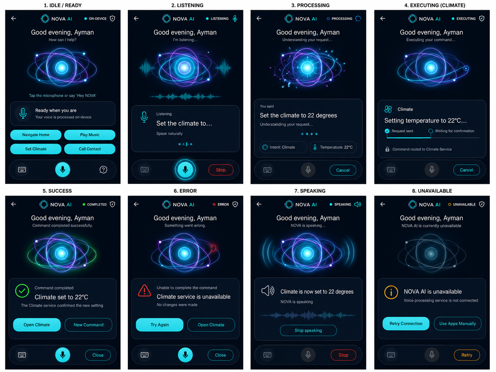

# HyperNova Cockpit — Task 02: NOVA AI Android App

Project guides:

- [Android 16 laptop environment](docs/ANDROID_16_DEVELOPMENT.md)
- [End-to-end Android + Raspberry Pi test runbook](docs/NOVA_END_TO_END_TEST_RUNBOOK.md)
- [Full-demo readiness and temporary TC397 bridge](docs/FULL_DEMO_READINESS.md)
- [Command bridge vertical-slice runbook](docs/NOVA_COMMAND_BRIDGE_RUNBOOK.md)
- [NOVA code guide](docs/NOVA_CODE_GUIDE.md)
- [Navigation and Climate command-integration handoff](docs/NAVIGATION_CLIMATE_COMMAND_HANDOFF.md)
- [Frozen shared AIDL contract source](../HyperNova_Contracts/README.md)
- [Android ↔ Raspberry Pi runtime protocol](docs/NOVA_RUNTIME_PROTOCOL.md)

> **Project:** HyperNova Cockpit  
> **Task:** Task 02 — NOVA AI  
> **Package:** `com.hypernova.ai`  
> **Target:** Custom AOSP Android IVI image  
> **Orientation:** Portrait only  
> **Production baseline:** 1080 × 1920 px, 9:16  
> **Language:** Kotlin  
> **UI:** Android XML Views + ViewBinding  
> **Architecture:** Single Activity + MVVM + State Machine + Service Clients  
> **AI policy:** On-device first, no cloud dependency  
> **Data policy:** Real state and real command results only  
> **Status:** Android 16 integration baseline in progress

---

## 1. Approved Visual Reference



The image above is the approved state board. It contains the eight required visible states:

```text
1. IDLE / READY
2. LISTENING
3. PROCESSING
4. EXECUTING
5. SUCCESS
6. ERROR
7. SPEAKING
8. UNAVAILABLE
```

The developer must keep the same geometry across all states. Only state-specific text, icons, orb behavior, buttons, and status colors may change.

The following stay fixed:

- Header height and position.
- NOVA AI logo and app title.
- Greeting area.
- Orb location.
- Interaction-card location.
- Bottom command-bar location.
- Screen margins.
- Typography scale.
- Card radius and borders.
- Touch-target sizes.

---

## 2. Task Objective

Build the production NOVA AI application for the HyperNova Cockpit.

NOVA AI is a voice-first automotive assistant that:

- Captures driver voice or text.
- Converts speech to text.
- Detects intent.
- Extracts entities and command parameters.
- Validates the command.
- Routes it to the responsible HyperNova application.
- Waits for a real completion result.
- Shows the current state clearly.
- Speaks the confirmed result.
- Publishes its state to the Launcher.
- Works without cloud dependency.

NOVA AI is not a generic chatbot. It is an automotive command-orchestration application.

Example:

```text
Driver: “Set the climate to 22 degrees”
        |
        v
Speech-to-Text
        |
        v
Intent = SET_CLIMATE
Temperature = 22°C
        |
        v
Climate Service
        |
        v
Confirmed / Rejected / Timeout
        |
        v
SUCCESS or ERROR
```

The app must never show success before the target service confirms the command.

---

## 3. Scope

### Required

- The eight approved UI states.
- On-device voice session handling.
- Text-input mode.
- AI-engine connection layer.
- Speech-to-text client.
- Intent/entity result handling.
- Command router.
- Navigation integration.
- MediaSession integration.
- Climate integration.
- Phone integration.
- Driver profile integration.
- Text-to-speech.
- Audio-focus handling.
- NOVA AI service for Launcher.
- Signature-protected IPC.
- Timeout and reconnect logic.
- Portrait AOSP integration.
- Debug and release APKs.

### Not Required

- Cloud account.
- Online chatbot.
- Conversation-history feed.
- Social-message bubbles.
- AI model marketplace.
- Direct AURIX communication.
- Direct CAN communication.
- Direct contact/call-log ownership.
- Fake operational data.

---

## 4. Non-Negotiable Real-Data Rule

The reference board contains example text such as:

```text
Ayman
Set the climate to 22 degrees
Climate set to 22°C
Climate service is unavailable
```

These are visual examples only.

Production UI must use:

- Real driver name from Driver/Profile service.
- Real speech transcript from STT.
- Real intent and entity output.
- Real command target.
- Real command progress.
- Real completion or failure result.
- Real AI-engine availability.

Do not include these production classes:

```text
FakeSpeechToTextEngine
MockIntentDetector
DummyClimateResult
HardcodedSuccessResponse
StaticDriverProfile
DemoCommandRepository
```

Test doubles are allowed only under:

```text
src/test/
src/androidTest/
```

---

## 5. Application Architecture

```text
NovaActivity
|
+-- NovaFragment
|
+-- NovaViewModel
|
+-- NovaStateMachine
|
+-- NovaSessionController
|
+-- AiOrchestrator
|   |
|   +-- SpeechToTextClient
|   +-- IntentEngineClient
|   +-- EntityExtractor
|   +-- TextToSpeechClient
|
+-- CommandRouter
|   |
|   +-- NavigationCommandClient
|   +-- MediaCommandClient
|   +-- ClimateCommandClient
|   +-- PhoneCommandClient
|   +-- SettingsCommandClient
|
+-- DriverProfileClient
|
+-- VehicleUxRestrictionClient
|
+-- NovaAiService
```

Responsibilities:

| Component | Responsibility |
|---|---|
| `NovaActivity` | Hosts full-screen portrait app |
| `NovaFragment` | Renders all visual states |
| `NovaViewModel` | Exposes immutable UI state |
| `NovaStateMachine` | Validates state transitions |
| `NovaSessionController` | Owns one command session |
| `AiOrchestrator` | Coordinates STT, intent, entities, TTS |
| `CommandRouter` | Routes intent to target application |
| `NovaAiService` | Publishes AI state to Launcher |
| `VehicleUxRestrictionClient` | Applies parked/moving restrictions |

---

## 6. State Machine

```text
IDLE
  |
  +--> LISTENING
          |
          +--> PROCESSING
                  |
                  +--> EXECUTING
                          |
                          +--> SUCCESS --> SPEAKING --> IDLE
                          |
                          +--> ERROR --> IDLE / Retry

Any state --> UNAVAILABLE
UNAVAILABLE --> IDLE after successful reconnect
```

Approved visible states:

```text
IDLE
LISTENING
PROCESSING
EXECUTING
SUCCESS
ERROR
SPEAKING
UNAVAILABLE
```

Invalid transitions must be ignored and logged.

---

## 7. Shared HyperNova Design System

NOVA AI must use the same design tokens as the Launcher and every future IVI application.

Shared module:

```text
hypernova-design-system
```

### Colors

| Token | Hex | Use |
|---|---|---|
| `hn_background_primary` | `#020A13` | Main background |
| `hn_background_secondary` | `#06121F` | Lower gradient |
| `hn_surface_primary` | `#071524` | Cards |
| `hn_surface_secondary` | `#0B1B2C` | Elevated areas |
| `hn_surface_overlay` | `#102337` | Selected surface |
| `hn_border_primary` | `#506174` | Main border |
| `hn_border_subtle` | `#293847` | Divider |
| `hn_primary_cyan` | `#25D9E8` | Main active color |
| `hn_primary_cyan_pressed` | `#1FC2D0` | Pressed cyan |
| `hn_primary_cyan_dark` | `#0B8493` | Secondary cyan |
| `hn_ai_blue` | `#2C9CFF` | AI visual |
| `hn_ai_purple` | `#A04CFF` | AI visual |
| `hn_text_primary` | `#F5F7FA` | Main text |
| `hn_text_secondary` | `#A7B0BE` | Secondary text |
| `hn_text_disabled` | `#687486` | Disabled |
| `hn_success` | `#39EA4B` | Success |
| `hn_warning` | `#F5A623` | Unavailable/warning |
| `hn_error` | `#FF5E68` | Error |

Rules:

- Cyan is the primary interaction color.
- Blue and purple are reserved for NOVA AI visuals.
- Green is only for confirmed success.
- Red is only for actual error.
- Amber is for unavailable/degraded.
- Never recolor the whole screen for one state.
- Do not introduce new accent colors locally.

### Spacing

```text
4dp, 8dp, 12dp, 16dp, 20dp, 24dp, 32dp
```

### Typography

Use `Roboto`.

| Element | Size |
|---|---:|
| Header title | `18sp` |
| Header state | `9–10sp` |
| Greeting | `24–26sp` |
| Subtitle | `12–14sp` |
| Interaction label | `10–11sp` |
| Main interaction message | `17–20sp` |
| Secondary message | `11–12sp` |
| Action button | `13sp` |

---

## 8. Screen Geometry

Baseline:

```text
1080 × 1920 px
9:16 portrait
Approximately 540 × 960 dp at 2× density
```

Global values:

```text
Horizontal margin: 16dp
Section gap: 12dp
Card padding: 16dp
Minimum touch target: 48dp
```

Recommended section heights:

| Section | Height |
|---|---:|
| Header | `56dp` |
| Greeting | `72dp` |
| Orb area | `300dp` |
| Interaction card | `150–190dp` |
| Actions area | `96–112dp` |
| Bottom command bar | `72dp` |

The main screen must fit without scrolling.

---

## 9. Header

Layout:

```text
Back | NOVA AI Logo | NOVA AI | State Dot | State Label | Privacy Icon
```

Dimensions:

```text
Header height: 56dp
Back touch target: 48dp
Back icon: 22dp
NOVA logo: 28–30dp
Title: 18sp
State dot: 6–8dp
Privacy icon: 18dp
```

State labels:

| State | Label | Color |
|---|---|---|
| IDLE | `ON-DEVICE` | Cyan |
| LISTENING | `LISTENING` | Cyan |
| PROCESSING | `PROCESSING` | Blue |
| EXECUTING | `EXECUTING` | Cyan/Blue |
| SUCCESS | `COMPLETED` | Green |
| ERROR | `ERROR` | Red |
| SPEAKING | `SPEAKING` | Cyan |
| UNAVAILABLE | `UNAVAILABLE` | Amber |

Back must stop or cancel the active session safely before leaving when required.

---

## 10. Greeting

Source:

```text
Android system time
+
Driver Profile Service
```

Greeting rules:

```text
05:00–11:59 -> Good morning
12:00–17:59 -> Good afternoon
18:00–04:59 -> Good evening
```

When the profile is unavailable:

```text
Good evening
How can I help?
```

Never hard-code `Ayman`.

---

## 11. AI Orb

The orb is a state indicator, not decoration only.

Accepted local asset formats:

```text
Lottie JSON
AnimatedVectorDrawable
Animated WebP
Static PNG/WebP fallback
```

Required behavior:

| State | Orb behavior |
|---|---|
| IDLE | Slow calm cyan/blue/purple orbit |
| LISTENING | Brighter cyan, waveform response |
| PROCESSING | Faster controlled orbit, inward particles |
| EXECUTING | Stable communication ring |
| SUCCESS | One soft green pulse |
| ERROR | One short red edge pulse |
| SPEAKING | Smooth outward audio pulses |
| UNAVAILABLE | Dimmed/desaturated, minimal motion |

Dimensions:

```text
Container height: 280–320dp
Visible width: 340–390dp
Core: 90–120dp
```

Rules:

- No rapid flashing.
- No online asset loading.
- Static fallback is mandatory.
- Pause animation when app is hidden.

---

## 12. Interaction Card

Shared style:

```text
Background: #071524
Optional gradient: #071524 -> #0B1B2C
Border: 1dp #506174
Radius: 22dp
Padding: 16dp
Minimum height: 150dp
```

The card may show:

- Transcript.
- Processing status.
- Intent and entities.
- Target app.
- Command progress.
- Confirmed result.
- Error reason.

Rules:

- Maximum two lines for the main command where possible.
- Never show fake progress.
- Never show success before confirmation.
- Never expose raw exception text.

---

## 13. State Specifications

### 13.1 IDLE / READY

Header:

```text
ON-DEVICE
Privacy shield
Cyan dot
```

Content:

```text
Good evening, [Driver]
How can I help?
Tap the microphone or say “Hey NOVA”
```

Interaction card:

```text
Ready when you are
Your voice is processed on-device
```

Suggested actions:

```text
Navigate Home | Play Music
Set Climate  | Call Contact
```

Bottom bar:

```text
Keyboard | Microphone | Help
```

### 13.2 LISTENING

Entry:

- Microphone pressed.
- Wake word accepted.

UI:

```text
LISTENING
I’m listening…
[Live real transcript]
Speak naturally
```

Bottom bar:

```text
Keyboard disabled | Active Microphone | Stop
```

Stop must release the microphone and either finalize a valid transcript or return to IDLE.

### 13.3 PROCESSING

Entry after final voice or typed text.

UI:

```text
You said
[Real transcript]
Understanding your request…
```

Optional real chips:

```text
Intent: [Detected domain]
Entity: [Detected value]
```

Timeout policy:

```text
Normal local timeout: 8 seconds
Extended engine timeout: maximum 20 seconds
```

### 13.4 EXECUTING

Enter only after intent and parameters are valid.

UI:

```text
[Target app]
[Human-readable command]
Request sent
Waiting for confirmation
Command routed to [Service]
```

Command states:

```text
CREATED
SUBMITTED
ACCEPTED
IN_PROGRESS
COMPLETED
REJECTED
TIMEOUT
CANCELLED
UNAVAILABLE
```

`ACCEPTED` is not equal to `COMPLETED`.

### 13.5 SUCCESS

Enter only after final confirmation.

UI:

```text
Command completed
[Confirmed result]
[Confirmation source]
```

Actions:

```text
Open [Target App]
New Command
```

Use green only for the confirmation indicator.

### 13.6 ERROR

Possible reasons:

- Service unavailable.
- Rejected command.
- Invalid parameter.
- Permission denied.
- Timeout.
- Binder failure.
- AI engine failure.

UI:

```text
Unable to complete the command
[Readable reason]
No changes were made
```

Actions:

```text
Try Again
Open [Target App]
Close
```

### 13.7 SPEAKING

UI:

```text
[Spoken confirmed response]
NOVA is speaking
[Audio waveform]
```

Controls:

```text
Stop speaking
Stop
```

Request audio focus, play TTS, release focus, then return to IDLE.

### 13.8 UNAVAILABLE

Enter when:

- AI engine is disconnected.
- Model initialization fails.
- Required service is missing.
- No fallback exists.

UI:

```text
NOVA AI is unavailable
[Readable reason]
```

Actions:

```text
Retry Connection
Use Apps Manually
Retry
```

The rest of the IVI remains usable.

---

## 14. Suggested Actions

Approved actions:

```text
Navigate Home
Play Music
Set Climate
Call Contact
```

Style:

```text
Height: 48dp
Radius: 24dp
Background: #25D9E8
Pressed: #1FC2D0
Text: #020A13
Text size: 13sp
Gap: 8dp
```

Routing:

| Action | Integration |
|---|---|
| Navigate Home | Navigation AIDL |
| Play Music | Android MediaSession |
| Set Climate | Climate AIDL |
| Call Contact | Phone AIDL |

Show only in IDLE. Hide during listening, processing, executing, and speaking.

---

## 15. Bottom Command Bar

Style:

```text
Height: 72dp
Background: #071524
Border: 1dp #506174
Radius: 28dp
Padding: 12dp
Touch target: 48dp
```

Microphone:

```text
Diameter: 52dp
Active background: #25D9E8
Inactive background: #293847
Active icon: #020A13
```

State mapping:

| State | Left | Center | Right |
|---|---|---|---|
| IDLE | Keyboard | Microphone | Help |
| LISTENING | Disabled | Active microphone | Stop |
| PROCESSING | Disabled | Disabled | Cancel |
| EXECUTING | Disabled | Disabled | Cancel when supported |
| SUCCESS | Keyboard | Microphone | Close |
| ERROR | Keyboard | Microphone | Close |
| SPEAKING | Disabled | Disabled | Stop |
| UNAVAILABLE | Disabled | Disabled | Retry |

---

## 16. Text Input Mode

Text mode is secondary to voice.

Requirements:

- Use Android IME.
- Show `Ask NOVA…`.
- Provide Clear and Send.
- Show `Processed on-device`.
- Respect driving restrictions.
- Disable typing when system UX rules require it.
- Do not build a chat-history interface.
- Do not use message bubbles.

Flow:

```text
Text submitted -> PROCESSING -> EXECUTING -> SUCCESS / ERROR
```

---

## 17. AI Engine Boundary

Use a stable interface:

```text
AiEngineConnection
```

The implementation may connect to:

```text
Android local native service
Linux AI guest
vsock
Local TCP/Unix-domain bridge
Vendor AI runtime
```

Engine responsibilities:

```text
Wake-word result
Speech recognition
Intent detection
Entity extraction
Optional response generation
TTS content
```

Android NOVA responsibilities:

```text
UI state
Session state
Permissions
Audio focus
Command routing
Safety restrictions
Result confirmation
Launcher state publishing
```

The UI must not depend directly on one AI model implementation.

---

## 18. Command Router

Supported domains:

```text
NAVIGATION
MEDIA
CLIMATE
PHONE
SETTINGS
UNKNOWN
```

Example intents:

```text
NAVIGATE_HOME
NAVIGATE_TO_DESTINATION
PLAY_MEDIA
PAUSE_MEDIA
NEXT_TRACK
PREVIOUS_TRACK
SET_CLIMATE_TEMPERATURE
OPEN_CONTACTS
CALL_CONTACT
OPEN_PROFILE
OPEN_SETTINGS
```

Unknown intent:

```text
ERROR
“This request is not supported yet”
```

Never route unknown commands randomly.

---

## 19. Integration with HyperNova Apps

### Navigation

Use versioned AIDL.

```text
navigateHome()
navigateToDestination(...)
getCurrentState()
registerCallback()
unregisterCallback()
```

### Media

Use Android MediaSession:

```text
MediaBrowser
MediaController
PlaybackState
MediaMetadata
TransportControls
```

`Play Music`:

```text
1. Find HyperNova MediaSession.
2. Call play if available.
3. Open Media app if no session exists.
4. Wait for a valid state or approved fallback result.
```

### Climate

Use versioned AIDL:

```text
setTargetTemperature(float)
getCurrentState()
registerCallback()
unregisterCallback()
```

Temperature limits come from Climate capabilities. NOVA must not invent supported ranges.

### Phone

Use versioned AIDL:

```text
openContacts()
openRecentContact()
requestCall(...)
```

Phone app owns call confirmation and contacts/call-log permissions.

### Driver & Settings

Use Profile service for:

```text
Driver name
Language
Units
Speech preferences
Saved Home destination
```

---

## 20. NOVA AI Service for Launcher

Service:

```text
com.hypernova.ai.service.NovaAiService
```

Contracts:

```text
INovaAiService
INovaAiCallback
NovaAiState
```

Published statuses:

```text
STARTING
READY
LISTENING
PROCESSING
EXECUTING
SPEAKING
ERROR
UNAVAILABLE
```

Suggested state:

```kotlin
data class NovaAiState(
    val apiVersion: Int,
    val status: Int,
    val isOnDevice: Boolean,
    val isOfflineReady: Boolean,
    val isPrivateMode: Boolean,
    val lastErrorCode: Int,
    val updatedAtEpochMillis: Long
)
```

The Launcher uses it to update:

- AI orb.
- ON-DEVICE status.
- PRIVATE status.
- OFFLINE READY status.
- Error/unavailable state.

---

## 21. IPC Security and Versioning

Signature permission:

```xml
<permission
    android:name="com.hypernova.permission.ACCESS_COCKPIT_SERVICES"
    android:protectionLevel="signature" />
```

NOVA service:

```xml
<service
    android:name=".service.NovaAiService"
    android:exported="true"
    android:permission="com.hypernova.permission.ACCESS_COCKPIT_SERVICES">
    <intent-filter>
        <action android:name="com.hypernova.action.BIND_NOVA_AI_SERVICE" />
    </intent-filter>
</service>
```

All service contracts expose:

```text
getApiVersion()
getServiceVersion()
```

On version mismatch:

- Do not call unsupported methods.
- Show incompatible/unavailable state.
- Log the mismatch.
- Keep manual apps usable.

---

## 22. Permissions and Audio

Possible permissions:

```text
android.permission.RECORD_AUDIO
android.permission.FOREGROUND_SERVICE
android.permission.FOREGROUND_SERVICE_MICROPHONE
android.permission.POST_NOTIFICATIONS
```

Only declare what is actually required.

Microphone start flow:

```text
Check permission
Check AI readiness
Check driving restrictions
Request audio focus
Start capture
Start STT
```

Stop flow:

```text
Stop capture
Finalize/discard transcript
Release microphone
Release resources
```

Handle:

```text
Permission denied
Microphone busy
No speech detected
STT timeout
Engine disconnected
Audio device failure
```

---

## 23. TTS and Audio Focus

Rules:

- Speak only confirmed results.
- Keep responses short.
- Respect driver language.
- Request audio focus.
- Duck or pause Media according to policy.
- Release focus after speech.
- Restore Media according to policy.
- Stop immediately when requested.

Examples:

```text
“Navigation to Home has started.”
“Music is playing.”
“Climate is set to 22 degrees.”
“I could not reach the Climate service.”
```

---

## 24. Driving Restrictions

When moving:

- Voice remains primary.
- Keyboard may be disabled.
- Long manual setup is blocked.
- Controls stay large and simple.

When parked:

- Text input may be enabled.
- Detailed setup may be available.

Use the approved system UX restriction source. Do not invent independent safety rules.

---

## 25. Recommended Project Structure

```text
app/src/main/java/com/hypernova/ai/
|
+-- NovaActivity.kt
+-- ui/
|   +-- NovaFragment.kt
|   +-- NovaViewModel.kt
|   +-- NovaUiState.kt
|   +-- NovaUiEvent.kt
|   +-- NovaUiEffect.kt
|
+-- session/
|   +-- NovaStateMachine.kt
|   +-- NovaSessionController.kt
|   +-- NovaSession.kt
|
+-- engine/
|   +-- AiEngineConnection.kt
|   +-- SpeechToTextClient.kt
|   +-- IntentEngineClient.kt
|   +-- TextToSpeechClient.kt
|
+-- command/
|   +-- CommandRouter.kt
|   +-- CommandPlan.kt
|   +-- CommandResult.kt
|   +-- NavigationCommandClient.kt
|   +-- MediaCommandClient.kt
|   +-- ClimateCommandClient.kt
|   +-- PhoneCommandClient.kt
|
+-- service/
|   +-- NovaAiService.kt
|   +-- NovaStatePublisher.kt
|
+-- profile/
|   +-- DriverProfileClient.kt
|
+-- audio/
|   +-- AudioFocusController.kt
|   +-- MicrophoneController.kt
|
+-- safety/
    +-- VehicleUxRestrictionClient.kt
```

---

## 26. Recommended Layout Files

```text
activity_nova.xml
fragment_nova.xml
view_nova_header.xml
view_nova_greeting.xml
view_nova_orb.xml
card_nova_interaction.xml
view_nova_suggested_actions.xml
view_nova_result_actions.xml
view_nova_command_bar.xml
view_nova_text_input.xml
```

Prefer one shared screen whose state is bound dynamically. Do not duplicate eight full-screen layouts unless there is a strong documented reason.

---

## 27. View IDs

```text
btnBack
ivNovaLogo
tvNovaTitle
viewStateDot
tvNovaState
ivPrivacyStatus

tvGreeting
tvGreetingSubtitle

novaOrbContainer
novaOrbAnimation
novaWaveform

cardInteraction
ivInteractionState
tvInteractionLabel
tvInteractionMessage
tvInteractionSecondary
interactionProgress
chipIntent
chipEntity

btnNavigateHome
btnPlayMusic
btnSetClimate
btnCallContact

btnPrimaryResultAction
btnSecondaryResultAction

btnKeyboard
btnMicrophone
btnContextAction

etNovaCommand
btnClearText
btnSendText
tvOnDevicePrivacy
```

---

## 28. UI State and Events

Suggested UI state:

```kotlin
data class NovaUiState(
    val visibleState: NovaVisibleState,
    val driverName: String?,
    val transcript: String?,
    val detectedIntent: String?,
    val detectedEntities: List<DetectedEntity>,
    val targetDomain: CommandDomain?,
    val commandStatus: CommandStatus?,
    val primaryMessage: UiText,
    val secondaryMessage: UiText?,
    val isMicrophoneAvailable: Boolean,
    val isKeyboardAllowed: Boolean,
    val canCancel: Boolean,
    val aiEngineStatus: AiEngineStatus,
    val isSpeaking: Boolean
)
```

Suggested events:

```kotlin
sealed interface NovaUiEvent {
    data object BackPressed : NovaUiEvent
    data object MicrophonePressed : NovaUiEvent
    data object StopPressed : NovaUiEvent
    data object CancelPressed : NovaUiEvent
    data object RetryPressed : NovaUiEvent
    data object KeyboardPressed : NovaUiEvent
    data class TextSubmitted(val text: String) : NovaUiEvent
    data object NavigateHomePressed : NovaUiEvent
    data object PlayMusicPressed : NovaUiEvent
    data object SetClimatePressed : NovaUiEvent
    data object CallContactPressed : NovaUiEvent
    data object NewCommandPressed : NovaUiEvent
}
```

---

## 29. Animations

| Animation | Duration |
|---|---:|
| State crossfade | `160–220ms` |
| Card press | `100ms` |
| Button press | `100ms` |
| Orb idle loop | `4–6s` |
| Success pulse | `500–700ms` |
| Error pulse | `350–500ms` |
| Bottom action change | `160ms` |

Rules:

- No flashing.
- No full-screen color flash.
- No animation that blocks a command.
- Respect reduced-animation settings.
- Pause when hidden.

---

## 30. Error Handling

Handle all of these:

```text
AI engine unavailable
AI protocol mismatch
Microphone permission denied
Microphone busy
No speech detected
Speech timeout
Unsupported intent
Missing entity
Target service unavailable
Command rejected
Command timeout
Binder death
TTS failure
Audio focus failure
Profile unavailable
```

Each error maps to:

```text
Readable message
Internal error code
Recovery action
Next valid state
```

Never show stack traces to the driver.

---

## 31. Performance and Logging

Performance:

- No blocking work on the main thread.
- Use coroutines and `StateFlow`.
- Audio and AI processing stay off the UI thread.
- Pause animation when hidden.
- Release microphone and TTS resources.
- Prevent duplicate command submission.
- Handle Binder lifecycle safely.

Log tags:

```text
HN-Nova
HN-NovaSession
HN-AiEngine
HN-STT
HN-Intent
HN-CommandRouter
HN-TTS
HN-NovaService
```

Do not log:

- Raw audio.
- Full private transcripts in production.
- Contact details.
- Phone numbers.
- Sensitive profile data.
- Authentication secrets.

---

## 32. Accessibility and Automotive UX

- Minimum touch target: `48dp`.
- Content descriptions for icons.
- High text contrast.
- Voice-first interaction.
- No long press.
- No multi-touch requirement.
- No scrolling on the primary state screen.
- No tiny labels.
- Do not depend on color only.
- Keep responses short.
- Keep important actions one press away.

---

## 33. Testing Requirements

### State Transitions

```text
IDLE -> LISTENING
LISTENING -> PROCESSING
PROCESSING -> EXECUTING
EXECUTING -> SUCCESS
EXECUTING -> ERROR
SUCCESS -> SPEAKING
SPEAKING -> IDLE
Any state -> UNAVAILABLE
UNAVAILABLE -> IDLE after reconnect
```

### UI

- Correct label and color per state.
- Correct orb behavior.
- Suggested actions only in IDLE.
- No overlaps.
- No clipped text.
- Fits 1080 × 1920.
- Same geometry across states.

### Integration

- Profile name updates.
- Launcher receives NOVA state.
- Navigation command works.
- Media play works.
- Climate waits for confirmation.
- Phone flow routes correctly.
- Missing service enters ERROR.
- Engine loss enters UNAVAILABLE.
- TTS audio focus works.
- Microphone denial is handled.

### Security

- Untrusted app cannot bind.
- Invalid parameters are rejected.
- API mismatch is handled.
- Sensitive data is not exposed.

---

## 34. Development Order

```text
1. Freeze package and IPC contracts
2. Import HyperNova design system
3. Create project and dark theme
4. Build fixed screen geometry
5. Implement all eight visible states
6. Implement state machine
7. Integrate Driver Profile
8. Implement microphone permission flow
9. Implement audio capture
10. Implement AI engine connection
11. Implement STT
12. Implement intent/entity handling
13. Implement CommandRouter
14. Integrate Navigation
15. Integrate MediaSession
16. Integrate Climate
17. Integrate Phone
18. Implement result tracking
19. Implement TTS and audio focus
20. Implement NovaAiService for Launcher
21. Add IPC security and versioning
22. Add timeouts and reconnect
23. Apply driving restrictions
24. Test all states
25. Build APKs
26. Integrate into AOSP
27. Validate on target portrait display
```

---

## 35. Required Deliverables

```text
1. Complete Android Studio project
2. Source code
3. Shared design-system dependency/version
4. Shared IPC-contract dependency/version
5. Eight state implementations
6. AI engine connector
7. Navigation integration
8. MediaSession integration
9. Climate integration
10. Phone integration
11. NOVA service for Launcher
12. Debug APK
13. Release APK
14. Screenshot for every state
15. State-transition test report
16. Integration test report
17. Permission documentation
18. AOSP integration notes
19. Asset-license/source notes
20. Updated README
```

Suggested APK names:

```text
HyperNovaNovaAI-debug.apk
HyperNovaNovaAI-release.apk
```

---

## 36. Definition of Done

### Visual

- [ ] All eight states are implemented.
- [ ] Layout matches the reference board.
- [ ] Geometry does not jump between states.
- [ ] Shared HyperNova colors are used.
- [ ] Orb changes correctly by state.
- [ ] Buttons match Launcher style.
- [ ] No clipped text.
- [ ] No scrolling.
- [ ] Touch targets are at least 48dp.
- [ ] No smartphone chatbot layout.

### Architecture

- [ ] Package is `com.hypernova.ai`.
- [ ] State machine controls visible state.
- [ ] No production dummy data.
- [ ] Real profile data is used.
- [ ] Real STT transcript is used.
- [ ] Real intent/entity output is used.
- [ ] Real target-service confirmation is used.
- [ ] Navigation integration works.
- [ ] MediaSession integration works.
- [ ] Climate integration works.
- [ ] Phone integration works.
- [ ] Launcher receives NOVA state.
- [ ] Signature permission protects IPC.
- [ ] API versioning is implemented.
- [ ] Engine loss enters UNAVAILABLE.
- [ ] Binder death is handled.
- [ ] Command timeout is handled.
- [ ] Success is never shown before confirmation.

### Audio and Safety

- [ ] Microphone permission works.
- [ ] Microphone is released correctly.
- [ ] Audio focus is handled.
- [ ] TTS stops correctly.
- [ ] Keyboard follows driving restrictions.
- [ ] Sensitive data is not logged.

### Delivery

- [ ] Debug APK generated.
- [ ] Release APK generated.
- [ ] Eight screenshots included.
- [ ] Test reports included.
- [ ] AOSP notes included.
- [ ] Final README updated.

---

## 37. Questions and Answers

### Why are there eight states?

The driver must always know whether NOVA is ready, listening, processing, executing, speaking, completed, failed, or unavailable.

### Why must success wait for another app?

NOVA routes commands; the destination app owns the real result.

### Can production use fake command results?

No. Fake values are allowed only in test source sets.

### Why use MediaSession?

It is Android’s standard mechanism for playback metadata and controls.

### Does NOVA communicate directly with AURIX?

No. Climate goes through the Climate service and vehicle communication layer.

### Does NOVA require internet?

No. It is designed for on-device/offline operation.

### What happens when the AI engine is offline?

The app enters UNAVAILABLE and offers manual app use.

### Is NOVA a chatbot?

No. It is an automotive assistant and command router.

### How does the Launcher know NOVA’s state?

It binds to the versioned `NovaAiService`.

### Most important rule?

Never report command success before the responsible service confirms it.

---

## 38. Final Instruction

Build NOVA AI as a production automotive command system, not only a visual prototype.

The final result must combine:

```text
Consistent HyperNova UI
+
Real on-device AI state
+
Safe command routing
+
Confirmed results
+
Launcher integration
+
Automotive usability
```

Do not add cloud dependency, fake operational data, unprotected IPC, or unconfirmed success states without an approved architecture change.
