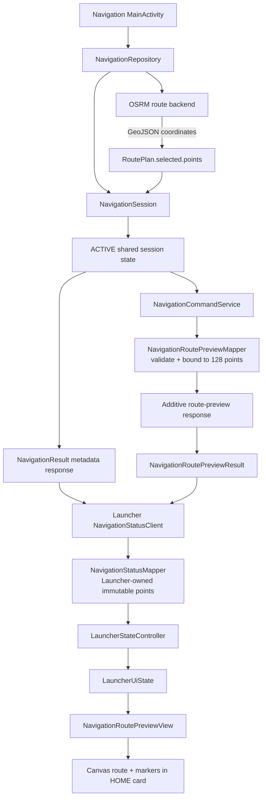
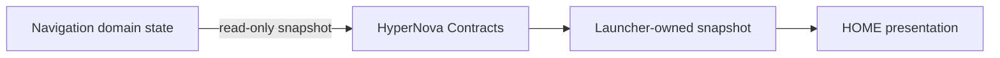
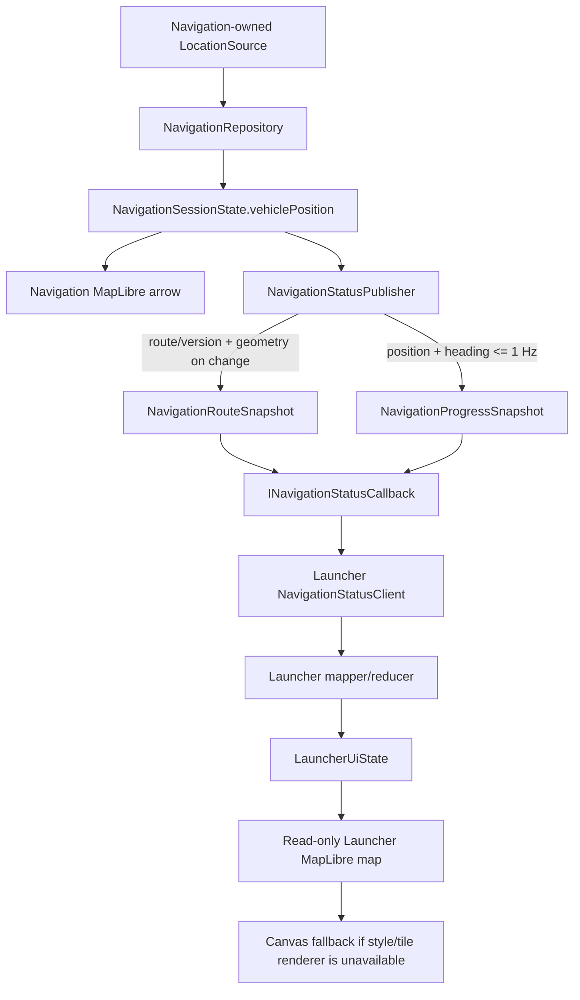

# Architecture

Navigation's `Application` owns one `NavigationRepository`. Both
`MainActivity` and `NavigationCommandService` obtain that same instance, whose
`NavigationSession` stores the current immutable snapshot.

Ownership remains one-way:

The status operation does not call search, route calculation, activation,
cancellation, preference storage, UI views, or OSRM. The same selected
`RouteAlternative.points` list feeds both Navigation's map controller and the
read-only preview mapper.

## Live HOME extension

The route and progress channels are deliberately split. Geometry is bounded to
128 points and is never repeated on a location tick. Sequence numbers reject
stale progress, while the route ID and monotonically increasing route version
prevent a position from being applied to a different route.
