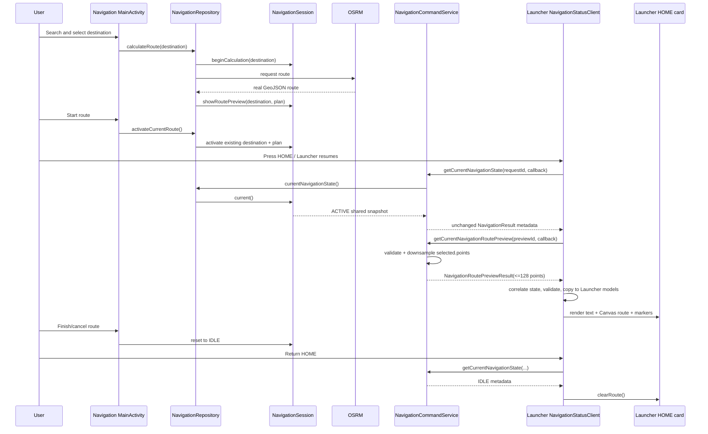

# Runtime Flow



There is no polling loop. A bind-time request plus a foreground-resume request
updates HOME after the user returns from Navigation.

## Continuous HOME progress flow

```mermaid
sequenceDiagram
    participant L as Navigation LocationSource
    participant S as Shared NavigationSession
    participant P as NavigationStatusPublisher
    participant C as Launcher NavigationStatusClient
    participant M as Launcher MapLibre map

    C->>P: registerNavigationStatusCallback(callback)
    P-->>C: NavigationRouteSnapshot(route ID/version, geometry, metadata)
    P-->>C: NavigationProgressSnapshot(position, bearing, sequence)
    C->>M: fit real route and render first authoritative marker
    loop Navigation-owned position changes
        L->>S: VehiclePosition update
        S->>P: immutable session snapshot
        P->>P: throttle to >= 1000 ms between IPC progress events
        P-->>C: progress only; no geometry
        C->>C: validate route version and increasing sequence
        C->>M: interpolate only to received endpoint; update follow camera
    end
    S->>P: cancel -> IDLE
    P-->>C: newer empty route snapshot + null progress position
    C->>M: clear route, destination marker, and vehicle arrow
```

The legacy one-shot current-state/route-preview calls remain as compatibility
fallbacks if an older Navigation service does not implement observer
registration.
