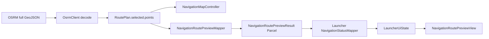
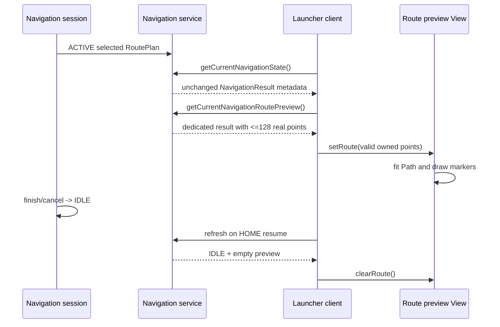

# Route Preview

## Why text worked while the preview was blank

The current-state query originally returned destination, navigation state,
planned duration, and total distance. It carried no route coordinates. The
Launcher therefore rendered truthful text but had no authoritative shape to
draw; its old preview placeholder was invisible.

## Geometry source and transport

Navigation's OSRM request uses `overview=full&geometries=geojson`.
`OsrmClient` converts each GeoJSON `[longitude, latitude]` pair into a domain
`GeoPoint(latitude, longitude)`. The selected `RouteAlternative.points` list is
stored in `NavigationSessionState.routePlan` and is the same geometry rendered
by `NavigationMapController`.



The contract models are:

- `NavigationRoutePoint`: one latitude/longitude pair as doubles.
- `NavigationRoutePreview`: an immutable point list plus nullable authoritative
  current position.
- `NavigationRoutePreviewResult`: a separate correlated status/state response
  returned by the additive preview callback.

The preview is empty for IDLE, ROUTE_PREVIEW, and ERROR. It is included for
ACTIVE and ARRIVED, and for CALCULATING only if an authoritative selected plan
already exists. Cancel/reset replaces the domain session state, so stale points
cannot leak into a later IDLE response.

## Binder-size bound

`MAX_ROUTE_PREVIEW_POINTS` is 128. Navigation first removes invalid points. If
the valid route has at most 128 vertices it is copied intact. Otherwise it
selects deterministic evenly spaced source indices:

```text
sourceIndex = outputIndex * lastSourceIndex / (maximumPoints - 1)
```

This always retains the first and last vertices, bounds Parcel size, has no
randomness, and preserves the overall shape sufficiently for a compact card.
Launcher never makes a second OSRM request.

## Launcher validation and projection

`NavigationStatusMapper` converts contract objects to immutable Launcher-owned
`NavigationPreviewPoint` objects. It rejects NaN/infinite values, latitude
outside `[-90, 90]`, and longitude outside `[-180, 180]`. A preview with fewer
than two valid points is unavailable and no route line is drawn.

The pure `NavigationRouteProjection` helper:

1. scales longitude by `cos(middle latitude)` for a better local aspect ratio;
2. computes the route bounding box;
3. calculates one uniform scale for both axes;
4. centers the route inside the View's padded content rectangle;
5. negates latitude so north points toward Canvas top;
6. safely handles horizontal, vertical, and near-zero-span routes.

The custom View caches the projected `Path` whenever data or dimensions change.
It draws a dark navy background, a restrained decorative grid, cyan glow and
route strokes, and two minimal markers. The grid is not map data and carries no
fake street meaning.

## Marker semantics

- Current/start: Navigation's session `vehiclePosition` when available;
  otherwise the first route point.
- Destination: the final route point.

Launcher does not move either marker itself and does not claim simulated
progress as physical GPS.

## Runtime flow



## Runtime evidence

The on-device test used a real Sheikh Zayed OSRM route. The active card showed
the cyan geometry plus destination, 18-minute planned duration, 8.9 km total
distance, and derived arrival time. After finishing Navigation, HOME displayed
`No active route` and the cyan line disappeared.

- `runtime-launcher-route-preview.png`
- `runtime-launcher-route-cleared.png`

## Compatibility

The geometry uses a dedicated callback/result and an AIDL method appended after
all existing transactions. `NavigationResult` was deliberately left unchanged,
so existing NOVA and command clients keep the same Parcelable wire format. An
updated Launcher gracefully retains text-only state if the preview transaction
is unavailable.
