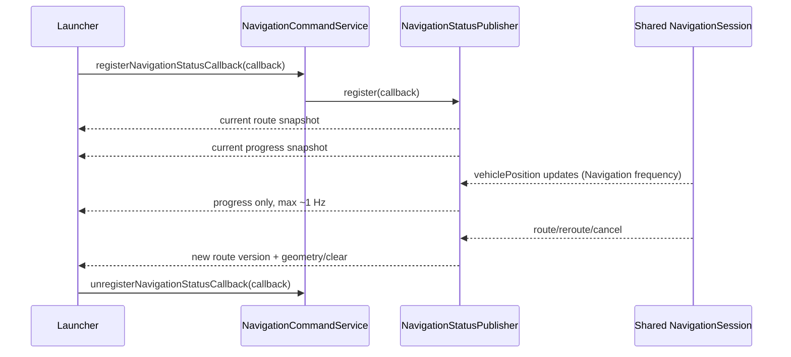

# Live Position and Heading

## Authoritative source

The moving arrow in full Navigation is driven by
`NavigationSessionState.vehiclePosition`. `NavigationRepository` owns the
location-source listener, posts accepted samples into `NavigationSession`, and
both `NavigationMapController` and `NavigationStatusPublisher` observe that same
immutable session state.

The current development application constructs `SimulatedLocationSource` in
`HyperNovaNavigationApplication`. This is Navigation-owned route progress, not
a Launcher animation. A production GNSS provider can replace that source while
the contract and Launcher remain unchanged.

## Contract models

`NavigationRouteSnapshot` contains:

- route ID and monotonic route version
- Navigation state
- destination
- planned route duration and total distance
- bounded route geometry (`NavigationRoutePreview`, maximum 128 points)

`NavigationProgressSnapshot` contains:

- matching route ID/version
- Navigation state
- monotonically increasing sequence number
- nullable `NavigationCurrentPosition`
- authoritative remaining distance when available

`NavigationCurrentPosition` carries latitude, longitude, bearing, speed in
meters/second, and snapshot capture time. Non-finite heading/speed use explicit
unavailable semantics; coordinates outside valid latitude/longitude ranges are
not published or rendered.

## Observer flow

`RemoteCallbackList` owns Binder registrations and handles dead processes. The
service adds/removes one repository listener with its lifecycle. Registration
always returns the latest route and progress snapshots. The existing one-shot
state/preview API remains an older-service fallback.

## Versioning and traffic control

Route identity is a deterministic hash of the destination and selected route
geometry/metrics. A changed route identity increments route version. State
transitions publish a route snapshot; ordinary position ticks do not.

Progress is limited by `MIN_PROGRESS_UPDATE_INTERVAL_MILLIS = 1000`. A first
position, route/state transition, or registration snapshot is immediate. The
Launcher rejects non-increasing sequence numbers and progress whose route
ID/version does not match its cached geometry.

## Marker and camera

The marker rotates to the received normalized bearing. A 550 ms Canvas/MapLibre
visual interpolation may bridge two received coordinates, but it ends exactly
at the newest coordinate and never extrapolates. With no position, the route
start is displayed without motion.

The first route snapshot fits the entire geometry with map padding. Subsequent
authoritative progress enters a stable north-up follow camera at zoom 15.8,
eased over 650 ms and limited to one camera update per 800 ms. The arrow carries
heading, so the camera does not rotate or jump aggressively.

Cancellation produces a newer empty route snapshot and a null-position progress
snapshot. Launcher clears route layers, destination, start, and vehicle sources.
