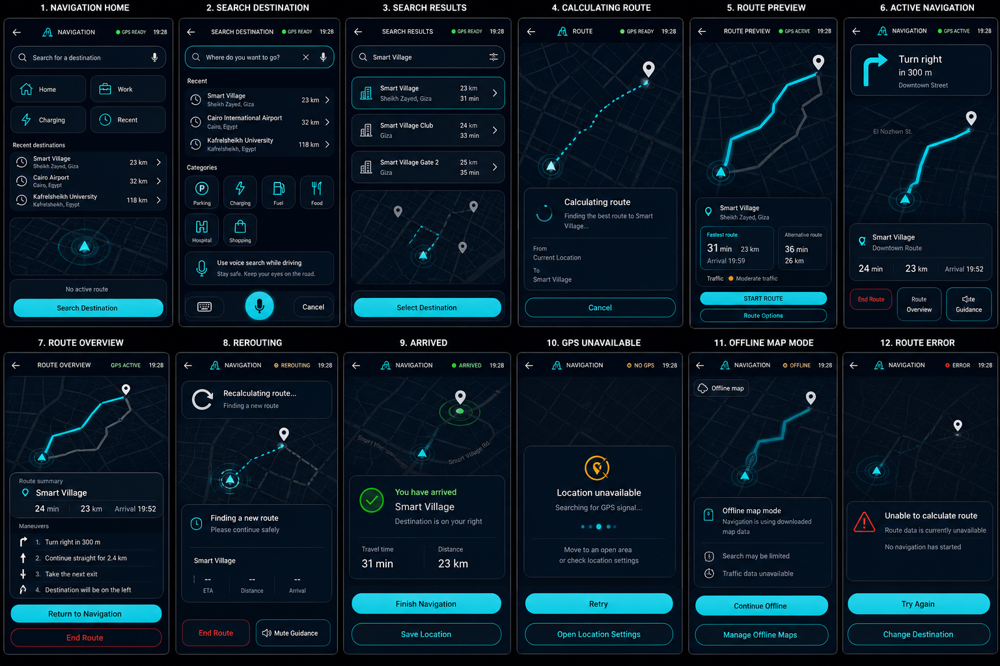

# HyperNova Cockpit — Task 03: Navigation Android App

> **Project:** HyperNova Cockpit  
> **Task:** Task 03 — HyperNova Navigation  
> **Application package:** `com.hypernova.navigation`  
> **Target platform:** Custom AOSP Android IVI image  
> **Orientation:** Portrait only  
> **Reference state-board resolution:** 1536 × 1024 px  
> **Production screen baseline:** 1080 × 1920 px, 9:16  
> **Language:** Kotlin  
> **UI technology:** Android XML Views + ViewBinding  
> **Architecture:** Single Activity + MVVM + Navigation Engine abstraction + AIDL service  
> **Data policy:** Real navigation data only — no production mock or dummy data  
> **Map policy:** Provider-independent architecture with dark HyperNova map styling  
> **Status:** Ready for implementation  

---

## 1. Approved Visual Reference



The image above is the approved visual reference for the HyperNova Navigation application.

It defines the following 12 required visible states:

```text
1. NAVIGATION HOME
2. SEARCH DESTINATION
3. SEARCH RESULTS
4. CALCULATING ROUTE
5. ROUTE PREVIEW
6. ACTIVE NAVIGATION
7. ROUTE OVERVIEW
8. REROUTING
9. ARRIVED
10. GPS UNAVAILABLE
11. OFFLINE MAP MODE
12. ROUTE ERROR
```

The developer must preserve the same design system across every state.

The following must stay consistent:

- Header height.
- Screen margins.
- Card shapes.
- Border thickness.
- Typography.
- Icon family.
- Map color system.
- Cyan interaction color.
- Button geometry.
- Touch-target size.
- Error, warning, and success behavior.
- Portrait composition.

Only state-specific content may change.

---

# 2. Task Objective

Build the production HyperNova Navigation Android application.

The application is responsible for:

- Displaying the current map.
- Reading current device position.
- Searching destinations.
- Showing search results.
- Calculating routes.
- Showing route alternatives.
- Starting active guidance.
- Publishing live ETA and distance.
- Publishing the next maneuver.
- Detecting route deviation.
- Rerouting.
- Handling arrival.
- Supporting offline map mode.
- Handling GPS failure.
- Handling route-calculation errors.
- Publishing state to the Launcher.
- Receiving navigation commands from NOVA AI.
- Following automotive UX restrictions.
- Integrating safely into the HyperNova AOSP image.

The Navigation app is the only owner of navigation business data.

The Launcher and NOVA AI must never calculate routes or own ETA values.

---

# 3. Core Ownership Rule

The Navigation application owns:

```text
Current location
Destination
Search results
Route geometry
Route alternatives
ETA
Distance
Arrival time
Next maneuver
Maneuver distance
Rerouting state
Arrival state
Offline map state
Map preview
Voice-guidance state
Navigation error state
```

The Launcher only displays a summary.

NOVA AI only sends commands and waits for real results.

Example:

```text
NOVA AI
   |
   | navigateHome()
   v
Navigation Service
   |
   | calculate real route
   v
Navigation Engine
   |
   | publish result
   v
NOVA AI + Launcher
```

---

# 4. No Production Dummy Data

The visual reference contains values such as:

```text
Smart Village
23 km
31 min
Arrival 19:52
Turn right in 300 m
```

These values are visual examples only.

The production application must use:

- Real current location.
- Real destination.
- Real map data.
- Real route.
- Real ETA.
- Real distance.
- Real arrival time.
- Real maneuver instructions.
- Real GPS state.
- Real offline-map state.
- Real route errors.

The production source must not contain:

```text
MockNavigationRepository
FakeRouteProvider
DummyGpsState
HardcodedEta
HardcodedDistance
StaticDestinationList
FakeCurrentLocation
DemoMapState
```

Test doubles are allowed only in:

```text
src/test/
src/androidTest/
```

When data is unavailable, display a real empty or unavailable state.

Examples:

```text
No active route
Location unavailable
Searching for GPS signal…
Route data unavailable
Offline map data unavailable
```

---

# 5. HyperNova Shared Design System

The Navigation app must use the same shared design system as the Launcher and NOVA AI.

Shared module:

```text
hypernova-design-system
```

It must define:

- Colors.
- Typography.
- Dimensions.
- Card shapes.
- Buttons.
- Icon rules.
- State colors.
- Loading states.
- Error states.
- Press animations.
- Common automotive touch-target rules.

No developer may change these values locally without an approved design-system update.

---

# 6. Color System

Use these exact tokens.

| Token | Hex | Usage |
|---|---|---|
| `hn_background_primary` | `#020A13` | Main app background |
| `hn_background_secondary` | `#06121F` | Secondary gradient/background |
| `hn_surface_primary` | `#071524` | Main card surface |
| `hn_surface_secondary` | `#0B1B2C` | Elevated card |
| `hn_surface_overlay` | `#102337` | Selected surface |
| `hn_border_primary` | `#506174` | Main card border |
| `hn_border_subtle` | `#293847` | Dividers |
| `hn_primary_cyan` | `#25D9E8` | Active route and primary actions |
| `hn_primary_cyan_pressed` | `#1FC2D0` | Pressed cyan |
| `hn_primary_cyan_dark` | `#0B8493` | Route glow |
| `hn_text_primary` | `#F5F7FA` | Main text |
| `hn_text_secondary` | `#A7B0BE` | Secondary text |
| `hn_text_disabled` | `#687486` | Disabled/unavailable |
| `hn_success` | `#39EA4B` | GPS active, arrived |
| `hn_warning` | `#F5A623` | GPS unavailable, offline, rerouting |
| `hn_error` | `#FF5E68` | Route failure |
| `hn_white` | `#FFFFFF` | High-emphasis marker/icon |
| `hn_transparent` | `#00000000` | Transparent |

## 6.1 Color Rules

- Cyan is the main interaction and active-route color.
- Green appears only for real healthy/success states.
- Amber appears only for warning, rerouting, no GPS, or offline state.
- Red appears only for real errors or destructive confirmation.
- Purple is not used as a main Navigation accent.
- Do not use bright full-card backgrounds.
- Do not use Google Maps default colors.
- Do not use a white map theme.
- Do not introduce new colors locally.

---

# 7. Map Color System

The map must match HyperNova Cockpit.

| Map element | Color |
|---|---|
| Map background | `#06121F` |
| Land | `#081522` |
| Main roads | `#26394B` |
| Secondary roads | `#172838` |
| Road outlines | `#34485A` |
| Active route | `#25D9E8` |
| Route glow | `#0B8493` |
| Completed route | `#506174` |
| Alternative route | `#687486` |
| Vehicle marker | `#25D9E8` |
| Destination marker | `#F5F7FA` |
| Normal traffic | `#39EA4B` |
| Moderate traffic | `#F5A623` |
| Heavy traffic | `#FF5E68` |
| Map labels | `#A7B0BE` |

Map rules:

- Active route is always the brightest road element.
- Old or alternative routes are gray.
- No fake traffic is shown.
- No route line appears before route calculation finishes.
- Vehicle position must never move artificially.
- When GPS is unavailable, use the last known location only when clearly labeled.

---

# 8. Screen Baseline and Spacing

Production baseline:

```text
1080 × 1920 px
9:16 portrait
Approximately 540 × 960 dp at 2× density
```

Global spacing:

```text
4dp
8dp
12dp
16dp
20dp
24dp
32dp
```

Global dimensions:

```text
Screen horizontal margin: 12–16dp
Header height: 56dp
Search field height: 52dp
Primary button height: 48dp
Minimum touch target: 48dp
Main card radius: 22dp
Small card radius: 16dp
Card padding: 12–16dp
Main section gap: 12dp
```

The primary screen must fit without horizontal scrolling.

Active Navigation must not require vertical scrolling.

---

# 9. Typography

Use:

```text
Roboto
```

| Element | Size | Weight |
|---|---:|---|
| Header title | `18sp` | Medium |
| Header status | `9–10sp` | Medium |
| Search input | `14sp` | Regular |
| Card title | `11–12sp` | Medium |
| Next-turn instruction | `22–26sp` | Medium |
| Maneuver distance | `16–18sp` | Medium |
| Destination title | `16–18sp` | Medium |
| ETA value | `18–20sp` | Medium |
| Body | `13sp` | Regular |
| Secondary | `10–11sp` | Regular |
| Button text | `13sp` | Medium |

Rules:

- Keep destination titles to one or two lines.
- Use ellipsis for long labels.
- Do not shrink critical guidance text below 16sp.
- Keep secondary text readable.
- Do not use decorative fonts.

---

# 10. Icon System

Use:

```text
Material Symbols Rounded
```

Required icon categories:

```text
Back
Navigation arrow
Search
Microphone
Close
Home
Work
Charging
Recent
Parking
Fuel
Food
Hospital
Shopping
Location marker
Destination marker
Right turn
Left turn
Straight
Exit
Route overview
Mute
Unmute
Retry
Offline map
GPS off
Success
Error
Warning
End route
```

Rules:

- Use one consistent stroke weight.
- Active icons use cyan.
- Inactive icons use secondary gray.
- Healthy GPS uses green.
- Warning icons use amber.
- Error icons use red.
- Every interactive icon requires a content description.

---

# 11. Application Screen Structure

Main screens:

```text
NavigationActivity
|
+-- Navigation Home
+-- Search Destination
+-- Search Results
+-- Route Preview
+-- Active Navigation
+-- Route Overview
```

State-driven screens:

```text
Calculating Route
Rerouting
Arrived
GPS Unavailable
Offline Map Mode
Route Error
```

The application should use one Activity and multiple Fragments or one state-driven content host.

Recommended:

```text
Single Activity
+
Navigation Component
+
StateFlow
```

---

# 12. Navigation State Machine

Approved navigation states:

```text
IDLE
SEARCHING
SEARCH_RESULTS
CALCULATING_ROUTE
ROUTE_PREVIEW
NAVIGATING
REROUTING
ARRIVED
GPS_UNAVAILABLE
OFFLINE
ERROR
```

High-level flow:

```text
IDLE
  |
  +--> SEARCHING
          |
          +--> SEARCH_RESULTS
                  |
                  +--> CALCULATING_ROUTE
                          |
                          +--> ROUTE_PREVIEW
                                  |
                                  +--> NAVIGATING
                                          |
                                          +--> REROUTING
                                          |       |
                                          |       +--> NAVIGATING
                                          |
                                          +--> ARRIVED
```

Any active state may enter:

```text
GPS_UNAVAILABLE
OFFLINE
ERROR
```

Invalid transitions must be rejected and logged.

---

# 13. State 1 — Navigation Home

## Purpose

Entry screen when no route is active.

## Required content

```text
Header
Search field
Quick destinations
Recent destinations
Current-position map
No active route
Search Destination button
```

## Header

```text
Back
NAVIGATION
GPS READY
Current time
```

## Quick destinations

```text
Home
Work
Charging
Recent
```

Data sources:

- Home from Driver Profile.
- Work from Driver Profile.
- Charging from POI/Search provider.
- Recent from Navigation history.

If Home is not configured:

```text
Set Home Location
```

Do not show a fake address.

## Current-position map

- Show current real location.
- Show subtle cyan location ring.
- No active route line.
- No fake movement.

## Primary action

```text
Search Destination
```

---

# 14. State 2 — Search Destination

## Purpose

Allow the driver to define a destination.

## Required content

```text
Focused search field
Recent destinations
Categories
Voice-search safety message
Bottom command bar
```

## Search field

```text
Where do you want to go?
```

Controls:

```text
Clear
Voice Search
```

## Categories

```text
Parking
Charging
Fuel
Food
Hospital
Shopping
```

## Driving restrictions

When moving:

```text
Keyboard disabled
Voice search enabled
Message: Use voice search while driving
```

When parked:

```text
Keyboard enabled
Voice search enabled
```

## Bottom bar

```text
Keyboard
Microphone
Cancel
```

---

# 15. State 3 — Search Results

## Purpose

Display real search-provider results.

Each result contains:

```text
Place name
Address
Distance
Estimated travel time
Category icon
Selection indicator
```

Results must come from the configured SearchProvider.

Do not hard-code:

```text
Smart Village
Cairo Airport
Kafrelsheikh University
```

Those are visual examples only.

## Result selection

- First press selects.
- Second press or primary button opens route calculation.
- Selected result uses cyan border.
- Unavailable result is disabled.

## Bottom content

- Small map preview.
- `Select Destination` button.

---

# 16. State 4 — Calculating Route

## Entry condition

Enter only after:

- Current location is available.
- Destination is valid.
- Route provider accepts the request.

## UI

```text
Current location marker
Destination marker
Dotted cyan calculation path
Calculating route
Finding the best route…
Cancel
```

## Critical rules

- Do not show ETA yet.
- Do not show final distance yet.
- Do not show solid route.
- Do not claim route readiness.
- Allow cancel when provider supports it.

Timeout:

```text
Recommended route timeout: 15 seconds
Configurable maximum: 30 seconds
```

On timeout:

```text
ROUTE ERROR
```

---

# 17. State 5 — Route Preview

## Purpose

Show confirmed route choices before starting guidance.

## Required content

```text
Full map
Fastest route
Alternative route
Destination
Address
ETA
Distance
Arrival time
Traffic state
START ROUTE
Route Options
```

## Route display

- Fastest route: bright cyan.
- Alternative route: gray.
- Selected route: cyan border.
- Traffic only when real data exists.

## Start Route behavior

```text
User presses START ROUTE
        |
        v
Navigation engine starts guidance
        |
        v
Navigation state becomes NAVIGATING
        |
        +--> Launcher receives state
        +--> NOVA AI receives command result
```

---

# 18. State 6 — Active Navigation

This is the most important screen.

## Required regions

```text
Header
Next maneuver card
Full map
Bottom route summary
Route controls
```

## Next maneuver card

Must show:

```text
Maneuver icon
Instruction
Distance to maneuver
Street name
```

Example:

```text
Turn right
in 300 m
Downtown Street
```

These values must come from the GuidanceEngine.

## Map

- Vehicle centered slightly below screen center.
- Active route ahead in cyan.
- Completed route behind in gray.
- Destination marker visible when appropriate.
- Road labels readable.
- Map remains dominant.

## Bottom route summary

```text
Destination
Route name
Remaining time
Remaining distance
Arrival time
```

## Controls

```text
End Route
Route Overview
Mute Guidance
```

All controls must be at least 48dp.

---

# 19. State 7 — Route Overview

## Purpose

Display the full route and maneuver list.

## Content

```text
Full route map
Destination
ETA
Distance
Arrival time
Maneuver list
Return to Navigation
End Route
```

## Driving restriction

When moving:

- Limit maneuver list detail.
- Keep primary route overview visible.
- Avoid long scrolling.

When parked:

- Full maneuver list may be shown.

---

# 20. State 8 — Rerouting

## Entry condition

Enter when route deviation is confirmed.

## UI

```text
REROUTING
Recalculating route…
Old route in gray
Vehicle off route
Dotted cyan calculation path
Finding a new route
Please continue safely
```

## Critical rules

- Do not show new ETA until confirmed.
- Do not show new route until calculation finishes.
- Use amber, not red.
- Keep destination visible.
- Keep last confirmed route data dimmed only when useful.

After success:

```text
REROUTING -> NAVIGATING
```

After failure:

```text
REROUTING -> ERROR
```

---

# 21. State 9 — Arrived

## Entry condition

Enter when the Navigation engine confirms destination arrival.

## UI

```text
ARRIVED
You have arrived
Destination
Destination side/location note
Travel time
Distance
Finish Navigation
Save Location
```

Use green only for the success indicator.

## Completion

After `Finish Navigation`:

```text
Navigation state -> IDLE
Launcher card -> No active route
NOVA AI -> final result available
```

---

# 22. State 10 — GPS Unavailable

## Entry condition

Enter when current location cannot be determined.

## UI

```text
NO GPS
Location unavailable
Searching for GPS signal…
Move to an open area or check location settings
Retry
Open Location Settings
```

## Rules

- Do not animate fake vehicle movement.
- Do not show a fake current position.
- Last known location may be shown only with reduced opacity and a label.
- Use amber, not red.
- Continue offline route guidance only when the engine explicitly supports it.

---

# 23. State 11 — Offline Map Mode

## Entry condition

Enter when internet connectivity is unavailable and downloaded map data is used.

## UI

```text
OFFLINE
Offline map mode
Navigation is using downloaded map data
Search may be limited
Traffic data unavailable
Continue Offline
Manage Offline Maps
```

## Rules

- Do not show fake live traffic.
- Real cached route guidance may continue.
- Mark stale data.
- Search capability must reflect available offline index data.
- Do not claim full online functionality.

---

# 24. State 12 — Route Error

## Entry conditions

Examples:

```text
Route provider unavailable
Route calculation failed
Unsupported destination
No map data
Location invalid
Provider timeout
Network error without offline fallback
```

## UI

```text
ERROR
Unable to calculate route
Readable reason
No navigation has started
Try Again
Change Destination
```

## Rules

- Do not show a route line.
- Do not show ETA.
- Do not show arrival time.
- Do not expose raw exceptions.
- Keep map static in background.

---

# 25. End Route Confirmation

Even though it is not a separate state on the approved board, the app must implement confirmation.

## UI

```text
End navigation?
Guidance to [Destination] will stop.

Continue Navigation
End Route
```

Style:

- Continue Navigation: cyan filled.
- End Route: red outline.
- Do not use a full bright red surface.
- Dim the active map in the background.

---

# 26. Map Provider Abstraction

Do not couple the full application to one map vendor.

Required interfaces:

```text
MapProvider
SearchProvider
RouteProvider
GuidanceProvider
OfflineMapProvider
TrafficProvider
LocationProvider
```

Example:

```text
Navigation UI
    |
    v
NavigationEngine
    |
    +--> Mapbox implementation
    +--> OpenStreetMap implementation
    +--> Offline custom implementation
```

The UI must not know vendor-specific classes.

---

# 27. Navigation Engine Architecture

```text
NavigationEngine
|
+-- LocationProvider
+-- SearchProvider
+-- RouteProvider
+-- GuidanceEngine
+-- MapRenderer
+-- OfflineMapManager
+-- TrafficProvider
```

Responsibilities:

| Component | Responsibility |
|---|---|
| `LocationProvider` | Current location and GPS status |
| `SearchProvider` | Destination and POI search |
| `RouteProvider` | Route calculation and alternatives |
| `GuidanceEngine` | Maneuvers and route progress |
| `MapRenderer` | Map drawing |
| `OfflineMapManager` | Downloaded map data |
| `TrafficProvider` | Live traffic when available |

---

# 28. Internal Application Architecture

```text
NavigationActivity
|
+-- NavigationHostFragment
|
+-- NavigationViewModel
|
+-- NavigationRepository
|
+-- NavigationStateMachine
|
+-- NavigationEngine
|
+-- NavigationService
|
+-- NavigationStatePublisher
|
+-- DriverProfileClient
|
+-- VehicleUxRestrictionClient
```

Responsibilities:

| Component | Responsibility |
|---|---|
| `NavigationActivity` | Full-screen portrait host |
| `NavigationViewModel` | Exposes immutable UI state |
| `NavigationRepository` | Combines engine/provider data |
| `NavigationStateMachine` | Validates transitions |
| `NavigationEngine` | Coordinates location, search, route, guidance |
| `NavigationService` | Exposes state and commands to other apps |
| `NavigationStatePublisher` | Sends callbacks to Launcher/NOVA |
| `DriverProfileClient` | Reads Home and Work |
| `VehicleUxRestrictionClient` | Applies parked/moving restrictions |

---

# 29. Recommended Project Structure

```text
app/src/main/java/com/hypernova/navigation/
|
+-- NavigationActivity.kt
|
+-- ui/
|   +-- home/
|   +-- search/
|   +-- results/
|   +-- routepreview/
|   +-- guidance/
|   +-- overview/
|   +-- common/
|
+-- engine/
|   +-- NavigationEngine.kt
|   +-- NavigationStateMachine.kt
|   +-- LocationProvider.kt
|   +-- SearchProvider.kt
|   +-- RouteProvider.kt
|   +-- GuidanceEngine.kt
|   +-- MapRenderer.kt
|   +-- OfflineMapManager.kt
|   +-- TrafficProvider.kt
|
+-- service/
|   +-- NavigationService.kt
|   +-- NavigationStatePublisher.kt
|
+-- model/
|   +-- NavigationState.kt
|   +-- NavigationStatus.kt
|   +-- Destination.kt
|   +-- SearchResult.kt
|   +-- Route.kt
|   +-- RouteAlternative.kt
|   +-- Maneuver.kt
|   +-- CommandResult.kt
|
+-- integration/
|   +-- DriverProfileClient.kt
|   +-- VehicleUxRestrictionClient.kt
|
+-- util/
    +-- UiText.kt
    +-- Result.kt
    +-- TimeFormatter.kt
    +-- DistanceFormatter.kt
```

---

# 30. Recommended XML Layout Files

```text
activity_navigation.xml
fragment_navigation_home.xml
fragment_search_destination.xml
fragment_search_results.xml
fragment_route_preview.xml
fragment_active_navigation.xml
fragment_route_overview.xml
view_navigation_header.xml
view_navigation_search_bar.xml
view_next_maneuver_card.xml
view_route_summary_card.xml
view_navigation_bottom_actions.xml
view_navigation_state_calculating.xml
view_navigation_state_rerouting.xml
view_navigation_state_arrived.xml
view_navigation_state_gps_unavailable.xml
view_navigation_state_offline.xml
view_navigation_state_error.xml
dialog_end_route.xml
```

Do not duplicate full layouts unnecessarily.

Use reusable map and status components.

---

# 31. Suggested View IDs

## Header

```text
btnBack
ivNavigationLogo
tvNavigationTitle
viewGpsStatusDot
tvGpsStatus
tvCurrentTime
```

## Search

```text
searchDestinationContainer
etDestinationSearch
btnVoiceSearch
btnClearSearch
rvRecentDestinations
rvCategories
```

## Map

```text
navigationMapContainer
mapView
ivVehicleMarker
ivDestinationMarker
routeOverlay
```

## Route Preview

```text
cardRoutePreview
tvDestinationName
tvDestinationAddress
tvFastestEta
tvFastestDistance
tvFastestArrival
tvAlternativeEta
tvAlternativeDistance
tvTrafficState
btnStartRoute
btnRouteOptions
```

## Active Navigation

```text
cardNextManeuver
ivManeuver
tvManeuverInstruction
tvManeuverDistance
tvManeuverStreet

cardRouteSummary
tvActiveDestination
tvActiveRouteName
tvRemainingTime
tvRemainingDistance
tvArrivalTime

btnEndRoute
btnRouteOverview
btnMuteGuidance
```

## State Views

```text
stateCalculating
stateRerouting
stateArrived
stateGpsUnavailable
stateOffline
stateError
```

---

# 32. Navigation UI State

Suggested state:

```kotlin
data class NavigationUiState(
    val status: NavigationStatus,
    val currentLocation: GeoPoint?,
    val destination: Destination?,
    val searchQuery: String,
    val searchResults: List<SearchResult>,
    val selectedResultId: String?,
    val activeRoute: Route?,
    val alternatives: List<RouteAlternative>,
    val nextManeuver: Maneuver?,
    val gpsStatus: GpsStatus,
    val connectivityStatus: ConnectivityStatus,
    val offlineMode: Boolean,
    val voiceGuidanceEnabled: Boolean,
    val canCancelCurrentOperation: Boolean,
    val message: UiText?
)
```

Required enums:

```text
NavigationStatus
GpsStatus
ConnectivityStatus
RouteCalculationStatus
GuidanceStatus
CommandStatus
```

---

# 33. Navigation Service for Launcher and NOVA AI

Service:

```text
com.hypernova.navigation.service.NavigationService
```

AIDL contracts:

```text
INavigationService
INavigationCallback
NavigationState
NavigationCommandResult
```

Required operations:

```text
getApiVersion()
getServiceVersion()
getCurrentState()
registerCallback()
unregisterCallback()
navigateHome()
navigateToDestination(...)
startRoute(...)
cancelRouteCalculation()
endNavigation()
setVoiceGuidanceEnabled(...)
openNavigation()
```

---

# 34. Published Navigation State

Suggested cross-app model:

```kotlin
data class NavigationState(
    val apiVersion: Int,
    val status: Int,
    val destinationName: String?,
    val destinationAddress: String?,
    val routeName: String?,
    val remainingTimeSeconds: Long?,
    val remainingDistanceMeters: Long?,
    val arrivalEpochMillis: Long?,
    val nextManeuverType: Int?,
    val nextManeuverInstruction: String?,
    val distanceToManeuverMeters: Long?,
    val mapPreviewUri: String?,
    val voiceGuidanceEnabled: Boolean,
    val gpsAvailable: Boolean,
    val offlineMode: Boolean,
    val updatedAtEpochMillis: Long
)
```

The Launcher uses only the summary fields.

NOVA AI uses command-result callbacks.

---

# 35. Launcher Integration

The Launcher reads:

```text
Navigation status
Destination
Route name
ETA
Distance
Arrival time
Map preview
```

Flow:

```text
Navigation Engine updates route
        |
        v
NavigationService publishes state
        |
        v
Launcher Navigation card updates
```

The Launcher must not:

- Access Navigation database.
- Calculate ETA.
- Read route geometry directly.
- Poll route state every second when callbacks are available.

---

# 36. NOVA AI Integration

Example:

```text
Driver: “Navigate me home”
        |
        v
NOVA AI detects NAVIGATE_HOME
        |
        v
INavigationService.navigateHome()
        |
        v
Navigation resolves saved Home
        |
        v
Route calculation
        |
        +--> SUCCESS: route started
        +--> ERROR: no Home saved
        +--> ERROR: GPS unavailable
        +--> ERROR: route failed
```

NOVA AI must wait for the real result.

Navigation must return explicit result codes.

Suggested result states:

```text
ACCEPTED
IN_PROGRESS
COMPLETED
REJECTED
NO_HOME_LOCATION
LOCATION_UNAVAILABLE
ROUTE_NOT_FOUND
OFFLINE_DATA_UNAVAILABLE
TIMEOUT
CANCELLED
```

---

# 37. Driver Profile Integration

Driver & Settings owns:

```text
Home location
Work location
Preferred units
Language
Voice-guidance preference
```

Navigation reads this through the Profile service.

Do not duplicate Home or Work inside Navigation preferences.

If Home is missing:

```text
Set Home Location
```

---

# 38. Driving Restrictions

Navigation must read the approved vehicle UX restriction state.

When moving:

- Keyboard may be disabled.
- Voice search remains enabled.
- Long maneuver lists may be limited.
- Complex route options may be hidden.
- Touch actions remain large.

When parked:

- Keyboard may be enabled.
- Full route options may be available.
- Offline map management may be enabled.

Do not invent independent safety rules.

---

# 39. Offline Maps

Offline architecture must include:

```text
OfflineMapManager
Downloaded region metadata
Storage status
Version/checksum
Search-index availability
Route capability availability
Traffic unavailable state
```

Offline mode must never imply live traffic.

Required visible states:

```text
Offline maps available
Offline search limited
Offline route available
Offline data missing
Offline data outdated
```

---

# 40. GPS and Location Handling

LocationProvider must expose:

```text
AVAILABLE
SEARCHING
DEGRADED
UNAVAILABLE
PERMISSION_DENIED
```

Rules:

- Never invent location.
- Never move the vehicle marker without real updates.
- Clearly label last-known location.
- Handle permission denial.
- Handle GNSS loss.
- Handle low-accuracy state.
- Handle tunnel or indoor state safely.

---

# 41. Voice Guidance

GuidanceEngine publishes:

```text
Next maneuver
Distance to maneuver
Street name
Lane guidance when available
Arrival message
Rerouting message
```

Controls:

```text
Mute Guidance
Unmute Guidance
```

The app must coordinate audio focus with Media.

Voice guidance should:

- Duck Media when required.
- Release focus after prompt.
- Respect user preference.
- Not permanently stop Media unless policy requires it.

---

# 42. IPC Security

Use a signature permission.

```xml
<permission
    android:name="com.hypernova.permission.ACCESS_COCKPIT_SERVICES"
    android:protectionLevel="signature" />
```

Navigation service:

```xml
<service
    android:name=".service.NavigationService"
    android:exported="true"
    android:permission="com.hypernova.permission.ACCESS_COCKPIT_SERVICES">
    <intent-filter>
        <action android:name="com.hypernova.action.BIND_NAVIGATION_SERVICE" />
    </intent-filter>
</service>
```

Rules:

- Sign HyperNova APKs with the approved key.
- Validate destination parameters.
- Validate caller permissions.
- Do not expose private navigation history.
- Use content URIs for map previews.
- Do not export unprotected debug services.

---

# 43. Contract Versioning

Expose:

```text
getApiVersion()
getServiceVersion()
```

Example:

```text
Navigation API version: 1
```

On mismatch:

- Do not call unsupported methods.
- Publish incompatible/unavailable state.
- Log the mismatch.
- Keep the UI usable locally.

---

# 44. Permissions

Possible permissions:

```text
android.permission.ACCESS_FINE_LOCATION
android.permission.ACCESS_COARSE_LOCATION
android.permission.FOREGROUND_SERVICE
android.permission.FOREGROUND_SERVICE_LOCATION
android.permission.INTERNET
android.permission.ACCESS_NETWORK_STATE
android.permission.POST_NOTIFICATIONS
```

Only declare permissions that are actually required.

Rules:

- Explain location use.
- Handle denial safely.
- Do not crash without Internet.
- Continue offline when supported.
- Do not request unrelated permissions.

---

# 45. Full-Screen Behavior

- Portrait only.
- Edge-to-edge.
- Dark launch theme.
- No white flash.
- Handle safe insets.
- Hide normal Android status/navigation bars in production if required by the cockpit shell.
- Do not reproduce Launcher bottom navigation inside the Navigation app.
- Use Navigation-specific actions only.

---

# 46. Animations

| Animation | Duration |
|---|---:|
| Card press | `100ms` |
| State crossfade | `160–220ms` |
| Route draw | `300–600ms` |
| Rerouting indicator | Continuous, subtle |
| Arrival pulse | `500–700ms` |
| Error pulse | `350–500ms` |

Rules:

- No flashing.
- No distracting map animation.
- Do not delay guidance.
- Respect reduced-animation settings.
- Keep the vehicle marker smooth but grounded in real location updates.

---

# 47. Error Handling

Handle:

```text
Location permission denied
GPS unavailable
Search provider unavailable
No search results
Route provider timeout
Route not found
Offline data missing
Offline data outdated
Traffic unavailable
Guidance engine failure
Map renderer failure
Binder death
API version mismatch
Storage failure
```

Every error maps to:

```text
Readable driver message
Internal error code
Recovery action
Next valid state
```

Never show raw stack traces.

---

# 48. Logging

Use:

```text
HN-Navigation
HN-Location
HN-Search
HN-Route
HN-Guidance
HN-OfflineMaps
HN-NavigationService
```

Log:

- State transitions.
- Route calculation start/end.
- GPS status.
- Provider connection.
- Service command.
- API mismatch.
- Rerouting.
- Arrival.
- Error code.

Do not log:

- Full private route history.
- Exact saved Home/Work addresses in production logs.
- Authentication tokens.
- Private driver profile data.
- Raw provider payloads containing personal information.

---

# 49. Performance

- Do not block the main thread.
- Use coroutines and `StateFlow`.
- Keep map rendering efficient.
- Avoid repeated bitmap decoding.
- Cache map previews responsibly.
- Avoid polling when callbacks exist.
- Throttle location/map updates appropriately.
- Release provider resources when not needed.
- Handle Activity lifecycle safely.
- Avoid Binder leaks.
- Avoid duplicate route requests.
- Avoid keeping large route geometry in multiple copies.

---

# 50. Accessibility and Automotive UX

- Minimum touch target: 48dp.
- High-contrast text.
- Clear maneuver instructions.
- Voice-first search while moving.
- No long press.
- No multi-touch requirement for critical actions.
- No tiny route controls.
- Do not depend on color only.
- Keep current maneuver highly visible.
- Keep error states readable.
- Keep route actions one press away.

---

# 51. Testing Requirements

## 51.1 State Tests

```text
IDLE -> SEARCHING
SEARCHING -> SEARCH_RESULTS
SEARCH_RESULTS -> CALCULATING_ROUTE
CALCULATING_ROUTE -> ROUTE_PREVIEW
ROUTE_PREVIEW -> NAVIGATING
NAVIGATING -> REROUTING
REROUTING -> NAVIGATING
NAVIGATING -> ARRIVED
Any state -> GPS_UNAVAILABLE
Any state -> OFFLINE
Any state -> ERROR
```

## 51.2 UI Tests

- All 12 approved states exist.
- Colors match the design system.
- Map style remains consistent.
- No text clipping.
- No overlapping controls.
- Active Navigation fits without scrolling.
- Buttons meet 48dp.
- Correct warning/error/success colors.
- No fake route before confirmation.

## 51.3 Integration Tests

- Launcher receives real route state.
- NOVA navigateHome works.
- Profile Home/Work loads correctly.
- Search provider returns real data.
- Route provider returns real alternatives.
- Guidance updates next maneuver.
- Rerouting works.
- Arrival publishes final state.
- Offline mode behaves correctly.
- GPS loss behaves correctly.
- Voice guidance audio focus works.

## 51.4 Security Tests

- Untrusted app cannot bind.
- Invalid destination is rejected.
- Unsupported API version is rejected.
- Private route history is not exposed.
- Debug interfaces are protected.

---

# 52. Development Order

Implement in this order:

```text
1. Freeze package name and IPC contracts
2. Import shared HyperNova design system
3. Create project and dark theme
4. Implement Header and common components
5. Implement Navigation Home
6. Implement Search Destination
7. Implement Search Results
8. Implement Calculating Route state
9. Implement Route Preview
10. Implement Active Navigation
11. Implement Route Overview
12. Implement Rerouting
13. Implement Arrived
14. Implement GPS Unavailable
15. Implement Offline Map Mode
16. Implement Route Error
17. Implement End Route confirmation
18. Implement NavigationStateMachine
19. Implement LocationProvider
20. Implement SearchProvider
21. Implement RouteProvider
22. Implement GuidanceEngine
23. Implement MapProvider abstraction
24. Implement OfflineMapManager
25. Implement NavigationService
26. Integrate Launcher
27. Integrate NOVA AI
28. Integrate Driver Profile
29. Add IPC security and versioning
30. Add driving restrictions
31. Add audio focus for voice guidance
32. Test all states
33. Build debug and release APKs
34. Integrate into AOSP
35. Validate on target portrait display
```

---

# 53. Required Deliverables

The task owner must provide:

```text
1. Complete Android Studio project
2. Source code
3. Shared design-system version
4. Shared IPC-contract version
5. All 12 approved states
6. NavigationEngine abstraction
7. LocationProvider
8. SearchProvider
9. RouteProvider
10. GuidanceEngine
11. MapProvider abstraction
12. OfflineMapManager
13. NavigationService
14. Launcher integration
15. NOVA AI integration
16. Driver Profile integration
17. Debug APK
18. Release APK
19. Screenshot of every state
20. State-transition test report
21. Integration test report
22. Permission documentation
23. AOSP integration notes
24. Map/provider license notes
25. Updated final README
```

Suggested APK names:

```text
HyperNovaNavigation-debug.apk
HyperNovaNavigation-release.apk
```

---

# 54. Definition of Done

## Visual

- [ ] All 12 approved states are implemented.
- [ ] UI matches the reference board.
- [ ] Shared HyperNova colors are used.
- [ ] Dark map style is consistent.
- [ ] Active route is cyan.
- [ ] Alternative route is gray.
- [ ] Cards and buttons match Launcher/NOVA AI.
- [ ] No clipped text.
- [ ] Active Navigation does not scroll.
- [ ] Touch targets are at least 48dp.
- [ ] No Google Maps default styling is visible.

## Architecture

- [ ] Package is `com.hypernova.navigation`.
- [ ] No production dummy data exists.
- [ ] Provider-independent interfaces are used.
- [ ] Navigation state machine is implemented.
- [ ] Real GPS state is used.
- [ ] Real search results are used.
- [ ] Real routes are used.
- [ ] Real ETA/distance are used.
- [ ] Real maneuver guidance is used.
- [ ] Offline state is honest.
- [ ] GPS unavailable state is honest.
- [ ] Rerouting waits for a real route.
- [ ] Arrival is confirmed by the engine.
- [ ] Launcher receives real state.
- [ ] NOVA AI receives real command results.
- [ ] Signature permission protects IPC.
- [ ] API versioning is implemented.
- [ ] Binder death is handled.
- [ ] Timeouts are handled.

## Safety and Audio

- [ ] Voice search works while moving.
- [ ] Keyboard follows restrictions.
- [ ] Voice guidance audio focus works.
- [ ] End Route requires confirmation.
- [ ] No fake vehicle movement is shown.
- [ ] No fake traffic is shown.
- [ ] Private navigation data is not logged.

## Delivery

- [ ] Debug APK generated.
- [ ] Release APK generated.
- [ ] 12 screenshots included.
- [ ] Test reports included.
- [ ] Provider licenses documented.
- [ ] AOSP notes included.
- [ ] Final README updated.

---

# 55. Questions and Answers

## Why is the map provider abstracted?

To prevent the complete app from depending on one vendor and to allow Mapbox, OSM, or an offline engine later.

## Why does Calculating Route not show ETA?

Because ETA and distance are not valid until the RouteProvider confirms the route.

## Who owns Navigation data?

The Navigation application and its NavigationEngine.

## Can the Launcher calculate ETA?

No. The Launcher only receives the published Navigation state.

## Can NOVA AI start navigation directly?

NOVA AI sends a command through `INavigationService` and waits for the real result.

## What happens without GPS?

The app enters GPS UNAVAILABLE and does not fake movement.

## What happens without Internet?

The app uses Offline Map Mode only when downloaded map data is available.

## Can the app show live traffic offline?

No.

## Why use amber for rerouting?

Rerouting is a warning/in-progress condition, not necessarily an error.

## What is the most important rule?

Never display route, ETA, distance, maneuver, or arrival data before the Navigation engine confirms it.

---

# 56. Final Instruction to the Task Owner

Build HyperNova Navigation as a production automotive navigation system, not only a visual prototype.

The final application must combine:

```text
Consistent HyperNova design
+
Real map and location state
+
Provider-independent architecture
+
Real route calculation
+
Safe active guidance
+
Launcher integration
+
NOVA AI integration
+
Offline and failure handling
```

Do not add production dummy data, fake GPS, fake routes, fake traffic, unprotected IPC, or unconfirmed route values without an approved architecture change.
