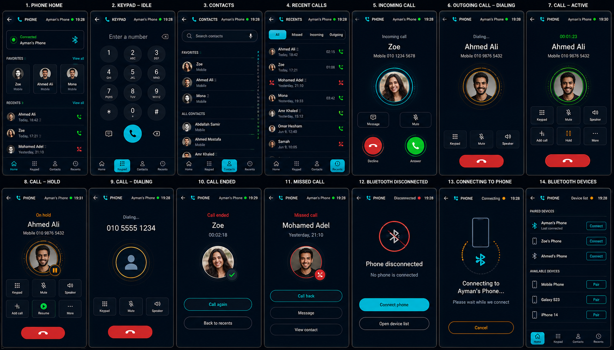

# HyperNova Cockpit — Task 06: Phone Android App

> **Project:** HyperNova Cockpit  
> **Task:** Task 06 — HyperNova Phone  
> **Application package:** `com.hypernova.phone`  
> **Target platform:** Custom AOSP / Android Automotive IVI image  
> **Orientation:** Portrait only  
> **Production baseline:** `1080 × 1920 px`, 9:16  
> **Reference board resolution:** `1659 × 948 px`  
> **Implementation language:** Kotlin  
> **UI technology:** Android XML Views + ViewBinding  
> **Architecture:** Single Activity + MVVM + Android Telecom + Bluetooth HFP/PBAP integration  
> **Primary phone source:** One active Bluetooth phone  
> **Data policy:** Real phone, call, contact, and connection state only  
> **Status:** Ready for implementation  

---

# 1. Approved Visual Reference



The image above is the approved visual reference for Task 06.

It defines these 14 main screens and states:

```text
1. PHONE HOME
2. KEYPAD — IDLE
3. CONTACTS
4. RECENT CALLS
5. INCOMING CALL
6. OUTGOING CALL — DIALING
7. CALL — ACTIVE
8. CALL — HOLD
9. CALL — DIALING
10. CALL ENDED
11. MISSED CALL
12. BLUETOOTH DISCONNECTED
13. CONNECTING TO PHONE
14. BLUETOOTH DEVICES
```

The implementation must preserve the same visual language across every screen:

- Same top header.
- Same dark navy background.
- Same cyan primary interaction color.
- Same card shapes.
- Same border thickness.
- Same icon family.
- Same touch-target rules.
- Same portrait composition.
- Same contact-avatar style.
- Same in-call control geometry.
- Same bottom navigation on normal phone screens.
- Same full-screen call layout on call states.

Names and numbers shown in the reference are visual examples only. Production code must use real data from the connected Bluetooth phone and Android system services.

---

# 2. Product Definition

HyperNova Phone is an automotive Bluetooth dialer and in-call controller.

It is responsible for:

```text
Bluetooth Phone Connection
Contacts
Favorites
Recent Calls
Dial Pad
Incoming Calls
Outgoing Calls
Active Calls
Hold / Resume
Mute / Unmute
Audio Route
End Call
Missed Calls
Call History
Bluetooth Device Selection
Phone Connection Errors
Launcher Integration
NOVA AI Integration
```

The application is not a smartphone dialer clone.

It must be designed for:

- Large portrait IVI display.
- Low distraction.
- One-press call actions.
- Clear call state.
- Real Bluetooth phone state.
- Real Android Telecom state.

---

# 3. Real System Architecture

```text
HyperNova Phone UI
        |
        v
PhoneViewModel
        |
        v
PhoneRepository
        |
        +--> TelecomCallController
        +--> BluetoothPhoneClient
        +--> ContactsRepository
        +--> CallHistoryRepository
        |
        v
Android Telecom Framework
        |
        +--> InCallService
        +--> TelecomManager
        +--> PhoneAccount
        |
        v
Bluetooth Hands-Free Client
        |
        +--> HFP Client
        +--> PBAP Client
        |
        v
Connected Bluetooth Phone
```

Responsibilities:

| Layer | Responsibility |
|---|---|
| UI | Displays real phone and call state |
| ViewModel | Exposes immutable screen state |
| Repository | Combines call, contact, and Bluetooth data |
| Telecom controller | Places and controls calls |
| InCallService | Receives real active-call updates |
| HFP Client | Call connection and call audio |
| PBAP Client | Contacts and call history |
| Contacts Provider | Stores synchronized contacts |
| Call Log Provider | Stores real recent-call data |

---

# 4. Critical Real-State Rule

The UI must never invent:

- Connected phone.
- Contact.
- Contact photo.
- Recent call.
- Phone number.
- Call timer.
- Call state.
- Contacts synchronization.
- Bluetooth device.
- Audio route.
- Call result.

Example call flow:

```text
User taps Call
    |
    v
Validate phone account
    |
    v
Send call request through Telecom
    |
    v
Telecom creates real call
    |
    v
DIALING
    |
    v
RINGING
    |
    v
ACTIVE
    |
    v
Start call timer
```

The timer starts only when the call becomes `ACTIVE`.

Do not display an active call before Telecom confirms it.

---

# 5. No Production Dummy Data

The production project must not contain:

```text
MockPhoneRepository
FakeBluetoothPhone
DummyContactsProvider
HardcodedRecentCalls
FakeCallTimer
StaticPhoneAccount
DemoCallState
FakeConnectedPhone
```

Test doubles are allowed only in:

```text
src/test/
src/androidTest/
```

When data is unavailable, display honest states:

```text
No phone connected
No favorite contacts
No recent calls
No contacts available
Contact sync in progress
Call information unavailable
Bluetooth connection lost
```

---

# 6. Main Application States

## 6.1 Global Phone States

```text
NO_PHONE
CONNECTING
READY
CONTACTS_SYNCING
ERROR
```

## 6.2 Call States

```text
IDLE
DIALING
RINGING
INCOMING
ACTIVE
MUTED
HELD
CALL_ENDED
MISSED
REJECTED
FAILED
```

## 6.3 Bluetooth States

```text
BLUETOOTH_DISABLED
DEVICE_LIST
PAIRING
CONNECTING
CONNECTED
DISCONNECTED
CONNECTION_FAILED
```

## 6.4 Contact States

```text
CONTACTS_EMPTY
CONTACTS_SYNCING
CONTACTS_READY
CONTACTS_SYNC_FAILED
```

---

# 7. State Machine

```text
NO_PHONE
    |
    v
CONNECTING
    |
    +--> READY
    |
    +--> ERROR

READY
  |
  +--> CONTACTS
  +--> RECENTS
  +--> KEYPAD
  +--> INCOMING
  +--> DIALING

DIALING
  |
  +--> RINGING
  +--> ACTIVE
  +--> FAILED

INCOMING
  |
  +--> ACTIVE
  +--> REJECTED
  +--> MISSED

ACTIVE
  |
  +--> MUTED
  +--> HELD
  +--> CALL_ENDED

HELD
  |
  +--> ACTIVE
  +--> CALL_ENDED
```

Invalid transitions must be ignored and logged.

---

# 8. Shared HyperNova Design System

The application must use:

```text
hypernova-design-system
```

The shared module defines:

- Colors.
- Typography.
- Dimensions.
- Card shapes.
- Button styles.
- Icon rules.
- Loading states.
- Error states.
- Automotive touch-target sizes.
- Animation timings.

The Phone developer must not redefine these tokens locally.

---

# 9. Color System

| Token | Hex | Usage |
|---|---|---|
| `hn_background_primary` | `#020A13` | Main background |
| `hn_background_secondary` | `#06121F` | Secondary gradient |
| `hn_surface_primary` | `#071524` | Main cards |
| `hn_surface_secondary` | `#0B1B2C` | Elevated surfaces |
| `hn_surface_overlay` | `#102337` | Selected state |
| `hn_border_primary` | `#506174` | Main border |
| `hn_border_subtle` | `#293847` | Divider |
| `hn_primary_cyan` | `#25D9E8` | Primary interaction |
| `hn_primary_cyan_pressed` | `#1FC2D0` | Press state |
| `hn_primary_cyan_dark` | `#0B8493` | Cyan glow |
| `hn_text_primary` | `#F5F7FA` | Main text |
| `hn_text_secondary` | `#A7B0BE` | Secondary text |
| `hn_text_disabled` | `#687486` | Disabled content |
| `hn_success` | `#39EA4B` | Connected / Answer / Active |
| `hn_warning` | `#F5A623` | Connecting / Hold / Limited |
| `hn_error` | `#FF5E68` | Missed / Decline / Error |
| `hn_white` | `#FFFFFF` | High-emphasis icon |
| `hn_transparent` | `#00000000` | Transparent |

## 9.1 Color Rules

- Cyan is the main interaction color.
- Green is used only for connected, active, and answer states.
- Amber is used for connecting, held, and warning states.
- Red is used only for decline, missed call, end call, and real errors.
- Do not color the entire screen red or green.
- Destructive controls use red outline or controlled red fill.
- Keep the background dark navy in every state.

---

# 10. Screen Baseline and Dimensions

```text
Resolution: 1080 × 1920 px
Aspect ratio: 9:16
Orientation: Portrait
Logical baseline: approximately 540 × 960 dp
```

Recommended dimensions:

```text
Screen horizontal margin: 16dp
Header height: 56dp
Section gap: 12dp
Main card radius: 22dp
Small card radius: 16dp
Card padding: 16dp
Standard button height: 48dp
Minimum touch target: 48dp
Dial-pad key: 64–72dp
Answer button: 64–72dp
Decline button: 64–72dp
End-call button: 64–72dp
Contact avatar: 48–64dp
Call avatar: 160–200dp
```

---

# 11. Typography

Use `Roboto`.

| Element | Size | Weight |
|---|---:|---|
| Header title | `18sp` | Medium |
| Header device/status | `9–10sp` | Medium |
| Contact name in list | `14–16sp` | Medium |
| Main call name | `26–32sp` | Medium |
| Phone number | `14–18sp` | Regular |
| Dialed number | `28–32sp` | Medium |
| Call timer | `18–22sp` | Medium |
| Body | `13sp` | Regular |
| Secondary | `10–11sp` | Regular |
| Button label | `12–13sp` | Medium |

Rules:

- Use ellipsis for long names.
- Do not shrink critical call-state text.
- Keep the call timer readable.
- Do not use decorative fonts.

---

# 12. Icon System

Use:

```text
Material Symbols Rounded
```

Required icons:

```text
Back
Phone
Bluetooth
Bluetooth Off
Keypad
Contacts
Recents
Home
Search
Microphone
Call
End Call
Answer
Decline
Mute
Speaker
Hold
Resume
Add Call
Message
Delete
Favorite
Incoming
Outgoing
Missed
Rejected
Device
Pair
Connect
Error
Warning
More
```

Rules:

- Same rounded outline style.
- Same stroke weight.
- Active icon uses cyan.
- Healthy/answer state uses green.
- Hold/connecting uses amber.
- Missed/decline/error uses red.
- Every interactive icon needs a content description.

---

# 13. Normal-Screen Header

Normal screens use:

```text
Back
Phone icon
Screen title
Connected phone name
Status dot
Current time
```

Examples:

```text
PHONE
KEYPAD
CONTACTS
RECENTS
```

Right-side status:

```text
Ayman's Phone
Connected
19:28
```

The phone name is real at runtime.

---

# 14. Bottom Navigation

Normal phone screens may use the approved four-item bottom navigation:

```text
Home
Keypad
Contacts
Recents
```

Rules:

- Selected destination uses cyan.
- Inactive items use gray.
- Do not show bottom navigation during incoming, active, held, dialing, ended, or missed-call full-screen states.
- Do not duplicate Launcher navigation.

---

# 15. Screen 1 — Phone Home

The Phone Home screen shows:

```text
Connected phone
Favorites
Recent calls
Bottom navigation
```

## 15.1 Connected Phone Card

Display:

```text
Connected
[Phone name]
Bluetooth icon
```

Optional status:

```text
Contacts synced
Contacts syncing
HFP ready
```

## 15.2 Favorites

Each favorite card contains:

- Avatar.
- Name.
- Phone type.
- Call action.

If no favorites exist:

```text
No favorite contacts
```

## 15.3 Recent Calls

Each row contains:

- Contact/avatar.
- Call type.
- Time.
- Call button.

The data comes from the synchronized call log.

---

# 16. Screen 2 — Keypad Idle

Required content:

```text
Enter a number
Delete
3 × 4 keypad
Message action when supported
Call button
```

Keypad:

```text
1  2  3
4  5  6
7  8  9
*  0  #
```

Rules:

- Keys are 64–72dp.
- The number field uses large text.
- The Call button remains disabled when the number is invalid.
- Show the active phone account.
- Do not start a call until Telecom accepts it.

---

# 17. Screen 3 — Contacts

Required content:

```text
Search field
Voice search
Favorites section
All contacts
Alphabet index
Call action
```

Each contact row contains:

- Avatar.
- Display name.
- Phone type.
- Call action.
- Favorite state when available.

When moving:

- Keyboard search may be disabled.
- Voice search remains enabled.
- Favorite editing may be restricted.

When contacts are still syncing:

```text
Contacts are still syncing
```

Do not show fake entries.

---

# 18. Screen 4 — Recent Calls

Tabs:

```text
All
Missed
Incoming
Outgoing
```

Each row contains:

- Avatar.
- Name or number.
- Call type.
- Date/time.
- Duration when available.
- Call-back action.

Colors:

- Incoming/outgoing: normal text.
- Missed/rejected: red indicator only.
- Selected tab: cyan.

Do not color an entire missed-call row red.

---

# 19. Screen 5 — Incoming Call

Full-screen state.

Display:

```text
Incoming call
Contact name
Phone number/type
Large avatar
Message action when supported
Mute ringtone action when supported
Decline
Answer
```

Answer:

- Green or cyan filled.
- Large touch target.

Decline:

- Red outline or controlled red fill.
- Large touch target.

Do not show a timer.

---

# 20. Screen 6 — Outgoing Call: Dialing

Display:

```text
Dialing…
Contact name
Phone number
Large avatar
Keypad
Mute
Speaker
End Call
```

Rules:

- No call timer.
- No active-call green state.
- End Call is available.
- Show the correct phone account.

---

# 21. Screen 7 — Active Call

Display:

```text
Active-call timer
Contact name
Phone number
Large avatar
Keypad
Mute
Speaker
Add Call
Hold
More
End Call
```

The timer starts only when the real call becomes active.

Audio route:

```text
Vehicle Speakers
Phone
Other supported route
```

Unavailable actions must be disabled.

---

# 22. Screen 8 — Call on Hold

Display:

```text
On hold
Contact name
Phone number
Avatar
Keypad
Mute
Speaker
Add Call
Resume
More
End Call
```

Use amber for the hold state.

Do not show this as an error.

Resume must wait for Telecom confirmation.

---

# 23. Screen 9 — Dialing Unknown Number

This state is used when a number has no contact match.

Display:

```text
Dialing…
Phone number
Generic contact avatar
Keypad
Mute
Speaker
End Call
```

Do not invent a contact name or avatar.

---

# 24. Screen 10 — Call Ended

Display:

```text
Call ended
Contact name or number
Final duration
Call Again
Back to Recents
```

Rules:

- Stop the timer.
- Remove active-call controls.
- Use real final duration.
- Do not keep the call marked active.

---

# 25. Screen 11 — Missed Call

Display:

```text
Missed call
Contact name or number
Date/time
Avatar
Call Back
Message
View Contact
```

Use red only for the missed indicator.

Do not show active-call controls.

---

# 26. Screen 12 — Bluetooth Disconnected

Display:

```text
Phone disconnected
No phone is connected
Connect phone
Open device list
```

Rules:

- Clear stale phone state.
- Hide contacts and recent-call actions if data is unavailable.
- Disable calling.
- Do not show a fake connected device.

---

# 27. Screen 13 — Connecting to Phone

Display:

```text
Connecting to [Phone Name]…
Please wait while we connect
Cancel
```

Visual connection stages may include:

```text
Device found
HFP connecting
Phone account registering
PBAP syncing
```

Do not show green connected state until HFP and the phone account are ready.

---

# 28. Screen 14 — Bluetooth Devices

Sections:

```text
Paired Devices
Available Devices
```

Paired-device row:

```text
Device name
Last connected
Connect
```

Available-device row:

```text
Device name
Pair
```

Rules:

- Pairing is allowed only when vehicle policy permits.
- Show `Bluetooth setup is available while parked` when restricted.
- Do not copy stock Android Settings.
- Use HyperNova design.

---

# 29. Contacts Syncing

The design must also support:

```text
SYNCING CONTACTS
Downloading contacts and call history
```

Show:

- HFP ready.
- PBAP syncing.
- Contacts progress when available.
- Recent-call progress when available.
- Dial Pad may remain available.

Do not show fake progress percentages.

---

# 30. Call Error States

Required errors:

```text
PHONE_SERVICE_UNAVAILABLE
BLUETOOTH_DISABLED
NO_HFP_CONNECTION
PBAP_PERMISSION_DENIED
CONTACTS_SYNC_FAILED
CALL_FAILED
AUDIO_ROUTE_FAILED
PHONE_DISCONNECTED_DURING_CALL
TELECOM_UNAVAILABLE
```

Example:

```text
Unable to make call
The connected phone is unavailable
No call was started
```

Actions:

```text
Retry
Choose Device
Close
```

Use red only for the error indicator.

---

# 31. Multiple Contact Matches

When more than one contact matches a voice or text request:

```text
I found multiple contacts named Ahmed
```

Show a short selection list.

Do not call a random contact.

---

# 32. Audio Route Panel

The in-call screen must support a modal or bottom sheet:

```text
AUDIO ROUTE
```

Options:

```text
Vehicle Speakers
Phone
Other supported Bluetooth route
```

Selected route:

- Cyan icon.
- Cyan border.
- Selected dark surface.

Unavailable route:

- Disabled gray.

The state must come from Telecom.

---

# 33. Android Telecom Integration

Required concepts:

```text
TelecomManager
PhoneAccount
Call
InCallService
CallAudioState
```

Recommended controller:

```text
TelecomCallController
```

Responsibilities:

- Place call.
- Answer.
- Decline.
- Disconnect.
- Hold.
- Unhold.
- Mute.
- Select audio route.
- Read call state.
- Publish call updates.

The UI must not manipulate Bluetooth audio directly for call-state control.

---

# 34. HFP Integration

`HFP Client` provides:

```text
Hands-free calling
Call audio
Call control link
Phone account support
```

Required HFP states:

```text
DISCONNECTED
CONNECTING
CONNECTED
AUDIO_CONNECTING
AUDIO_CONNECTED
ERROR
```

Do not expose a connected phone before the real HFP state is ready.

---

# 35. PBAP Integration

`PBAP Client` provides:

```text
Contacts
Favorites
Call history
Contact photos when available
```

PBAP sync states:

```text
NOT_STARTED
SYNCING
READY
FAILED
PERMISSION_DENIED
```

The application reads synchronized contacts through the approved Contacts Provider.

Do not create a fake production contacts database.

---

# 36. Phone Service for Launcher and NOVA AI

Service:

```text
com.hypernova.phone.service.HyperNovaPhoneService
```

Contracts:

```text
IPhoneService
IPhoneCallback
PhoneState
PhoneCommandResult
```

Required methods:

```text
getApiVersion()
getServiceVersion()
getCurrentState()
registerCallback()
unregisterCallback()

openContacts()
openRecents()
openKeypad()
callContact()
callNumber()
callRecentContact()
answerCall()
declineCall()
endCall()
muteCall()
unmuteCall()
holdCall()
resumeCall()
setAudioRoute()
```

---

# Implementation status

The starter project has been implemented as a standalone, real-state HyperNova Phone foundation. It uses Kotlin, XML Views, ViewBinding, MVVM, immutable `StateFlow` UI state, public Bluetooth monitoring, provider-backed contacts/call history, and Android Telecom/InCallService foundations.

The default standalone experience is a designed Bluetooth-disconnected screen. It never simulates a paired phone, HFP/PBAP readiness, contacts, recents, or calls. Grant access contextually from the relevant screen to view real platform data.

## Build and launch

```bash
./gradlew clean assembleDebug
adb install -r app/build/outputs/apk/debug/app-debug.apk
adb shell am start -a com.hypernova.phone.action.OPEN -p com.hypernova.phone
```

The debug artifact is copied to `artifacts/apk/HyperNovaPhone-debug.apk` after a successful build. To capture an attached device render only inside this repository:

```bash
tools/capture_ui_screenshots.sh
```

See [architecture](docs/ARCHITECTURE.md), [Bluetooth/Telecom behavior](docs/BLUETOOTH_TELECOM_FLOW.md), [permissions](docs/PERMISSIONS.md), [UI states](docs/UI_STATES.md), and the [AOSP integration plan](docs/AOSP_INTEGRATION.md).

---

# 37. Phone State Model

Suggested state:

```kotlin
data class PhoneState(
    val apiVersion: Int,
    val availability: PhoneAvailability,
    val connectedDeviceName: String?,
    val hfpConnected: Boolean,
    val contactsSyncState: ContactsSyncState,
    val activeCallState: HyperNovaCallState,
    val activeContactName: String?,
    val activePhoneNumber: String?,
    val activeCallDurationSeconds: Long?,
    val isMuted: Boolean,
    val isHeld: Boolean,
    val audioRoute: PhoneAudioRoute?,
    val updatedAtEpochMillis: Long
)
```

---

# 38. Phone UI State

```kotlin
data class PhoneUiState(
    val phoneState: PhoneState,
    val favorites: List<ContactUi>,
    val recents: List<RecentCallUi>,
    val contacts: List<ContactUi>,
    val dialedNumber: String,
    val selectedTab: PhoneTab,
    val message: UiText?
)
```

---

# 39. Launcher Integration

The Launcher Phone card may display:

```text
Phone availability
Connected phone
Contacts-sync state
Recent contact
Last-call time
Incoming-call state
Active-call state
Call duration
```

The Launcher must not read Contacts Provider or Telecom directly.

Flow:

```text
HyperNova Phone
       |
       v
PhoneState Publisher
       |
       v
Launcher Phone Card
```

---

# 40. NOVA AI Integration

Supported commands:

```text
Call Zoe
Call my recent contact
Open contacts
Open recent calls
Open dial pad
Answer call
Decline call
Mute call
Unmute call
Hold call
Resume call
End call
Switch audio to phone
Switch audio to vehicle speakers
```

For every command:

```text
Validate state
    |
    v
Send Telecom/Phone command
    |
    v
Wait for real result
    |
    v
Return success or error
```

NOVA AI must never report success before Telecom confirms it.

---

# 41. Driving Restrictions

When moving:

- Voice search remains available.
- Keyboard contact search may be disabled.
- Bluetooth pairing may be blocked.
- Favorite editing may be blocked.
- Contact details may be simplified.
- Incoming-call controls remain available.
- Active-call controls remain available.
- Dial Pad remains large and simple according to product policy.

When parked:

- Pairing may be enabled.
- Keyboard search may be enabled.
- Favorite editing may be enabled.
- Full contact details may be shown.

---

# 42. Accessibility and Automotive UX

- Minimum touch target: `48dp`.
- Dial-pad keys: `64–72dp`.
- Answer/Decline: at least `64dp`.
- End Call: at least `64dp`.
- No long press for primary controls.
- No multi-touch requirement.
- Keep contact name and call state visible.
- Keep End Call accessible.
- Use text plus icons.
- Do not rely on color only.
- Keep error text short.

---

# 43. Recommended Project Structure

```text
app/src/main/java/com/hypernova/phone/
|
+-- PhoneActivity.kt
|
+-- ui/
|   +-- PhoneFragment.kt
|   +-- PhoneViewModel.kt
|   +-- PhoneUiState.kt
|   +-- PhoneUiEvent.kt
|   +-- home/
|   +-- keypad/
|   +-- contacts/
|   +-- recents/
|   +-- call/
|   +-- devices/
|
+-- telecom/
|   +-- HyperNovaInCallService.kt
|   +-- TelecomCallController.kt
|   +-- CallAudioController.kt
|
+-- bluetooth/
|   +-- BluetoothPhoneClient.kt
|   +-- HfpConnectionMonitor.kt
|   +-- PbapSyncMonitor.kt
|
+-- contacts/
|   +-- ContactsRepository.kt
|   +-- CallHistoryRepository.kt
|
+-- service/
|   +-- HyperNovaPhoneService.kt
|   +-- PhoneStatePublisher.kt
|
+-- model/
|   +-- PhoneState.kt
|   +-- HyperNovaCallState.kt
|   +-- ContactUi.kt
|   +-- RecentCallUi.kt
|   +-- PhoneAudioRoute.kt
|
+-- integration/
|   +-- VehicleUxRestrictionClient.kt
|   +-- NovaAiPhoneCommandAdapter.kt
|
+-- util/
    +-- UiText.kt
    +-- Result.kt
    +-- PhoneNumberFormatter.kt
```

---

# 44. Recommended Layout Files

```text
activity_phone.xml
fragment_phone_home.xml
fragment_keypad.xml
fragment_contacts.xml
fragment_recent_calls.xml
fragment_bluetooth_devices.xml

view_phone_header.xml
view_phone_bottom_navigation.xml
card_connected_phone.xml
card_favorite_contact.xml
row_recent_call.xml
row_contact.xml
view_dial_pad.xml

view_call_incoming.xml
view_call_dialing.xml
view_call_active.xml
view_call_hold.xml
view_call_ended.xml
view_call_missed.xml
view_phone_disconnected.xml
view_phone_connecting.xml
view_phone_error.xml

dialog_audio_route.xml
dialog_multiple_contacts.xml
```

---

# 45. Suggested View IDs

## Header

```text
btnBack
ivPhoneLogo
tvPhoneTitle
tvConnectedDevice
viewPhoneStatusDot
tvCurrentTime
```

## Phone Home

```text
cardConnectedPhone
tvConnectedPhoneName
tvConnectionState
rvFavorites
rvRecentCalls
```

## Keypad

```text
tvDialedNumber
btnDeleteDigit
btnDigit0
btnDigit1
btnDigit2
btnDigit3
btnDigit4
btnDigit5
btnDigit6
btnDigit7
btnDigit8
btnDigit9
btnStar
btnHash
btnCall
```

## Contacts and Recents

```text
etContactSearch
btnVoiceSearch
rvContacts
rvRecents
tabAll
tabMissed
tabIncoming
tabOutgoing
```

## In-Call

```text
ivCallAvatar
tvCallState
tvCallContactName
tvCallNumber
tvCallTimer
btnCallKeypad
btnMute
btnSpeaker
btnAddCall
btnHold
btnMore
btnEndCall
btnAnswer
btnDecline
btnResume
```

## Bluetooth Devices

```text
rvPairedDevices
rvAvailableDevices
btnConnectDevice
btnPairDevice
```

---

# 46. Manifest and Telecom Components

Main Activity:

```xml
<activity
    android:name=".PhoneActivity"
    android:exported="true"
    android:screenOrientation="portrait">
    <intent-filter>
        <action android:name="android.intent.action.MAIN" />
        <category android:name="android.intent.category.LAUNCHER" />
    </intent-filter>
</activity>
```

InCallService:

```xml
<service
    android:name=".telecom.HyperNovaInCallService"
    android:exported="true"
    android:permission="android.permission.BIND_INCALL_SERVICE">
    <meta-data
        android:name="android.telecom.IN_CALL_SERVICE_UI"
        android:value="true" />

    <intent-filter>
        <action android:name="android.telecom.InCallService" />
    </intent-filter>
</service>
```

Custom Phone Service must be protected by the shared signature permission.

---

# 47. Permissions and Privileged Access

Possible requirements:

```text
android.permission.BLUETOOTH_CONNECT
android.permission.BLUETOOTH_SCAN
android.permission.CALL_PHONE
android.permission.READ_CONTACTS
android.permission.READ_CALL_LOG
android.permission.WRITE_CALL_LOG
android.permission.READ_PHONE_STATE
android.permission.ANSWER_PHONE_CALLS
android.permission.MANAGE_OWN_CALLS
android.permission.POST_NOTIFICATIONS
```

Automotive Bluetooth, PBAP, and Telecom integration may also require:

- System-app placement.
- Platform signing.
- Default Dialer role.
- Privileged permissions.
- SELinux policy.
- Product-specific overlays.

Every privileged requirement must be documented.

---

# 48. IPC Security

Use:

```xml
<permission
    android:name="com.hypernova.permission.ACCESS_COCKPIT_SERVICES"
    android:protectionLevel="signature" />
```

Rules:

- Validate call commands.
- Validate caller package/signature.
- Do not expose private contacts to untrusted apps.
- Do not export debug services in release.
- Do not log full phone numbers unnecessarily.
- Do not expose raw PBAP data.

---

# 49. Contract Versioning

Expose:

```text
getApiVersion()
getServiceVersion()
```

Recommended:

```text
HyperNova Phone API version: 1
```

On mismatch:

- Reject unsupported custom commands.
- Keep local UI usable.
- Log mismatch.
- Publish unavailable/incompatible state.
- Do not use unsafe fallback behavior.

---

# 50. Call Notifications

Incoming calls may use:

- Full-screen call UI.
- Automotive heads-up notification.
- System call notification.

Requirements:

- Answer and Decline actions.
- Correct contact/number.
- Correct call state.
- High priority.
- No duplicate incoming-call surfaces.
- Safe transition to full in-call UI.

---

# 51. Audio Focus and Media Interaction

During a call:

```text
Phone call starts
    |
    v
Pause or mute Media
    |
    v
Route call audio
    |
    v
Restore Media after call according to policy
```

Navigation guidance may be suppressed or mixed according to product policy.

NOVA AI speech must not interfere with active-call audio unless explicitly allowed.

---

# 52. Error Handling

Handle:

```text
Telecom unavailable
Phone account unavailable
Bluetooth disabled
HFP disconnected
PBAP sync failed
Contact not found
Multiple contacts found
Invalid number
Call rejected
Call failed
Audio route failed
Phone disconnected during call
Permission denied
Default Dialer role missing
```

Each error maps to:

```text
Readable message
Internal code
Recovery action
Next valid state
```

Never show raw stack traces.

---

# 53. Logging

Use tags:

```text
HN-Phone
HN-Telecom
HN-InCall
HN-Hfp
HN-Pbap
HN-Contacts
HN-CallHistory
HN-PhoneService
```

Log:

- Phone connection state.
- Contacts sync state.
- Call-state transitions.
- Audio-route changes.
- Command results.
- Service binding.
- API mismatch.
- Error codes.

Do not log:

- Full phone numbers.
- Private contacts.
- Raw PBAP payloads.
- Sensitive call history.
- Bluetooth addresses in production unless required and protected.

---

# 54. Performance Requirements

- Do not block the main thread.
- Use coroutines and `StateFlow`.
- Use callbacks instead of aggressive polling.
- Keep contact search off the UI thread.
- Cache thumbnails responsibly.
- Release service connections.
- Handle Binder death.
- Avoid duplicate call requests.
- Avoid duplicate incoming-call UI.
- Stop call timer when call ends.
- Keep in-call screen responsive.

---

# 55. Testing Requirements

## Bluetooth

- Bluetooth disabled.
- No paired device.
- Pairing.
- Connecting.
- HFP ready.
- PBAP syncing.
- Disconnect.
- Disconnect during call.

## Contacts

- No contacts.
- Syncing.
- Ready.
- Search.
- Multiple matches.
- Favorite state.
- PBAP failure.

## Calls

- Dial valid number.
- Dial invalid number.
- Incoming.
- Answer.
- Decline.
- DIALING.
- RINGING.
- ACTIVE.
- Mute.
- Hold.
- Resume.
- Audio route.
- End.
- Missed.
- Failed.
- Call timer.

## Launcher/NOVA AI

- Launcher phone state updates.
- NOVA AI call contact.
- NOVA AI answer/decline.
- NOVA AI mute/end.
- Real confirmation required.

## Visual

- 14 approved screens match reference.
- No clipping.
- No overlap.
- 9:16 fit.
- Large touch targets.
- Correct state colors.
- Bottom navigation hidden in call screens.

---

# 56. Development Order

```text
1. Freeze package and Phone contracts
2. Import HyperNova design system
3. Create Android project
4. Build common Header
5. Build bottom navigation
6. Build Phone Home
7. Build Keypad
8. Build Contacts
9. Build Recents
10. Build Incoming Call
11. Build Outgoing Call
12. Build Active Call
13. Build Hold state
14. Build Call Ended
15. Build Missed Call
16. Build Disconnected state
17. Build Connecting state
18. Build Bluetooth Devices
19. Implement PhoneUiState
20. Implement TelecomCallController
21. Implement InCallService
22. Integrate HFP connection
23. Integrate PBAP sync
24. Implement ContactsRepository
25. Implement CallHistoryRepository
26. Implement audio routing
27. Implement incoming-call notification
28. Implement HyperNovaPhoneService
29. Integrate Launcher
30. Integrate NOVA AI
31. Apply driving restrictions
32. Add IPC security
33. Add contract versioning
34. Add error states
35. Test with real Bluetooth phone
36. Build debug and release APKs
37. Integrate into AOSP
38. Validate on target portrait display
```

---

# 57. Required Deliverables

```text
1. Complete Android Studio project
2. Source code
3. HyperNova design-system version
4. IPC-contract version
5. 14 approved screens
6. Phone Home
7. Keypad
8. Contacts
9. Recents
10. Incoming Call
11. Outgoing Call
12. Active Call
13. Hold
14. Call Ended
15. Missed Call
16. Bluetooth Disconnected
17. Connecting state
18. Bluetooth Devices
19. Telecom controller
20. InCallService
21. HFP integration
22. PBAP integration
23. Contacts repository
24. Call-history repository
25. Audio-route handling
26. Incoming-call notification
27. Launcher integration
28. NOVA AI integration
29. Driving restrictions
30. IPC security
31. Debug APK
32. Release APK
33. State screenshots
34. Bluetooth test report
35. Call-state test report
36. Launcher/NOVA integration report
37. Permission documentation
38. AOSP integration notes
39. Privileged-app notes
40. Updated final README
```

Suggested APK names:

```text
HyperNovaPhone-debug.apk
HyperNovaPhone-release.apk
```

---

# 58. Definition of Done

## Visual

- [ ] All 14 approved screens are implemented.
- [ ] UI matches the reference.
- [ ] HyperNova colors are used.
- [ ] Header is consistent.
- [ ] Bottom navigation is correct.
- [ ] Call screens are full-screen and readable.
- [ ] Touch targets meet size.
- [ ] Dial-pad keys are 64–72dp.
- [ ] End Call remains accessible.
- [ ] No clipped text.
- [ ] No overlapping controls.
- [ ] No smartphone-dialer styling.

## Architecture

- [ ] Package is `com.hypernova.phone`.
- [ ] No production dummy data.
- [ ] Telecom controller exists.
- [ ] InCallService exists.
- [ ] HFP integration works.
- [ ] PBAP integration works.
- [ ] Contacts repository works.
- [ ] Call history works.
- [ ] Call timer starts only when ACTIVE.
- [ ] Call timer stops on end.
- [ ] Unknown number state works.
- [ ] Hold and Resume work.
- [ ] Audio route reflects Telecom.
- [ ] HFP disconnect is handled.
- [ ] Multiple contact matches are handled.
- [ ] Version mismatch is handled.
- [ ] Binder death is handled.

## Integration

- [ ] Launcher receives real phone state.
- [ ] NOVA AI commands work.
- [ ] Commands wait for real confirmation.
- [ ] Media interruption works during calls.
- [ ] Incoming-call notifications work.
- [ ] Driving restrictions work.
- [ ] IPC is protected.

## Delivery

- [ ] Debug APK generated.
- [ ] Release APK generated.
- [ ] State screenshots included.
- [ ] Test reports included.
- [ ] AOSP notes included.
- [ ] Final README updated.

---

# 59. Questions and Answers

## Why use Android Telecom?

It is the central system for real call state, call controls, audio route, and InCallService.

## What does HFP do?

It provides hands-free call connection, controls, and call audio.

## What does PBAP do?

It synchronizes contacts and call history from the connected phone.

## When does the call timer start?

Only when Telecom reports the call as active.

## Can the app show contacts before PBAP sync completes?

Only contacts already available from the real provider. It must not invent contacts.

## Can NOVA AI call a contact directly?

Yes, after resolving one real contact and sending the request through the Phone Service and Telecom.

## What happens when two contacts have the same name?

The app asks the user to choose. It must not call randomly.

## Does the Launcher read contacts directly?

No. It reads summarized Phone state from HyperNova Phone.

## What is the most important rule?

Never display a connected phone, contact, call state, timer, or successful call before the real system confirms it.

---

# 60. Final Instruction

Build HyperNova Phone as a production automotive Bluetooth dialer.

The final result must combine:

```text
Shared HyperNova design
+
Android Telecom
+
InCallService
+
HFP Client
+
PBAP Client
+
Contacts and Recents
+
Real Call States
+
Launcher Integration
+
NOVA AI Integration
+
Automotive Safety
```

Do not add fake phone data, fake call timers, fake contacts, unprotected IPC, or unconfirmed call success without an approved architecture change.
