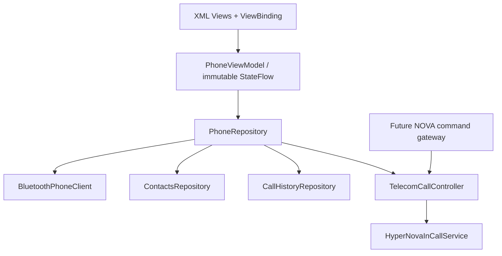

# HyperNova Phone architecture

The app owns its state and exposes no Launcher coupling or exported custom Binder service. `PhoneCommandGateway` is an internal boundary for a future versioned, signature-protected cockpit API. It validates and dispatches through Telecom; it never mutates UI state.

`BluetoothPhoneClient` uses only public APIs. The HFP/PBAP seams are intentionally represented by capability state until an AAOS platform adapter is supplied. Generic Bluetooth connection is never presented as phone-audio readiness.

`DrivingRestrictionsProvider` is intentionally deferred: standalone defaults to setup-safe UI and does not invent vehicle-speed data. An AAOS Car API/provider adapter should enforce pairing/search restrictions during integration.
