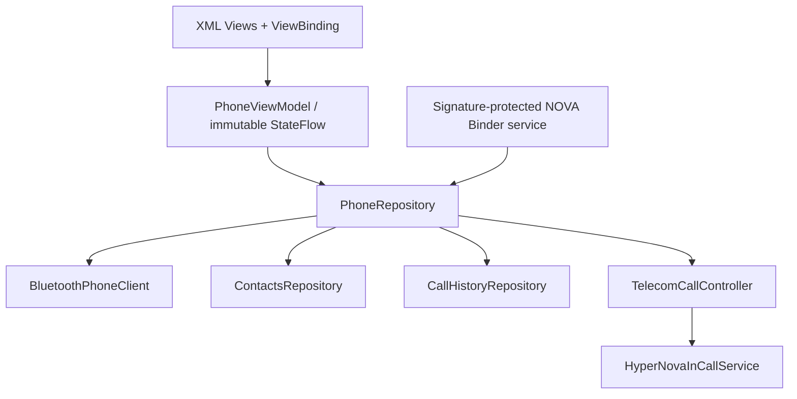

# HyperNova Phone architecture

The app owns its state and has no Launcher or HOME coupling. `PhoneCommandService` exposes the existing versioned, signature-protected NOVA contract and dispatches only through the same repository and Telecom authorities used by the UI.

`BluetoothPhoneClient` uses only public APIs. On NXP Standard Android, a call-capable `PhoneAccount` owned by `com.android.bluetooth.hfpclient.HfpClientConnectionService` is the authoritative HFP signal. A generic paired or connected Bluetooth device is never presented as phone-audio readiness. On HyperNova AAOS, the existing connectivity Binder remains the authoritative platform adapter.

Incoming calls are delivered by Telecom to `HyperNovaInCallService`, which opens only the standalone translucent `IncomingCallActivity` top bar while the call is incoming. Outgoing `DIALING`/`RINGING`, or an answered incoming call reaching `ACTIVE`, opens the full `MainActivity` call UI. UI state never advances to `ACTIVE` without a real Telecom callback.

Contacts and caller names come from `ContactsProvider`; recents come from `CallLog`. Debounced provider observers reload lists, invalidate positive identity caches, and re-resolve the current caller during PBAP batches. No fallback invents contacts or call history.

`DrivingRestrictionsProvider` is intentionally deferred: standalone defaults to setup-safe UI and does not invent vehicle-speed data. An AAOS Car API/provider adapter should enforce pairing/search restrictions during integration.
