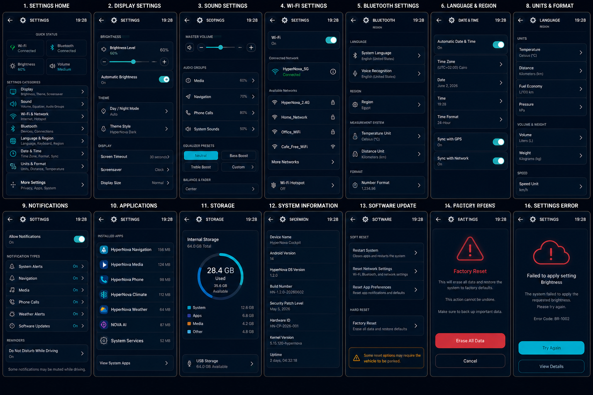

# HyperNova Cockpit — Task 09: Settings Android App

> **Project:** HyperNova Cockpit  
> **Task:** Task 09 — HyperNova Settings  
> **Application package:** `com.hypernova.settings`  
> **Target platform:** Custom AOSP / Android Automotive IVI image  
> **Orientation:** Portrait only  
> **Production baseline:** `1080 × 1920 px`, 9:16  
> **Reference board resolution:** `1536 × 1024 px`  
> **Implementation language:** Kotlin  
> **UI technology:** Android XML Views + ViewBinding  
> **Architecture:** Single Activity + MVVM + controller-based Android framework integration  
> **System integration:** Android Settings Provider, Display, Audio, Wi-Fi, Bluetooth, Locale, Storage, Package Manager, and Update/Reset services  
> **Data policy:** Real confirmed Android/system state only  
> **Status:** Ready for implementation  

---

# 1. Approved Visual Reference



The image above is the approved visual reference for Task 09.

It establishes the visual direction for these major Settings areas:

```text
1. Settings Home
2. Display Settings
3. Sound Settings
4. Wi-Fi Settings
5. Bluetooth Settings
6. Language & Region
7. Date & Time
8. Units & Format
9. Notifications
10. Applications
11. Storage
12. System Information
13. Software Update / Reset Options
14. Factory Reset Confirmation
15. Restricted While Driving
16. Settings Error
```

The supplied AI-generated reference contains a few label/header mismatches.  
The production implementation must use the corrected screen titles and information architecture defined in this README.

The implementation must preserve the same shared HyperNova visual language:

- Deep navy background.
- Cyan primary action color.
- Rounded dark cards.
- Thin blue-gray borders.
- White primary text.
- Muted gray-blue secondary text.
- Green confirmed/connected state.
- Amber pending/restricted state.
- Red destructive/error state.
- Large automotive-safe controls.
- Consistent margins and typography.
- Portrait 9:16 screen geometry.

All values visible in the reference image are examples only.

Production values must come from real Android and system services.

---

# 2. Product Definition

HyperNova Settings is the system-configuration application for the HyperNova Cockpit.

It manages device-level and system-level settings:

```text
Display
Brightness
Automatic Brightness
Theme and Day/Night Mode
Sound
Audio Groups
Wi-Fi
Bluetooth
Language
Region
Keyboard
Voice Language
Date and Time
Time Zone
Units and Formats
Notifications
Privacy and Permissions
Applications
Storage
System Information
Software Update
Reset Options
Factory Reset
Driving Restrictions
Settings Errors
```

This application owns **system defaults**.

Driver-specific preferences remain owned by:

```text
HyperNova Driver Profile
```

---

# 3. Settings vs Driver Profile

```text
HyperNova Settings
= Device and system configuration

HyperNova Driver Profile
= Personal driver preferences
```

Examples:

```text
Display brightness = Settings
Wi-Fi pairing = Settings
Bluetooth device management = Settings
System default units = Settings
Factory reset = Settings

Preferred climate temperature = Driver Profile
Preferred media source = Driver Profile
Personal Home and Work = Driver Profile
Personal language override = Driver Profile
```

Priority rule:

```text
Personal profile override exists
        |
        v
Use personal value

No profile override
        |
        v
Use system default
```

The Settings application must not read or write the Profile database directly.

It must communicate through the Profile Service.

---

# 4. Critical Confirmation Rule

A requested setting is not the same as a confirmed system setting.

Every editable setting follows:

```text
User changes setting
        |
        v
Validate request
        |
        v
Show requested value as pending
        |
        v
Send request through controller
        |
        v
Wait for Android/system callback
        |
        +--> Applied
        +--> Rejected
        +--> Timeout
        +--> Restart Required
        +--> Reboot Required
        |
        v
Update confirmed state
```

Example:

```text
Confirmed brightness: 60%
Requested brightness: 70%
```

While pending, show:

```text
Setting brightness to 70%…
Waiting for system confirmation
```

Do not replace the confirmed value before the framework confirms it.

This rule applies to:

- Brightness.
- Automatic brightness.
- Theme.
- Volume.
- Wi-Fi.
- Bluetooth.
- Language.
- Region.
- Date and time.
- Units.
- Notifications.
- Permissions.
- Software update.
- Reset operations.

---

# 5. Real Data Rule

The production application must never invent:

- Connected Wi-Fi network.
- Bluetooth device.
- Volume level.
- Brightness value.
- Language.
- Time zone.
- Storage size.
- Android version.
- Build ID.
- Security patch date.
- Installed applications.
- Application version.
- Software update state.
- Reset completion.
- Permission state.
- Service health.

Example values such as:

```text
HyperNova_5G
Ayman's Phone
60%
64 GB
Android 14
HyperNova OS 1.2.0
```

are visual examples only.

Production data must come from Android framework and approved HyperNova system services.

---

# 6. No Production Dummy Data

The release application must not contain:

```text
MockSettingsRepository
FakeWifiNetwork
DummyBluetoothDevice
HardcodedStorageState
StaticSystemInfo
DemoUpdateProgress
FakeBrightnessState
FakePermissionState
```

Test doubles are allowed only in:

```text
src/test/
src/androidTest/
```

When data is unavailable, show an honest state:

```text
Unavailable
Unable to read setting
Service not connected
No networks found
No devices found
Storage information unavailable
Update status unavailable
```

---

# 7. High-Level Architecture

```text
+---------------------- HyperNova Settings -----------------------+
|                                                                 |
|  SettingsActivity                                               |
|       |                                                         |
|       v                                                         |
|  SettingsNavHost                                                |
|       |                                                         |
|       v                                                         |
|  SettingsViewModel                                              |
|       |                                                         |
|       v                                                         |
|  SettingsRepository                                             |
|       |                                                         |
|       +--> DisplaySettingsController                            |
|       +--> AudioSettingsController                              |
|       +--> WifiSettingsController                               |
|       +--> BluetoothSettingsController                          |
|       +--> LocaleSettingsController                             |
|       +--> DateTimeSettingsController                           |
|       +--> UnitSettingsController                               |
|       +--> NotificationSettingsController                       |
|       +--> PrivacySettingsController                            |
|       +--> ApplicationSettingsController                        |
|       +--> StorageSettingsController                            |
|       +--> SystemInfoProvider                                   |
|       +--> SoftwareUpdateController                             |
|       +--> ResetController                                      |
|                                                                 |
|  HyperNovaSettingsService                                       |
|       |                                                         |
|       +--> Launcher summary                                     |
|       +--> Driver Profile adapter                               |
|       +--> NOVA AI adapter                                      |
|                                                                 |
|  VehicleUxRestrictionClient                                     |
+-----------------------------------------------------------------+
```

---

# 8. Main Components

| Component | Responsibility |
|---|---|
| `SettingsActivity` | Hosts the portrait application |
| `SettingsViewModel` | Exposes immutable UI state |
| `SettingsRepository` | Combines all controller states |
| `DisplaySettingsController` | Brightness, theme, timeout |
| `AudioSettingsController` | Media, navigation, call, AI, system volumes |
| `WifiSettingsController` | Wi-Fi state, scan, connect, forget |
| `BluetoothSettingsController` | Scan, pair, connect, disconnect, forget |
| `LocaleSettingsController` | Language, region, keyboard, voice language |
| `DateTimeSettingsController` | Automatic/manual date, time, timezone |
| `UnitSettingsController` | Temperature, distance, speed, pressure, wind |
| `NotificationSettingsController` | Notification categories and DND |
| `PrivacySettingsController` | Android permission and privacy summaries |
| `ApplicationSettingsController` | App info, cache, notifications |
| `StorageSettingsController` | Internal and USB storage |
| `SystemInfoProvider` | Product/build/kernel/version information |
| `SoftwareUpdateController` | Check, download, verify, install |
| `ResetController` | Safe reset operations |
| `HyperNovaSettingsService` | Protected cross-app API |
| `VehicleUxRestrictionClient` | Moving/parked restrictions |

---

# 9. Required Global States

```text
SETTINGS_LOADING
SETTINGS_READY
SETTING_APPLYING
SETTING_APPLIED
SETTING_REJECTED
SETTING_TIMEOUT
RESTART_REQUIRED
REBOOT_REQUIRED
SERVICE_STARTING
SERVICE_UNAVAILABLE
PERMISSION_DENIED
RESTRICTED_WHILE_DRIVING
ERROR
```

---

# 10. Shared HyperNova Design System

The application must use:

```text
hypernova-design-system
```

The shared module owns:

- Colors.
- Typography.
- Dimensions.
- Card shapes.
- Buttons.
- Sliders.
- Toggles.
- Icons.
- Loading states.
- Warning states.
- Error states.
- Automotive touch sizes.
- Animation timings.

The Settings developer must not redefine shared tokens locally.

---

# 11. Color System

| Token | Hex | Usage |
|---|---|---|
| `hn_background_primary` | `#020A13` | Main background |
| `hn_background_secondary` | `#06121F` | Secondary gradient |
| `hn_surface_primary` | `#071524` | Main cards |
| `hn_surface_secondary` | `#0B1B2C` | Elevated cards |
| `hn_surface_overlay` | `#102337` | Selected card/control |
| `hn_border_primary` | `#506174` | Main border |
| `hn_border_subtle` | `#293847` | Divider |
| `hn_primary_cyan` | `#25D9E8` | Main interaction |
| `hn_primary_cyan_pressed` | `#1FC2D0` | Pressed state |
| `hn_primary_cyan_dark` | `#0B8493` | Cyan glow |
| `hn_text_primary` | `#F5F7FA` | Main text |
| `hn_text_secondary` | `#A7B0BE` | Secondary text |
| `hn_text_disabled` | `#687486` | Disabled content |
| `hn_success` | `#39EA4B` | Applied / connected / healthy |
| `hn_warning` | `#F5A623` | Applying / restricted / restart |
| `hn_error` | `#FF5E68` | Error / reset / destructive action |
| `hn_white` | `#FFFFFF` | High-emphasis icon |
| `hn_transparent` | `#00000000` | Transparent |

## 11.1 Color Rules

- Cyan is the main interaction color.
- Green is used for connected, applied, up-to-date, and healthy states.
- Amber is used for applying, connecting, restricted, restart, and warning states.
- Red is used only for destructive actions, critical warnings, and real errors.
- Do not color an entire screen red, green, or amber.
- Keep the main background dark navy on every screen.
- Use red controls only for reset, forget, erase, and failure actions.

---

# 12. Screen Baseline and Dimensions

```text
Resolution: 1080 × 1920 px
Aspect ratio: 9:16
Orientation: Portrait
Logical baseline: approximately 540 × 960 dp
```

Recommended dimensions:

```text
Screen horizontal margin: 16dp
Header height: 56dp
Main section gap: 12dp
Main card radius: 22dp
Small card radius: 16dp
Card padding: 16dp
Settings row height: 64–72dp
Primary button height: 48dp
Minimum touch target: 48dp
Slider touch height: 48–56dp
Main system icon: 72–96dp
```

---

# 13. Typography

Use:

```text
Roboto
```

| Element | Size | Weight |
|---|---:|---|
| Header title | `18sp` | Medium |
| Header state | `9–10sp` | Medium |
| Settings row title | `14–16sp` | Medium |
| Settings row summary | `10–12sp` | Regular |
| Section title | `11–12sp` | Medium |
| Main status title | `22–28sp` | Medium |
| Body | `13sp` | Regular |
| Secondary | `10–11sp` | Regular |
| Button label | `12–13sp` | Medium |
| Slider value | `16–20sp` | Medium |

Rules:

- Use ellipsis for long network/device names.
- Do not shrink critical warnings.
- Keep current setting values visible.
- Do not use decorative fonts.

---

# 14. Icon System

Use:

```text
Material Symbols Rounded
```

Required icons:

```text
Back
Settings
Display
Brightness
Sound
Volume
Navigation Audio
Phone Audio
NOVA AI Audio
Wi-Fi
Hotspot
Bluetooth
Language
Region
Keyboard
Voice
Date
Time
Time Zone
Units
Temperature
Distance
Speed
Pressure
Notifications
Applications
Storage
USB
System Information
Software Update
Restart
Reset
Factory Reset
Lock
Warning
Error
Retry
More
Chevron
```

Rules:

- Same rounded outline style.
- Same stroke weight.
- Active icons use cyan.
- Connected/applied uses green.
- Restricted/pending uses amber.
- Destructive/error uses red.
- Every interactive icon needs a content description.

---

# 15. Shared Header

All screens use:

```text
Back
Settings icon
Screen title
State dot
Current time
```

Possible screen titles:

```text
SETTINGS
DISPLAY
SOUND
WI-FI
BLUETOOTH
LANGUAGE & REGION
DATE & TIME
UNITS & FORMAT
NOTIFICATIONS
APPLICATIONS
STORAGE
SYSTEM INFORMATION
SOFTWARE UPDATE
RESET OPTIONS
FACTORY RESET
```

Possible states:

```text
READY
CONNECTED
APPLYING
SCANNING
CONNECTING
UPDATED
RESTART REQUIRED
REBOOT REQUIRED
RESTRICTED
UNAVAILABLE
ERROR
```

---

# 16. Settings Row Design

Each standard row contains:

```text
Icon
Title
Current confirmed summary
Optional state chip
Chevron or direct control
```

Example:

```text
Wi-Fi
Connected to HyperNova_5G
Strong signal
>
```

Selected style:

```text
Cyan icon
Cyan border
Selected dark surface
```

Unavailable style:

```text
Disabled gray icon
Disabled gray text
Summary: Unavailable
```

---

# 17. Automotive Toggle Design

Enabled:

```text
Cyan track
White knob
ON text
```

Disabled:

```text
Dark gray track
Gray knob
OFF text
```

Pending:

```text
Confirmed toggle remains visible
Amber/cyan spinner
Requested state shown separately
```

Do not use tiny smartphone switches.

---

# 18. Screen 1 — Settings Home

Required content:

## 18.1 Quick Status

```text
Wi-Fi
Bluetooth
Brightness
Volume
```

Each quick-status card shows real current state.

## 18.2 Main Categories

```text
Display
Sound
Wi-Fi & Network
Bluetooth
Language & Region
Date & Time
Units & Format
More Settings
```

`More Settings` opens:

```text
Privacy
Notifications
Applications
Storage
System
Update
Reset
```

Every row includes:

- Icon.
- Title.
- Real summary.
- Chevron.

---

# 19. Screen 2 — Display Settings

Required controls:

```text
Brightness Level
Automatic Brightness
Day / Night Mode
Theme Style
Screen Timeout
Screensaver
Display Size
Text Size
Reduced Animations
```

## 19.1 Brightness

Display:

```text
Confirmed value
Requested value when pending
Slider
Minus
Plus
```

## 19.2 Theme

Initial production options:

```text
HyperNova Dark
Automatic Day/Night
```

Light theme may be omitted in the first release.

## 19.3 Pending Example

```text
Setting brightness to 70%…
Confirmed brightness: 60%
```

Do not animate the confirmed slider position early.

---

# 20. Screen 3 — Sound Settings

Required audio groups:

```text
Media
Navigation
Phone Calls
NOVA AI
System Sounds
```

Each group has an independent volume value.

Additional controls:

```text
Master Volume
Touch Sounds
Startup Sound
Speed-Adjusted Volume
Equalizer Presets
Balance
Fader
Audio Output
```

Equalizer presets may include:

```text
Neutral
Bass Boost
Treble Boost
Custom
```

Do not use one global volume value for all categories.

---

# 21. Screen 4 — Wi-Fi Settings

Required content:

```text
Wi-Fi On/Off
Connected Network
Available Networks
More Networks
Hotspot
Scan
Add Network
```

Connected network details:

```text
SSID
Connected state
Signal strength
Security type
IP information
Forget
Network details
```

Wi-Fi states:

```text
WIFI_OFF
SCANNING
NETWORKS_AVAILABLE
CONNECTING
CONNECTED
AUTHENTICATION_FAILED
NO_NETWORKS
ERROR
```

Do not show `Connected` before Android confirms network connectivity.

---

# 22. Wi-Fi Connecting and Error

Connecting state:

```text
Connecting to [SSID]…
Authenticating
Waiting for IP address
Checking Internet access
```

Progress states:

```text
Network found — Complete
Authentication — Applying
IP address — Waiting
Internet — Waiting
```

Error state:

```text
Unable to connect
Authentication failed
```

Actions:

```text
Try Again
Forget Network
Choose Another Network
```

---

# 23. Screen 5 — Bluetooth Settings

Required content:

```text
Bluetooth On/Off
This Device Name
Paired Devices
Available Devices
Scan
Pair
Connect
Disconnect
Forget
Device Details
Supported Profiles
```

Example profiles:

```text
Phone Calls
Contacts
Media Audio
Messages
```

Bluetooth states:

```text
BLUETOOTH_OFF
SCANNING
PAIRING
PAIRED
CONNECTING
CONNECTED
PAIRING_FAILED
CONNECTION_FAILED
```

The Settings app owns device management.

The Phone and Media apps own calling and playback behavior.

---

# 24. Screen 6 — Language & Region

Required settings:

```text
System Language
Region
Keyboard Languages
Voice Recognition Language
NOVA AI Language
Text Direction
Temperature Unit shortcut
Distance Unit shortcut
Number Format
```

Changing locale may require:

```text
Activity recreation
Service restart
System UI refresh
```

Possible state:

```text
Restart required
```

Do not show success until locale confirmation is received.

---

# 25. Screen 7 — Date & Time

Required settings:

```text
Automatic Date & Time
Automatic Time Zone
Time Zone
Date
Time
24-Hour Format
Sync with GPS
Sync with Network
```

When automatic mode is enabled:

- Manual date is disabled.
- Manual time is disabled.
- Manual timezone may be disabled according to policy.

Possible states:

```text
SYNCED
SYNCING
MANUAL
UNAVAILABLE
ERROR
```

Do not display fake synchronization success.

---

# 26. Screen 8 — Units & Format

Required categories:

```text
Temperature
Distance
Fuel Economy / Energy
Pressure
Volume
Weight
Speed
Wind
Rain
Number Format
```

Examples:

```text
Celsius
Kilometers
L/100 km
hPa
Liters
Kilograms
km/h
km/h
mm
1,234.56
```

Driver Profile may override personal unit preferences.

Display:

```text
System default
Profile override
```

where applicable.

---

# 27. Screen 9 — Notifications

Required controls:

```text
Allow Notifications
System Alerts
Navigation
Media
Phone Calls
Weather Alerts
Software Updates
NOVA AI
Do Not Disturb While Driving
```

Rules:

- Notification states come from Android notification framework.
- Critical safety alerts may follow product policy.
- Some notifications may be muted while driving.
- Do not create a separate notification framework.

---

# 28. Screen 10 — Applications

Required content:

```text
Installed HyperNova apps
App icon
App name
Version
Storage usage
Notification status
Permissions
Open details
```

Supported app details:

```text
Open App
Permissions
Notifications
Storage
Clear Cache
Force Stop when allowed
Disable when allowed
Uninstall when allowed
```

System-critical apps must show:

```text
System application
Cannot be uninstalled
```

Do not allow unsafe disabling of Launcher, Settings, or core services.

---

# 29. Screen 11 — Storage

Required content:

```text
Internal Storage
Used
Available
Total
System
Applications
Media
Offline Maps
Weather Cache
Temporary Cache
Other
USB Storage
```

Actions:

```text
Clear Safe Cache
Manage Offline Maps
Manage USB Storage
Review Large Files
```

Rules:

- Values come from real storage APIs.
- External USB state is real.
- Deletion requires confirmation.
- Do not delete personal media without explicit confirmation.
- Do not show missing categories as zero without explanation.

---

# 30. Screen 12 — System Information

Required values:

```text
Device Name
Product Name
Model
Android Version
HyperNova OS Version
Build Number
Build Type
Security Patch Level
Hardware ID
Architecture
Kernel Version
Launcher Version
NOVA AI Version
System Uptime
```

Rules:

- Read values from the real system.
- Mask sensitive identifiers.
- Do not hard-code build information in XML.
- Provide legal and open-source license links.

---

# 31. Screen 13 — Software Update

Required states:

```text
UPDATE_CHECKING
UP_TO_DATE
UPDATE_AVAILABLE
UPDATE_DOWNLOADING
UPDATE_VERIFYING
UPDATE_INSTALLING
REBOOT_REQUIRED
UPDATE_FAILED
```

Required information:

```text
Current version
Build ID
Security patch
Available version
Download size
Release notes
Download progress
Verification status
Installation status
Restart requirement
```

Rules:

- Never show fake progress.
- Never report success before package verification.
- Do not permit unsafe update interruption.
- Use the approved OTA/update service.

Actions:

```text
Check for Updates
Download
Pause
Resume
Install
Restart Later
Restart Now
View Release Notes
```

---

# 32. Screen 14 — Reset Options

Reset categories:

```text
Restart System
Reset Network Settings
Reset Bluetooth Devices
Reset App Preferences
Clear Guest Session
Reset Driver Profiles
Factory Reset
```

Each reset has an independent confirmation flow.

The reset page must separate:

```text
Soft Reset
Hard Reset
```

Soft reset examples:

```text
Restart System
Reset Network
Reset Bluetooth
Reset App Preferences
```

Hard reset:

```text
Factory Reset
```

---

# 33. Screen 15 — Factory Reset Confirmation

Required content:

```text
Factory Reset
This will erase all user data and restore factory defaults
This action cannot be undone
```

Data list:

```text
Driver profiles
Saved Wi-Fi networks
Bluetooth pairings
App settings
Offline maps
Saved locations
Cached media
Guest session data
```

Required safety flow:

```text
Vehicle parked
        |
        v
First confirmation
        |
        v
Data review
        |
        v
Second confirmation
        |
        v
Approved Android reset mechanism
```

Actions:

```text
Erase All Data
Cancel
```

Factory reset must not be implemented using direct file deletion.

---

# 34. Screen 16 — Settings Error

Required error screen:

```text
Failed to apply setting
[Setting name]
The system failed to apply the requested value
Error code
```

Actions:

```text
Try Again
View Details
Return to Settings
```

The last confirmed setting remains active.

Use red only for:

- Error icon.
- Error title.
- Error code/status.

Do not color the whole screen red.

---

# 35. Restricted While Driving

The visual system must also support:

```text
Setting unavailable while driving
Park the vehicle to change this setting
```

Restricted examples:

```text
Wi-Fi password entry
Bluetooth pairing
Forget device
Language changes
Manual date and time
Permission changes
Profile reset
Factory reset
Complex update confirmation
```

Allowed while driving may include:

```text
Brightness
Audio groups
Simple safe toggles
View connection status
View system information
```

Use `VehicleUxRestrictionClient`.

---

# 36. Settings State Model

```kotlin
data class SystemSettingsState(
    val display: DisplaySettingsState,
    val audio: AudioSettingsState,
    val wifi: WifiSettingsState,
    val bluetooth: BluetoothSettingsState,
    val locale: LocaleSettingsState,
    val dateTime: DateTimeSettingsState,
    val units: UnitSettingsState,
    val notifications: NotificationSettingsState,
    val privacy: PrivacySettingsState,
    val applications: ApplicationSettingsState,
    val storage: StorageState,
    val systemInfo: SystemInfoState,
    val update: SoftwareUpdateState,
    val pendingOperation: SettingsOperation?,
    val updatedAtEpochMillis: Long
)
```

---

# 37. Setting Operation Model

```kotlin
data class SettingsOperation(
    val id: String,
    val category: SettingsCategory,
    val key: String,
    val requestedValue: String?,
    val confirmedValue: String?,
    val status: SettingsOperationStatus,
    val startedAtEpochMillis: Long,
    val errorCode: String?
)
```

Statuses:

```text
REQUESTED
VALIDATING
APPLYING
APPLIED
REJECTED
TIMEOUT
RESTART_REQUIRED
REBOOT_REQUIRED
FAILED
```

---

# 38. Controller Interfaces

Base read-only controller:

```kotlin
interface SettingsController<T> {
    val state: StateFlow<T>
    suspend fun refresh(): Result<T>
}
```

Writable controller pattern:

```kotlin
interface MutableSettingsController<T, C> : SettingsController<T> {
    suspend fun apply(command: C): SettingsCommandResult
}
```

Controllers:

```text
DisplaySettingsController
AudioSettingsController
WifiSettingsController
BluetoothSettingsController
LocaleSettingsController
DateTimeSettingsController
UnitSettingsController
NotificationSettingsController
PrivacySettingsController
ApplicationSettingsController
StorageSettingsController
SoftwareUpdateController
ResetController
```

---

# 39. HyperNova Settings Service

Service:

```text
com.hypernova.settings.service.HyperNovaSettingsService
```

Contracts:

```text
ISettingsService
ISettingsCallback
SettingsSummary
SettingsCommand
SettingsCommandResult
```

Required safe methods:

```text
getApiVersion()
getServiceVersion()
getCurrentSummary()
registerCallback()
unregisterCallback()

setBrightness()
setVolumeGroup()
setWifiEnabled()
setBluetoothEnabled()
setTemperatureUnit()
setDistanceUnit()

openSettings()
openWifiSettings()
openBluetoothSettings()
openDisplaySettings()
openSoundSettings()
checkForUpdates()
```

Dangerous operations must not be exposed as direct one-step voice commands.

---

# 40. Launcher Integration

The Launcher Settings card receives:

```text
Wi-Fi state
Bluetooth state
Display mode
Sound availability
Settings availability
Restart required
Update available
```

Flow:

```text
HyperNovaSettingsService
        |
        v
Launcher Settings Card
```

The Launcher must not directly read Android system settings.

---

# 41. Driver Profile Integration

Driver Profile may request personal preferences:

```text
Language
Units
Theme
Display preference
```

Flow:

```text
Driver Profile
        |
        v
ProfileSettingsAdapter
        |
        v
HyperNovaSettingsService
        |
        v
Real system result
```

The Settings app must return:

```text
APPLIED
UNSUPPORTED
UNAVAILABLE
FAILED
RESTART_REQUIRED
```

---

# 42. NOVA AI Integration

Safe commands:

```text
Increase screen brightness
Decrease screen brightness
Set media volume to 60 percent
Set navigation volume to 70 percent
Turn on Wi-Fi
Turn off Wi-Fi
Turn on Bluetooth
Turn off Bluetooth
Use Celsius
Use metric units
Open Settings
Open Wi-Fi Settings
Open Bluetooth Settings
Check for software updates
```

Restricted commands:

```text
Forget Wi-Fi network
Forget Bluetooth device
Change permissions
Reset network settings
Delete driver profiles
Factory reset
```

For destructive actions, NOVA AI must respond:

```text
This action must be completed manually while parked.
```

---

# 43. IPC Security

Use a signature-level permission:

```xml
<permission
    android:name="com.hypernova.permission.ACCESS_COCKPIT_SERVICES"
    android:protectionLevel="signature" />
```

Service declaration:

```xml
<service
    android:name=".service.HyperNovaSettingsService"
    android:exported="true"
    android:permission="com.hypernova.permission.ACCESS_COCKPIT_SERVICES">
    <intent-filter>
        <action android:name="com.hypernova.action.BIND_SETTINGS_SERVICE" />
    </intent-filter>
</service>
```

Rules:

- Validate callers.
- Validate setting keys.
- Validate ranges.
- Reject unsupported commands.
- Restrict destructive operations.
- Do not expose provider secrets.
- Do not export debug services in release builds.

---

# 44. Contract Versioning

Expose:

```text
getApiVersion()
getServiceVersion()
```

Recommended:

```text
HyperNova Settings API version: 1
```

On mismatch:

- Reject unsupported custom commands.
- Keep local Settings UI usable.
- Publish incompatible-service state.
- Log mismatch.
- Do not use unsafe fallback values.

---

# 45. Android Permissions and Privileged Access

Possible requirements include:

```text
android.permission.WRITE_SETTINGS
android.permission.CHANGE_WIFI_STATE
android.permission.ACCESS_WIFI_STATE
android.permission.NEARBY_WIFI_DEVICES
android.permission.BLUETOOTH_CONNECT
android.permission.BLUETOOTH_SCAN
android.permission.PACKAGE_USAGE_STATS
android.permission.QUERY_ALL_PACKAGES
android.permission.REQUEST_DELETE_PACKAGES
android.permission.POST_NOTIFICATIONS
android.permission.REBOOT
android.permission.MASTER_CLEAR
```

Some operations require:

- System-app installation.
- Platform signing.
- Privileged permissions.
- Device-owner or system service integration.
- SELinux policy.
- Product-specific framework modifications.

Every privileged requirement must be documented.

---

# 46. Manifest

```xml
<activity
    android:name=".SettingsActivity"
    android:exported="true"
    android:screenOrientation="portrait">
    <intent-filter>
        <action android:name="android.intent.action.MAIN" />
        <category android:name="android.intent.category.LAUNCHER" />
    </intent-filter>
</activity>
```

Settings Service:

```xml
<service
    android:name=".service.HyperNovaSettingsService"
    android:exported="true"
    android:permission="com.hypernova.permission.ACCESS_COCKPIT_SERVICES">
    <intent-filter>
        <action android:name="com.hypernova.action.BIND_SETTINGS_SERVICE" />
    </intent-filter>
</service>
```

---

# 47. Recommended Project Structure

```text
app/src/main/java/com/hypernova/settings/
|
+-- SettingsActivity.kt
|
+-- ui/
|   +-- SettingsViewModel.kt
|   +-- SettingsUiState.kt
|   +-- SettingsUiEvent.kt
|   +-- home/
|   +-- display/
|   +-- sound/
|   +-- wifi/
|   +-- bluetooth/
|   +-- language/
|   +-- datetime/
|   +-- units/
|   +-- notifications/
|   +-- privacy/
|   +-- applications/
|   +-- storage/
|   +-- systeminfo/
|   +-- update/
|   +-- reset/
|   +-- error/
|
+-- repository/
|   +-- SettingsRepository.kt
|   +-- SettingsRepositoryImpl.kt
|
+-- controller/
|   +-- DisplaySettingsController.kt
|   +-- AudioSettingsController.kt
|   +-- WifiSettingsController.kt
|   +-- BluetoothSettingsController.kt
|   +-- LocaleSettingsController.kt
|   +-- DateTimeSettingsController.kt
|   +-- UnitSettingsController.kt
|   +-- NotificationSettingsController.kt
|   +-- PrivacySettingsController.kt
|   +-- ApplicationSettingsController.kt
|   +-- StorageSettingsController.kt
|   +-- SoftwareUpdateController.kt
|   +-- ResetController.kt
|
+-- service/
|   +-- HyperNovaSettingsService.kt
|   +-- SettingsStatePublisher.kt
|
+-- model/
|   +-- SystemSettingsState.kt
|   +-- DisplaySettingsState.kt
|   +-- AudioSettingsState.kt
|   +-- WifiSettingsState.kt
|   +-- BluetoothSettingsState.kt
|   +-- LocaleSettingsState.kt
|   +-- DateTimeSettingsState.kt
|   +-- UnitSettingsState.kt
|   +-- NotificationSettingsState.kt
|   +-- StorageState.kt
|   +-- SystemInfoState.kt
|   +-- SoftwareUpdateState.kt
|   +-- SettingsOperation.kt
|
+-- integration/
|   +-- NovaAiSettingsAdapter.kt
|   +-- ProfileSettingsAdapter.kt
|   +-- VehicleUxRestrictionClient.kt
|
+-- util/
    +-- UiText.kt
    +-- Result.kt
    +-- SettingsValidator.kt
    +-- UnitFormatter.kt
```

---

# 48. Recommended Layout Files

```text
activity_settings.xml
fragment_settings_home.xml
fragment_display_settings.xml
fragment_sound_settings.xml
fragment_wifi_settings.xml
fragment_bluetooth_settings.xml
fragment_language_region.xml
fragment_date_time.xml
fragment_units_format.xml
fragment_notifications.xml
fragment_privacy_permissions.xml
fragment_applications.xml
fragment_storage.xml
fragment_system_information.xml
fragment_software_update.xml
fragment_reset_options.xml
fragment_factory_reset.xml
fragment_settings_error.xml
fragment_restricted_setting.xml

view_settings_header.xml
row_settings_category.xml
row_settings_value.xml
row_settings_toggle.xml
view_automotive_slider.xml
card_quick_status.xml
card_connected_network.xml
row_wifi_network.xml
row_bluetooth_device.xml
row_audio_group.xml
row_storage_category.xml
row_installed_application.xml
view_state_applying.xml
view_state_restart_required.xml
view_state_service_unavailable.xml
```

---

# 49. Suggested View IDs

## Header

```text
btnBack
ivSettingsLogo
tvSettingsTitle
tvSettingsState
viewSettingsStatusDot
tvCurrentTime
```

## Home

```text
cardWifiStatus
cardBluetoothStatus
cardBrightnessStatus
cardVolumeStatus
rvSettingsCategories
```

## Display

```text
brightnessSlider
tvConfirmedBrightness
tvRequestedBrightness
switchAutomaticBrightness
rowDayNightMode
rowThemeStyle
rowScreenTimeout
rowScreensaver
rowDisplaySize
```

## Sound

```text
masterVolumeSlider
mediaVolumeSlider
navigationVolumeSlider
phoneVolumeSlider
novaAiVolumeSlider
systemVolumeSlider
rowEqualizer
rowBalanceFader
```

## Wi-Fi

```text
switchWifi
cardConnectedNetwork
rvAvailableNetworks
btnScanNetworks
btnAddNetwork
```

## Bluetooth

```text
switchBluetooth
rvPairedDevices
rvAvailableDevices
btnScanDevices
btnRenameDevice
```

## Storage

```text
storageUsageChart
tvStorageUsed
tvStorageAvailable
rvStorageCategories
cardUsbStorage
btnClearSafeCache
```

## Update

```text
tvCurrentVersion
tvAvailableVersion
updateProgress
btnCheckUpdate
btnDownloadUpdate
btnInstallUpdate
btnRestartNow
```

## Reset

```text
rowRestartSystem
rowResetNetwork
rowResetBluetooth
rowResetAppPreferences
rowClearGuest
rowResetProfiles
rowFactoryReset
btnEraseAllData
```

---

# 50. Error Handling

Required cases:

```text
Settings service unavailable
Brightness apply failed
Audio apply failed
Wi-Fi authentication failed
Wi-Fi service unavailable
Bluetooth pairing failed
Bluetooth service unavailable
Locale apply failed
Date/time sync failed
Invalid unit value
Permission denied
Storage read failed
Package manager unavailable
Update server unavailable
Update verification failed
Update installation failed
Reset rejected
Factory reset unavailable
Operation timeout
API version mismatch
```

Every error maps to:

```text
Readable message
Internal error code
Recovery action
Next valid state
```

Never show raw framework exceptions.

---

# 51. Logging

Use tags:

```text
HN-Settings
HN-DisplaySettings
HN-AudioSettings
HN-WifiSettings
HN-BluetoothSettings
HN-LocaleSettings
HN-DateTimeSettings
HN-UnitSettings
HN-AppSettings
HN-StorageSettings
HN-SoftwareUpdate
HN-Reset
HN-SettingsService
```

Log:

- Setting request.
- Confirmed result.
- Rejection.
- Timeout.
- Restart/reboot requirement.
- Wi-Fi state.
- Bluetooth state.
- Update state.
- Reset state.
- Service connection.
- Version mismatch.
- Error code.

Do not log:

- Wi-Fi passwords.
- Bluetooth authentication data.
- Sensitive device identifiers.
- Full permission history.
- Update credentials.
- Private network configuration.

---

# 52. Performance Requirements

- Do not block the main thread.
- Use coroutines and `StateFlow`.
- Use framework callbacks instead of aggressive polling.
- Serialize conflicting operations.
- Prevent duplicate apply requests.
- Stop Wi-Fi/Bluetooth scans when not needed.
- Cache system information safely.
- Handle Binder death.
- Release listeners.
- Avoid stale callbacks.
- Keep update progress real.
- Do not continuously recalculate storage totals.

---

# 53. Accessibility and Automotive UX

- Minimum touch target: `48dp`.
- Settings rows: `64–72dp`.
- Large sliders.
- Large toggles.
- Text and icons together.
- Do not rely only on color.
- Keep current value visible.
- Keep pending value separate.
- Keep destructive actions separated.
- No long press for primary actions.
- No multi-touch requirement.
- Avoid deep nested menus.
- Avoid tiny checkboxes.
- Keep restricted reason visible.
- Keep restart/reboot requirement visible.

---

# 54. Animation Rules

| Animation | Duration |
|---|---:|
| Row press | `100ms` |
| Toggle transition | `160ms` after confirmation |
| Slider confirmation | `160–220ms` |
| State crossfade | `160–220ms` |
| Connecting spinner | Continuous, subtle |
| Success pulse | `500–700ms` |
| Warning pulse | `350–500ms` |
| Error pulse | `350–500ms` |

Rules:

- Do not animate confirmed values before confirmation.
- No rapid flashing.
- Pause hidden animations.
- Respect reduced-animation settings.

---

# 55. Testing Requirements

## Display

- Brightness increase/decrease.
- Automatic brightness.
- Theme.
- Timeout.
- Pending/rejected/timeout.

## Sound

- Every audio group.
- Mute.
- Equalizer.
- Balance/fader.
- Concurrent audio update.

## Wi-Fi

- Off.
- Scan.
- Connect.
- Authentication failure.
- Disconnect.
- Forget.
- No networks.
- Service unavailable.

## Bluetooth

- Off.
- Scan.
- Pair.
- Connect.
- Disconnect.
- Forget.
- Supported profiles.
- Pairing failure.

## Locale and Time

- Language.
- Region.
- Keyboard.
- Voice language.
- Automatic date/time.
- Manual time.
- Time zone.
- Restart required.

## Units

- Every unit category.
- Driver Profile override.
- Persistence.
- Invalid value.

## Notifications and Apps

- Notification category state.
- App details.
- System app restrictions.
- Clear cache.
- Permission summary.

## Storage

- Internal storage.
- USB storage.
- Cache cleanup.
- Low storage.
- Critical storage.
- Missing storage service.

## Update

- Up to date.
- Available.
- Download.
- Pause/resume.
- Verify.
- Install.
- Reboot required.
- Failure.

## Reset

- Restart.
- Network reset.
- Bluetooth reset.
- App preference reset.
- Guest clear.
- Profile reset.
- Factory reset confirmation.
- Driving restriction.

## Integration

- Launcher summary update.
- Profile settings apply.
- NOVA AI safe commands.
- Restricted voice actions.
- Service reconnect.
- Version mismatch.

## Visual

- All required screens match the reference language.
- Correct titles are used.
- No clipped text.
- No overlap.
- 9:16 portrait fit.
- Touch targets meet size.
- Error and destructive states are clear.
- No stock Settings appearance.

---

# 56. Development Order

```text
1. Freeze package name and Settings contracts
2. Import HyperNova design system
3. Create Android project and dark theme
4. Build common Header
5. Build Settings Home
6. Build Display Settings
7. Build Sound Settings
8. Build Wi-Fi Settings
9. Build Bluetooth Settings
10. Build Language & Region
11. Build Date & Time
12. Build Units & Format
13. Build Notifications
14. Build Privacy & Permissions
15. Build Applications
16. Build Storage
17. Build System Information
18. Build Software Update
19. Build Reset Options
20. Build Factory Reset Confirmation
21. Build Restricted and Error states
22. Implement settings models
23. Implement SettingsRepository
24. Implement Display controller
25. Implement Audio controller
26. Implement Wi-Fi controller
27. Implement Bluetooth controller
28. Implement Locale controller
29. Implement Date/Time controller
30. Implement Units controller
31. Implement Notifications controller
32. Implement Privacy controller
33. Implement Applications controller
34. Implement Storage controller
35. Implement SystemInfo provider
36. Implement SoftwareUpdate controller
37. Implement Reset controller
38. Implement HyperNovaSettingsService
39. Integrate Launcher
40. Integrate Driver Profile
41. Integrate NOVA AI
42. Add IPC security
43. Add contract versioning
44. Add driving restrictions
45. Test all settings and states
46. Build debug and release APKs
47. Integrate into AOSP image
48. Validate on target portrait display
```

---

# 57. Required Deliverables

```text
1. Complete Android Studio project
2. Source code
3. HyperNova design-system version
4. IPC-contract version
5. Settings Home
6. Display Settings
7. Sound Settings
8. Wi-Fi Settings
9. Wi-Fi error/connecting states
10. Bluetooth Settings
11. Language & Region
12. Date & Time
13. Units & Format
14. Notifications
15. Privacy & Permissions
16. Applications
17. Storage
18. System Information
19. Software Update
20. Reset Options
21. Factory Reset Confirmation
22. Restricted state
23. Settings Error
24. SettingsRepository
25. Display controller
26. Audio controller
27. Wi-Fi controller
28. Bluetooth controller
29. Locale controller
30. Date/Time controller
31. Units controller
32. Notifications controller
33. Privacy controller
34. Applications controller
35. Storage controller
36. SystemInfo provider
37. SoftwareUpdate controller
38. Reset controller
39. Settings Service
40. Launcher integration
41. Driver Profile integration
42. NOVA AI integration
43. IPC security
44. Driving restrictions
45. Debug APK
46. Release APK
47. State screenshots
48. Settings test report
49. Wi-Fi/Bluetooth test report
50. Update test report
51. Reset safety test report
52. Permission/security notes
53. AOSP integration notes
54. Updated final README
```

Suggested APK names:

```text
HyperNovaSettings-debug.apk
HyperNovaSettings-release.apk
```

---

# 58. Definition of Done

## Visual

- [ ] UI matches the approved reference language.
- [ ] Correct production titles are used.
- [ ] HyperNova colors are used.
- [ ] Header is consistent.
- [ ] Rows, sliders, and toggles are consistent.
- [ ] Touch targets meet `48dp`.
- [ ] Destructive actions are clearly separated.
- [ ] Factory Reset is not a one-tap action.
- [ ] Restricted state is clear.
- [ ] No clipped text.
- [ ] No overlapping controls.
- [ ] No stock Android Settings styling.

## Architecture

- [ ] Package is `com.hypernova.settings`.
- [ ] No production dummy data exists.
- [ ] SettingsRepository exists.
- [ ] All required controllers exist.
- [ ] Confirmed and requested states are separate.
- [ ] Applying/rejected/timeout are handled.
- [ ] Restart/reboot requirements are handled.
- [ ] Wi-Fi uses Android Wi-Fi framework.
- [ ] Bluetooth uses Android Bluetooth stack.
- [ ] Locale uses approved system mechanism.
- [ ] System Info is read dynamically.
- [ ] Update progress is real.
- [ ] Factory reset uses approved Android mechanism.
- [ ] Version mismatch is handled.
- [ ] Binder death is handled.

## Integration

- [ ] Launcher receives real summary.
- [ ] Driver Profile overrides are handled.
- [ ] NOVA AI safe commands work.
- [ ] Destructive voice commands are blocked.
- [ ] Driving restrictions are applied.
- [ ] IPC is protected.

## Delivery

- [ ] Debug APK generated.
- [ ] Release APK generated.
- [ ] State screenshots included.
- [ ] Test reports included.
- [ ] Security/permission notes included.
- [ ] AOSP integration notes included.
- [ ] Final README updated.

---

# 59. Questions and Answers

## Is Settings the same as Driver Profile?

No. Settings owns device defaults. Driver Profile owns personal preferences.

## Can the UI show a requested setting immediately?

It may show it as requested, but the confirmed value must remain until the framework confirms the change.

## Can Launcher read Android settings directly?

No. It receives a summary through `HyperNovaSettingsService`.

## Can NOVA AI perform Factory Reset?

No. Destructive operations must be completed manually while parked.

## Who owns Wi-Fi pairing?

HyperNova Settings through the Android Wi-Fi framework.

## Who owns Bluetooth pairing?

HyperNova Settings through the Android Bluetooth stack.

## Who owns calls and Bluetooth media playback?

Phone and Media applications.

## Can system information be hard-coded?

No.

## Can Factory Reset use `rm -rf`?

No. It must use the approved Android reset mechanism.

## What is the most important rule?

Never show a setting, connection, update, restart, reset, or system value as confirmed before the real Android/system service confirms it.

---

# 60. Final Instruction

Build HyperNova Settings as the production system-configuration manager for the cockpit.

The final result must combine:

```text
Shared HyperNova design
+
Real Android framework state
+
Controller-based architecture
+
Display and audio control
+
Wi-Fi and Bluetooth management
+
Locale, date/time, and units
+
Notifications and permissions
+
Applications and storage
+
System information
+
Software update
+
Safe reset flows
+
Launcher integration
+
Driver Profile integration
+
NOVA AI integration
+
Automotive restrictions
```

Do not add fake system data, direct system-file modification, unsafe reset behavior, unconfirmed setting success, or unprotected IPC without an approved architecture change.
