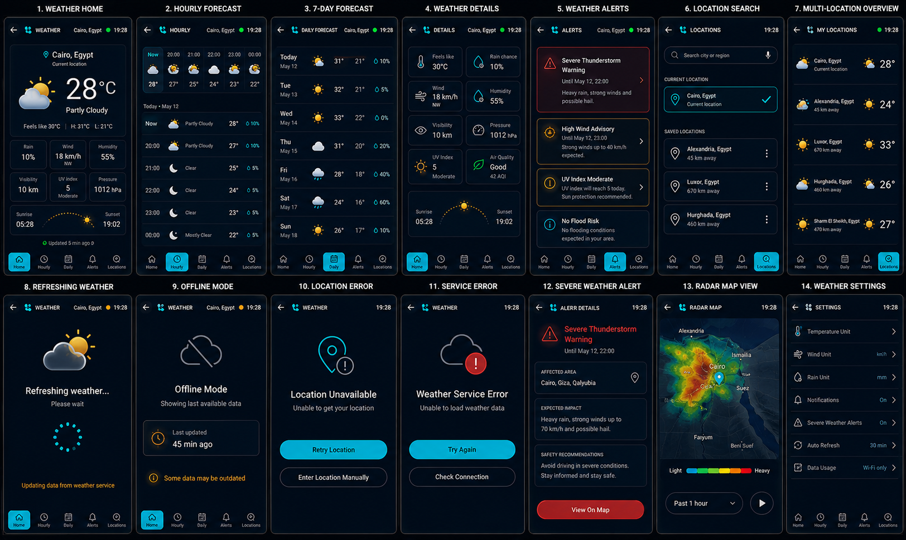

# HyperNova Cockpit — Task 07: Weather Android App

> **Project:** HyperNova Cockpit  
> **Task:** Task 07 — HyperNova Weather  
> **Application package:** `com.hypernova.weather`  
> **Target platform:** Custom AOSP / Android Automotive IVI image  
> **Orientation:** Portrait only  
> **Production baseline:** `1080 × 1920 px`, 9:16  
> **Reference board resolution:** `1624 × 969 px`  
> **Implementation language:** Kotlin  
> **UI technology:** Android XML Views + ViewBinding  
> **Architecture:** Single Activity + MVVM + Repository + Weather Provider abstraction + local cache  
> **Primary location source:** Current vehicle location  
> **Data policy:** Real location, forecast, alert, and update-time data only  
> **Offline policy:** Last confirmed cached data with explicit age and stale state  
> **Status:** Ready for implementation  

---

# 1. Approved Visual Reference



The image above is the approved visual reference for Task 07.

It defines these 14 required screens and states:

```text
1. WEATHER HOME
2. HOURLY FORECAST
3. 7-DAY FORECAST
4. WEATHER DETAILS
5. WEATHER ALERTS
6. LOCATION SEARCH
7. MULTI-LOCATION OVERVIEW
8. REFRESHING WEATHER
9. OFFLINE MODE
10. LOCATION ERROR
11. SERVICE ERROR
12. SEVERE WEATHER ALERT
13. RADAR MAP VIEW
14. WEATHER SETTINGS
```

The implementation must preserve the same shared visual language across every screen:

- Same dark navy background.
- Same header geometry.
- Same bottom navigation.
- Same cyan active state.
- Same card radius.
- Same border thickness.
- Same icon family.
- Same text hierarchy.
- Same automotive touch-target rules.
- Same 9:16 portrait layout.
- Same weather-condition illustration style.
- Same data freshness and alert behavior.

The values shown in the visual reference, such as `Cairo, Egypt`, `28°C`, `18 km/h`, `1012 hPa`, `45 min ago`, and the listed cities and alerts, are visual examples only.

Production code must use real data.

---

# 2. Product Definition

HyperNova Weather is a production automotive weather and forecast application.

It is responsible for:

```text
Current vehicle location
Current weather
Current temperature
Feels-like temperature
Daily high and low
Hourly forecast
Seven-day forecast
Humidity
Wind speed and direction
Rain probability
Visibility
Air pressure
UV index
Air quality
Sunrise and sunset
Weather alerts
Severe alert details
Saved locations
Multi-location overview
Radar map
Offline cached weather
Weather settings
Launcher integration
NOVA AI integration
```

The application is not a smartphone weather widget.

It is designed for:

- Large portrait IVI display.
- Fast glanceability.
- Real vehicle location.
- Real update timestamps.
- Clear stale/offline behavior.
- Driver-safe alert presentation.
- Consistent HyperNova design.

---

# 3. Core Product Rule

The source of truth must be:

```text
Real location
+
Real weather provider response
+
Real cached response
+
Real update timestamp
```

The app must never invent:

- Location.
- Temperature.
- Weather condition.
- Forecast.
- Rain probability.
- Wind speed.
- Air quality.
- UV index.
- Alert.
- Radar frame.
- Data freshness.
- Last-update time.

If live data is unavailable:

```text
Show real cached data
+
Show exact cache age
+
Mark it as offline/stale
```

If no cached data exists:

```text
Show no-data or service-error state
```

---

# 4. No Production Dummy Data

The production application must not contain:

```text
MockWeatherRepository
FakeWeatherProvider
DummyLocationProvider
HardcodedForecast
StaticWeatherAlert
FakeRadarLayer
DemoWeatherCache
FakeUpdatedTime
```

Test doubles are allowed only in:

```text
src/test/
src/androidTest/
```

When data is missing, show honest states:

```text
Current weather unavailable
Hourly forecast unavailable
Daily forecast unavailable
Air quality unavailable
Radar unavailable
No saved locations
Location unavailable
Weather service unavailable
```

Do not display zero values for missing fields.

---

# 5. High-Level Architecture

```text
+--------------------- HyperNova Weather App ---------------------+
|                                                                 |
|  WeatherActivity                                                |
|       |                                                         |
|       v                                                         |
|  WeatherNavHost                                                 |
|       |                                                         |
|       v                                                         |
|  WeatherViewModel                                               |
|       |                                                         |
|       v                                                         |
|  WeatherRepository                                              |
|       |                                                         |
|       +--> VehicleLocationProvider                              |
|       +--> WeatherProvider                                      |
|       +--> WeatherAlertProvider                                 |
|       +--> RadarProvider                                        |
|       +--> WeatherCache                                         |
|       +--> SavedLocationRepository                              |
|                                                                 |
|  HyperNovaWeatherService                                        |
|       |                                                         |
|       +--> Launcher state publisher                             |
|       +--> NOVA AI command/query adapter                        |
+-----------------------------------------------------------------+
```

---

# 6. Main Components

| Component | Responsibility |
|---|---|
| `WeatherActivity` | Hosts the portrait application |
| `WeatherViewModel` | Exposes immutable UI state |
| `WeatherRepository` | Combines live, cached, alert, and location data |
| `VehicleLocationProvider` | Provides current vehicle location |
| `WeatherProvider` | Retrieves current and forecast data |
| `WeatherAlertProvider` | Retrieves active weather alerts |
| `RadarProvider` | Retrieves radar tiles/frames |
| `WeatherCache` | Stores last confirmed responses |
| `SavedLocationRepository` | Stores user-saved cities |
| `HyperNovaWeatherService` | Exposes summary state to Launcher and NOVA AI |
| `WeatherRefreshManager` | Applies refresh and freshness policies |
| `WeatherFormatter` | Formats units and times |
| `VehicleUxRestrictionClient` | Applies moving/parked restrictions |

---

# 7. Provider Abstraction

Do not couple the UI directly to one weather vendor.

Required interfaces:

```kotlin
interface WeatherProvider {
    suspend fun getCurrentWeather(location: GeoPoint, units: WeatherUnits): Result<CurrentWeather>
    suspend fun getHourlyForecast(location: GeoPoint, units: WeatherUnits): Result<List<HourlyForecast>>
    suspend fun getDailyForecast(location: GeoPoint, units: WeatherUnits): Result<List<DailyForecast>>
}

interface WeatherAlertProvider {
    suspend fun getActiveAlerts(location: GeoPoint): Result<List<WeatherAlert>>
}

interface RadarProvider {
    suspend fun getRadarFrames(bounds: GeoBounds, timeRange: RadarTimeRange): Result<List<RadarFrame>>
}
```

The repository selects the active provider.

The UI must not use vendor-specific models.

---

# 8. Location Architecture

```text
Weather UI
    |
    v
VehicleLocationProvider
    |
    +--> Android location service
    +--> Vehicle GNSS source
    +--> Last known approved location
```

Location states:

```text
AVAILABLE
SEARCHING
DEGRADED
UNAVAILABLE
PERMISSION_REQUIRED
PERMISSION_DENIED
```

Rules:

- Do not invent a location.
- Do not show `Cairo` unless the location provider or user selection confirms it.
- Last-known location must be clearly labeled.
- Manual location search is allowed when current location is unavailable.
- Current vehicle location remains distinct from saved locations.

---

# 9. Weather Data Freshness

Required freshness states:

```text
LIVE
JUST_UPDATED
REFRESHING
CACHED
STALE
EXPIRED
UNAVAILABLE
```

Recommended policy:

```text
0–15 minutes     -> Fresh
15–60 minutes    -> Cached / usable
1–3 hours        -> Stale warning
More than 3 hours -> Expired, policy dependent
```

The exact thresholds must be configurable.

Every cached screen must show:

```text
Last updated [real age]
```

Do not hide stale age.

---

# 10. Required Application States

## 10.1 Global

```text
LOADING
READY
REFRESHING
OFFLINE_CACHED
NO_DATA
PARTIAL_DATA
ERROR
```

## 10.2 Location

```text
LOCATION_AVAILABLE
LOCATION_SEARCHING
LOCATION_UNAVAILABLE
LOCATION_PERMISSION_REQUIRED
LOCATION_PERMISSION_DENIED
INVALID_LOCATION
```

## 10.3 Provider

```text
SERVICE_AVAILABLE
SERVICE_TIMEOUT
SERVICE_RATE_LIMITED
SERVICE_UNAVAILABLE
NETWORK_UNAVAILABLE
```

## 10.4 Alerts

```text
NO_ALERTS
ADVISORY
WARNING
SEVERE
CRITICAL
EXPIRED
```

## 10.5 Radar

```text
RADAR_LOADING
RADAR_READY
RADAR_PLAYING
RADAR_PAUSED
RADAR_UNAVAILABLE
```

---

# 11. Shared HyperNova Design System

The application must use:

```text
hypernova-design-system
```

The shared module owns:

- Colors.
- Typography.
- Dimensions.
- Card shapes.
- Buttons.
- Icons.
- Loading indicators.
- Alert styles.
- Error styles.
- Automotive touch sizes.
- Animation timings.

The Weather developer must not redefine shared values locally.

---

# 12. Color System

| Token | Hex | Usage |
|---|---|---|
| `hn_background_primary` | `#020A13` | Main background |
| `hn_background_secondary` | `#06121F` | Secondary gradient |
| `hn_surface_primary` | `#071524` | Main cards |
| `hn_surface_secondary` | `#0B1B2C` | Elevated cards |
| `hn_surface_overlay` | `#102337` | Selected tab/card |
| `hn_border_primary` | `#506174` | Main borders |
| `hn_border_subtle` | `#293847` | Dividers |
| `hn_primary_cyan` | `#25D9E8` | Main active control |
| `hn_primary_cyan_pressed` | `#1FC2D0` | Pressed state |
| `hn_primary_cyan_dark` | `#0B8493` | Cyan glow |
| `hn_text_primary` | `#F5F7FA` | Main text |
| `hn_text_secondary` | `#A7B0BE` | Secondary text |
| `hn_text_disabled` | `#687486` | Disabled text |
| `hn_success` | `#39EA4B` | Updated / healthy / good air |
| `hn_warning` | `#F5A623` | Offline / stale / warning |
| `hn_error` | `#FF5E68` | Severe alert / error |
| `hn_white` | `#FFFFFF` | High-emphasis icon |
| `hn_transparent` | `#00000000` | Transparent |

## 12.1 Color Rules

- Cyan is the primary interaction color.
- Green is used for fresh/healthy state.
- Amber is used for offline, stale, advisory, and warning.
- Red is used only for severe/critical alerts and real errors.
- Do not recolor the entire screen by weather condition.
- Weather illustrations may contain controlled natural colors.
- UI controls remain cyan, white, gray, amber, green, or red.
- Do not use bright commercial-weather gradients.

---

# 13. Screen Baseline and Spacing

```text
Resolution: 1080 × 1920 px
Aspect ratio: 9:16
Orientation: Portrait
Logical baseline: approximately 540 × 960 dp
```

Spacing scale:

```text
4dp
8dp
12dp
16dp
20dp
24dp
32dp
```

Recommended dimensions:

```text
Screen horizontal margin: 16dp
Header height: 56dp
Bottom navigation height: 64–72dp
Section gap: 12dp
Main card radius: 22dp
Small card radius: 16dp
Card padding: 16dp
Standard button height: 48dp
Minimum touch target: 48dp
Main temperature: 72–88sp
Weather illustration: 120–180dp
```

---

# 14. Typography

Use:

```text
Roboto
```

| Element | Size | Weight |
|---|---:|---|
| Header title | `18sp` | Medium |
| Header location/status | `9–10sp` | Medium |
| Location name | `18–22sp` | Medium |
| Current temperature | `72–88sp` | Medium |
| Condition | `20–24sp` | Medium |
| Metric value | `18–22sp` | Medium |
| Forecast value | `14–18sp` | Medium |
| Alert title | `18–22sp` | Medium |
| Section title | `11–12sp` | Medium |
| Body | `13sp` | Regular |
| Secondary | `10–11sp` | Regular |
| Button label | `12–13sp` | Medium |

Rules:

- Use ellipsis for long city names.
- Do not shrink alert text below readable size.
- Keep current temperature visually dominant.
- Do not use decorative fonts.

---

# 15. Icon System

Use:

```text
Material Symbols Rounded
```

Required icons:

```text
Back
Weather
Location
Search
Microphone
Home
Hourly
Calendar
Alerts
Locations
Temperature
Rain
Wind
Humidity
Visibility
Pressure
UV
Air Quality
Sunrise
Sunset
Cloud
Offline
Refresh
Error
Warning
Radar
Play
Pause
Settings
Notifications
Units
Data Usage
More
Favorite
```

Rules:

- Same rounded outline style.
- Same stroke weight.
- Selected icons use cyan.
- Healthy state uses green.
- Warning uses amber.
- Severe/error uses red.
- Every interactive icon needs a content description.

---

# 16. Header

Normal screens use:

```text
Back
Weather icon
Screen title
Current location
Status dot
Current time
```

Examples:

```text
WEATHER
HOURLY
DAILY FORECAST
DETAILS
ALERTS
LOCATIONS
RADAR MAP
SETTINGS
```

Right side may show:

```text
Cairo, Egypt
Updated
Offline
Error
19:28
```

The city and status are dynamic.

---

# 17. Bottom Navigation

The approved bottom navigation contains:

```text
Home
Hourly
Daily
Alerts
Locations
```

Rules:

- Selected destination uses cyan.
- Inactive items use gray.
- Use the same order on all normal screens.
- Error and full-screen alert detail screens may hide the bottom navigation.
- Do not reproduce Launcher navigation.

---

# 18. Screen 1 — Weather Home

Required content:

```text
Current location
Current vehicle-location label
Current temperature
Condition
Feels-like temperature
High / Low
Rain probability
Wind
Humidity
Visibility
UV index
Pressure
Sunrise
Sunset
Last update age
```

## 18.1 Current Weather Card

Display:

- Location.
- Current-location label.
- Main weather illustration.
- Current temperature.
- Condition.
- Feels-like value.
- High and low.

## 18.2 Metrics Grid

Cards:

```text
Rain
Wind
Humidity
Visibility
UV Index
Pressure
```

Unavailable values must show `Unavailable`, not zero.

## 18.3 Sunrise/Sunset

Display:

- Sunrise time.
- Sunset time.
- Daylight arc.

Times come from the provider response.

## 18.4 Freshness

Display:

```text
Updated [real age]
```

Use green only when fresh.

---

# 19. Screen 2 — Hourly Forecast

Required content:

```text
Compact horizontal preview
Current date
Hourly vertical list
Temperature
Condition
Rain probability
```

Each row contains:

- Time.
- Weather icon.
- Condition.
- Temperature.
- Rain probability.
- Optional wind.

Highlight the current hour in cyan.

Do not create tiny unreadable charts.

---

# 20. Screen 3 — Seven-Day Forecast

Required content:

```text
Day
Date
Weather icon
Condition
High
Low
Rain probability
```

Display seven large rows.

Highlight Today in cyan.

If fewer days are available, show only confirmed provider data.

Do not fabricate missing days.

---

# 21. Screen 4 — Weather Details

Recommended card grid:

```text
Feels Like
Rain Chance
Wind
Humidity
Visibility
Pressure
UV Index
Air Quality
```

Sun card:

```text
Sunrise
Sunset
Daylight arc
```

Rules:

- High UV uses amber.
- Poor air quality uses warning/error state.
- Missing metric is labeled unavailable.
- Units follow Weather Settings.

---

# 22. Screen 5 — Weather Alerts

Display active alerts as cards.

Each card contains:

```text
Severity
Title
Validity period
Short impact summary
Open details
```

Severity styles:

| Severity | Style |
|---|---|
| Advisory | Cyan/info |
| Warning | Amber |
| Severe | Red outline |
| Critical | Red emphasis |
| No risk | Cyan/green info |

Do not color the whole screen red.

Expired alerts must be removed or marked expired.

---

# 23. Screen 6 — Location Search

Required content:

```text
Search field
Voice search
Current location
Saved locations
More menu
```

Current location card:

- Current location icon.
- City and country.
- `Current location`.
- Selected check mark.

Saved location card:

- Location icon.
- City and country.
- Distance from current vehicle location when available.
- More menu.

Driving restrictions:

- Keyboard may be disabled while moving.
- Voice search remains available.
- Location editing may be limited.

---

# 24. Screen 7 — Multi-Location Overview

Display:

```text
Current location
Saved locations
Current temperature
Weather icon
Condition
Distance from vehicle
```

Rules:

- Current location is visually distinguished.
- Saved locations come only from user data.
- No random production cities.
- Refresh state is visible per location when needed.
- Do not show stale data without age/status.

---

# 25. Screen 8 — Refreshing Weather

Display:

```text
Refreshing weather…
Please wait
Updating data from weather service
```

Rules:

- Keep confirmed data visible when practical.
- Do not replace data before a successful response.
- Do not clear cache during refresh.
- Disable duplicate refresh requests.
- Use cyan/amber subtle progress.

On success:

```text
Update cache
Update UI
Publish Launcher state
```

On failure:

```text
Keep old confirmed cache
Show stale/offline state
```

---

# 26. Screen 9 — Offline Mode

Display:

```text
Offline Mode
Showing last available data
Last updated [real age]
Some data may be outdated
```

Rules:

- Mark every displayed value as cached.
- Do not show live radar.
- Do not show live alerts as current.
- Do not claim update success.
- Allow retry connection.
- Cached forecast may remain available according to freshness policy.

---

# 27. Screen 10 — Location Error

Display:

```text
Location Unavailable
Unable to get your location
```

Actions:

```text
Retry Location
Enter Location Manually
```

Rules:

- Do not show a fake city.
- Do not show current weather without a valid location.
- Saved locations may remain available.
- Permission-denied state must be distinguished from GPS-unavailable state.

---

# 28. Screen 11 — Service Error

Display:

```text
Weather Service Error
Unable to load weather data
```

Actions:

```text
Try Again
Check Connection
```

If cache exists:

```text
Use Cached Data
```

Do not hide the error behind stale data.

---

# 29. Screen 12 — Severe Weather Alert

This is a full alert-detail screen.

Required content:

```text
Alert severity
Alert title
Validity period
Affected area
Expected impact
Safety recommendations
View on Map
```

Examples:

```text
Severe Thunderstorm Warning
Affected area: Cairo, Giza, Qalyubia
Expected impact: heavy rain, strong winds, possible hail
```

All content is dynamic.

Actions:

```text
View On Map
Acknowledge
Close
```

Use red only for severe/critical indicators.

---

# 30. Screen 13 — Radar Map View

Required content:

```text
Map
Current vehicle location
Radar overlay
Time-range selector
Play/Pause animation
Intensity legend
```

Radar legend:

```text
Light -> Heavy
```

Rules:

- Radar frames must come from `RadarProvider`.
- Do not generate fake storm movement.
- Offline mode disables live radar.
- Clearly show frame timestamp.
- Use a dark map style consistent with HyperNova Navigation.
- Keep current location marker cyan.
- Alerts may be overlaid when available.
- Map interactions must respect driving restrictions.

---

# 31. Screen 14 — Weather Settings

Settings:

```text
Temperature Unit
Wind Unit
Rain Unit
Notifications
Severe Weather Alerts
Auto Refresh
Data Usage
```

Recommended values:

```text
Temperature: Celsius / Fahrenheit
Wind: km/h / mph / m/s
Rain: mm / in
Notifications: On / Off
Severe Alerts: On / Off
Auto Refresh: configurable interval
Data Usage: Wi-Fi only / Any network
```

Rules:

- Settings must persist safely.
- Unit changes update every screen.
- Severe-alert setting must follow product safety policy.
- Do not silently disable critical vehicle-safety alerts if policy forbids it.

---

# 32. Weather Condition Model

Support:

```text
CLEAR_DAY
CLEAR_NIGHT
PARTLY_CLOUDY_DAY
PARTLY_CLOUDY_NIGHT
CLOUDY
OVERCAST
LIGHT_RAIN
HEAVY_RAIN
THUNDERSTORM
FOG
HAZE
WINDY
DUST
HOT
COLD
UNKNOWN
```

Only the central illustration and condition icon change.

Application geometry remains consistent.

---

# 33. Weather State Model

```kotlin
data class WeatherState(
    val status: WeatherStatus,
    val location: WeatherLocation?,
    val current: CurrentWeather?,
    val hourly: List<HourlyForecast>,
    val daily: List<DailyForecast>,
    val alerts: List<WeatherAlert>,
    val radarAvailability: RadarAvailability,
    val freshness: DataFreshness,
    val updatedAtEpochMillis: Long?,
    val isCached: Boolean,
    val isStale: Boolean,
    val errorCode: Int?
)
```

---

# 34. Current Weather Model

```kotlin
data class CurrentWeather(
    val temperature: Double?,
    val feelsLike: Double?,
    val condition: WeatherCondition,
    val high: Double?,
    val low: Double?,
    val rainProbabilityPercent: Int?,
    val windSpeed: Double?,
    val windDirectionDegrees: Int?,
    val humidityPercent: Int?,
    val visibility: Double?,
    val pressureHpa: Double?,
    val uvIndex: Double?,
    val airQuality: AirQualityState?,
    val sunriseEpochMillis: Long?,
    val sunsetEpochMillis: Long?
)
```

---

# 35. Saved Location Model

```kotlin
data class SavedWeatherLocation(
    val id: String,
    val displayName: String,
    val countryOrRegion: String?,
    val latitude: Double,
    val longitude: Double,
    val isCurrentVehicleLocation: Boolean,
    val isFavorite: Boolean,
    val updatedAtEpochMillis: Long?
)
```

The current vehicle location is not stored as a fake favorite.

---

# 36. Alert Model

```kotlin
data class WeatherAlert(
    val id: String,
    val severity: WeatherAlertSeverity,
    val title: String,
    val summary: String,
    val affectedAreas: List<String>,
    val expectedImpact: String?,
    val safetyRecommendations: List<String>,
    val startsAtEpochMillis: Long?,
    val endsAtEpochMillis: Long?,
    val sourceName: String?
)
```

---

# 37. Cache Architecture

```text
WeatherProvider response
        |
        v
Validate
        |
        v
Map to domain model
        |
        v
Store in WeatherCache
        |
        v
Publish confirmed WeatherState
```

Recommended cache:

```text
Room database
+
DataStore for preferences
```

Cache must store:

- Location.
- Current weather.
- Hourly forecast.
- Daily forecast.
- Alerts when allowed.
- Provider timestamps.
- Fetch timestamp.
- Units/version.

Do not cache invalid or partial responses as complete data.

---

# 38. Refresh Policy

Refresh triggers:

```text
App open
Manual refresh
Location change
Scheduled refresh
Network recovery
Launcher request
NOVA AI request
Alert update
```

Rules:

- Coalesce duplicate refreshes.
- Apply provider rate limits.
- Use backoff after failure.
- Keep confirmed data during refresh.
- Publish new state only after validation.
- Preserve cache if refresh fails.

---

# 39. Launcher Integration

Launcher Weather card receives:

```text
Current location
Current temperature
Condition
Weather icon
Freshness
Offline state
Alert state
Updated time
```

Flow:

```text
WeatherRepository
      |
      v
HyperNovaWeatherService
      |
      v
Launcher Weather Card
```

Launcher must not:

- Call the weather API.
- Read the cache directly.
- Guess the location.
- Calculate freshness independently.
- Hide offline age.

---

# 40. NOVA AI Integration

Supported questions:

```text
What is the weather?
What is the outside temperature?
Will it rain today?
Show the hourly forecast
Show the weekly forecast
What is the weather in Cairo?
Are there any weather alerts?
What is the visibility?
What is the wind speed?
When is sunset?
Open radar map
```

Flow:

```text
NOVA AI
    |
    v
HyperNovaWeatherService
    |
    v
WeatherRepository
    |
    v
Current or cached real data
    |
    v
NOVA AI response
```

NOVA AI must say when data is:

```text
Cached
Offline
Stale
Unavailable
```

---

# 41. Weather Service Contract

Service:

```text
com.hypernova.weather.service.HyperNovaWeatherService
```

Contracts:

```text
IWeatherService
IWeatherCallback
WeatherSummary
WeatherCommandResult
```

Required methods:

```text
getApiVersion()
getServiceVersion()
getCurrentSummary()
getCurrentWeather()
getHourlyForecast()
getDailyForecast()
getActiveAlerts()
refresh()
setLocation()
registerCallback()
unregisterCallback()
```

---

# 42. IPC Security

Use a signature-level permission:

```xml
<permission
    android:name="com.hypernova.permission.ACCESS_COCKPIT_SERVICES"
    android:protectionLevel="signature" />
```

Rules:

- Validate callers.
- Validate location parameters.
- Do not expose provider API keys.
- Do not expose precise vehicle location to untrusted apps.
- Do not export debug services in release builds.
- Do not log sensitive location history.

---

# 43. Contract Versioning

Expose:

```text
getApiVersion()
getServiceVersion()
```

Recommended:

```text
HyperNova Weather API version: 1
```

On mismatch:

- Reject unsupported custom calls.
- Keep local UI usable.
- Publish incompatible/unavailable state.
- Log mismatch.
- Do not guess missing fields.

---

# 44. Permissions

Possible permissions:

```text
android.permission.ACCESS_FINE_LOCATION
android.permission.ACCESS_COARSE_LOCATION
android.permission.INTERNET
android.permission.ACCESS_NETWORK_STATE
android.permission.POST_NOTIFICATIONS
android.permission.FOREGROUND_SERVICE
```

Only request required permissions.

Rules:

- Explain location usage.
- Handle denial safely.
- Do not crash without Internet.
- Do not request unrelated permissions.
- Provider keys must not be stored directly in public source code.

---

# 45. Driving Restrictions

When moving:

- Weather Home remains available.
- Hourly and daily forecasts remain readable.
- Alert details remain available.
- Radar interaction may be limited.
- Keyboard location search may be disabled.
- Voice search remains available.
- Saved-location editing may be restricted.
- Long alert text may be summarized.

When parked:

- Keyboard location search may be enabled.
- Saved-location editing may be enabled.
- Radar controls may be fully enabled.
- Detailed settings may be edited.

Use the approved `VehicleUxRestrictionClient`.

---

# 46. Notifications and Alerts

Alert notification requirements:

- High priority for severe/critical alerts.
- Clear severity.
- Current affected location.
- Validity time.
- Open alert details action.
- No duplicate alert notifications.
- Expired alert removed.
- Alert settings respected according to product policy.

Do not notify repeatedly for the same alert without meaningful change.

---

# 47. Radar Safety and Performance

- Use dark map tiles.
- Limit frame count.
- Cache frames responsibly.
- Stop animation when hidden.
- Do not animate radar in offline mode.
- Do not block the main thread.
- Show exact frame timestamp.
- Respect provider attribution/license.
- Reduce interaction while moving.

---

# 48. Recommended Project Structure

```text
app/src/main/java/com/hypernova/weather/
|
+-- WeatherActivity.kt
|
+-- ui/
|   +-- WeatherViewModel.kt
|   +-- WeatherUiState.kt
|   +-- WeatherUiEvent.kt
|   +-- home/
|   +-- hourly/
|   +-- daily/
|   +-- details/
|   +-- alerts/
|   +-- locations/
|   +-- radar/
|   +-- settings/
|
+-- data/
|   +-- WeatherRepository.kt
|   +-- WeatherProvider.kt
|   +-- WeatherAlertProvider.kt
|   +-- RadarProvider.kt
|   +-- WeatherCache.kt
|   +-- SavedLocationRepository.kt
|
+-- location/
|   +-- VehicleLocationProvider.kt
|
+-- refresh/
|   +-- WeatherRefreshManager.kt
|
+-- service/
|   +-- HyperNovaWeatherService.kt
|   +-- WeatherStatePublisher.kt
|
+-- model/
|   +-- WeatherState.kt
|   +-- CurrentWeather.kt
|   +-- WeatherCondition.kt
|   +-- HourlyForecast.kt
|   +-- DailyForecast.kt
|   +-- WeatherAlert.kt
|   +-- SavedWeatherLocation.kt
|   +-- DataFreshness.kt
|
+-- integration/
|   +-- NovaAiWeatherAdapter.kt
|   +-- VehicleUxRestrictionClient.kt
|
+-- util/
    +-- WeatherFormatter.kt
    +-- WeatherIconMapper.kt
    +-- UnitFormatter.kt
    +-- Result.kt
```

---

# 49. Recommended Layout Files

```text
activity_weather.xml
fragment_weather_home.xml
fragment_hourly_forecast.xml
fragment_daily_forecast.xml
fragment_weather_details.xml
fragment_weather_alerts.xml
fragment_location_search.xml
fragment_multi_location.xml
fragment_radar_map.xml
fragment_weather_settings.xml

view_weather_header.xml
view_weather_bottom_navigation.xml
card_current_weather.xml
card_weather_metrics.xml
card_sunrise_sunset.xml
row_hourly_forecast.xml
row_daily_forecast.xml
row_weather_alert.xml
row_saved_location.xml

view_state_refreshing.xml
view_state_offline.xml
view_state_location_error.xml
view_state_service_error.xml
view_state_no_data.xml
view_alert_severe.xml
```

---

# 50. Suggested View IDs

## Header

```text
btnBack
ivWeatherLogo
tvWeatherTitle
tvCurrentLocation
viewWeatherStatusDot
tvCurrentTime
```

## Home

```text
tvLocationName
tvLocationType
ivCurrentCondition
tvCurrentTemperature
tvCondition
tvFeelsLike
tvHighLow
tvRain
tvWind
tvHumidity
tvVisibility
tvUvIndex
tvPressure
tvSunrise
tvSunset
tvUpdatedAge
```

## Forecasts

```text
rvHourlyForecast
rvDailyForecast
```

## Alerts

```text
rvWeatherAlerts
tvAlertSeverity
tvAlertTitle
tvAlertPeriod
tvAffectedArea
tvExpectedImpact
tvSafetyRecommendations
btnViewOnMap
```

## Locations

```text
etLocationSearch
btnVoiceSearch
rvCurrentLocation
rvSavedLocations
btnAddLocation
```

## Radar

```text
radarMapView
btnRadarPlayPause
radarTimeRange
radarIntensityLegend
tvRadarFrameTime
```

## Settings

```text
rowTemperatureUnit
rowWindUnit
rowRainUnit
switchNotifications
switchSevereAlerts
rowAutoRefresh
rowDataUsage
```

---

# 51. Manifest

```xml
<activity
    android:name=".WeatherActivity"
    android:exported="true"
    android:screenOrientation="portrait">
    <intent-filter>
        <action android:name="android.intent.action.MAIN" />
        <category android:name="android.intent.category.LAUNCHER" />
    </intent-filter>
</activity>
```

Service:

```xml
<service
    android:name=".service.HyperNovaWeatherService"
    android:exported="true"
    android:permission="com.hypernova.permission.ACCESS_COCKPIT_SERVICES">
    <intent-filter>
        <action android:name="com.hypernova.action.BIND_WEATHER_SERVICE" />
    </intent-filter>
</service>
```

---

# 52. Settings Storage

Use:

```text
DataStore
```

Store:

```text
Temperature unit
Wind unit
Rain unit
Notification preference
Severe-alert preference
Auto-refresh interval
Data-usage policy
Saved location IDs
```

Do not store:

- Provider API secrets.
- Unencrypted sensitive location history.
- Fake current location.
- Unconfirmed weather data.

---

# 53. Error Handling

Required cases:

```text
Location permission denied
Location unavailable
Network unavailable
Provider timeout
Provider rate limit
Provider authentication failure
Invalid provider response
No forecast data
Partial data
Cache unavailable
Cache expired
Radar unavailable
Alert provider unavailable
Saved location invalid
Service binding failure
API version mismatch
```

Each maps to:

```text
Readable message
Internal error code
Recovery action
Next valid state
```

Never show raw exceptions.

---

# 54. Logging

Use tags:

```text
HN-Weather
HN-WeatherProvider
HN-WeatherLocation
HN-WeatherCache
HN-WeatherAlert
HN-WeatherRadar
HN-WeatherService
HN-WeatherRefresh
```

Log:

- Refresh start/result.
- Location state.
- Provider result.
- Cache read/write.
- Freshness transition.
- Alert changes.
- Radar state.
- Service binding.
- Version mismatch.
- Error codes.

Do not log:

- Precise location history in production.
- Provider API keys.
- Full provider payloads.
- Private user-saved location history without need.

---

# 55. Performance Requirements

- Do not block the main thread.
- Use coroutines and `StateFlow`.
- Coalesce refresh requests.
- Apply provider rate limits.
- Use exponential backoff.
- Cache parsed domain models.
- Avoid decoding large weather assets repeatedly.
- Stop radar animation when hidden.
- Avoid repeated geocoding.
- Use callbacks instead of aggressive polling.
- Release map resources.
- Avoid duplicate alert notifications.

---

# 56. Accessibility and Automotive UX

- Minimum touch target: `48dp`.
- High-contrast text.
- Current temperature remains visible.
- Location remains visible.
- Freshness remains visible.
- Alert severity uses text and color.
- No long press for primary actions.
- No multi-touch requirement.
- No tiny graphs.
- No advertisement or news feed.
- Keep critical alert actions large.

---

# 57. Animation Rules

| Animation | Duration |
|---|---:|
| Card press | `100ms` |
| Screen state crossfade | `160–220ms` |
| Refresh spinner | Continuous, subtle |
| Weather illustration | Slow and subtle |
| Alert pulse | `350–500ms` |
| Radar frame transition | Provider-frame cadence |
| Bottom navigation selection | `160ms` |

Rules:

- No rapid flashing.
- Reduce animation while moving.
- Pause hidden animations.
- Respect reduced-animation settings.

---

# 58. Testing Requirements

## Weather Data

- Current weather.
- Hourly forecast.
- Seven-day forecast.
- Partial response.
- Missing metric.
- Invalid response.
- Unit conversion.
- Time-zone formatting.

## Location

- Current vehicle location.
- Permission required.
- Permission denied.
- GPS unavailable.
- Manual city selection.
- Invalid city.
- Last-known location.

## Cache

- Fresh cache.
- Stale cache.
- Expired cache.
- Offline start.
- Failed refresh.
- Cache migration.

## Alerts

- No alerts.
- Advisory.
- Warning.
- Severe.
- Critical.
- Expired.
- Duplicate alert suppression.

## Radar

- Loading.
- Ready.
- Play.
- Pause.
- No frames.
- Offline.
- Location marker.
- Frame timestamps.

## Integration

- Launcher receives weather summary.
- NOVA AI current-weather query.
- NOVA AI forecast query.
- NOVA AI cached-data warning.
- Service reconnect.
- Version mismatch.

## Visual

- 14 approved screens match reference.
- No clipping.
- No overlap.
- 9:16 fit.
- Bottom navigation consistent.
- Alert severity colors correct.
- Offline age visible.
- No fake zero values.

---

# 59. Development Order

```text
1. Freeze package name and Weather contracts
2. Import HyperNova design system
3. Create Android project and dark theme
4. Build common Header
5. Build bottom navigation
6. Build Weather Home
7. Build Hourly Forecast
8. Build Seven-Day Forecast
9. Build Weather Details
10. Build Weather Alerts
11. Build Location Search
12. Build Multi-Location Overview
13. Build Refreshing state
14. Build Offline state
15. Build Location Error
16. Build Service Error
17. Build Severe Alert Details
18. Build Radar Map
19. Build Weather Settings
20. Implement Weather models
21. Implement VehicleLocationProvider
22. Implement WeatherProvider abstraction
23. Integrate selected weather provider
24. Implement WeatherAlertProvider
25. Implement RadarProvider
26. Implement Room cache
27. Implement saved locations
28. Implement refresh/freshness policy
29. Implement HyperNovaWeatherService
30. Integrate Launcher
31. Integrate NOVA AI
32. Add location permission flow
33. Add IPC security and versioning
34. Add driving restrictions
35. Test live/offline/error states
36. Build debug and release APKs
37. Integrate into AOSP image
38. Validate on target portrait display
```

---

# 60. Required Deliverables

```text
1. Complete Android Studio project
2. Source code
3. HyperNova design-system version
4. IPC-contract version
5. 14 approved screens
6. Weather Home
7. Hourly Forecast
8. Seven-Day Forecast
9. Weather Details
10. Weather Alerts
11. Location Search
12. Multi-Location Overview
13. Refreshing state
14. Offline state
15. Location Error
16. Service Error
17. Severe Alert Details
18. Radar Map
19. Weather Settings
20. WeatherProvider abstraction
21. LocationProvider
22. AlertProvider
23. RadarProvider
24. Weather cache
25. Saved-location repository
26. Refresh manager
27. Weather Service
28. Launcher integration
29. NOVA AI integration
30. IPC security
31. Driving restrictions
32. Debug APK
33. Release APK
34. State screenshots
35. Offline/cache test report
36. Alert test report
37. Radar test report
38. Launcher/NOVA integration report
39. Permission documentation
40. Provider/API/license notes
41. AOSP integration notes
42. Updated final README
```

Suggested APK names:

```text
HyperNovaWeather-debug.apk
HyperNovaWeather-release.apk
```

---

# 61. Definition of Done

## Visual

- [ ] All 14 approved screens are implemented.
- [ ] UI matches the supplied reference.
- [ ] HyperNova colors are used.
- [ ] Header and bottom navigation are consistent.
- [ ] Current temperature is dominant.
- [ ] Metrics are readable.
- [ ] Alerts are clearly separated by severity.
- [ ] Offline age is visible.
- [ ] Radar uses a dark map style.
- [ ] Touch targets meet `48dp`.
- [ ] No clipped text.
- [ ] No overlapping controls.
- [ ] No smartphone-weather styling.

## Architecture

- [ ] Package is `com.hypernova.weather`.
- [ ] No production dummy data exists.
- [ ] WeatherProvider abstraction exists.
- [ ] VehicleLocationProvider exists.
- [ ] WeatherAlertProvider exists.
- [ ] RadarProvider exists.
- [ ] Cache exists.
- [ ] Saved locations work.
- [ ] Refresh policy works.
- [ ] Freshness state works.
- [ ] Missing data is not replaced with zero.
- [ ] Cached data is labeled.
- [ ] Provider timeout is handled.
- [ ] Rate limit is handled.
- [ ] Version mismatch is handled.
- [ ] Service reconnect is handled.

## Integration

- [ ] Launcher receives real weather summary.
- [ ] NOVA AI queries work.
- [ ] NOVA AI reports cached/stale data honestly.
- [ ] Location permissions are handled.
- [ ] Driving restrictions are applied.
- [ ] IPC is protected.
- [ ] Severe alerts can notify safely.

## Delivery

- [ ] Debug APK generated.
- [ ] Release APK generated.
- [ ] State screenshots included.
- [ ] Test reports included.
- [ ] Provider/license notes included.
- [ ] AOSP integration notes included.
- [ ] Final README updated.

---

# 62. Questions and Answers

## Who owns weather data?

HyperNova Weather through `WeatherRepository`.

## Can Launcher call the weather API?

No. Launcher receives summary state from `HyperNovaWeatherService`.

## What happens without Internet?

The app shows last confirmed cached data with its real age.

## Can cached data be shown as live?

No.

## What happens without location?

The app shows Location Error and allows retry or manual location.

## Can the app display zero for a missing metric?

No. It must show `Unavailable` or hide the metric.

## How does NOVA AI get weather?

Through the protected Weather Service.

## What is Radar Map based on?

Real radar frames from `RadarProvider`.

## Can radar work offline?

Not as live radar. Only previously cached frames may be shown if policy allows and clearly labeled.

## What is the most important rule?

Never display location, weather, forecast, alert, radar, or freshness data unless it came from a real provider or clearly labeled real cache.

---

# 63. Final Instruction

Build HyperNova Weather as a production automotive weather application.

The final result must combine:

```text
Shared HyperNova design
+
Real vehicle location
+
Real weather provider
+
Hourly and daily forecasts
+
Weather details
+
Alerts
+
Saved locations
+
Radar
+
Offline cache
+
Launcher integration
+
NOVA AI integration
+
Automotive usability
```

Do not add fake weather data, fake alerts, fake radar, hidden stale age, unprotected IPC, or random saved locations without an approved architecture change.
