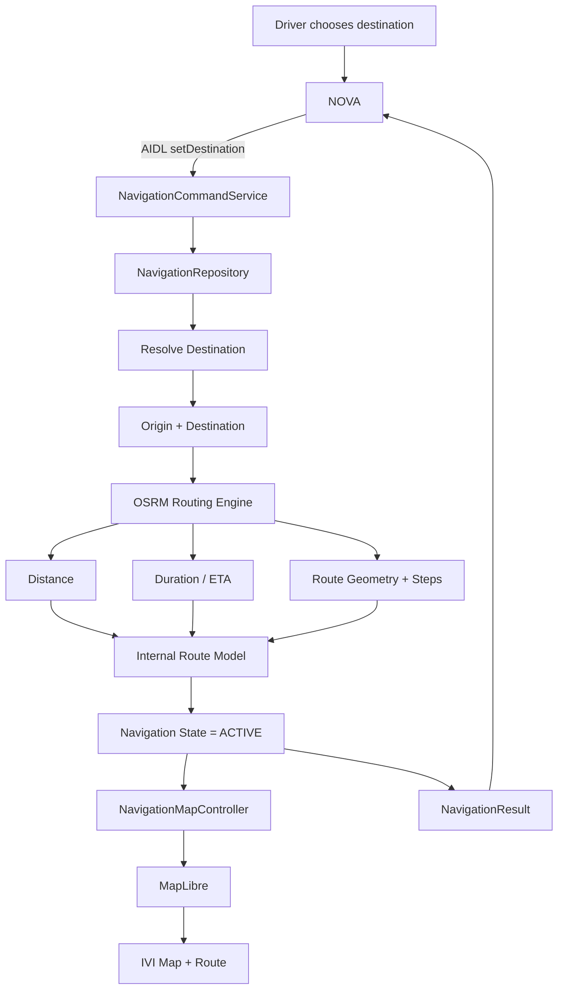

# HyperNova Navigation — How Navigation & OSRM Work

> **Purpose:** شرح مبسط للـ Navigation flow في مشروع HyperNova Navigation، بحيث لما ترجع للفايل بعد فترة تفتكر بسرعة:
>
> - مين OSRM؟
> - الـ route بيتحسب إزاي؟
> - الفرق بين Nominatim وOSRM وMapLibre.
> - دور `NavigationRepository`.
> - يعني إيه Navigation تصبح `ACTIVE`.
> - إمتى بنرجع `NavigationResult` إلى NOVA.

---

# 1. الصورة الكبيرة

الـ flow اللي بنتكلم عنه هو:

```text
NavigationRepository
        ↓
       OSRM
        ↓
   Route Data
        ↓
Internal Route / RoutePlan
        ↓
Navigation becomes ACTIVE
        ↓
NavigationResult
```

الفكرة ببساطة:

```text
أنا فين؟
+
أنا عايز أروح فين؟
        ↓
احسب الطريق بينهم
        ↓
احتفظ بالطريق داخل Navigation
        ↓
ابدأ Navigation session
        ↓
اعرض الطريق على الشاشة
        ↓
أكد لـ NOVA أن Navigation بدأت
```

---

# 2. قبل الـ Routing: Navigation محتاجة إيه؟

علشان نحسب Route، محتاجين نقطتين:

```text
Origin
=
مكان العربية / نقطة البداية
```

و:

```text
Destination
=
المكان اللي المستخدم عايز يروحه
```

في الوضع الحالي للمشروع، نقطة البداية المعروفة هي:

```text
ITI Smart Village

Latitude:  30.07112
Longitude: 31.02075
```

مثلاً المستخدم اختار:

```text
Cairo University
```

بعد البحث أصبح عندنا تقريبًا:

```text
Origin
ITI Smart Village
(lat, lon)

        +

Destination
Cairo University
(lat, lon)
```

لكن وجود الإحداثيات لوحده **لا يعني أننا نعرف الطريق**.

إحنا فقط نعرف:

```text
Start Point ●

Destination ●
```

لسه محتاجين Routing Engine يعرف شبكة الطرق ويقرر نمشي منين.

---

# 3. مين OSRM؟

**OSRM = Open Source Routing Machine**

OSRM هو الـ **Routing Engine**.

وظيفته الأساسية:

> ياخد نقطة البداية ونقطة النهاية، ويحسب Route على شبكة الطرق.

يعني تقريبًا:

```text
Origin coordinates
        +
Destination coordinates
        ↓
       OSRM
        ↓
Road Route
```

OSRM يجاوب أسئلة مثل:

```text
نمشي في أنهي شوارع؟

المسافة بالطريق كام؟

الوقت المتوقع كام؟

شكل الطريق Geometry عامل إزاي؟

إيه الـ maneuvers / route steps؟

هل فيه alternative routes؟
```

---

# 4. الفرق بين Nominatim وOSRM وMapLibre

دي أهم مقارنة تفتكرها:

```text
Nominatim
=
فين المكان؟
```

```text
OSRM
=
أوصل للمكان إزاي؟
```

```text
MapLibre
=
أعرض الخريطة والطريق إزاي؟
```

## مثال كامل

المستخدم كتب:

```text
Cairo University
```

### Nominatim

يعمل Search ويقول:

```text
Cairo University
Latitude  = ...
Longitude = ...
```

يعني:

```text
"Cairo University"
        ↓
    Nominatim
        ↓
Coordinates
```

### OSRM

بعد كده ندي OSRM:

```text
ITI Coordinates
+
Cairo University Coordinates
```

فيحسب:

```text
Route
Distance
Duration
Geometry
Steps
Alternatives
```

### MapLibre

بعد كده ناخد الـ geometry:

```text
OSRM Route Geometry
        ↓
NavigationMapController
        ↓
MapLibre
        ↓
Route line فوق الخريطة
```

---

# 5. الرسم الكامل للثلاثة

```text
                    USER
                     |
                     | Search: "Cairo University"
                     v
               +-------------+
               | Nominatim   |
               +-------------+
                     |
                     | Place + Coordinates
                     v
               Destination
                     |
                     |
Origin --------------+
ITI Smart Village    |
                     v
               +-------------+
               |    OSRM     |
               +-------------+
                     |
          +----------+----------+
          |          |          |
          v          v          v
      Distance    Duration    Geometry
                                  |
                                  v
                         NavigationMapController
                                  |
                                  v
                             MapLibre
                                  |
                                  v
                         Route على الشاشة
```

---

# 6. NavigationRepository دورها إيه؟

`NavigationRepository` هي الطبقة اللي تجمع Navigation logic بدل ما الـ UI تتعامل مباشرة مع كل provider.

يعني بدل:

```text
MainActivity
   ↓
OSRM مباشرة
```

نريد:

```text
MainActivity
      |
      v
NavigationRepository
      |
      v
     OSRM
```

وفي المستقبل الـ AIDL Service تستخدم **نفس Repository**:

```text
MainActivity -----------+
                        |
                        v
              NavigationRepository
                        ^
                        |
AIDL Service -----------+
```

وده مهم لأننا لا نريد:

```text
MainActivity -> Routing Engine A

AIDL Service -> Routing Engine B
```

بل:

```text
                 ONE
        NavigationRepository
```

تكون هي المصدر المشترك للحالة والـ routing.

---

# 7. مثال: المستخدم اختار Destination

نفترض إن Navigation عرفت:

```text
Origin:
ITI Smart Village

Destination:
Cairo University
```

الـ Repository تبدأ route calculation:

```text
NavigationRepository
        |
        | calculate route
        v
       OSRM
```

OSRM request يكون conceptually بالشكل:

```text
/route/v1/driving/
originLongitude,originLatitude;
destinationLongitude,destinationLatitude
```

## مهم جدًا

OSRM URL يستخدم:

```text
longitude,latitude
```

وليس:

```text
latitude,longitude
```

يعني ترتيب الإحداثيات مهم.

---

# 8. OSRM بيرجع إيه؟

OSRM لا يرجع صورة Map.

ولا يرجع فيديو.

هو يرجع **Data** تصف الطريق.

تقريبًا:

```text
OSRM Response
│
├── Distance
│   └── مثال: 38.4 km
│
├── Duration
│   └── مثال: 42 min
│
├── Geometry
│   ├── point 1
│   ├── point 2
│   ├── point 3
│   └── ... point N
│
├── Steps
│   ├── Continue straight
│   ├── Turn right
│   ├── Take exit
│   ├── Turn left
│   └── Arrive
│
└── Alternative Routes
```

---

# 9. يعني إيه Route Geometry؟

افترض إن الطريق الحقيقي منحني بالشكل ده:

```text
START ●
       \
        \
         ●────●
              \
               ●
                \
                 ● DESTINATION
```

OSRM يصف الشكل ده بمجموعة نقاط:

```text
Point 1
Point 2
Point 3
Point 4
...
Point N
```

بعد كده MapLibre توصل النقاط ببعض وتعرض Route line.

```text
OSRM
 |
 | Geometry
 v
[●, ●, ●, ●, ●, ●]
 |
 v
NavigationMapController
 |
 v
MapLibre Source + Layer
 |
 v
========================
Route line on the map
```

إذن:

> OSRM **يحسب** شكل الطريق.

بينما:

> MapLibre **يرسم** شكل الطريق.

---

# 10. Route Data تتحول لإيه داخل التطبيق؟

الـ response الخام من OSRM ليس مناسبًا إن كل أجزاء التطبيق تتعامل معه مباشرة.

لذلك عادةً Navigation تحوله إلى Internal Model.

Conceptually ممكن نسميه:

```text
RoutePlan
```

مثلاً:

```text
RoutePlan
│
├── Destination
├── Distance
├── Duration / ETA
├── Geometry
├── Steps
└── Alternatives
```

لكن مهم:

> اسم `RoutePlan` هنا شرح للـ concept.

في الـ handoff الحالي الاسم المؤكد في الـ repository design هو:

```text
ActiveRoute
```

مثال boundary مذكور للمشروع:

```kotlin
fun startGuidance(
    destination: ResolvedDestination
): ActiveRoute
```

يعني الفكرة الأهم:

```text
OSRM Response
     ↓
Internal Navigation Route Model
```

مش مهم دلوقتي الاسم النهائي قد ما نفهم الوظيفة.

---

# 11. إمتى Navigation تصبح ACTIVE؟

قبل حساب وتشغيل الـ route ممكن Navigation تكون مثلاً:

```text
HOME
```

أو:

```text
SEARCH
```

أو:

```text
CALCULATING_ROUTE
```

بعد ما الطريق يتحسب ويتفعل كـ active guidance:

```text
Route Calculated
        ↓
Route stored as current active route
        ↓
Guidance starts
        ↓
Navigation State = ACTIVE
```

بمعنى:

> Navigation عندها دلوقتي Route حالي شغال.

---

# 12. إيه اللي Navigation تحتاج تحتفظ به وهي ACTIVE؟

Conceptually:

```text
ACTIVE NAVIGATION
│
├── Destination
├── Route Geometry
├── Distance
├── ETA
├── Route Steps
└── Current navigation state
```

وبكده أي جزء في التطبيق يقدر يعرف:

```text
هل فيه Navigation شغالة؟

رايحين فين؟

المسافة كام؟

ETA كام؟

إيه الطريق الحالي؟
```

---

# 13. مهم: ACTIVE حاليًا لا تعني Live GPS Navigation كاملة

في المشروع الحالي عندنا Route حقيقي من OSRM، لكن لا يوجد حتى الآن:

```text
Live GPS / vehicle position
Automatic maneuver progression
Real rerouting trigger
Real arrival trigger
```

الوضع الحالي conceptually:

```text
ITI Smart Village
      |
      | fixed configured origin
      v
     OSRM
      |
      v
Calculated route
      |
      v
Route displayed / active preview
```

وليس بعد:

```text
Car moves
   ↓
GPS Position Update
   ↓
Current position changes
   ↓
Next maneuver changes
   ↓
ETA updates dynamically
   ↓
Rerouting
   ↓
Arrival detection
```

دي مرحلة مستقبلية.

---

# 14. الفرق بين Route Calculation وLive Navigation

## الموجود حاليًا

```text
Origin
   +
Destination
   ↓
OSRM
   ↓
Route
   ↓
Display Route
   ↓
Active Navigation State
```

## الـ Navigation الكاملة مستقبلًا

```text
                      GPS / Vehicle Position
                              |
                              v
Origin + Destination ---> Routing Engine
                              |
                              v
                            Route
                              |
                              v
                       Active Navigation
                              |
                  +-----------+-----------+
                  |                       |
                  v                       v
          Position updates         Route progress
                  |                       |
                  +-----------+-----------+
                              |
                              v
                         Next Maneuver
                              |
                              v
                            ETA
                              |
                       Off Route?
                         /      \
                       No        Yes
                       |          |
                       |          v
                       |       Reroute
                       |
                       v
                    Arrived?
```

---

# 15. فين NOVA في الموضوع؟

لما نضيف AIDL integration، NOVA ممكن تطلب:

```text
Set destination
```

Conceptually:

```text
NOVA
 |
 | setDestination(destinationId)
 v
NavigationCommandService
 |
 v
NavigationRepository
 |
 v
Resolve Destination
 |
 v
OSRM
 |
 v
Route calculated
 |
 v
Navigation becomes ACTIVE
 |
 v
NavigationResult
 |
 v
NOVA
```

---

# 16. ليه ما نرجعش Success فورًا؟

لأن مجرد إن NOVA قالت:

```text
Navigate to Cairo University
```

لا يعني إن Navigation نجحت.

ممكن يحصل:

```text
Destination ID expired
OSRM failed
No valid route
Timeout
```

لذلك الـ flow الصحيح:

```text
NOVA Request
     ↓
Navigation accepts request
     ↓
Route calculation
     ↓
Route activation
     ↓
State == ACTIVE ?
     |
     +---- NO ----> Error / failure result
     |
     +---- YES ---> CONFIRMED NavigationResult
```

---

# 17. NavigationResult إيه؟

`NavigationResult` هو النتيجة اللي Navigation ترجعها عبر الـ shared contract إلى NOVA.

Conceptually ممكن تحتوي:

```text
Status:
CONFIRMED

State:
ACTIVE

Destination:
Cairo University

Distance:
38.4 km

ETA:
42 min
```

المبدأ المهم:

```text
NOVA must NOT claim success
until Navigation confirms ACTIVE
```

يعني NOVA لا تقول للسائق:

```text
Navigation started successfully
```

إلا بعد ما Navigation نفسها تؤكد إن الـ route أصبح active بالفعل.

---

# 18. End-to-End Flow

```text
+----------------------------+
|           DRIVER           |
+----------------------------+
              |
              | "Navigate to Cairo University"
              v
+----------------------------+
|            NOVA            |
+----------------------------+
              |
              | AIDL command
              v
+----------------------------+
| NavigationCommandService   |
+----------------------------+
              |
              v
+----------------------------+
|   NavigationRepository     |
+----------------------------+
              |
              | Resolve destination
              v
       Origin + Destination
              |
              v
+----------------------------+
|            OSRM            |
|       Routing Engine       |
+----------------------------+
              |
      +-------+--------+----------------+
      |                |                |
      v                v                v
   Distance         Duration         Geometry
                                           |
                                           v
                                  Route Internal Model
                                           |
                                           v
                                  Navigation becomes
                                        ACTIVE
                                    /             \
                                   /               \
                                  v                 v
                         NavigationMapController  NavigationResult
                                  |                 |
                                  v                 v
                              MapLibre             NOVA
                                  |
                                  v
                          IVI Navigation UI
```

---

# 19. Mermaid Diagram

لو الـ Markdown viewer بيدعم Mermaid:



---

# 20. Mental Model تحفظه

لو نسيت كل التفاصيل، افتكر الجمل دي:

```text
Nominatim
=
Search / Geocoding
=
"المكان فين؟"
```

```text
OSRM
=
Routing Engine
=
"أوصل له إزاي؟"
```

```text
MapLibre
=
Map Renderer
=
"أرسم الخريطة والطريق إزاي؟"
```

```text
NavigationRepository
=
Navigation business logic / shared state boundary
=
"مين ينظم كل العمليات دي ويحافظ على حالة Navigation؟"
```

---

# 21. رسم سريع للمراجعة

```text
                    "Cairo University"
                            |
                            v
                      Nominatim
                            |
                            v
                     Destination
                      Coordinates
                            |
                            |
ITI Coordinates -----------+
                            |
                            v
                           OSRM
                            |
                 +----------+----------+
                 |          |          |
                 v          v          v
              Geometry   Distance   Duration
                 |
                 v
            Internal Route
                 |
                 v
            ACTIVE ROUTE
              /      \
             /        \
            v          v
       MapLibre    NavigationResult
            |          |
            v          v
          IVI         NOVA
```

---

# 22. Current vs Future

## Current HyperNova Navigation

```text
Real place search
       ↓
Real destination coordinates
       ↓
Real OSRM route calculation
       ↓
Real geometry / distance / duration
       ↓
MapLibre route rendering
```

لكن نقطة البداية حاليًا configured/fixed:

```text
ITI Smart Village
```

## Future

```text
Vehicle GNSS / GPS
       ↓
Live current position
       ↓
Route progress
       ↓
Maneuver progression
       ↓
ETA updates
       ↓
Off-route detection
       ↓
Rerouting
       ↓
Arrival detection
```

---

# 23. Final Summary

الـ Navigation عندنا ليست مجرد Map.

هي pipeline:

```text
Find destination
      ↓
Resolve coordinates
      ↓
Calculate route
      ↓
Create internal route state
      ↓
Activate guidance
      ↓
Render route
      ↓
Expose navigation status/results
```

وفي مشروع HyperNova الحالي:

```text
Nominatim
    ↓
Place / Coordinates

Overpass
    ↓
Nearby POIs

OSRM
    ↓
Route calculation

NavigationRepository
    ↓
Navigation logic/state

NavigationMapController
    ↓
Prepare map sources/layers

MapLibre + OpenFreeMap
    ↓
Visual map rendering

NavigationCommandService + AIDL
    ↓
Future NOVA command/control integration
```

---

## One-line memory trick

```text
Nominatim finds it.
OSRM routes to it.
MapLibre draws it.
NavigationRepository owns the navigation flow.
NOVA only confirms success after Navigation is ACTIVE.
```

---

## Source Note

This note was prepared from the HyperNova Navigation handoff context supplied for this project. It preserves the current project limitation that live GPS movement, automatic maneuver progression, real rerouting, and real arrival detection are not yet implemented.
